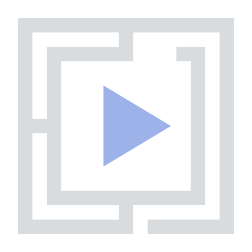
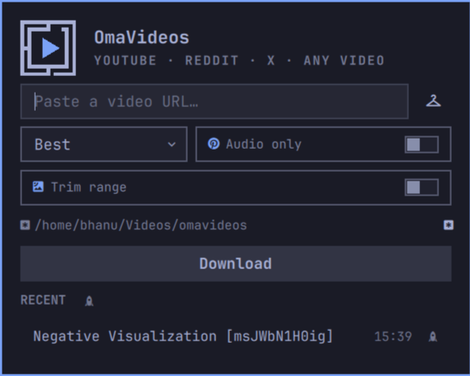
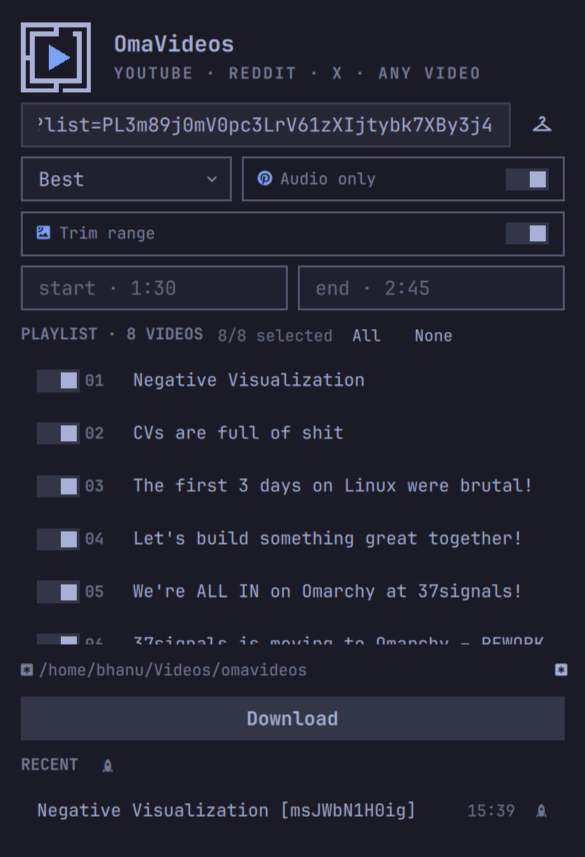

<table>
<tr>
<td></td>
<td>

## OmaVideos

A minimal bar-widget for Omarchy that turns a pasted URL into a finished
download. Paste a YouTube, Reddit, X, Vimeo, Twitch — or any other yt-dlp
supported URL — and it lands in your `omavideos` folder at the best quality
with audio, while the bar arrow glows until it is done.

</td>
</tr>
</table>

## Screenshots

| The bar arrow + panel | Downloading with progress |
|---|---|
|  |  |

## Features

- **One-click grab** — click the download arrow in the bar, paste a URL, hit
  Enter. Right-click the arrow to open the panel prefilled from your clipboard.
- **Best quality with audio** — downloads merge the highest video and audio
  streams (yt-dlp `bv*+ba/b`) with metadata embedded.
- **Quality cap** — Best / 2160p / 1440p / 1080p / 720p.
- **Audio only** — extracts the best audio track as high-bitrate m4a.
- **Playlists** — grab the whole playlist, or pick entries by number/range
  (`1,3,5-8`).
- **Trim** — download only a slice of a video (`1:30` → `2:45`), cut exactly
  via keyframe-aware re-encoding.
- **Progress & status** — live progress bar, stream phase (video/audio/merging),
  playlist position, cancel, error surfacing.
- **Recent list** — the last eight downloads with one-click play / folder reveal.

## Install

```bash
omarchy plugin add https://github.com/Bhanu4417/OmaVideos.git --enable
```

That one command installs and enables the widget in the bar. If you skipped
the bar placement prompt, place it yourself:

```bash
omarchy plugin enable bhanu.omavideos right
```

OmaVideos needs `yt-dlp` (the download engine) and `ffmpeg` (merging, audio
extraction, trimming) on your system:

```bash
omarchy pkg add yt-dlp ffmpeg
```

## Uninstall

```bash
omarchy plugin remove bhanu.omavideos
```

That drops the plugin folder and its `bhanu.omavideos` entry in
`~/.config/omarchy/shell.json`. Nothing keeps running after removal:
OmaVideos starts no daemon, installs no service or timer, and grants nothing
that needs revoking.

## Removed

| Path | What it is |
|------|------------|
| `~/.config/omarchy/plugins/bhanu.omavideos/` | the plugin |
| the `bhanu.omavideos` entry in `~/.config/omarchy/shell.json` | bar placement and settings |

## Kept, on purpose

| Path | What it is |
|------|------------|
| `~/.local/state/omarchy/omavideos-recent.json` | the recent-downloads list shown in the panel |
| `~/Videos/omavideos/` (default `downloadDir`) | your finished downloads |

Nothing in either folder is ever sent anywhere. Delete them with
`rm -rf ~/.local/state/omarchy/omavideos-recent.json` if you want the recent
list gone.

## What it touches

- **Network.** OmaVideos makes exactly one kind of network call: it runs
  `yt-dlp` against the URL you paste, and only when you press Download. It
  phones no home, sends no telemetry, and talks to no OmaVideos service.
- **No elevated privilege.** No sudo, no pkexec, no systemd units, no package
  installs at run time. `yt-dlp` and `ffmpeg` run with **your** user
  permissions, unsandboxed — review any change to `Model.js` (which builds the
  yt-dlp command line) before running it.
- **One file it edits for you:** the widget's own entry in
  `~/.config/omarchy/shell.json`, added when you enable it and removed on
  uninstall. It touches no other Omarchy or Hyprland configuration.
- **Site access varies.** YouTube bot-checks can reject some IPs/networks, and
  X sometimes needs cookies for certain content. Keep `yt-dlp` updated for new
  site breakage. If a YouTube video fails with 403, try another client in the
  widget settings → **YouTube client** (`tv_embedded`, `web_safari`, …), or
  export your browser cookies and point yt-dlp at them with `--cookies`.

## Configuration

Right-click the widget → settings, or edit the widget's entry in
`~/.config/omarchy/shell.json`:

| Key            | Default                | Meaning                                |
|----------------|------------------------|----------------------------------------|
| `quality`      | `best`                 | Quality cap (`best`/`2160p`/…/`720p`)  |
| `audioOnly`    | `false`                | Extract best audio as m4a              |
| `playlist`     | `false`                | Download whole playlist                |
| `playlistItems`| `""`                   | e.g. `1,3,5-8` (empty = all)           |
| `trim`         | `false`                | Enable time-range trimming             |
| `trimStart`    | `""`                   | Start timestamp, e.g. `1:30`           |
| `trimEnd`      | `""`                   | End timestamp, e.g. `2:45`             |
| `downloadDir`  | `~/Videos/omavideos`   | Where downloads land                   |
| `ytClient`     | `web_embedded`         | YouTube player client                 |

## Layout

```
manifest.json   Plugin contract (kind bar-widget, settings schema)
BarWidget.qml   Bar button (Omarchy-style play mark) + open/close lifecycle + IPC routes
Panel.qml       URL field, options, progress, recent list
OmaPlayButton.qml Theme-aware bar icon that lights up with download progress
OmaVideoMark.qml Theme-aware Omarchy+play mark (panel hero)
Model.js        yt-dlp command builder, parsers, recent-store helpers
assets/logo.svg Brand mark
assets/screenshot-*.png Showcase screenshots
preview.png     Notification icon / README logo
```

## License

MIT — see [LICENSE](LICENSE). `yt-dlp` is its own project under Unlicense/GPL.