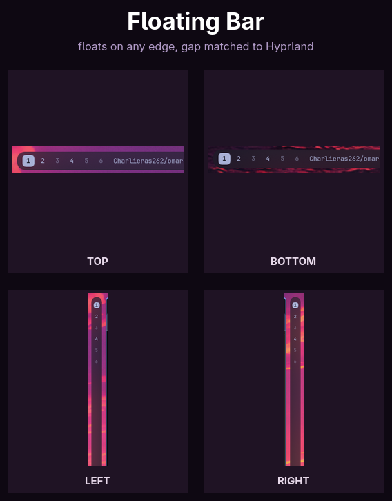

# Floating Bar

A full [Omarchy](https://omarchy.org) bar replacement (`"kind": "bar"`): the
stock bar, floating off the screen edge with rounded corners instead of
spanning edge-to-edge. It inherits Omarchy's own bar position, so it isn't
locked to the top -- drag it to any edge from the menu, or with the mouse,
the same way you would the stock bar, and it floats there too.



The floating gap isn't a fixed number — it's read from Hyprland's own
`general:gaps_out` at startup and kept in sync with it afterward (e.g.
Omarchy's own "no gaps" toggle, `omarchy hyprland window gaps toggle`,
updates the bar's own gap live, no reload needed), so the space around the
bar matches the gap Hyprland already puts between windows and the screen
edge instead of introducing a second, inconsistent gap value.

## Install

```bash
omarchy plugin add https://github.com/Charlieras262/omarchy-floating-bar.git --enable
```

`omarchy plugin update` later pulls new versions the same way any
git-managed plugin does.

## Configure

Optional, set on the bar's own entry in `~/.config/omarchy/shell.json`
(same place `position` and `transparent` already live):

```json
{
  "bar": {
    "id": "charlieras262.floating-bar",
    "cornerRadius": 14,
    "floatGap": 12
  }
}
```

| Key | Type | Default | Description |
|---|---|---|---|
| `cornerRadius` | number (px) | *(auto)* | Corner radius of the floating bar. If omitted, it follows Omarchy's own `Style.cornerRadius` — which already mirrors `decoration:rounding` live — so the bar's corners match every popup panel and any window, including a live change from a plugin like [Omablur](https://github.com/Charlieras262/omarchy-omablur). Set it explicitly to override that. |
| `floatGap` | number (px) | *(auto)* | Gap between the bar and the screen edges it floats away from. If omitted, it tracks `hyprctl getoption general:gaps_out` live (including Hyprland config reloads) — set it explicitly to override that. |
| `noRoundedOnNoGaps` | boolean | `true` | Square the bar off whenever the gap is 0 (e.g. Omarchy's "no gaps" toggle) instead of leaving it rounded while flush against the screen edge. Set `false` to always use `cornerRadius` regardless of the current gap. |
The bar's own background also follows Omarchy's shared `Style.shellOpacity`
token (distinct from the `transparent` option above, which drops the
background to fully invisible rather than a partial, blur-showing alpha) --
see [Omablur](https://github.com/Charlieras262/omarchy-omablur), which sets
it while its own blur is on so the whole shell (bar, menus, notifications,
popups) dims together, not just this bar.

The bar is anchored to one edge (`position: "top"` by default, same as
stock). The gap applies to the anchored edge and both perpendicular sides;
the edge *opposite* `position` gets none, since that's the side already
facing Hyprland's own window-to-window gap — adding floatGap there too
would make that one side look bigger than the other three.

## Switch back to the stock bar (without uninstalling)

```bash
omarchy bar reset
```

A `"kind": "bar"` plugin doesn't show up in `omarchy menu plugin
enable/disable`, and `omarchy plugin disable` doesn't apply to it either --
that's an Omarchy-wide rule for anything that replaces the whole bar
(`canDisable: !isBarOption` in Omarchy's own `shell.qml`), not specific to
this plugin. A bar option isn't a toggle, it's one of several mutually
exclusive choices, switched with `omarchy bar use <id>`:

```bash
omarchy bar use charlieras262.floating-bar   # switch to this bar
omarchy bar reset                            # switch back to the stock bar
```

Switching back this way keeps the plugin installed, so switching to it
again later doesn't need a reinstall.

## Remove

```bash
omarchy plugin remove charlieras262.floating-bar
```

This removes the plugin's files and switches the bar back to the stock
`omarchy.bar`.

## Dependencies

`hyprctl` (ships with Hyprland/Omarchy) for the one-time `general:gaps_out`
probe at startup. Everything else is plain QML on Omarchy's own
`qs.Commons`/`qs.Ui` modules and the Quickshell Hyprland/Wayland
integration — no external packages or services.

## Why this needs a workaround, and when it stops needing one

Cloning any `"kind": "bar"` plugin in Omarchy 4.0.0-1 fails to render at
all, even completely unedited — filed as
[basecamp/omarchy#8007](https://github.com/basecamp/omarchy/issues/8007).
The cause: a cloned bar loads through `Loader.source` (a URL), which can't
supply QML `required property` values at construction the way the built-in
bar's `sourceComponent` can — `configureBar()` in `shell.qml` only sets
`omarchyPath`, `barWidgetRegistry`, and `barConfig` shortly *after*
construction, too late for `required`.

This plugin works around it: those three properties in `Bar.qml` get
inline defaults instead of `required`, since `configureBar()` still sets
the real values immediately after and nothing reads them before that.

[basecamp/omarchy#8146](https://github.com/basecamp/omarchy/pull/8146)
fixes this properly upstream (passing the properties through
`Loader.setSource(url, initialProperties)`). Once that ships in a stable
Omarchy release, this plugin's workaround becomes redundant — check the
issue/PR status if a future Omarchy update seems to double-apply something
or warns about the properties being both set and required.

## Known limitation: notifications and popup panels can overlap the bar

Two pieces of Omarchy's own shell assume every bar sits flush against the
screen edge with no margin of its own, and don't know about this plugin's
`floatGap`:

- Notification toasts (`omarchy.notifications`' `Service.qml`) clear the
  bar using `barSize + Style.gapsOut`.
- Every popup panel built on the shared `Ui/KeyboardPanel.qml` base (the
  Display/network/bluetooth/audio panels you get from clicking a tray
  icon, and others) positions itself using `barSize + gap` on the
  away-from-bar axis.

Both fall short by `floatGap`, so toasts and panels can render slightly
over the bar when it's on the top or right edge.

This can't be fixed from this plugin's own files — both belong to
Omarchy's own shell, only read `barSize` from whichever bar is active (no
property for edge margin), and their relevant properties are `readonly`
computed values, so nothing external can override them either.

Fixing it means editing those two files yourself as root — this plugin
deliberately does not ship a script that runs as root against its own
git-managed checkout (that checkout can change on every `omarchy plugin
update`, which would turn an auto-run `sudo` script into a code-execution
path into a user-writable directory). Open each file as root (e.g.
`sudoedit /usr/share/omarchy/shell/plugins/notifications/Service.qml`) and
add a `barEdgeMargin` term (read from `shell.bar.floatGap` when the active
bar defines it, `0` otherwise, so it's a no-op for any other bar) into
their bar-clearance math:

`shell/plugins/notifications/Service.qml`, change

```qml
readonly property int barClearance: liveBarSize + Style.gapsOut
```

to

```qml
readonly property real barEdgeMargin: shell && shell.bar && shell.bar.barHidden !== undefined
  && shell.bar.floatGap !== undefined ? Math.max(0, Number(shell.bar.floatGap) || 0) : 0
readonly property int barClearance: liveBarSize + barEdgeMargin + Style.gapsOut
```

`shell/Ui/KeyboardPanel.qml`, change

```qml
property int gap: Style.gapsOut  // distance between bar edge and panel
```

to

```qml
readonly property real barEdgeMargin: bar && bar.floatGap !== undefined
  ? Math.max(0, Number(bar.floatGap) || 0) : 0
property int gap: Style.gapsOut + barEdgeMargin  // distance between bar edge and panel
```

Then `omarchy restart shell`. An Omarchy update to either file will
silently drop the edit — just reapply it if toasts or panels start
overlapping the bar again afterward.

## License

MIT — see [LICENSE](LICENSE).
