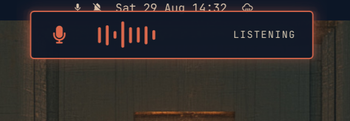
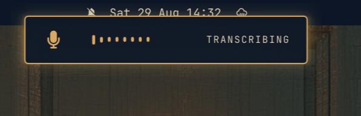
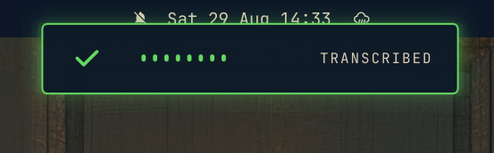

# Voxtype Aura

A compact, theme-aware [Voxtype](https://github.com/peteonrails/voxtype)
dictation overlay for [Omarchy](https://omarchy.org/).

Aura appears at the top-center of the focused monitor while Voxtype is active:

- **LISTENING** with live microphone-level bars while recording.
- **TRANSCRIBING** with a sweeping animation while processing speech.
- **TRANSCRIBED** with a brief check mark after successful transcription.
- Hidden when Voxtype is idle.

It follows Omarchy's active colors, typography, spacing, and corner radius. The
layer-shell surface never takes keyboard focus, accepts no pointer input, and
does not reserve screen space.

## Examples

### Listening



### Transcribing



### Transcribed



## Requirements

- Omarchy with shell-plugin support.
- Voxtype running as `voxtype.service`.
- `omarchy-voxtype-status` available on `PATH`.
- `voxtype-audio-bridge` available on `PATH`.

## Install

Disable Voxtype's built-in OSD in `~/.config/voxtype/config.toml`:

```toml
[osd]
enabled = false
```

Restart Voxtype:

```sh
systemctl --user restart voxtype.service
```

Install and enable Aura:

```sh
omarchy plugin add https://github.com/adamcbrewer/voxtype-aura.git --enable
```

## Remove

```sh
omarchy plugin remove io.github.adamcbrewer.voxtype-aura
```

To restore Voxtype's built-in display, set `[osd] enabled = true` and restart
`voxtype.service`.

## How It Works

Aura is a keep-loaded Omarchy service plugin. It follows Voxtype's status stream
through `omarchy-voxtype-status` and reads live microphone levels from
`voxtype-audio-bridge`. A valid transition from `transcribing` to an
inactive state briefly shows the completion state. Unexpected or unavailable
status data fails closed by hiding the overlay. If either process exits while
needed, Aura retries it after one second.

## Credits

Voxtype Aura was inspired by Jon Henshaw's
[Voxtype Prism](https://github.com/jonhenshaw/voxtype-prism), particularly its
compact, theme-aware recording indicators and Omarchy layer-shell integration.
See [THIRD_PARTY_NOTICES.md](THIRD_PARTY_NOTICES.md) for license attribution.

## Security

Omarchy plugins run unsandboxed inside the long-lived `omarchy-shell` process.
Review plugin code before enabling it. Aura runs two fixed local commands,
accepts no user input, performs no network requests, and reads no credentials.

## License

[MIT](LICENSE)
