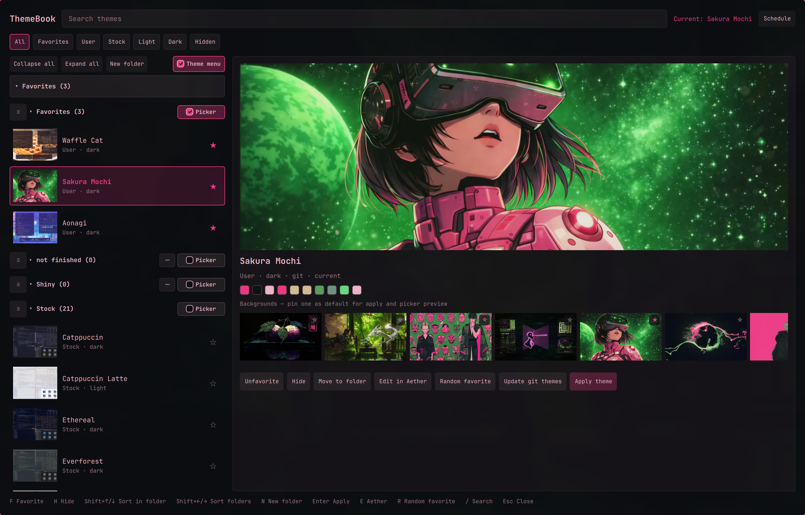
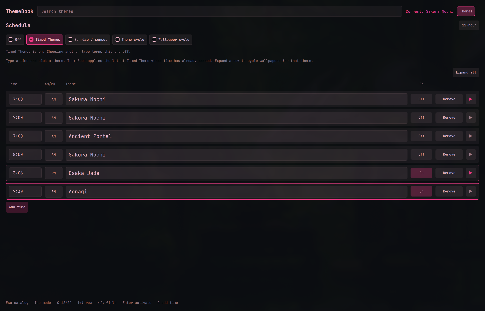
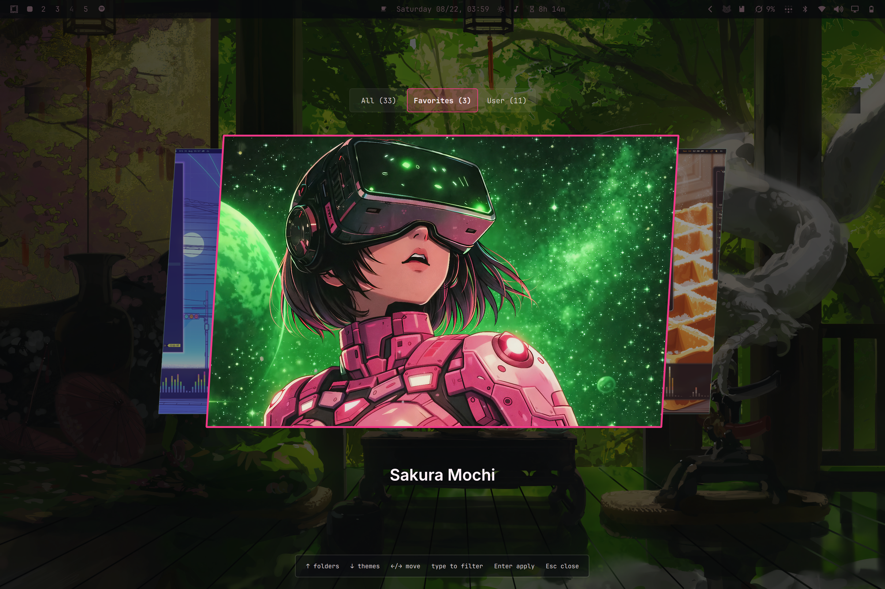

# ThemeBook

**The full theme suite for [Omarchy](https://omarchy.org)** — organizer, previewer, picker, and scheduler in one plugin.

Browse every installed theme, sort them into folders with favorites and recents first, pin a default wallpaper, preview before you apply, use an enhanced stock-style carousel, then put the desktop on a clock, sunrise/sunset, theme cycle, or wallpaper cycle. Optional hand-off to [Aether](https://github.com/bjarneo/aether) when you want to edit.

ThemeBook is not a theme installer and not a designer. It is the place you live in after themes are installed: catalog, library, and schedule.

Plugin id: `io.github.calebhat.themebook`. MIT. Independent community plugin. Not affiliated with Omarchy or 37signals.

No sudo or pkexec is required. No network calls. No extra packages.

<p align="center"></p>

| Catalog | Schedule | Picker |
|---|---|---|
| [](docs/screenshots/catalog.png) | [](docs/screenshots/schedule.png) | [](docs/screenshots/picker.png) |

## What it does

- **Catalog** of the same installed themes as Style > Theme (user overlays win on slug). The header shows the current theme. **Collapse all** / **Expand all** fold every section at once.
- **Select then apply** — click a card to preview (colors, backgrounds, source, git); the desktop changes only on **Apply theme**, Enter, or double-click.
- **Favorites** starred from the list or the preview; **Random favorite** applies one at random.
- **Recents** is always listed (default: under Favorites), even when empty.
- **Folders** you create (**New folder**), rename, and delete (confirmation; themes stay installed). **Add themes** on a user folder opens a checklist: check to add, uncheck to remove. **Move to folder** on a selected theme does the same from the theme side (a theme can be in more than one folder). **✕** on a theme row inside a folder removes it from that folder, next to Favorite. User and Stock still list every theme. Rename and Delete sit in a **⋯** menu on user folders.
- **Reorder** any section — Favorites, Recents, User, Stock, and your folders — by dragging the **≡** handle. A line between folders shows the drop point. Order is saved in `themebook.json`. **Shift+↑/↓** sorts themes inside a folder; **Shift+←/→** moves sections.
- **Picker** checkboxes on Favorites, Recents, User, Stock, and your folders choose which sections appear in the carousel.
- **Filters** — All / Favorites / User / Stock / Light / Dark / Hidden, plus search.
- **Move to folder** is the first preview action (then Favorite, then Edit in Aether). Hide and Show are separate buttons: Hide when the theme is visible, Show when it is hidden.
- **Backgrounds** — click a wallpaper in the strip to preview it in the panel (it does not change the live theme). **Apply theme** uses the wallpaper you are previewing, or the starred **default** if you have not picked one. Star a default for apply and picker/catalog previews, including schedules.
- **Hide** themes without uninstalling; **Hidden** filter lists them. **Show** replaces Hide when the theme is already hidden. **Unfavorite** when it is already a favorite.
- **Remove** any theme with a confirmation dialog (deletes user themes from disk; hides stock themes from the catalog and picker). If the active theme is removed, ThemeBook switches away first.
- **Update git themes** via `omarchy theme update` (shown when the selected theme is git-backed).
- **Edit in Aether** (optional) opens the Aether GUI with the theme wallpaper loaded for editing. It does not apply the theme through Aether.
- **Theme menu** (checkbox, on for new installs) can replace Super+Ctrl+Shift+Space / Style > Theme with ThemeBook’s enhanced stock-style carousel. Toggle off to restore Omarchy’s picker.
- **Carousel picker** — skewed previews like stock Omarchy, folder tiles above, type-to-filter (folders and themes independently), ↑/↓ between rows, ←/→ to move, Esc clears filter then closes. New installs open **All**, with Stock and User included (Favorites is still empty until you star themes). Remembers last folder, theme, and whether focus was on folders or themes. Open with `omarchy-shell themebook pick`.
- **Schedule** (header **Schedule** button) — exactly one type at a time, shown as radio chips: **Off**, **Timed Themes**, **Sunrise / sunset**, **Theme cycle**, **Wallpaper cycle**. Only one of those can run. While a schedule is running, the header button shows an **On** badge (search shrinks to make room) and a banner names the active type. Applying a theme by hand (or a wallpaper while a wallpaper timer is running) asks to confirm and then turns the schedule **Off**, so a timer cannot revert your pick. Timed / sunrise use 12- or 24-hour time; AM/PM is a separate control in 12-hour mode. If `acrogenesis.theme-scheduler` is enabled, ThemeBook’s theme schedule stays off.

### Schedule types

- **Off** — no ThemeBook schedule is running.
- **Timed Themes** — as many clock times as you want (**Add time**). Each row has time, theme, **On/Off**, and **Remove**. ThemeBook applies the latest enabled Timed Theme whose time has already passed. A row only gets the accent border when it is On. Expand **▶** on a row to turn on a **wallpaper cycle** for that slot; the minutes field stays visible and keeps your last value when you toggle it off.
- **Sunrise / sunset** — day and night themes from your Omarchy weather location (`sunwait`). Hidden if `sunwait` is missing. Expand each period to cycle wallpapers on its own timer while sunrise or sunset is in effect. Minutes are kept when you toggle wallpapers off.
- **Theme cycle** — walks through themes in a folder you pick, every N minutes. Optional **Also cycle wallpapers** (with its own interval) rotates backgrounds of the current theme while that theme is active. Adding or removing themes in that folder (or Favorites, if that’s the source) is picked up on the next tick; a removed theme is dropped from the rotation.
- **Wallpaper cycle** — rotates wallpapers of the **current** theme only (`omarchy theme bg next`). It never applies a different theme. Adding or removing image files in the theme’s `backgrounds/` folder (or `~/.config/omarchy/backgrounds/<theme>/`) is included on the next tick.

Applying a theme by hand resets cycle intervals so a timer does not immediately undo your pick. Switching to another schedule type turns the previous one off.

## Install

```sh
omarchy plugin add https://github.com/calebhat/omarchy-themebook.git --enable
omarchy restart shell
```

`omarchy plugin add` only clones files. It does not run a setup script. Enabling the plugin is the consent to load it in `omarchy-shell`.

On first start, if you do not already have one, ThemeBook copies its Apps launcher into `~/.local/share/applications/`. It never overwrites that file. It also installs `icon.png` as the Apps icon (`io.github.calebhat.themebook`).

**Theme menu** is on by default for new installs. That writes a `style.theme` override in `~/.config/omarchy/extensions/omarchy-menu.jsonc` so Super+Ctrl+Shift+Space opens ThemeBook’s carousel. Turn **Theme menu** off in the catalog to remove that override and restore Omarchy’s picker. ThemeBook does not edit Hyprland or theme folders.

Open the catalog from Apps (**ThemeBook**), Style > ThemeBook, or:

```sh
omarchy-shell shell toggle io.github.calebhat.themebook '{}'
```

Open the carousel picker:

```sh
omarchy-shell themebook pick
```

Optional Hyprland tile rule (Quickshell app-id is always `org.quickshell`):

```lua
o.window({ class = "^org.quickshell$", title = "^ThemeBook$" }, { tile = true })
```

## Keyboard

Catalog (also printed at the bottom of that view):

| Key | Action |
|---|---|
| `/` | Search |
| `j` / `k` or ↑ / ↓ | Move selection |
| `F` | Favorite |
| `H` | Hide |
| `Shift+↑/↓` | Sort inside the current folder or favorites |
| `Shift+←/→` | Reorder folders |
| `N` | New folder |
| `Enter` | Apply |
| `Delete` / `Backspace` / `D` | Remove |
| `E` | Edit in Aether |
| `R` | Random favorite |
| `Esc` | Close |

Schedule (also printed at the bottom of that view): `Esc` catalog · `Tab` next schedule type · `C` 12/24 · ↑/↓ row · ←/→ field · `Enter` activate · `A` add time.

Picker: ↑ folders · ↓ themes · ←/→ move · type to filter · `Enter` apply · `Esc` close.

## Config

Stored at `~/.config/omarchy/themebook.json`: favorites, hidden slugs, folders, recents, collapsed sections, `sectionOrder`, picker settings (including Theme menu / which folders are in the carousel), default wallpapers, clock 12/24, timed / sunrise schedule, **theme cycle** (folder, minutes, nested wallpaper), and **wallpaper cycle** (minutes). Theme directories are never written except through `omarchy theme set` / `bg set` / `remove` / `update`.

Local IPC (`omarchy-shell themebook …`) is the same user session as the shell. It only accepts installed theme slugs.

## Remove

```sh
omarchy plugin remove io.github.calebhat.themebook --yes
```

That does not delete your themes. Leftovers you can delete yourself:

- `~/.local/share/applications/io.github.calebhat.themebook.desktop`
- a `style.theme` override in `~/.config/omarchy/extensions/omarchy-menu.jsonc` if Theme menu was on (or turn Theme menu off before removing)
- `~/.config/omarchy/themebook.json`

## License and dependencies

MIT — see [LICENSE](LICENSE).

Documented extra dependencies: none required.

Optional tools (already common on Omarchy, not installed by this plugin):

- `jq` — catalog JSON (Omarchy ships it)
- `aether` — **Edit in Aether**
- `sunwait` — sunrise/sunset schedule
- `uwsm-app` — launching Aether under UWSM when present
- `vipsthumbnail` — JPEG thumbs for the carousel (Omarchy’s image picker uses the same cache)

## Security notes

- Applies themes with `omarchy theme set <slug>` as argv, never `bash -c`.
- Preview and background paths must resolve under the real theme directory (symlink themes included). Directory symlinks under `backgrounds/` are not followed out of the tree. Catalog JSON is capped (256 themes, 48 backgrounds each, 1 MiB). The catalog helper runs under one 12s TERM / 2s KILL deadline; `find` is item-capped before sort. `themebook.json` is size-checked with `stat` before any bytes are copied into the shell (max 256 KiB). Folder and theme names render as plain text.
- **Theme menu** edits `omarchy-menu.jsonc` only while that checkbox is on; turning it off deletes the override.
- The Apps `.desktop` file is created only if it does not already exist.
- No network, no sudo, no pkexec, no pip, no setup script.
