# Argus — System Monitor for Omarchy

*Other monitors show you what's happening. Argus is still watching when
you're not.*

Argus puts the system stats you pick in the [Omarchy](https://omarchy.org)
bar — in your order, urgent-colored past your thresholds — and opens a
full tabbed panel underneath. Then it does the two things a glance
monitor can't:

- **The flight recorder.** Every chart zooms from 2 minutes to 1 hour to
  24 hours of peak history, and the long rings persist to disk — so
  "was the machine hot overnight?" survives shell restarts, reboots,
  and crashes.
- **Alerts that explain themselves.** Every alert is opt-in, names its
  likely culprit process in the notification, and logs a context
  snapshot — click it later to see exactly what was running the moment
  it fired. One setting turns alerts into automation (ntfy, webhooks,
  logs).

And it stays honest: sampling cost is measured and shown, unavailable
stats say so instead of showing zeros, Argus never asks for privileges,
and every supported machine's quirks are locked in by a
[fixture corpus](#contributing-a-hardware-fixture) that CI re-parses on
every commit.

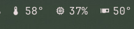

## Bar metrics (all selectable, reorderable)

CPU usage, CPU temperature, RAM usage, GPU usage, GPU temperature, VRAM
usage, disk usage, disk I/O, network throughput, load average, and battery
(shown only on machines that have one). Pick any subset and arrange the
order in the panel's **SETUP** tab; the choice persists to
`~/.config/omarchy/shell.json`.

## Panel tabs

- **HOME** — the overview: a configurable grid of glance tiles (CPU, memory, GPU, network, disk I/O, disk, battery), each with its live value, a subline, and a sparkline or meter; click a tile to open its tab, pick tiles in the SETUP tab
- **CPU** — processor model, overall usage with sparkline history, a core grid laid out like the silicon (SMT siblings fused, cores grouped by CCD with live clocks, efficiency cores drawn shorter on hybrid chips), frequency, temperature with its own chart and session peak, load, uptime, stall pressure, kernel version
- **MEM** — RAM usage with sparkline history, an in use / cache / free split bar (free(1)'s accounting), dirty pages, swap with its backing named (zram-aware), PSI memory pressure
- **GPU** — every GPU (AMD via amdgpu sysfs, NVIDIA via nvidia-smi, Intel via hwmon): name, usage with sparkline history, VRAM, temperature with session peak, power draw, and each card's busiest processes with GPU usage and VRAM (via DRM fdinfo; not available for the proprietary NVIDIA driver). An AMD iGPU's memory meter covers its real pool — the BIOS carve-out plus GTT (shared system RAM) — not just the misleading carve-out, with the split shown underneath
- **DISK** — every real filesystem with its physical disk model (LUKS/LVM resolved via lsblk), live read/write rates per physical disk, PSI I/O pressure, and per-drive SMART health (wear, power-on time, warnings) via udisks2 — a failing or worn-out drive turns urgent, and notifies once per session when its alert is enabled
- **NET** — total and per-interface download/upload rates with sparklines, each interface labeled with its kind (Wi-Fi/Ethernet), SSID, and IPv4 address; virtual interfaces (VPN tunnels, bridges, veth) are listed but kept out of the totals so VPN traffic isn't counted twice
- **PROC** — the full process table: filter live (`/`) by name, user, or pid; sort by any column; walk rows with j/k; expand a row for the complete command line, owner, and thread count; Terminate or Kill −9 after confirmation
- **TEMP** — every hwmon sensor, grouped by device with friendly names (CPU, GPU, NVMe with drive model, RAM, Wi-Fi, …), plus fan speeds; each sensor row can carry its own alert threshold, set inline, and noisy sensors can be hidden (hidden sensors keep alerting)
- **BAT** — per-battery charge, status, power draw, health, and time estimate (tab appears only when a system battery exists)
- **PWR** — measured power draw per source: CPU package and friends via RAPL (with an honest hint when the kernel keeps the counters root-only — see Power below), every GPU, battery discharge, draw sparklines with session peaks, and session energy totals in Wh
- **GAME** — the in-game HUD's control room: pick which metrics MangoHud shows (FPS, frametime graph, CPU/GPU stats, VRAM…), give them custom labels, set position, font size, opacity, compact mode, the toggle hotkey — and match the overlay to your Omarchy theme. Changes apply live to running games
- **ALERTS** — every alert with its opt-in toggle and inline threshold stepper (all off by default), the per-sensor alerts armed from the TEMP tab, and the fired-alert log with context snapshots
- **SETUP** — toggles and reorder arrows for which metrics the bar shows, the Home-tile picker, panel settings (°C/°F, refresh interval), and Argus's own measured sampling cost

A watch row under the host name keeps every vital — CPU, RAM, CPU/GPU
temperature, disk, battery — visible on every tab. A vital turns urgent
with its metric, and clicking one jumps to the tab that explains it.

Sparklines cover the last ~2 minutes at full resolution; click any chart
caption to cycle every chart through a 1-hour view (one bar per minute)
and a 24-hour view (one bar per 24 minutes). Every bar is that window's
peak — peaks, not averages, so spikes survive the zoom-out.

The hour and day rings are **the flight recorder**: usage, network,
disk I/O, CPU/GPU power draw, and CPU temperature persist to
`~/.local/state/argus/history.json` once a minute and reload when the
shell starts, so "was the machine hot overnight?", "did power spike
while I was away?", and "did anything trip?" stay answerable across
restarts, reboots, and crashes — in watts and degrees, not just usage.
Downtime renders as empty slots.

PSI "stall pressure" (`/proc/pressure`, shown over the 10s/1m/5m windows
like a load average) is the share of time tasks spent *waiting* on a
contended resource — it is not usage. On a healthy machine it reads 0
however busy the CPU is; it only rises when work actually queues (more
runnable tasks than cores, memory reclaim, saturated disk).

| | |
|---|---|
| 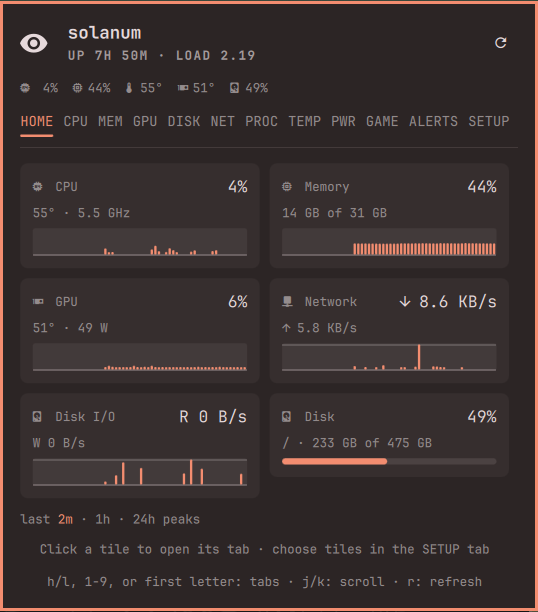 | 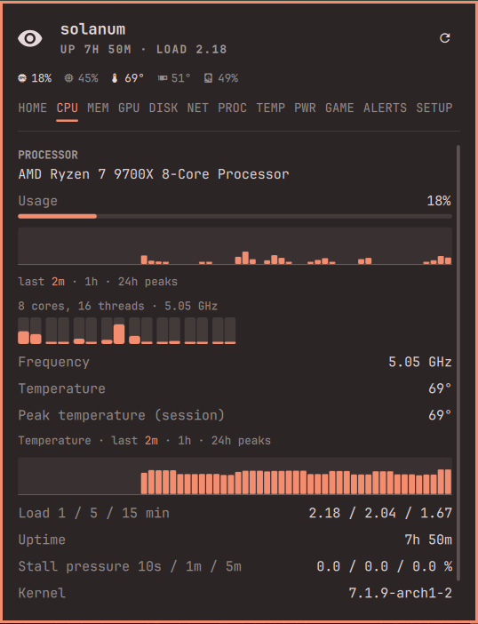 |
| 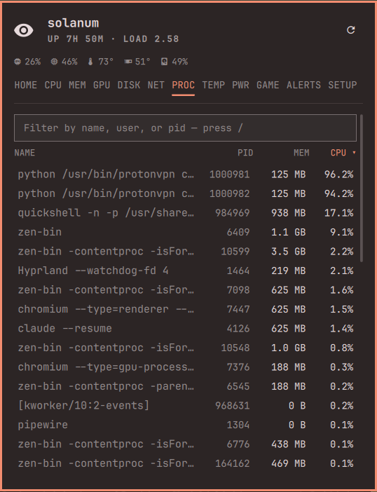 | 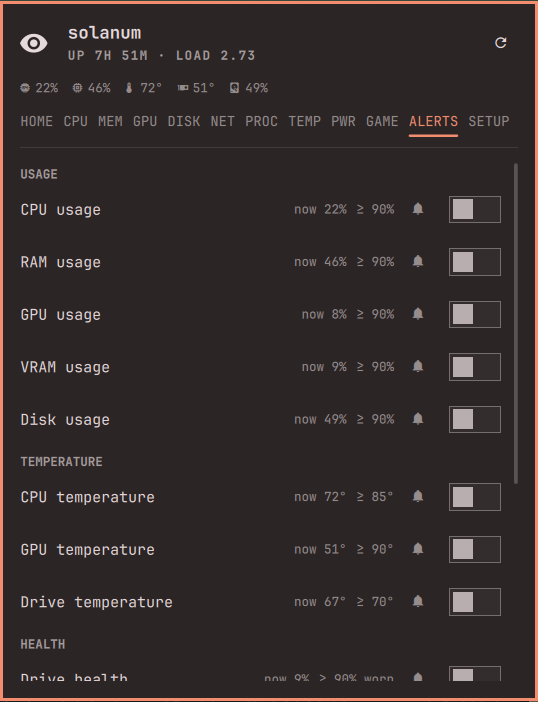 |
| 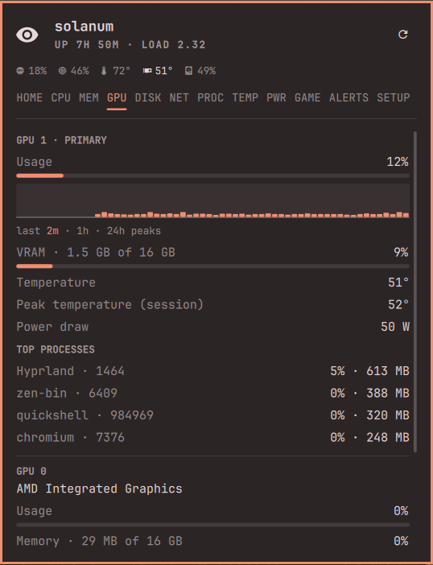 | 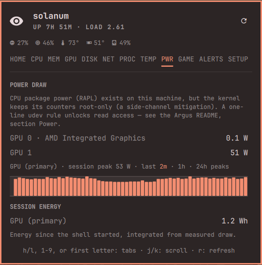 |
| 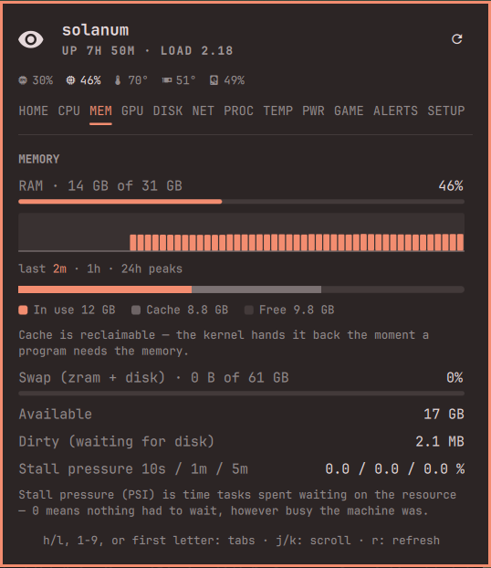 |  |
| 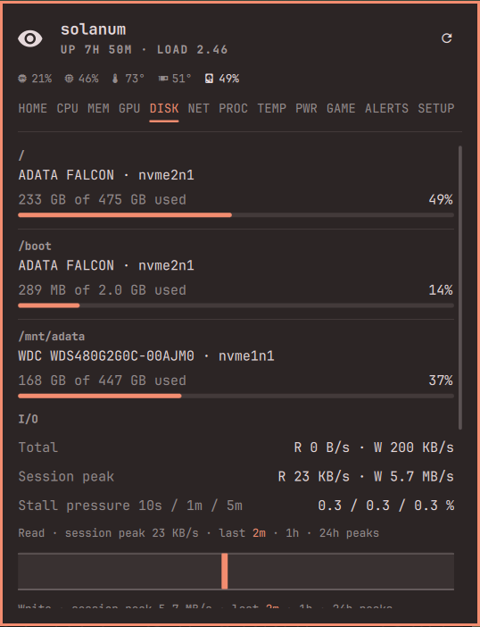 | 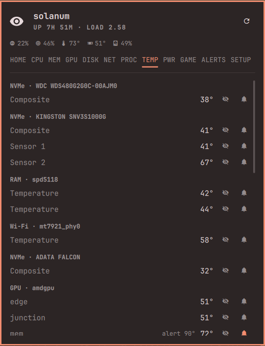 |
| 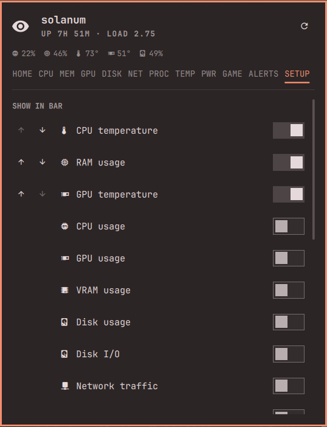 | |

## Interactions

- Bar button: left click opens the panel, middle click refreshes, right click launches btop
- Panel: `h`/`l` or ←/→ switch tabs, `1`–`9` or a tab's first letter jump straight to it, `j`/`k` or ↑/↓ scroll, `r` refreshes, `Esc` closes
- PROC tab: `/` focuses the filter, `j`/`k` walk rows, `Enter` expands the row, `x` terminates it (confirmed), column headers sort
- Reopening the panel lands on the tab you left; a currently-urgent metric overrides that and lands on the tab that explains it

Bind it in Hyprland if the bar is out of reach:

```
bindd = SUPER SHIFT, A, Argus, exec, omarchy-shell io.github.diegopluna.argus toggle
bindd = SUPER SHIFT, P, Processes, exec, sh -c 'omarchy-shell io.github.diegopluna.argus tab PROC; omarchy-shell io.github.diegopluna.argus open'
```

## Install

```bash
git clone https://github.com/diegopluna/omarchy-argus \
  ~/.config/omarchy/plugins/io.github.diegopluna.argus
omarchy plugin enable io.github.diegopluna.argus
```

Requires only tools an Omarchy install already has: `bash`, `coreutils`,
`df`, `ps` (procps), `lsblk` (util-linux), and `lspci` (pciutils) for GPU
names. On NVIDIA systems, `nvidia-smi` (which ships with the driver)
provides GPU stats. Optional: `btop` (right-click launch), and
`mangohud` (`sudo pacman -S mangohud` — not part of Omarchy) for the
GAME tab's in-game HUD; its test window uses `mpv`, which Omarchy's
base install ships. Without MangoHud everything else works and the
GAME tab says what's missing.

## Uninstall

```bash
omarchy plugin disable io.github.diegopluna.argus
rm -rf ~/.config/omarchy/plugins/io.github.diegopluna.argus
rm -rf ~/.local/state/argus
```

Disabling removes the widget from the bar; the only state Argus writes is
its own entry in `~/.config/omarchy/shell.json` and the flight-recorder
history at `~/.local/state/argus/history.json`.

## Settings

Inline settings on the widget's entry in `shell.json`:

| Key | Default | Meaning |
|---|---|---|
| `show` | `["cpu", "ram", "cputemp"]` | Metric keys shown in the bar, in display order |
| `intervalSec` | `2` | Poll interval in seconds, 1–60 (edited from the SETUP tab) |
| `tempUnit` | `"C"` | Temperature display unit, `"C"` or `"F"` (edited from the SETUP tab; everything is measured and stored in °C) |
| `diskMount` | `/` | Mount point used by the bar's disk metric |
| `alerts` | `"On"` | Master switch over every alert notification |
| `alertCommand` | — | Shell command run on every fired alert (see below) |
| `alertsOn` | `[]` | Alert keys the user toggled on (edited from the ALERTS tab) |

Urgent thresholds — one per metric (`urgentCpuPct`, `urgentCpuTempC`,
`urgentMemPct`, `urgentGpuPct`, `urgentGpuTempC`, `urgentVramPct`,
`urgentDiskPct`, `urgentDriveTempC`, `urgentBatPct`, `urgentWearPct`) —
are edited from the panel's **ALERTS** tab and persist as inline settings
alongside the keys above. They are per component because different
silicon has different comfort zones: GPUs run hot by design, SSDs
throttle early. Pre-0.9.0 configs keep working: the old shared CPU/RAM
values still cover GPU/VRAM until their own are set, and the pre-0.5.0
single `urgentTempC` still falls back for the CPU/GPU temperatures.
Load average turns urgent when the 1-minute load reaches the thread
count. Drive temperature is alert-only (it has no bar segment) and
watches the hottest NVMe/SATA sensor.

## Alerts

Every alert is **off by default**. The ALERTS tab lists them — CPU usage,
CPU temperature, RAM, GPU usage/temperature, VRAM, disk usage, drive
temperature, battery low, drive health — each with a toggle, the live
reading it watches ("now 43%"), and its threshold, editable inline
(−/+ stepper). Thresholds color bar segments
and panel rows urgent whether or not the alert is on; the toggle adds
the notification.

A toggled-on metric that stays past its threshold for three consecutive
ticks fires one desktop notification (via `notify-send`, so it renders
through the Omarchy shell). Temperature and battery alerts use critical
urgency; usage alerts are normal. Each metric then stays quiet for a
5-minute cooldown. Alerts evaluate every sampled metric, whether or not
its bar segment is shown.

CPU and memory alerts name their likely culprit — *"CPU usage at 100%
(threshold 90%) — chromium 61%"* — from a process snapshot taken the
moment the alert fires. With the drive-health alert on, a drive whose
SMART health turns bad (critical warning, wear past the configurable
alarm level, or media errors) alerts once per session.

The last twenty fired alerts are kept, with timestamps, at the bottom of
the ALERTS tab — for the "did anything trip while I was away?" question
that a vanished notification can't answer — and the CPU/MEM/GPU
sparklines mark where in the history each alert fired. Each logged alert
carries a **context snapshot**: click it to see what the system looked
like the moment it fired — headline metric values and the busiest
processes. The log persists with the flight recorder, so it survives
shell restarts.

On top of the default thresholds, **any individual sensor** can carry its
own alert threshold, set from the TEMP tab: the 󰂚 button on a sensor row
opens a stepper (−/+/off). A sensor over its limit renders its row in the
urgent color and fires a notification with the usual 3-tick hold and
cooldown. These persist in shell.json as a `sensorThresholds` map keyed by
`chip|device|label`, so they survive reboots and hwmon renumbering.

### Alert hook

`alertCommand` runs on every fired alert (in addition to the desktop
notification), with the alert's details in environment variables:
`ARGUS_ALERT_KEY` (metric key, `sensor:…`, or `drivehealth`),
`ARGUS_ALERT_TEXT` (the full message, attribution included),
`ARGUS_ALERT_CRITICAL` (`1`/`0`), and `ARGUS_ALERT_AT` (epoch ms). One
setting turns alerts into automation — log them, push them to a phone,
page a webhook:

```json
"alertCommand": "curl -s -d \"$ARGUS_ALERT_TEXT\" https://ntfy.sh/my-box"
```

## In-game HUD (MangoHud)

The GAME tab turns Argus into the GUI for [MangoHud](https://github.com/flightlessmango/MangoHud):
pick metrics, label them ("RX 9070" instead of "GPU"), place and style
the overlay — including colors that follow your Omarchy theme, in-game —
and every change applies **live** to running games via
`mangohudctl reload-cfg`. Argus writes its own config file
(`~/.local/state/argus/mangohud.conf`) and never touches your
`MangoHud.conf`.

Setup is two parts, and the split matters:

**Once, session-wide** — the config *path* only. Add to
`~/.config/hypr/hyprland.lua`, then `hyprctl reload`:

```lua
hl.env("MANGOHUD", "0")
hl.env("MANGOHUD_CONFIGFILE", os.getenv("HOME") .. "/.local/state/argus/mangohud.conf")
```

**Per game** — the activation. Steam → game → Properties → Launch
Options:

```
MANGOHUD=1 %command%
```

**Do not set `MANGOHUD=1` session-wide.** It looks convenient, but the
Vulkan layer then loads into *every* Vulkan process — browsers, video
players, and the Omarchy shell itself, which it can crash (found the
hard way: a libMangoHud segfault in quickshell's `vkCreateDevice` took
the whole desktop down in a crash loop). The per-game line is seven
characters of one-time typing per title and scopes the layer to actual
games.

(Also note: `env = ...` lines in `hyprland.conf` do **nothing** on
current Omarchy — the Lua config is the live one and the old syntax
fails silently. On pre-Quattro Omarchy, set the config-path variable
with `env = MANGOHUD_CONFIGFILE,...` there and re-log instead.)

MangoHud is a Vulkan implicit layer, and Proton runs everything through
DXVK/vkd3d — so this covers essentially your whole library with no
per-game launch options. The GAME tab shows whether the injection is
active and the exact lines to paste. `toggle_hud` (default
`Shift_R+F12`, configurable in the tab) summons or hides the overlay
mid-game.

## Power

The PWR tab shows what each source measures itself drawing: GPUs (amdgpu
hwmon / nvidia-smi), battery discharge, and the CPU package via RAPL
energy counters. Since the PLATYPUS side-channel mitigation, most
kernels keep `/sys/class/powercap/intel-rapl*/energy_uj` root-only, so
the tab shows an unlock hint instead of numbers. If you accept the
(local, sophisticated-attacker) side-channel tradeoff, one udev rule
opens the counters read-only for monitoring:

```bash
sudo tee /etc/udev/rules.d/99-argus-rapl.rules <<'EOF'
SUBSYSTEM=="powercap", KERNEL=="intel-rapl*", RUN+="/bin/chmod 0444 /sys%p/energy_uj"
EOF
sudo udevadm control --reload && sudo udevadm trigger -s powercap
```

(`intel-rapl` is the driver name on AMD too.) Argus never asks for
privileges itself; without access it reports the restriction and moves
on.

## Fans

Argus lists every `fan*_input` the kernel exposes under
`/sys/class/hwmon`. GPU and NVMe fans appear out of the box; motherboard
fan headers need the board's Super I/O driver loaded — on most consumer
boards (ASUS/MSI/Gigabyte with Nuvoton chips):

```bash
sudo modprobe nct6775
echo nct6775 | sudo tee /etc/modules-load.d/nct6775.conf
```

(`it87` for ITE chips; `asus_ec_sensors` covers some ASUS boards.)

## IPC

```bash
omarchy-shell io.github.diegopluna.argus toggle
omarchy-shell io.github.diegopluna.argus refresh
omarchy-shell io.github.diegopluna.argus tab TEMP
omarchy-shell io.github.diegopluna.argus span 24h  # sparkline span: 2m|1h|24h
omarchy-shell io.github.diegopluna.argus metrics   # current snapshot as JSON, for scripts
```

## Data sources

`/proc` (stat, meminfo, loadavg, uptime, net/dev, cpuinfo, diskstats,
swaps), `df`, `lsblk`, `ps`, `/sys/devices/system/cpu` for core topology
and frequencies, `ip` and `iw` (when present) for interface addresses and
the Wi-Fi SSID, `/sys/class/hwmon` for temperatures and fans,
`/sys/class/power_supply` for batteries (peripheral batteries such as mice
are filtered out via the sysfs `scope` attribute), and
`/sys/class/drm/card*/device` for AMD GPU busy/VRAM/GTT (amdgpu; a card
without `mem_busy_percent` — which the kernel exposes only for dedicated
VRAM — is an APU, so its memory pool is carve-out + GTT),
`/proc/*/fdinfo` DRM usage stats for per-process GPU usage, and udisks2
over D-Bus for drive SMART health. NVIDIA GPUs
are read through `nvidia-smi --query-gpu=... --format=csv,noheader,nounits`
and Intel GPUs (i915/xe) through their hwmon temperature/power — Intel
exposes no unprivileged busy counter, so usage is honestly marked
unavailable rather than shown as zero. nvidia-smi is
invoked only when `/proc/driver/nvidia/version` shows the driver is loaded,
guarded by a 3-second timeout; `[N/A]` fields (e.g. utilization on some
GPUs) degrade gracefully. While every NVIDIA card is runtime-suspended
(`/sys/bus/pci/.../power/runtime_status`), Argus skips the query entirely so
polling never keeps an Optimus dGPU awake, and shows the card as asleep.
Hybrid AMD iGPU + NVIDIA dGPU systems list both, with the bar's GPU metrics
following the card with the most VRAM.

## Sampling

One short bash sampler runs per refresh — shared by every bar surface, so
multi-monitor setups still sample once. Hardware identity that cannot
change while the shell runs (hostname, CPU model, disk models, GPU names)
is sampled once at startup (`sample.sh static`), and top processes are
sampled only while a panel is open, so `lsblk`/`lspci`/`ps` stay off the
always-on hot path. `df` and `lsblk` run under `timeout` so a stale
network mount degrades one tick instead of freezing the widget. GPU power
draw comes from amdgpu's hwmon `power1_average` and nvidia-smi's
`power.draw`. Usage deltas are computed in QML.

The SETUP tab shows what sampling actually costs (wall clock per tick,
measured, not promised). The shell never blocks on it, and the sampler's
own CPU cost is ~10ms per tick (values are read with zero-fork bash
builtins). The dominant wall cost turned out to be NVMe temperature
reads — an admin command a drive can take ~75ms to answer, which also
keeps it awake — so temperatures and fans sample every third tick with
the last readings replayed between (panel opens and manual refreshes
always sample everything), the full process table ships only while the
PROC tab is watched, and interface identity refreshes every fifth panel
tick. A throttled tick costs ~6ms of wall time.

## Contributing a hardware fixture

Argus aims to parse every machine's hwmon/GPU/battery layout correctly,
and the test suite proves it against a corpus of real samples in
`tests/fixtures/` — every fixture is re-parsed on every CI run. If Argus
misreads (or you just own) hardware the corpus lacks:

```bash
bash tests/make-fixture.sh > tests/fixtures/<cpu>-<gpu>.txt
```

The script scrubs your hostname and process lists; review the output,
then open a PR. One file makes your hardware a permanent regression test.

---

*Argus Panoptes never sleeps. Should you ever doubt that all hundred eyes
are still open, address him by name.*
