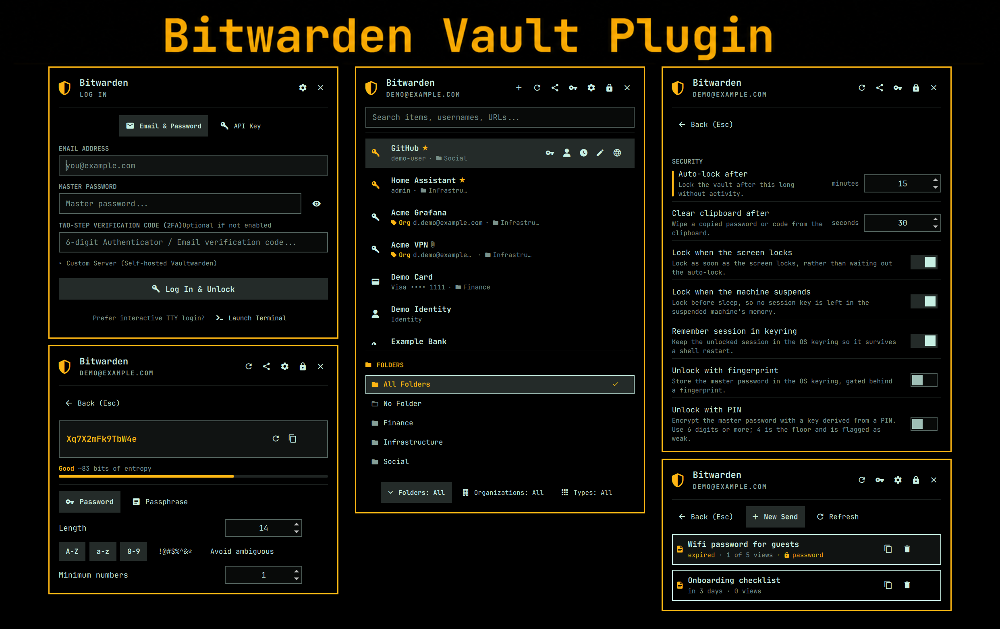
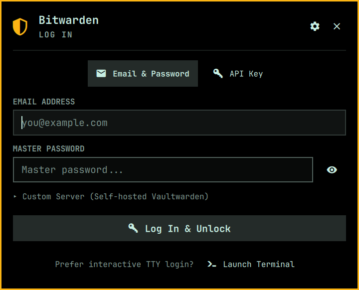
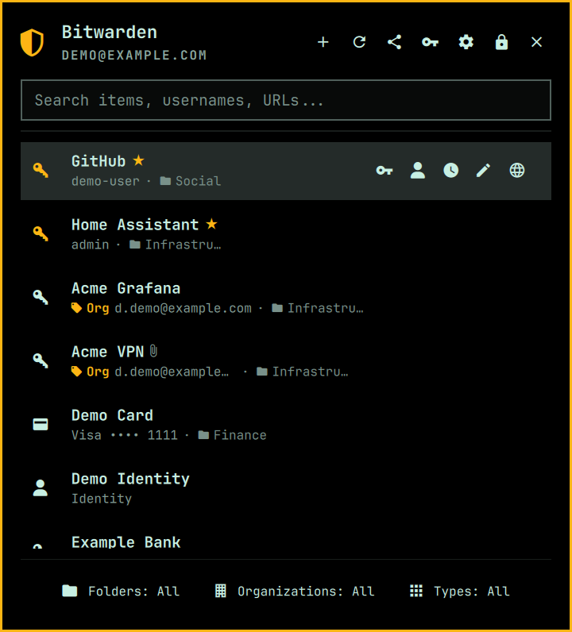
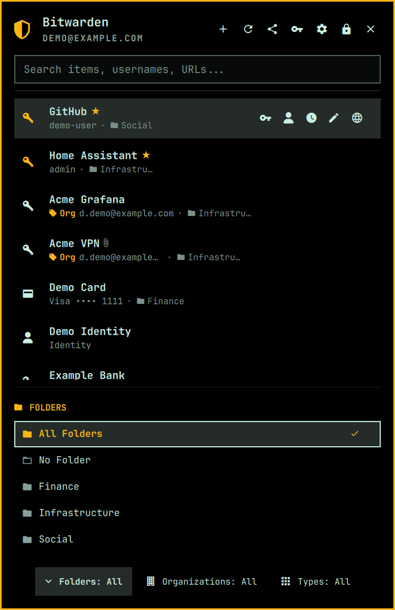
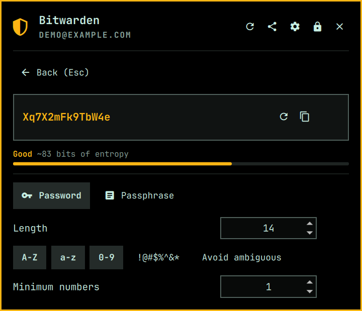
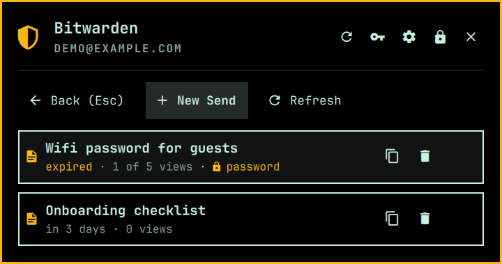

# qs-bitwarden-cli

A modern, fast, and feature-rich Bitwarden password manager plugin for the **Omarchy** shell environment and **Hyprland** desktop.

[](LICENSE)
[](manifest.json)
[](https://omarchy.org/)
[](https://bitwarden.com/help/cli/)



---

## Screenshots

Every screenshot below is captured against a **fixture vault** of made-up entries, never a real one -- see [Regenerating the Screenshots](#regenerating-the-screenshots) for how they are made and how to regenerate them.

| First run |
| :---: |
|  |
| The whole install: `omarchy plugin add`, then one button here. The panel watches for it and moves on to your vault by itself |

| Log in | Vault list | Filter drawer |
| :---: | :---: | :---: |
|  |  |  |
| Email + password first, then 2FA only when Bitwarden requests it; API key, custom server, and terminal handoff are also available | Folders, organizations, favourites and TOTP at a glance | Folders, Organizations and Types open as a drawer |

| Generator | Bitwarden Send | Settings |
| :---: | :---: | :---: |
|  |  |  |

---

## Overview

`qs-bitwarden-cli` seamlessly integrates your Bitwarden vault into the Omarchy status bar and quick access panel. Built with native QML/C++ bindings on top of Quickshell and the official Bitwarden CLI (`bw`), it provides lightning-fast search, secure credential auto-copy, live 2FA TOTP generation, multi-organization switching, and complete vault item management without ever opening a web browser.

---

## Features

- **Full Status Bar & Quick Access Panel Integration**:
  - Live vault lock state indicated in the status bar (`󰞀` shield icon: accent when unlocked, base when locked, urgent when unauthenticated).
  - Clean drop-down panel with fast navigation and keyboard-first workflow.

- **Authentication & Secure Keyring Storage**:
  - Direct Master Password unlock.
  - Interactive login starts with Email + Password and reveals the 2FA prompt only when Bitwarden requires it (Authenticator App or Email); API Key credentials (`BW_CLIENTID` / `BW_CLIENTSECRET`) remain available as a separate method.
  - **Custom Server Support**: Works seamlessly with official Bitwarden servers and self-hosted Vaultwarden instances.
  - **Terminal login fallback**: when the built-in form cannot cover your login method -- SSO, a Duo push, a hardware key -- the login screen offers **Launch Terminal**, which runs `bw login` in a real terminal so Bitwarden's own prompts handle it.
  - That terminal hands its session straight back: it captures the key with `bw login --raw` (prompts stay on stderr, so the login is still interactive) and writes it to `$XDG_RUNTIME_DIR/qs-bitwarden-cli/session-handoff`, mode `600`, in a directory created `700` before the file exists. There is no fallback path: if `XDG_RUNTIME_DIR` is somehow unset the login refuses to run rather than putting a session key anywhere a second user could have prepared. The panel reads that file once, deletes it, and comes back unlocked -- no second login just to get in. If the vault was merely locked rather than logged out, the same button unlocks instead. **It only reads it when it is expecting to.** The check runs on every status refresh, and it used to adopt whatever was at that path whether or not the panel had ever asked for a terminal login -- so anything able to write the file could hand the panel a session key at a moment of its own choosing, and the panel would take it and write it to the keyring. The runtime directory is `0700`, so that is one of your own processes rather than a stranger and it was never a privilege boundary; it was a window with no reason to be open. A key is only expected in the ten minutes after the panel itself launched a terminal, so those are the only minutes it is read in. Outside them the file is deleted unread -- not reading it is not a reason to leave a live session key lying in the runtime directory, and a login abandoned halfway leaves exactly that.
  - **The terminal reopens the panel for you** on success, then closes itself; you only have to dismiss it if something went wrong and there is an error worth reading.
  - Two `bw status` calls used to sit on that path, each around three seconds on a real vault: one in the terminal to decide login-versus-unlock, one in the panel to confirm a key `bw` had just minted. Neither is needed -- the panel already knows which state it is in, and the confirming check now starts only after the item list has been rendered instead of sitting in front of it.

- **PIN Unlock** (opt-in, `pinUnlock`):
  - Unlock with a numeric PIN instead of typing the master password. **6 digits or more is the recommendation**, 4 is the hard floor, and there is no upper limit. A PIN under 6 digits is accepted but the field turns red and tells you how small the search space you just chose is -- every extra digit multiplies an attacker's work by ten.
  - Unlike fingerprint unlock, the master password is **not** stored in the clear: it is encrypted with a key derived from your PIN (PBKDF2-SHA256, 600,000 iterations, salted) and only the ciphertext is kept, so reading the keyring alone does not reveal it.
  - A wrong PIN simply fails to decrypt, so no PIN hash is stored and there is none to attack.
  - Five wrong attempts removes the stored ciphertext entirely; re-enabling needs the master password again. So does a master password change, which is detected on the first failed unlock.

- **Fingerprint Unlock** (opt-in, `fingerprintUnlock`):
  - Unlock the vault with an enrolled fingerprint instead of retyping your master password.
  - Verifies through the same PAM stack as the Omarchy lock screen (`/etc/pam.d/omarchy-lock-fingerprint`), so it works wherever `omarchy setup security fingerprint` has been run.
  - Enrolling asks for your master password up front in the settings screen, rather than quietly capturing it on some later unlock.
  - The reader is armed automatically whenever you open the panel on a locked vault; the master password field always stays available as a fallback.
  - See [Fingerprint Unlock](#fingerprint-unlock) below for the security trade-off before enabling it.

- **Context-Aware Password Suggestions (Active Window / Browser Tab)**:
  - Reads the active window on open (`hyprctl activewindow -j`, falling back to the `hyprctl clients -j` focus history when the panel itself holds focus).
  - Recognises the current site from the browser's page title and matches it against each item's URLs and name using Bitwarden-style host and base-domain rules, brand aliases (a `Gmail` tab matches a `google.com` item), and word-boundary matching that ignores public suffixes and generic labels such as `www`, `login`, or `com`.
  - Places a highlighted **`󰌠 Suggested for <App / Website>`** banner and pins matching credentials to the top of the list with pre-selection, so pressing <kbd>Enter</kbd> immediately copies the right credential.
  - Only the strongest tier of matches is shown (at most 6), and a title with nothing identifiable in it produces no suggestions rather than a guess.
  - Standalone desktop apps match on window class; terminals only suggest for remote `ssh`/`mosh`/`sftp` hosts, never for local shells.
  - **It learns.** Opening or copying an item while a window is active records that window against the item, and it is suggested outright next time -- ahead of every heuristic. This is what handles sites a title can never match: a portal on `auth.example.xyz` titled `Home - authentik` shares no word with the stored credential, so pick it once and it sticks. Learned suggestions are marked `󰐾` rather than `󰌠`.
  - **Suggest here / Suggested here** in an item's detail view pins or unpins that item for the current site or app deliberately, without waiting to be taught.
  - Re-picking a different item retargets what was learned, so a bad association corrects itself the next time you choose.
  - Associations live in `~/.local/state/qs-bitwarden-cli/associations.json` (mode `600`) and hold only vault item IDs and the title words they were learned from -- never credentials. Writes replace a private temporary file atomically, never follow a symlink, and narrow an older permissive file back to `600`; reads validate the schema and discard unknown versions, malformed entries, and keys outside the `domain:`, `app:`, and `word:` namespaces. **Logging out deletes the file after any active writer has exited**, so an in-flight update cannot resurrect the previous account's metadata. It holds no secrets, but between them the domains, app names and timestamps are a record of which sites the account has logins for and when each was last used, in the clear and with no expiry of its own.
  - **Limitation:** browsers do not publish the active tab URL to Wayland or Hyprland, so the *heuristics* work from the page title. A site whose title mentions neither its name nor its domain (`New Tab`, a bare `Sign in`) cannot be inferred -- teach it once instead.

- **Smart Auto-Copy TOTP Flow on <kbd>Enter</kbd>**:
  - Selecting a login item and pressing <kbd>Enter</kbd> copies the **Password** to the clipboard and automatically closes the panel, returning focus immediately to your target application so you can paste (<kbd>Ctrl+V</kbd>) and submit.
  - If the item has a TOTP 2FA secret configured, the plugin automatically copies the live 6-digit **TOTP code** to your clipboard after a brief delay (default: 3s) and posts a desktop notification saying so. The notification deliberately does **not** contain the code: a notification daemon keeps history and can render a body over a lock screen, which is no place for a live second factor. The digits are shown in the panel itself, with their countdown.
    - You can immediately paste the TOTP code into the 2FA prompt without ever reopening or refocusing the plugin!
    - If you prefer manual progression, pressing <kbd>Enter</kbd> or <kbd>t</kbd> while the follow-up banner is active also copies the code immediately.

- **Full Add, Edit & Delete (CRUD) Operations**:
  - **Create Items (`n` key or `+` button)**: Add new **Logins** (`󰌋`) or **Secure Notes** (`󰈐`).
  - **Password Generator**: A full generator screen (<kbd>g</kbd> or the `󰌆` button) mirroring the Bitwarden browser extension's options -- password (length, A-Z, a-z, 0-9, special, minimum numbers, minimum special, avoid ambiguous) or passphrase (word count, separator, capitalise, include number), with a live strength meter. Generation comes from Bitwarden's own generator rather than a reimplementation, and the item form's **Generate...** button opens this same screen and fills the password field in on the way back.
  - **It is fast.** A fresh `bw generate` costs about 2.9 seconds, almost none of it generation: roughly 0.9s is the CLI's Node bootstrap and 2s is Bitwarden's service container starting, and every option toggle paid it again. The panel now starts `bw serve` on loopback the first time you open the generator and asks that, which answers in about **2ms**. The server is deliberately started with **no session**, so it is a locked vault that can generate passwords and nothing else -- a loopback port has no authentication and is reachable by every user on the machine, so it must never hold an unlocked vault. The server is also only up while the generator screen is: `bw serve` answers `/status` with your account email and user id to anyone on the machine who asks, so it goes up with the screen and comes down with it rather than idling on a port for the whole session. And an answer on that port is not taken as proof the server is ours -- there is no authentication to lean on, so the port is probed before we start, and anything already answering means the panel uses `bw generate` for that visit instead of letting a stranger's server pick your password. If our own server later dies, any value it had already supplied is discarded rather than left on screen to be copied. **And no request to that port can hold the panel up, fill it, or leave loopback.** Every request runs through a managed child process with curl's config disabled, proxies bypassed, a two-second deadline, and a producer-side 64 KB cap. A request cut short counts as an occupied port, never a free one.
  - **Edit Items (`e` key or Edit button)**: Modify titles, credentials, authenticator keys, URLs, and notes.
  - **Delete Items (`x` key or Delete button)**: Delete items with confirmation protection.

- **Bitwarden Send** (<kbd>Alt</kbd>+<kbd>S</kbd> or the `󰒗` button):
  - Share a secret through a link that expires on its own, so a credential need not live in a chat log.
  - Create a text Send with a name, hidden-by-default text, a deletion window (1-31 days), a maximum view count, and an optional password. The access link is copied to your clipboard the moment it is created.
  - Lists your existing Sends with how long each has left (`in 3 days`, `expired`), views used against the maximum, and whether a password is set. Copy a link or delete a Send from the row.
  - Keyboard: <kbd>n</kbd> new, <kbd>r</kbd> refresh, <kbd>x</kbd> delete the highlighted Send, <kbd>Enter</kbd> copy its link, <kbd>Esc</kbd> back.
  - The Send payload -- which carries the Send password -- is passed to `bw` through the environment, never on the command line.

- **Attachments**:
  - Items that carry files are marked with a `󰏢` paperclip in the list, and the detail view lists each attachment with its name and size.
  - The list costs nothing: `bw list items` already returns the attachment metadata with the cipher, so the files are on screen the moment the item opens. Only the bytes need the CLI, and only for the file you ask for.
  - **Save** puts a file in your download directory (`xdg-user-dir DOWNLOAD`, falling back to `~/Downloads`), then offers **Open** and **Show in folder** for it. <kbd>a</kbd> saves every attachment on the item; they are fetched one at a time rather than starting a `bw` per file.
  - Nothing is ever written through whatever already sits at the chosen path: the bytes land in a private staging directory first and the finished file claims its name atomically, so a symlink left in the download folder is stepped around rather than followed, and an existing file is never overwritten -- " (1)", " (2)" and so on go before the extension until the name is free.
  - A download is bounded before it starts and while it runs: 512 MB per file, 15 minutes, and a check that the disk has room. If the server omits the size, the preflight reserves for the full 512 MB ceiling rather than treating it as an empty file. A transfer that breaks a limit leaves nothing behind.
  - **A file name out of the vault is treated as hostile.** It is decrypted content that is about to become part of a path, so path separators and control characters are replaced rather than stripped, a leading dot or dash is dropped, and the result is quoted on top of that: `../../.bashrc` saves as `bashrc` in your download directory and nowhere else. Tests run the real script against a stub `bw` to prove it.

- **Folders**:
  - Filter by folder from the bottom filter bar: **All Folders**, **No Folder**, or any specific folder.
  - Items show their folder inline (`󰉋 Name`) when no folder filter is active.
  - Assign a folder when creating or editing an item from an expandable list, including clearing an existing assignment, and create a new folder inline without leaving the form.

- **Unified Bottom Filter Bar**:
  - Three identical buttons centred at the bottom -- **Folders**, **Organizations**, **Types** -- each showing its current selection, so the active filters are readable at a glance without opening anything.
  - Opening one drops the window down like a drawer rather than squeezing the item list, with a pinned header naming the group (and its total when it overflows).
  - Five options are visible at a time and the rest scroll underneath the pinned header.
  - Any action outside the drawer closes it -- selecting an item, searching, copying, syncing, locking or opening another screen -- so it never sits over the results.
  - Fully keyboard driven: <kbd>f</kbd> folders, <kbd>v</kbd> organizations, <kbd>i</kbd> types; <kbd>↑</kbd>/<kbd>↓</kbd> move through the options, <kbd>Enter</kbd> applies, <kbd>Esc</kbd> closes. The cursor starts on the option already active, so <kbd>Enter</kbd> changes nothing by accident.

- **Organizations & Collections**:
  - The item form picks an organization from an expandable list, and reveals that organization's **collections** once one is chosen -- Bitwarden files org-owned items into collections rather than folders, and refuses to save one that is in none.
  - Collections are a multi-select, since an item can belong to several. A lone collection is pre-selected, and the form says "pick at least one" before the CLI would.
  - Choosing **My Vault** for an organization item clears both its organization and its collections.

- **Multi-Organization & Vault Filtering**:
  - Automatically queries and displays organizations you belong to.
  - Organization filter bar: **All Vaults**, **My Vault** (Personal items), or specific shared **Organization**.
  - Shared items display a prominent `󰓹 Org` tag in the list and detail views.
  - Choose destination vault (Personal vs. Organization) when creating or editing items.

- **Guided First Run — no prerequisites**:
  - `omarchy plugin add ... --enable` is the entire install. The widget enables into the bar with nothing else installed, wearing a `+` badge, and opens on its setup screen instead of a login form it cannot service.
  - The dependency probe runs ahead of anything that touches `bw`, so a machine without the CLI never lands on a dead end.
  - The setup screen watches for the install it launched and moves on to the vault by itself the moment the tools land — no re-check, no restart.

- **Setup Wizard & In-Panel Settings**:
  - Checks the tools Omarchy does not already ship (`bw`, plus fingerprint unlock) in a single probe, marking each required or optional and saying what it is for. Everything else the plugin shells out to comes with Omarchy, so the screen stays one short list rather than a wall of rows that are green on every machine.
  - A missing **required** tool opens the wizard automatically. **Install** hands off to `omarchy install app`, which surfaces the install in Omarchy's own floating, centred terminal -- the same window every other app install on the system opens.
  - Fingerprint unlock is Omarchy's job end to end: **Set up** runs `omarchy setup security fingerprint`, which detects the reader, installs `libfprint`/`fprintd`/`usbutils`, enrols a finger, verifies it, and writes the PAM stacks. The row is only drawn on a machine with a reader (`omarchy-hw-fingerprint`), and there is no `pkg add fprintd` button, because installing the package alone leaves the row exactly as red as it was.
  - Press <kbd>,</kbd> or the `󰒓` button for settings, grouped into **Security**, **Behavior** and **Suggestions**: auto-lock timeout, clipboard clear delay, TOTP auto-copy delay, and every toggle. A setting whose dependency is missing is shown but inert, with the reason given.
  - Changes are written to the plugin's entry in `~/.config/omarchy/shell.json` through `omarchy bar set`, so Omarchy owns the file and the shell hot-reloads the change. Nothing is stored in a second place.
  - Reachable from a keybind too: `omarchy-shell io.github.elevate08.qs-bitwarden-cli settings` (or `setup`).

- **Hardware-Accelerated Performance & Security**:
  - Virtualized `ListView` with component delegate recycling for instant rendering of large vaults.
  - Asynchronous search debouncing (50ms) for responsive 0ms typing latency.
  - **Unlock and password-login startup is prewarmed.** Opening the locked screen, or focusing the password field while logged out, starts the Bitwarden CLI and leaves it waiting on a private mode-`600` FIFO. Submitting the form writes the exact password bytes into that pipe, so most of the CLI's Node and service-container startup has already happened. Closing the panel cancels the waiting process and removes the FIFO.
  - **Items load before secondary metadata.** After authentication, the first command fetches only the item list. Folders, organizations and the confirming status refresh begin after those items have been parsed and rendered. Short `Loading items...` and `Syncing...` status text exposes the work without adding another screen.
  - **There is no persistent item cache.** Every authenticated cold load is verified through `bw`; decrypted vault items are never written into the plugin directory or another cache. The speedup comes from moving startup off the submit path and removing unrelated commands from the critical item path.
  - **Credentials do not reach a command line.** `/proc/<pid>/cmdline` is world-readable on a default Linux install while `/proc/<pid>/environ` is not. The session token travels in `BW_SESSION`; direct unlock and email-login passwords move from `BW_PASSWORD` through the private FIFO selected with `--passwordfile`; API key credentials use `BW_CLIENTID` / `BW_CLIENTSECRET`; item, folder, and Send payloads and copied secrets use their own variables. None is interpolated into a command or shell script. The one exception is the two-step login code: `bw` offers no environment option for it, so `--code` puts it in `bw`'s own argv for the length of the login — it is carried in `QSBW_CODE` and expanded there, which at least keeps it out of the wrapping shell. Tests assert that no builder emits `--session` and that no auth command carries a password, client secret or client ID in argv.
  - **The custom-server field is checked before the master password is sent to it.** `bw config server` takes whatever it is given, and the next thing down that path is your master password, so a plain `http://` address is refused unless it is loopback -- where there is no wire to listen on, and where a local Vaultwarden or an SSH tunnel to one is a normal way to run this. Any scheme that is not `http` or `https` is refused outright. The loopback exemption is anchored and userinfo is stripped before the host is judged, so `http://localhost.evil.com` and `http://localhost@evil.com` are both refused. Backslashes are refused too: WHATWG clients interpret them as path separators, and otherwise `http://evil.example\@localhost` can look local to a lightweight parser while connecting to `evil.example`.
  - Automatic clipboard clearing (`wl-copy --clear`) after a configurable timeout (default: 30s), and immediately whenever the vault locks. Password and TOTP fallback reads are managed and generation-checked, so a command that finishes after a lock cannot put its result on the clipboard.
  - Optional session token caching in Linux Secret Service (`secret-tool` / libsecret).
  - **Keyring writes cannot race a lock, logout, or cancelled setup.** Session, PIN, and fingerprint-password stores are generation-stamped; a completion from an old vault or an authentication setup form the user left is cleared instead of recreating a credential that was just removed.
  - **Locking the vault also discards what was still on its way out of it.** Every read and operation records the vault generation it started under, and the generation moves whenever the vault is locked, logged out of, or unlocked. A late item list, generated password, attachment completion, CRUD result, or newly created Send link is dropped instead of repopulating memory, navigating the locked panel, or copying a secret after the lock. Process output is accepted only after its exit status is known.
  - **And a lock forgets it as well as refuses it.** Refusing a stale answer still leaves it in the pipe it came down. Quickshell's `StdioCollector` keeps whatever its process last printed for as long as that process is not started again -- `text` is read-only, there is no `clear()`, and nothing drops the buffer when the panel stops reading it -- so every secret that had ever come back through one was still in the shell after the vault locked: the session key from the handoff file and from the keyring, the master password from the PIN and fingerprint lookups, both halves of a login or unlock, the whole item list with each login's password in its raw object, an item detail, a live TOTP. Clearing the properties those were copied into left the originals sitting behind them. The buffer *is* replaced when the process next starts, so a lock now runs a command that prints nothing through every collector that can hold vault data or a credential; anything still mid-read is come back for once it finishes.
  - **Auto-lock counts the time the machine was asleep.** Qt schedules its timers on the monotonic clock, which Linux stops while the machine is suspended, so a fifteen-minute countdown armed just before the lid closed still had fifteen minutes to run when the lid opened -- a vault left overnight came back exactly as open as it was left. The deadline is kept in wall-clock terms as well and polled every thirty seconds, so waking a suspended machine locks the vault rather than resuming the countdown. Between the monotonic timer and the wall clock, whichever notices first does the locking.
  - **The vault locks when the screen locks and when the machine suspends.**
  - **Settings are validated where they are read, not only where they are written.** Nothing validates `shell.json`, and a bad value there can fail open rather than loudly: a non-numeric minute count reaches QML as `NaN`, lands in an integer property as `0`, and `0` is how "never lock" is spelled, while a count past the documented ceiling overflows the timer's 32-bit interval into a negative number that never fires. Each numeric setting is held to the range in the table below, and anything unreadable falls back to its default instead of to zero. Boolean settings accept only actual JSON booleans, so strings such as `"false"` cannot become truthy by JavaScript coercion.
  - **A remembered session does not survive a reboot.** The login keyring is a file on disk that PAM unlocks again at the next login, so a machine powered off with an unlocked vault used to come back unlocked. Two things stop that. The token is written to libsecret's `session` collection, which the secret service holds in memory and destroys with the login session, so there is nothing on disk to come back; and it is stamped with the kernel's boot id, so a token that does survive -- a secret service with no session collection, a keyring restored from a backup -- no longer matches the running boot and is refused and cleared instead of used. Restarting the shell still keeps you unlocked. Powering the machine off does not.

---

## Installation & Setup

### 1. Install the Plugin

```bash
omarchy plugin add https://github.com/Elevate08/qs-bitwarden-cli --enable
```

That is the whole install. It clones the plugin into
`~/.config/omarchy/plugins/`, enables it, and places it in the bar section named
by the manifest (`right`). Nothing else has to be installed first. To update it
later:

```bash
omarchy plugin update io.github.elevate08.qs-bitwarden-cli
```

### 2. First Run

The widget appears in the bar straight away, with a small `+` badge if anything
it drives is still missing. Click it and the panel opens on its setup screen:
on a stock Omarchy install that is the Bitwarden CLI and nothing else, with an
**Install** button. Pressing it opens Omarchy's own installer window -- floating,
centred and themed, the same one every other app install on the system uses.

The panel watches that window's work for you. As soon as the tools land, it
moves on to the login or unlock screen on its own -- there is nothing to come
back and re-check, and no command to run first.

You can reopen it any time with <kbd>,</kbd> from the settings screen, or:

```bash
omarchy-shell io.github.elevate08.qs-bitwarden-cli setup
```

<details>
<summary>What the setup screen installs, and why</summary>

The plugin shells out to these rather than bundling them, so they are ordinary
system packages you can also install by hand:

| Tool | Package | Required | Used for |
| --- | --- | :---: | --- |
| `bw` | `bitwarden-cli` | yes | Reading and writing your vault. |
| `fprintd-list` | (via `omarchy setup security fingerprint`) | no | Fingerprint unlock. Omarchy installs the reader stack, enrols your finger and writes the PAM config in one command; the row only appears if you have a reader. |

The equivalent of what the Install button runs:

```bash
omarchy install app 'Bitwarden CLI' bitwarden-cli
```

That is the whole list, and only the first entry holds the panel back. The
plugin also uses `wl-copy` for the clipboard, `secret-tool` for the keyring,
`hyprctl` for window detection, and `gdbus`, `systemd-inhibit` and `openssl`
for suspend handling and PIN encryption -- but Omarchy ships every one of
those, so the setup screen does not list what it would only ever find already
there.

</details>

### 3. Bar Placement & Configuration

`--enable` already puts the widget in the bar. To move it:

```bash
omarchy bar move io.github.elevate08.qs-bitwarden-cli --section right
```

Settings are editable from the panel's own settings screen, or directly in
`~/.config/omarchy/shell.json`. Each setting lives **inline on the bar entry**,
not in a separate block:

```json
{
  "bar": {
    "layout": {
      "right": [
        {
          "id": "io.github.elevate08.qs-bitwarden-cli",
          "autoLockMinutes": 15,
          "lockOnScreenLock": true,
          "lockOnSuspend": true,
          "clearClipboardSec": 30,
          "rememberSession": true,
          "fingerprintUnlock": false
        }
      ]
    }
  }
}
```

### 4. Global Hotkey Configuration

To toggle the Bitwarden panel with a keyboard shortcut (e.g. `SUPER + CTRL + /`), add the binding to `~/.config/hypr/bindings.lua`:

```lua
o.bind("SUPER + CTRL + SLASH", "Bitwarden vault", "omarchy-shell io.github.elevate08.qs-bitwarden-cli toggle")
```

Apply changes by restarting the shell:

```bash
omarchy restart shell
```

### 5. Removal

```bash
omarchy plugin remove io.github.elevate08.qs-bitwarden-cli
```

That removes the plugin folder and its bar entry. Nothing the plugin stores
lives inside that folder, so clear the rest yourself if you want it gone:

```bash
# Session key, and the master password stored for PIN/fingerprint unlock
secret-tool clear service qs-bitwarden-cli

# Learned window-title -> vault item suggestions
rm -rf "${XDG_STATE_HOME:-$HOME/.local/state}/qs-bitwarden-cli"

# Settings block, if you edited shell.json by hand
# -> delete the "io.github.elevate08.qs-bitwarden-cli" key under "plugins"
```

Two more paths are written but need no cleaning up, because neither outlives
the moment it is used: the session handoff file under `$XDG_RUNTIME_DIR`, which
is read once and deleted and is on a tmpfs that goes with the login session,
and a `.qsbw-` staging directory inside your download folder, which exists only
for the length of an attachment download and is removed however that download
ends. Saved attachments themselves stay where you saved them, mode `600`.

Beyond those, the plugin writes nothing outside the paths above and your
`shell.json` entry, and it never modifies your Bitwarden vault on removal. Your vault is untouched -- log
out of the `bw` CLI separately with `bw logout` if you also want that cleared.

---

## Usage & Keyboard Shortcuts

The panel opens with the item list focused, so single-letter shortcuts work straight away. Press <kbd>/</kbd> to type a search.

**While the search box has focus** every letter is search text -- as a text field should behave. Hold <kbd>Alt</kbd> to reach the same shortcuts without leaving the box or disturbing your query; <kbd>↓</kbd> also hands focus back to the list.

### Vault List View (Main Screen)

| Shortcut | Action |
| :--- | :--- |
| <kbd>Enter</kbd> | Copy password (and arm the TOTP follow-up) |
| <kbd>Enter</kbd> *(again)* | Copy the TOTP code during the follow-up window |
| <kbd>↑</kbd> / <kbd>↓</kbd> / <kbd>j</kbd> / <kbd>k</kbd> | Move through items, or through an open filter drawer |
| <kbd>/</kbd> | Focus the search box |
| <kbd>Tab</kbd> / <kbd>Shift+Tab</kbd> | Cycle types without opening the drawer |
| <kbd>p</kbd> *(or <kbd>y</kbd>)* | Copy **p**assword |
| <kbd>u</kbd> *(or <kbd>c</kbd>)* | Copy **u**sername / email |
| <kbd>m</kbd> | Copy TOTP **m**ulti-factor code |
| <kbd>w</kbd> | Open the **w**ebsite in your browser |
| <kbd>e</kbd> | Open the detail inspector / **e**dit |
| <kbd>f</kbd> | **F**olders filter |
| <kbd>o</kbd> | **O**rganizations filter |
| <kbd>t</kbd> | **T**ypes filter |
| <kbd>g</kbd> | **G**enerator |
| <kbd>n</kbd> | **N**ew vault item |
| <kbd>s</kbd> | **S**ettings |
| <kbd>r</kbd> | Sync (**r**efresh) |
| <kbd>l</kbd> | **L**ock the vault |
| <kbd>Alt</kbd>+<kbd>s</kbd> | Bitwarden **S**end |
| <kbd>Alt</kbd>+<kbd>,</kbd> | Settings |
| <kbd>Esc</kbd> | Close the filter drawer, clear the search, or close the panel |

`Alt` + any letter above runs the same action from inside the search box. Two are `Alt`-only: <kbd>Alt</kbd>+<kbd>s</kbd> opens **Send** (which has no bare letter, since <kbd>s</kbd> is Settings), and <kbd>Alt</kbd>+<kbd>,</kbd> opens **Settings**, so Settings is still reachable while searching.

### Detail Inspector

| Shortcut | Action |
| :--- | :--- |
| <kbd>p</kbd> / <kbd>y</kbd> | Copy password |
| <kbd>u</kbd> / <kbd>c</kbd> | Copy username |
| <kbd>m</kbd> | Copy TOTP code |
| <kbd>v</kbd> | Toggle re**v**eal / mask password |
| <kbd>a</kbd> | Save every **a**ttachment on this item |
| <kbd>e</kbd> | Edit this item |
| <kbd>x</kbd> | Delete this item (asks first) |
| <kbd>b</kbd> / <kbd>q</kbd> / <kbd>Esc</kbd> | Back to the list |

### Filter Drawer (Folders / Organizations / Types)

| Shortcut | Action |
| :--- | :--- |
| <kbd>f</kbd> / <kbd>o</kbd> / <kbd>t</kbd> | Open (or close) that drawer |
| <kbd>↑</kbd> / <kbd>↓</kbd> | Move through the options |
| <kbd>Enter</kbd> | Apply the highlighted option |
| <kbd>Esc</kbd> | Close without changing anything |

The cursor starts on the option already in effect, so <kbd>Enter</kbd> never changes a filter by accident.

### Settings Screen

| Shortcut | Action |
| :--- | :--- |
| <kbd>↑</kbd> / <kbd>↓</kbd> | Move between settings |
| <kbd>←</kbd> / <kbd>→</kbd> | Decrease / increase a number by its step, or switch a toggle off / on |
| <kbd>Enter</kbd> | Flip the highlighted toggle, or open the PIN / fingerprint form |
| <kbd>Esc</kbd> | Back |

### Send Screen

| Shortcut | Action |
| :--- | :--- |
| <kbd>Alt</kbd>+<kbd>s</kbd> | Open Sends |
| <kbd>n</kbd> | New Send |
| <kbd>r</kbd> | Refresh the list |
| <kbd>x</kbd> | Delete the highlighted Send |
| <kbd>Enter</kbd> | Copy the highlighted Send's link |
| <kbd>Esc</kbd> | Back |

---

## IPC & Scripting Interface

You can control and query the Bitwarden plugin from the terminal, scripts, or window manager bindings. The form is `omarchy-shell <target> <method>`:

```bash
# Show, hide, or toggle the popup panel
omarchy-shell io.github.elevate08.qs-bitwarden-cli open
omarchy-shell io.github.elevate08.qs-bitwarden-cli close
omarchy-shell io.github.elevate08.qs-bitwarden-cli toggle

# Jump straight to a screen
omarchy-shell io.github.elevate08.qs-bitwarden-cli settings     # -> "settings"
omarchy-shell io.github.elevate08.qs-bitwarden-cli setup        # -> "setup" (dependency wizard)

# Lock the vault immediately
omarchy-shell io.github.elevate08.qs-bitwarden-cli lock         # -> "locked"

# Sync with Bitwarden
omarchy-shell io.github.elevate08.qs-bitwarden-cli sync         # -> "syncing"

# Query vault state
omarchy-shell io.github.elevate08.qs-bitwarden-cli status       # -> "unlocked" | "locked" | "unauthenticated"
```

`open`, `close` and `toggle` return nothing; the rest echo the state they moved to.

Omarchy's shell-level dispatcher also toggles any plugin, and works equally well for a keybinding:

```bash
omarchy-shell shell toggle io.github.elevate08.qs-bitwarden-cli
```

Only `toggle` exists at that level, though -- `omarchy-shell shell open|close <id>` answers `Function not found`, and `omarchy-shell shell call <id> <method> '{}'` answers `unknown`. Use the plugin-target form above for everything other than toggling.

The same calls work through Quickshell directly, which is useful when `omarchy-shell` is not on `PATH`:

```bash
qs -p /usr/share/omarchy/shell/shell.qml ipc call io.github.elevate08.qs-bitwarden-cli status
```

---

## Configuration Reference

The following settings are read from the plugin's own entry in the
`bar.layout` array of `~/.config/omarchy/shell.json` -- inline alongside its
`id`, as shown above. The panel's settings screen writes them for you via
`omarchy bar set`, so editing the file by hand is optional:

| Key | Type | Default | Description |
| :--- | :--- | :--- | :--- |
| `autoLockMinutes` | `number` | `15` | Minutes of inactivity before automatically locking the vault (`0` to disable). Range `0`-`1440`; out of range is clamped and an unreadable value falls back to `15`. |
| `clearClipboardSec` | `number` | `30` | Seconds before automatically clearing copied secrets from the clipboard (`0` to disable). Range `0`-`300`; out of range is clamped and an unreadable value falls back to `30`. |
| `lockOnScreenLock` | `boolean` | `true` | Lock the vault as soon as the screen locks, rather than waiting out `autoLockMinutes`. Reads the Omarchy lock screen's own state, so it follows a manual lock and an idle lock alike. A shell without the lock plugin simply never reports a lock; it is never read as one. |
| `lockOnSuspend` | `boolean` | `true` | Lock the vault when the machine is going to sleep, so no unlocked session key is left in the suspended machine's memory. Holds a `delay` sleep inhibitor for about a second so the lock finishes first. Needs `gdbus` (glib2) and `systemd-inhibit`; without them the setting is simply inert. |
| `rememberSession` | `boolean` | `true` | Persist session token in OS keyring (`secret-tool`) while unlocked. Survives a shell restart, never a reboot -- see the note above. |
| `autoCopyTotpSec` | `number` | `3` | Seconds after password copy to automatically replace clipboard with TOTP code (`0` to disable). Range `0`-`30`; out of range is clamped and an unreadable value falls back to `3`. |
| `closeOnCopy` | `boolean` | `true` | Automatically close panel on Enter copy so target application receives focus immediately. |
| `suggestOnOpen` | `boolean` | `true` | Automatically suggest matching vault items for the active window or browser tab on open. |
| `fingerprintUnlock` | `boolean` | `false` | Unlock the vault with an enrolled fingerprint. Stores your master password in the OS login keyring -- see below. |
| `pinUnlock` | `boolean` | `false` | Unlock with a numeric PIN. Stores the master password encrypted under a PIN-derived key -- see below. |

Learned suggestions are stored separately in `~/.local/state/qs-bitwarden-cli/associations.json`. Delete that file to reset everything the panel has learned; logging out deletes it for you.

---

## PIN Unlock

Turn on **Unlock with PIN** in the settings screen. You are asked for your master password once (it is needed to encrypt) and for a PIN. Six digits or more is what the screen asks for; four and five are accepted but shown in red with the number of combinations spelled out, so a weak PIN is a decision rather than an accident.

**How it differs from fingerprint unlock.** Fingerprint unlock keeps your master password in the login keyring in the clear, because PAM can only prove presence. A PIN can do better: the master password is encrypted with a key derived from the PIN (PBKDF2-SHA256, 600,000 iterations, salted) and only the ciphertext is stored, so reading the keyring is not by itself enough. A wrong PIN fails decryption, which means correctness needs no stored hash and there is no hash to attack.

**The honest limit.** A short PIN is a small search space, and if the ciphertext leaks, the iteration count is the only thing standing between an attacker and your master password. Five wrong attempts at the panel deletes the stored ciphertext, but that is a UI throttle and does nothing against an offline attack on a copy of the blob. Concretely: 4 digits is 10,000 candidates, which is minutes of offline guessing even at 600,000 PBKDF2 rounds each; 6 digits is 1,000,000, and 8 is 100,000,000. Pick accordingly.

The stored ciphertext is removed when you turn the setting off, after five wrong attempts, or when the vault rejects the decrypted password (for example after a master password change).

---

## Fingerprint Unlock

Set `fingerprintUnlock` to `true` to unlock the vault with a finger instead of your master password.

**Requirements**

- A fingerprint reader with at least one enrolled finger, configured through `omarchy setup security fingerprint`. The plugin verifies all of this itself (`/etc/pam.d/omarchy-lock-fingerprint`, `fprintd-list`) and silently stays hidden when any part is missing.
- A running, unlocked OS keyring, as used by `rememberSession`. Omarchy ships libsecret itself, so there is nothing to install for this.

**How it works**

1. Switch **Unlock with fingerprint** on in the settings screen. It asks for your master password once -- the same way setting a PIN does -- and stores it in the login keyring under `service=qs-bitwarden-cli, account=master_password`.
2. On every later lock, opening the panel arms the reader. A verified fingerprint releases the stored password to `bw unlock`; the password field remains available as a fallback at all times.
3. Unlocking with your master password afterwards refreshes the stored copy, so changing your master password does not silently strand the enrolment.

**Security trade-off -- read before enabling**

PAM can prove that you are present, but it cannot produce your Bitwarden master password, and `bw unlock` accepts nothing else. Fingerprint unlock therefore keeps your master password in the OS login keyring and treats a verified fingerprint as the gate on reading it back. This is the same trade the official Bitwarden desktop client makes for its own biometric unlock, and it means **anyone who can read your unlocked login keyring can read your master password**. It is off by default and worth leaving off on a shared or unattended machine.

The stored password is removed when you turn the setting off, press **Forget Fingerprint** on the locked screen, log out of the account, or when the vault rejects it (for example after a master password change, which then prompts you for the new one).

---

## Regenerating the Screenshots

The screenshots in this README are generated, not hand-cropped, and never show a real vault:

```bash
./demo/capture.sh            # writes docs/screenshots/*.png
```

`demo/bin/bw` is a stand-in for the Bitwarden CLI that answers from `demo/fixtures.json`. The script restarts the Omarchy shell with `demo/bin` ahead of it on `PATH`, so the plugin resolves `bw` to the shim and renders a vault of invented entries -- `demo@example.com`, `Acme Corp`, a card numbered `4111 1111 1111 1111`. Nothing in that path reads your keyring, touches the network, or runs the real `bw`, and the real shell is restored on exit, including if the script is interrupted.

`demo/find_panel.py` crops each image to the panel by locating its accent-coloured border. That matters for privacy as much as tidiness: a fixed crop leaves a margin of whatever is behind the panel -- windows, filenames, terminal scrollback -- in the published image.

To change what the screenshots show, edit `demo/fixtures.json` and re-run the script.

---

## Linting

Omarchy plugins are Qt6/Quickshell, so lint with the **Qt6** `qmllint` --
`/usr/bin/qmllint` on Arch is the Qt5 binary from `qt5-declarative` and exits
255 with no diagnostics on this file. The `qs.*` modules resolve only when the
import path contains a directory named `qs`:

```bash
mkdir -p /tmp/qs-imports && ln -sfn /usr/share/omarchy/shell /tmp/qs-imports/qs
/usr/lib/qt6/bin/qmllint -I /tmp/qs-imports Panel.qml FormPickerRow.qml
```

Remaining `unqualified` and `missing-property` warnings are baseline Quickshell
noise -- the stock Omarchy plugins report the same categories -- as are the
`signal-handler-parameters` warnings on `Process.onExited`, whose
`QProcess::ExitStatus` argument qmllint cannot see.

Validate the manifest against the schema the shell enforces:

```bash
omarchy plugin validate .
```

---

## Tests

Regression suites, no dependencies beyond Node:

```bash
node tests/auth.test.js             # unlock/login commands, and that no credential reaches argv
node tests/auth-prewarm.test.js     # private FIFO lifecycle, byte-exact password delivery, and cancellation
node tests/context-match.test.js    # window-title matching and learned suggestions
node tests/setup-settings.test.js   # dependency probe, settings writer, PIN crypto
node tests/first-run.test.js        # a fresh install with no `bw` yet: the setup gate, the
                                    # sequence that follows the install, and what the
                                    # in-panel install button asks for
node tests/generator.test.js        # generator option clamping and strength
node tests/folders.test.js          # folder parsing, filtering and assignment
node tests/sends.test.js            # Send payloads, parsing, and argv-safety
node tests/collections.test.js      # organization collections and item ownership
node tests/items.test.js            # item parsing, and that a list entry can build the detail view
node tests/attachments.test.js      # attachment metadata, that a vault file name cannot escape ~/Downloads,
                                    # that a symlink cannot redirect a download, and the transfer ceilings
node tests/handoff-urls.test.js     # session-handoff file path, and which URI schemes may be opened
node tests/rich-text.test.js        # vault text is drawn as text, never parsed as markup
node tests/session-boot.test.js     # a remembered session dies with the boot that minted it
node tests/stream-limits.test.js    # every stream the shell reads is capped by its producer
node tests/lock-state.test.js       # the auto-lock survives a suspend, the timings are clamped
                                    # on the way in, and a read of a vault that has since closed
                                    # is refused rather than rendered
node tests/lock-triggers.test.js    # locking on screen lock and on suspend, and the window in
                                    # which a terminal login's session key is accepted
node tests/hardening.test.js        # `--` before every server-chosen id, the custom-server check,
                                    # and that logging out takes the learned suggestions with it
node tests/buffer-scrub.test.js     # emptying the pipe buffers a lock used to leave full, and the
                                    # deadline and size ceiling on every generator-port request
node tests/initial-load.test.js     # items render before folders, organizations and status refresh
node tests/performance.test.js      # deterministic small/typical/large/stress vault guardrails
```

The performance suite generates invented 100-item/0.25 MiB, 500-item/1 MiB,
2,000-item/5 MiB and 5,000-item/14 MiB vaults. It reports p95 JSON parsing,
filtering and contextual-match times over 20 warm samples and fails on broad
regressions. It measures only in-process work after `bw` returns, so network,
server and CLI startup latency should be measured separately on the target
machine.

The 2026-08-24 auth benchmark used Bitwarden CLI 2026.2.0 and three runs with a
deliberately invalid password. A normal unlock took 2,641 ms median from submit
to result; after a three-second prewarm while the password screen was already
open, it took 1,026 ms -- a 1,615 ms / 61.1% reduction. These figures are a
same-machine comparison, not a universal latency promise.

Two suites need Qt rather than Node -- which any machine running the plugin
already has. One checks that Escape reaches the panel from inside a text
field; the other checks how Qt itself decides to draw a string, which is what
makes a vault value markup or text:

```bash
QT_QPA_PLATFORM=offscreen /usr/lib/qt6/bin/qmltestrunner -input tests/qml
```

---

## License

MIT -- see [LICENSE](LICENSE).
