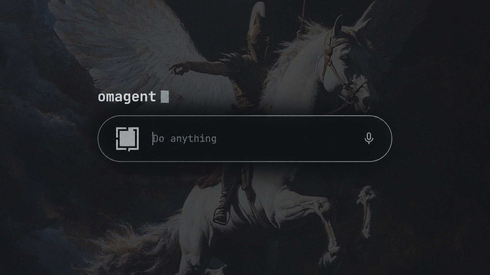
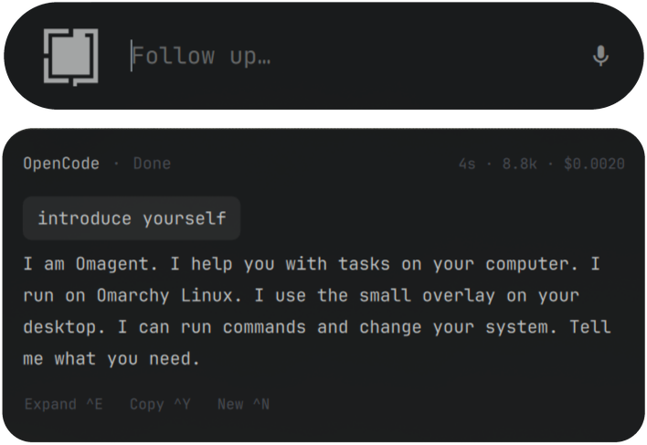

# Omagent



Omagent 0.1.0 is an alpha plugin for [Omarchy](https://omarchy.org).
The pill is a small input bar at the top of the screen.

You write a request.
Then you press Enter.
The default agent of Omarchy does the request.
The default agent is the agent that `omarchy default agent` sets.
The answer shows in a card below the pill.

NOTE: This release is an alpha. We did a full test of opencode on one machine.

Omagent does not set an agent for you.
You must set the default agent.
Omagent does not add a sandbox.

## Necessary items

You must have:

- Omarchy 4 with the overlay `omarchy-shell`
- Python 3.11 or a later version
- A default agent (`omarchy default agent opencode`)
- `wl-copy` from `wl-clipboard` for copying answers (included with Omarchy)

The plugin uses Omarchy's agent, terminal, notification, and voice-status
helpers. The selected agent must be installed and authenticated with its
provider. Provider usage may cost money. Python uses only its standard library.

Voxtype is not necessary.
You can use [Voxtype](https://github.com/basecamp/voxtype) for the microphone button.

## Install

1. Add the plugin:

```sh
omarchy plugin add https://github.com/ellion369/Omarchy-Omagent.git --enable
```

This command copies the plugin.
Then it sets the plugin to ON.

2. Check for an existing binding before adding the key and layer rule:

```sh
omarchy menu keybindings --print
```

Review `bindings.lua.install` and `layerrule.lua.install` first. If `SUPER+A`
is already assigned, choose an unused key in the binding snippet. Back up
your configuration and append the snippets once:

```sh
cp ~/.config/hypr/bindings.lua ~/.config/hypr/bindings.lua.bak.$(date +%s)
cat ~/.config/omarchy/plugins/io.github.ellion369.omagent/bindings.lua.install \
    ~/.config/omarchy/plugins/io.github.ellion369.omagent/layerrule.lua.install \
    >> ~/.config/hypr/bindings.lua
```

The plugin has no key before you add this text.
The layer rule adds blur behind the card.
If you do not add the layer rule, the card operates without blur.

Check that Hyprland accepts the configuration:

```sh
hyprctl reload
hyprctl configerrors
```

3. Restart the shell:

```sh
omarchy-restart-shell
```

Restart after installation or QML updates so this keep-loaded overlay is
instantiated with the current code.

4. Press `SUPER+A` to open the pill.

## Operation



Write a request.
Press Enter.
The next Enter continues the same session.

| Key | Function |
|---|---|
| `SUPER+A` | Open the pill |
| `Enter` | Send the request |
| `Shift+Tab` | Set auto-approve to ON or OFF for this session |
| `Ctrl+E` | Open this session in the terminal of the agent |
| `Ctrl+C` | Stop the agent |
| `Ctrl+N` | Start a new session and remove the card text |
| `Ctrl+Y` | Copy the last answer |
| `Escape` | Hide the overlay. The agent continues. |
| `PageUp` / `PageDown` | Scroll the card |

`SUPER+A` opens the last session again until you press `Ctrl+N`.
If you press Escape while the agent operates, the agent continues.
A notification shows when the agent stops.

If the directory `~/Work` exists, the agent starts there.
If this directory does not exist, the agent starts in `$HOME`.
A request must not have more than 2000 characters.

## Permissions

The pill has two modes.
The pill shows the mode.

Ask is the default mode.
Omagent does not change the permission rules of the agent.
The pill cannot show a permission prompt.
If the agent must ask, it does not do the action.

Auto-approve starts when you press `Shift+Tab`.
The agent gets its auto-approve flag.
This flag is the same as the flag of `omarchy agent`:

- `opencode --auto`
- `claude --permission-mode auto`
- `codex --approve-for-me`
- `gemini --yolo`.

The pill shows AUTO.
A new session sets the mode to Ask.
A restart of the shell sets the mode to Ask.
`Ctrl+E` opens the terminal of the agent without the auto-approve flag.

These two modes apply to the four streaming adapters below. Other agents
are handed to `omarchy agent`, which applies its own approval flags regardless
of the pill's mode. The pill's AUTO setting does not control those terminal runs.

**CAUTION:** Do not use auto-approve as a sandbox.
The agent operates on your files.
A deny rule for bash does not always stop the agent.
In one test, opencode used `unlink` when the rule `"rm *": "deny"` was set.
Use auto-approve only after you read the request.

## Agents

Four agents show output in the card.
The other agents open a terminal with your request.

| Agent | Output | Status |
|---|---|---|
| `opencode` | Card | Full test done |
| `claude` | Card | No test |
| `codex` | Card | No test |
| `gemini` | Card | No test |
| `crush` | Terminal | No test |
| `grok` | Terminal | No test |
| `copilot` | Terminal | No test |
| `pi` | Terminal | No test |
| `omp` | Terminal | No test |

NOTE: No test means that the adapter exists. We did not do a full test.

The Gemini adapter currently resumes `latest`, so another Gemini session can
change which conversation it opens. Use opencode for the verified workflow.

## Saved data

Omagent saves the last transcript, session ID, resume command, working
directory, usage totals, and overlay position in
`~/.local/state/omagent/last.json`. Auto-approve is not saved. The selected
agent manages its own history, credentials, and provider connections.

## Problems

If `SUPER+A` does nothing:

1. Restart the shell with `omarchy-restart-shell`.
2. Make sure that `~/.config/hypr/bindings.lua` contains `io.github.ellion369.omagent`.

If the card has no blur, add `layerrule.lua.install` to `~/.config/hypr/bindings.lua`.

If you see `No default agent set`, set a default agent:

```sh
omarchy default agent opencode
```

For shell loading errors, examine the shell log:

```sh
journalctl --user -f | grep -i omagent
```

Plugin `console.log` messages may not appear there. Router errors appear in
the card. `OMAGENT_DRY_RUN=1 ./omagent-route -- "your request"` checks the
selected command from a repository checkout without running the agent.

## Remove

```sh
omarchy plugin remove io.github.ellion369.omagent
omarchy-restart-shell
```

This command removes the plugin directory.
This command does not remove these items.
Remove them if you do not need them:

- The `SUPER+A` key and the layer rule in `~/.config/hypr/bindings.lua`
- The saved session in `~/.local/state/omagent/`

## License

MIT.
See `LICENSE`.
