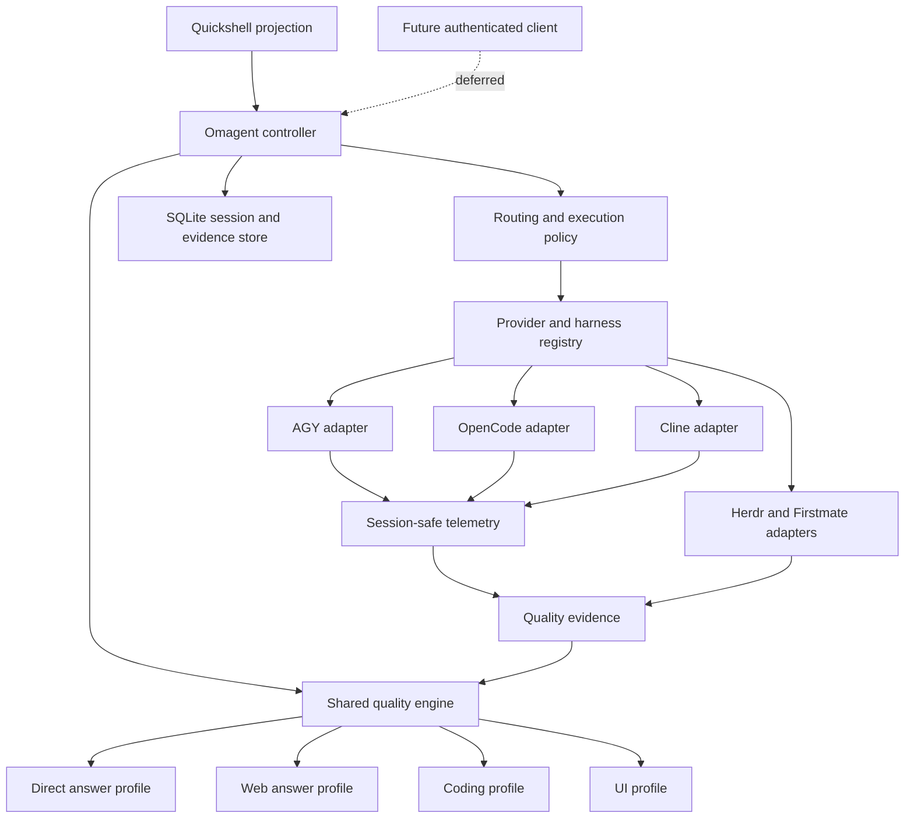
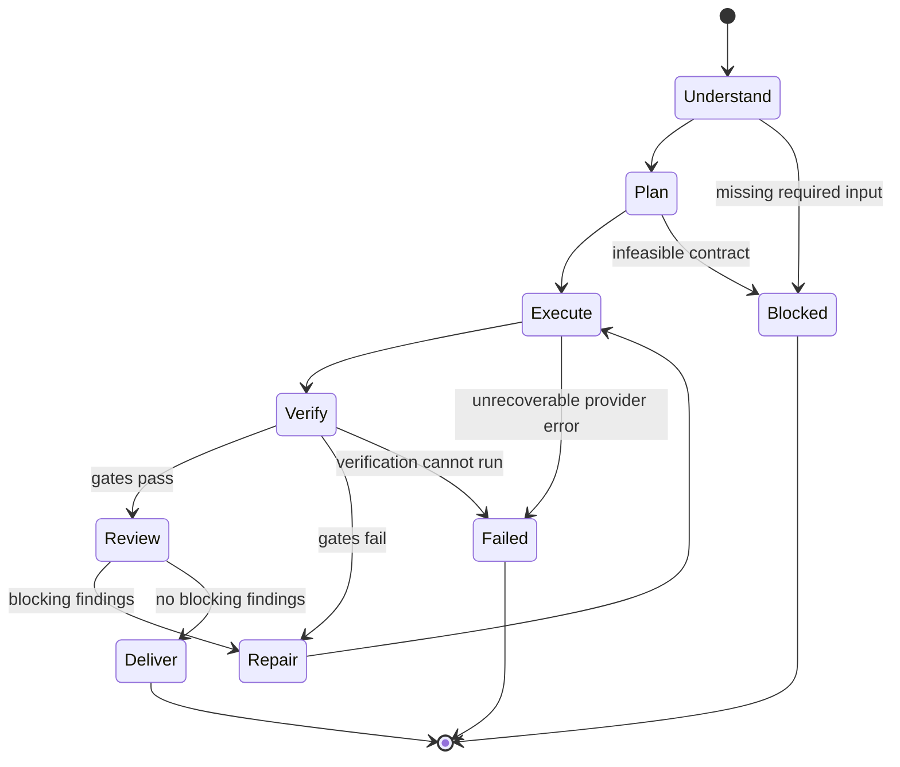
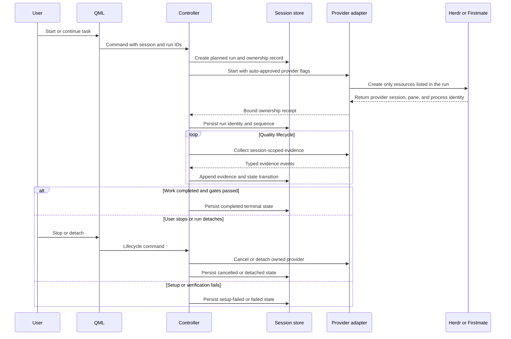
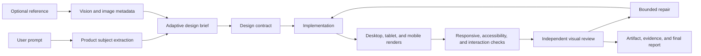

# Omagent Quality and Reliability Redesign - Plan

## Goal Capsule

- **Objective:** Make Omagent's direct, web, coding, and UI outputs consistently useful, verifiable, and correctly reported so the user can rely on the system without manually auditing every result.
- **Means:** Migrate the current monolith through a strangler architecture, add one shared evidence-based quality engine, and gate completion on deterministic checks plus independent review (KTD1, KTD4, KTD5).
- **Authority:** The user's Product Contract decisions and session-settled choices govern scope. This plan governs implementation. Current source and tests govern discovered behavior. A later user decision may replace either contract only through an explicit plan revision.
- **Execution profile:** Deep, phased, local-first implementation. Preserve the working feature surface while replacing lifecycle, provider, quality, and persistence foundations before restoring advanced automation.
- **Stop conditions:** Stop the current migration phase and preserve the last known-good overlay if a change causes false completion, cross-session contamination, uncontrolled process creation, loss of saved history, or an inability to recover an active run. Do not weaken a quality gate to make a benchmark pass.
- **Tail ownership:** After implementation, `ce-work` owns code changes, verification, review, simplification, and commits. This plan does not authorize implementation by itself.

---

## Product Contract

### Summary

Rebuild Omagent around a shared quality engine that plans, executes, verifies, reviews, repairs, and reports every task. Keep auto-approval enabled by default, but make quality evidence and truthful lifecycle state the authority for completion.

### Problem Frame

The current plugin has grown into a broad agent operating system. Its UI, router, provider selection, worktree creation, fleet orchestration, transcript parsing, session persistence, and quality instructions are spread across a 3,367-line QML file and a 7,868-line Python router. The result is not only a large surface area. It also produces weak and inconsistent output because task intent, execution, evidence, verification, review, repair, and final reporting are not governed by one explicit quality contract.

The current system also has correctness failures that directly reduce trust in output. The documented dry-run is not side-effect free. Coding follow-ups can provision new worktrees instead of steering the active run. OpenCode and Cline transcript readers are not session-isolated. Setup failures can be reported as completion. The QML and router write the same session files. The auto-approve control does not control the actual provider launch mode. Quality is therefore vulnerable to false progress, cross-run contamination, duplicated work, and unverified final claims.

The user does not need an approval-friction product. They need auto-approved work that is more capable, more consistent, and easier to trust after the fact. The plan therefore keeps local auto-approval while moving trust to deterministic quality gates, explicit evidence, correct state transitions, and independent review.

### Actors

- A1. **Local user:** Starts tasks, changes modes, stops or detaches work, reviews artifacts, and decides whether output is useful.
- A2. **Omagent controller:** Resolves the request, selects a quality profile, coordinates execution, and owns the run lifecycle.
- A3. **Lead coding agent:** Implements a task inside the selected workspace and produces evidence required by the active quality profile.
- A4. **Specialist subagents:** Perform bounded implementation, test, UI, or review roles when the task decomposition requires them.
- A5. **Independent reviewer:** Checks the result against the task contract and quality gates without relying on the implementer's completion claim.
- A6. **Provider adapters:** Run AGY, OpenCode, Cline, Gemini, Herdr, Firstmate, and browser tooling through stable interfaces.
- A7. **Quickshell overlay:** Renders state and evidence but does not infer completion or ownership.

### Requirements

#### Shared quality engine

- R1. Every direct, web, coding, and UI task must pass through one versioned quality profile with explicit understand, plan, execute, verify, review, repair, and deliver stages.
- R2. The quality engine must preserve the original request, derived task contract, selected workspace, provider decisions, commands, changed files, test results, screenshots, reviewer findings, and final claims as inspectable evidence.
- R3. Completion must be based on deterministic gates and the active profile's acceptance criteria, not on an agent's self-report, elapsed time, unrelated file activity, or a monitor timeout.
- R4. Verification failures must enter a bounded repair loop with the same workspace and task context. The final report must disclose unresolved findings.

#### Coding and engineering quality

- R5. Coding tasks must produce a scoped implementation plan before editing, run the repository's real verification commands, and pass an independent code review before completion.
- R6. Coding follow-ups must steer the existing run by default. New worktrees, branches, and fleets must be created only for an explicit new-task transition or when the current run cannot continue.
- R7. Auto-approval must remain the default execution posture. Quality approval comes from evidence gates, not from an extra interactive confirmation step.
- R8. Provider and subagent selection must be task-driven. The system must use the smallest fleet that can satisfy the task and quality gates.
- R9. Provider choice, model choice, and fallback state must come from one routing decision. Every selected provider must have a tested adapter and session-safe telemetry.
- R10. Stop, detach, resume, and cleanup must operate on the real owned process and workspace. Unrelated Herdr or Firstmate resources must never be changed.

#### UI and design quality

- R11. UI tasks must produce a design contract before implementation. The contract must define the user subject, visual direction, layout, interaction, responsive behavior, accessibility target, and verification views.
- R12. Reference images must contribute aesthetic and structural evidence without allowing the reference subject, copy, or brand to replace the user's requested product.
- R13. UI completion must require rendered inspection at agreed viewport sizes, responsive and accessibility checks, interaction verification, and an independent visual review with a repair pass for material defects.
- R14. The current fixed interrogation flow must become an adaptive brief. Omagent must ask only questions that materially change the design and otherwise proceed with explicit assumptions.

#### Direct and web answer quality

- R15. Direct answers must satisfy instruction coverage, context use, clarity, and uncertainty requirements before delivery.
- R16. Web answers must identify retrieval failure instead of silently presenting an ungrounded answer as current. Sources and retrieval limits must remain visible to the user.
- R17. Stream assembly, history persistence, and rendered text must use the same ordered content and must not lose whitespace or merge unrelated runs.

#### Architecture, state, and operations

- R18. The router must become a compatibility entry point over modular components. Provider, session, route, quality, telemetry, and orchestration logic must have separate owners.
- R19. One authoritative session store must own transcript, task, evidence, run, and resource state. The QML layer must not write router-owned state independently.
- R20. The event protocol must be versioned and must distinguish setup failure, completion, cancellation, detachment, blocking, and monitor timeout.
- R21. Dry-run must produce a plan without network, provider, process, Git, Herdr, Firstmate, or persistent-state side effects. Execution must use a separate explicit path.
- R22. The current router must not rewrite global provider binaries, provider trust, or unrelated user configuration as a side effect of task routing.
- R23. Credentials must not be stored in normal Omagent configuration or emitted into logs, prompts, events, or session files.
- R24. The system must first support the local installation, but all user-specific paths must be derived from runtime context and covered by portability tests before public release.
- R25. CI must run router, QML, session, provider, orchestration, quality, and end-to-end lifecycle checks with fake external dependencies. Real provider calls must not be part of deterministic CI.
- R26. Current production features must migrate behind independently testable feature gates. The migration must preserve rollback to the last known-good overlay until the replacement path meets its quality gates.
- R27. The user surface and every internal agent must use the same atomic controller operations for start, inspect, continue, verify, stop, detach, resume, review, repair, cleanup, and explicit new-task transition. Each operation must return the same run identity, ownership record, lifecycle state, evidence cursor, and failure classification.
- R28. A conversation session is a container for multiple immutable runs. It may have at most one nonterminal run. A follow-up continues the active run, while an explicit lane override or new-task command creates a child run without mutating the parent workspace or evidence.
- R29. Lifecycle checkpoints must be durable, ordered, and idempotent. Resume must continue the same run and workspace. If the original provider session cannot resume, a tested adapter may hand off in the same workspace and record the transition.
- R30. A deliverable with unresolved blocking gates must terminate as incomplete. A blocked run awaits user or system action. A failed run has no safe deliverable. Neither state may be represented as completed.
- R31. Coding work requires a discovered repository root or an explicit workspace. Omagent must not silently initialize a hidden repository, mutate repository ignore files, or create a new worktree when workspace setup fails.

### Key Decisions

- KD1. **Auto-approval remains the default.** The product will not add a mandatory confirmation gate before local coding work. Quality gates and evidence, not approval friction, determine whether work is complete. (session-settled: user-directed - chosen over interactive approval gating: the user accepts local auto-approval and prioritizes output quality.) Governs R7, R11, R13, R26.
- KD2. **Quality is a shared engine with domain profiles.** Direct, web, coding, and UI tasks use one lifecycle with different acceptance checks. This avoids four unrelated definitions of done. Governs R1, R2, R3, R5, R11, R15.
- KD3. **The migration is incremental.** Existing lanes remain available through compatibility adapters while the controller, state store, lifecycle, and quality engine replace them. Governs R18, R19, R20, R26.
- KD4. **The local installation is the first acceptance target.** Portability cleanup is required, but public-release polish does not delay local quality gates. Governs R24, R25.

### Key Flows

- F1. **Direct answer flow:** Request -> quality profile -> context assembly -> answer -> instruction and clarity review -> bounded repair -> evidence-backed delivery.
- F2. **Web answer flow:** Request -> query plan -> retrieval -> source assessment -> grounded synthesis -> citation and retrieval review -> delivery or explicit retrieval failure.
- F3. **Coding flow:** Request -> task contract -> workspace and run creation -> plan -> implementation -> deterministic verification -> independent review -> repair loop -> final report.
- F4. **UI flow:** Request or reference -> adaptive design brief -> design contract -> implementation -> rendered and responsive verification -> visual review -> repair -> artifact and evidence delivery.
- F5. **Continuation flow:** Existing run -> ownership lookup -> current workspace and provider binding -> follow-up planning -> same-run execution -> updated evidence and review.
- F6. **Lifecycle flow:** Planned -> starting -> working -> verifying -> reviewing -> repairing -> terminal state, with explicit cancelled, blocked, detached, failed, and setup-failed paths.

### Acceptance Examples

- AE1. Given a coding request, when the lead agent claims completion, then Omagent has run the declared verification, recorded the changed files and command evidence, completed an independent review, and either closed all blocking findings or reported them.
- AE2. Given a follow-up to an active coding run, when the user asks for another change, then Omagent reuses the same owned workspace and session unless the user explicitly requests a new task.
- AE3. Given Herdr workspace creation fails, when no provider process starts, then the event is setup-failed and no background-success message appears.
- AE4. Given two active provider sessions, when telemetry updates arrive, then each overlay sees only evidence from its own provider session and run.
- AE5. Given a UI task with a reference image, when the design contract is created, then it preserves the requested product subject and uses the image only for approved visual evidence.
- AE6. Given a UI implementation, when the quality engine reaches review, then desktop and mobile renders exist, material layout defects are checked, accessibility and responsive checks have run, and a reviewer has evaluated the result.
- AE7. Given web retrieval returns no usable results, when synthesis cannot be grounded, then Omagent reports the retrieval failure or asks for another query instead of presenting an unsupported current answer.
- AE8. Given dry-run mode, when the router is invoked, then no external process, network call, Git change, provider launch, or persistent state write occurs.
- AE9. Given the user presses Stop, when a provider process is owned by the run, then the real process or pane receives cancellation and the terminal state identifies the cancellation.
- AE10. Given a provider model is selected, when subagents are launched, then the routing decision records whether each role inherits that model or has an explicit role-specific override.
- AE11. Given a UI brief asks a blocking design question, when the question is emitted, then the run enters awaiting-user and the next answer continues the same run without a completion event.
- AE12. Given a provider process exits without verified completion evidence, when the controller observes the exit, then the run enters failed and preserves partial evidence without reporting completion.
- AE13. Given Stop is requested before an ownership receipt exists, when the controller handles the command, then the run becomes cancelled-before-start and no external resource is touched.
- AE14. Given a detached run survives an Omarchy shell restart, when Resume is requested, then the controller rebinds the same run, workspace, and provider identity or reports a recovery blocker without launching an unowned replacement.
- AE15. Given a legacy session contains a running or detached sidecar without a trustworthy ownership receipt, when it is migrated, then it enters recovery-required and cannot be reported complete or reattached automatically.

### Success Criteria

- The coding benchmark meets the task-specific test and review contract on at least 90% of first-run attempts.
- The direct-answer benchmark meets its instruction, grounding, clarity, and uncertainty rubric on at least 90% of attempts.
- The UI benchmark produces artifacts that pass the design, responsive, accessibility, and visual-review rubric on at least 85% of first-run attempts, with no known critical visual defect delivered as complete.
- Fault-injection tests produce zero false-success events.
- Dry-run isolation tests produce zero filesystem, process, network, Git, Herdr, Firstmate, or state-store side effects.
- Session-isolation tests produce zero cross-run transcript or completion contamination.
- Fake integration tests stop or detach every owned run without modifying unrelated resources.
- The same benchmark inputs produce materially consistent quality across every supported provider adapter before that adapter is enabled by default.
- A user can inspect one run and identify its task contract, workspace, provider decisions, evidence, review findings, repair history, and final status without reading raw logs.

### Scope Boundaries

#### In scope

- The local desktop overlay, router, session state, provider routing, coding worktrees, Firstmate and Herdr orchestration, direct and web lanes, UI quality flow, screenshot helper integration, dictation state integration, tests, CI, documentation, and migration controls.

#### Deferred to Follow-Up Work

- A new authenticated mobile bridge and production PWA backend. The desktop plan will expose stable controller and event interfaces, but it will not restore the unauthenticated backup bridge.
- A new custom crash-remediation fleet. The stock Omarchy crash path remains separate until a read-only diagnostic and approval model exists.
- Public marketplace release. Portability tests are in scope; publishing and broad compatibility claims are not.
- Additional providers or free-model sources. New providers enter only after they pass the common adapter and quality contracts.

#### Outside this product's identity

- Replacing Gemini, AGY, OpenCode, Cline, Herdr, Firstmate, or Omarchy with new foundation technologies.
- Building a general-purpose hosted agent platform or public remote-execution service.
- Removing the local-first nature of the plugin.

### Dependencies

- Gemini REST and DuckDuckGo behavior for direct and web lanes.
- AGY, OpenCode, and Cline command-line and session formats.
- Herdr workspace, pane, process, and agent lifecycle APIs.
- Firstmate task, inbox, and fleet state conventions.
- Quickshell process, file, IPC, and QML behavior.
- Git and worktree behavior.
- Omarchy Flow for dictation.
- Browser and screenshot backends for UI verification.
- SQLite from the Python standard library for authoritative local state.

### Sources

- `Omagent.qml` and `omagent-route` for current UI, routing, lifecycle, and persistence behavior.
- `harness_pool.py`, `tests/test_harness_pool.py`, and `.github/workflows/ci.yml` for current provider selection, test, and CI behavior.
- `ARCHITECTURE_UI_UX.md` for the intended UI and fleet workflow.
- `README.md` and `manifest.json` for the published v0.1.0 contract and current documentation drift.
- `docs/plans/2026-09-07-1915-feature-nothing-phone-voice-fleet-controller-plan.md` for the future mobile boundary. It remains a separate requirements artifact.

---

## Planning Contract

### Key Technical Decisions

- KTD1. **Use a strangler migration.** Keep `omagent-route` and the current overlay contract alive while new modules replace one responsibility at a time. This preserves a working local system and creates rollback points. Governs R18, R26.
- KTD2. **Use one SQLite session and evidence store.** The controller is the only writer. QML and agent-facing clients read projections and send commands through the controller contract. SQLite WAL mode, transactions, and append-only evidence records remove the current dual-writer race. A conversation session contains multiple immutable runs, and a session has at most one nonterminal run. Governs R2, R17, R19, R27, R28.
- KTD3. **Make lifecycle state a protocol contract.** Every event carries a schema version, conversation identity, run identity, parent-run identity when applicable, provider-attempt identity when applicable, sequence, and typed state. Only the controller may emit a terminal run state after the required evidence is committed. Legacy `done` means that a router command returned, not that the task completed. Duplicate, stale, out-of-order, and sequence-gap events have defined reducer behavior. Terminal states cannot be inferred from process exit, file activity, or timeout. Governs R3, R20, R27, R28, R30.
- KTD4. **Implement one quality state machine with profile-specific gates.** The shared lifecycle owns task contracts, evidence, review, and repair. Direct, web, coding, and UI modules provide only domain checks. Governs R1, R2, R3, R5, R11, R15.
- KTD5. **Require deterministic evidence before model review.** Tests, builds, schema checks, rendered inspection, source retrieval, and policy checks establish facts. An independent model reviews those facts and the task contract. Governs R3, R5, R13, R16.
- KTD6. **Use provider adapters keyed by owned run identity.** Every adapter must bind to the exact provider session, pane, process group, workspace, and run before telemetry or cancellation is allowed. Resource setup uses a two-phase ownership protocol: reserve intended resources, create them, validate the provider receipt, commit the manifest, and compensate only recorded resources after partial failure. Setup failure persists before compensation. Governs R9, R10, R29, R31.
- KTD7. **Use dynamic fleet sizing.** Start with a lead. Add implementer, test, UI, or reviewer roles only when the task contract and quality profile justify them. Every role receives a bounded mission and shared evidence location. Governs R5, R8.
- KTD8. **Separate routing, health checks, and provider launch.** A pure routing function consumes immutable preference, quota, catalog, and health snapshots. Health probes run in an isolated temporary HOME and workspace. Catalog maintenance is a separate operation. Provider launch adapters own provider-specific launch, telemetry, cancellation, resume, and handoff. Unsupported adapters cannot be selected, and auto-approval is the single default policy across QML, CLI, controller, and adapters. Governs R7, R9, R25, R29.
- KTD9. **Replace fixed UI grilling with an adaptive design brief.** The router asks only high-impact unresolved questions and otherwise records assumptions. Reference analysis uses a vision-capable provider plus deterministic image metadata. Governs R11, R12, R14.
- KTD10. **Treat the QML as a projection, not a second controller.** QML renders state and sends intents. It does not derive ownership, completion, cleanup, or model validity. The same controller command surface is available to internal agents and future tools, and every mutation returns the same authoritative run, ownership, lifecycle, evidence, and failure result. Governs R7, R10, R19, R20, R27.
- KTD11. **Use feature gates for migration.** Direct/web, coding, UI quality, fleet roles, fallback, background execution, and history migration can switch between old and new paths independently. Each run snapshots its gate selection and cannot switch implementations mid-run. A cutover matrix defines compatible QML, controller, store, protocol, and gate combinations, how detached legacy runs remain recoverable, and the rollback evidence required before legacy code is removed. Governs R19, R26, R29.
- KTD12. **Separate identity domains.** Conversation identity, run identity, parent-run identity, provider-attempt identity, provider-session identity, workspace, pane, process group, and Firstmate task are distinct records with explicit relationships. The compatibility layer maps the current overloaded session ID and JSON sidecars into these records before QML cutover. Governs R19, R20, R27, R28, R29.
- KTD13. **Use a default repair policy.** A profile allows two repair attempts by default. One attempt includes one repair execution and one complete re-verification. Reviewer unavailability produces blocked rather than self-certification. Safety, prompt-primacy, critical accessibility, broken interaction, failed deterministic gates, and material visual defects are blocking. Pure polish and preference-level findings are advisory. A repair cannot silently change the task contract. Governs R4, R5, R13, R30.

### High-Level Technical Design

#### Target component topology

#### Quality lifecycle

#### Run ownership and terminal-state flow

#### Run, provider-attempt, and lifecycle semantics

| Condition | Required transition |
|---|---|
| A UI brief or web answer asks a blocking question | `awaiting-user`; the next response continues the same run. |
| No tested provider or workspace exists before dispatch | `setup-failed`. |
| Setup fails before the ownership receipt is committed | Persist `setup-failed`, then compensate only resources already recorded as owned. |
| A provider process exits after receipt without verified completion | `failed`; preserve partial workspace and evidence. |
| The owned provider is active but telemetry is missing | `recovering`; never `completed`. |
| Monitor timeout with an active owned process | `detached`. |
| Stop before ownership receipt | `cancelled-before-start`; touch no external resource. |
| Stop after ownership receipt | `cancel-requested` -> acknowledged cancellation -> `cleanup-pending` -> `cancelled`. |
| Detach after ownership receipt | `detached` with ownership retained. |
| Resume after shell restart | `reattaching` to the same run and provider identity, or a recovery blocker without an unowned replacement. |
| A tested fallback is available | Start a new provider attempt in the same run and workspace. |
| No safe fallback or independent reviewer is available | `blocked`. |
| A deliverable exists with unresolved blocking findings | `incomplete`. |
| No safe deliverable exists | `failed`. |
| A late event arrives after a terminal state | Append it as late evidence; never mutate the terminal state. |

#### UI quality pipeline

### Sequencing

1. Establish characterization tests and quality benchmarks before changing behavior.
2. Introduce the modular controller, shared contracts, and single-writer store behind compatibility adapters.
3. Replace lifecycle, ownership, stop, detach, and dry-run behavior.
4. Add the shared quality engine with the direct and web profiles first.
5. Migrate coding and fleet orchestration to the new lifecycle and quality evidence.
6. Migrate the UI profile and rendered verification flow.
7. Integrate dictation, screenshot, and stock crash boundaries.
8. Remove legacy paths, publish accurate documentation, and run the quality release gate.

### Risks and Mitigations

| Risk | Mitigation |
|---|---|
| The migration changes user-visible behavior before its replacement is stable. | Keep compatibility routes and feature gates. Preserve a rollback path for every phase. |
| A shared quality engine becomes a generic checklist that adds work without improving output. | Define profile-specific gates and benchmark task contracts. Remove any check that does not correlate with benchmark improvement. |
| Provider sessions remain difficult to correlate. | Require a provider ownership receipt before monitoring. Refuse telemetry and cleanup without one. |
| Multi-agent review increases cost without improving quality. | Size the fleet from the task contract. Compare one-agent and multi-agent results on the benchmark before making roles default. |
| SQLite migration loses or rewrites current history incorrectly. | Import into a new store, verify counts and content hashes, retain the old files read-only, and provide rollback. |
| UI scoring becomes subjective or repetitive. | Combine deterministic viewport and accessibility checks with an independent reviewer and a bounded repair count. |
| Auto-approval amplifies a bad plan. | Require a plan and task contract before execution, but do not add an interactive approval gate. |
| External provider formats change. | Keep provider parsing behind adapters and run contract fixtures against captured sanitized samples. |
| Current uncommitted work is overwritten. | Commit or snapshot the existing rewrite before implementation. The plan must not assume a clean Git history. |
| Benchmark overfitting encourages narrow behavior. | Hold out task variants and provider combinations that are not used to tune prompts or thresholds. |

### System-Wide Impact

- **QML and agent clients:** Start, inspect, continue, verify, stop, detach, resume, review, repair, cleanup, and new-task operations must produce the same controller result through every client surface. Opening Herdr is an inspection action, not proof of run resumption.
- **Session data:** The migration changes the source of truth for transcripts, active runs, UI state, fleet state, and provider-switch state. Legacy files become read-only rollback inputs after verified cutover.
- **Provider CLIs and sessions:** Launch, telemetry, cancellation, resume, and fallback move behind adapters. Every supported adapter must publish a capability matrix for same-session resume and same-workspace handoff.
- **Herdr and Firstmate:** Global pruning disappears. Every workspace, pane, process group, task, and inbox is created and removed through a run ownership manifest.
- **Shared workspaces:** The lead, specialists, reviewer, and repair role use the same durable workspace by default. Reviewer roles are read-only unless the task contract grants a narrow repair role. Parallel writers are serialized by default; any file-scoped concurrency must be explicit in the task contract.
- **Context and trust boundaries:** QML, workers, reviewer, repair, and future tools consume the same redacted task and evidence snapshot. Retrieved pages, reference images, repository instructions, and terminal text remain untrusted data rather than controller instructions.
- **Quality operations:** The new benchmark and evidence artifacts affect CI, provider enablement, UI completion, and release readiness. Quality-gate changes require benchmark comparison and a versioned rubric.
- **Plugin lifecycle:** Shell restart, hot reload, detached runs, and compatibility cutover must rehydrate from the controller rather than infer process state from QML properties.
- **Documentation and support:** Provider enablement, repair policy, session recovery, migration, and quality reports become operator-facing behavior rather than hidden implementation details.

### Alternative Approaches Considered

- **Patch the current router in place.** This preserves short-term continuity but leaves one file responsible for unrelated concerns and makes lifecycle and quality dependencies difficult to enforce. Rejected in favor of a strangler migration.
- **Replace the router with a new plugin immediately.** This offers a clean architecture but removes the user's only working path before equivalence is proven. Rejected because incremental rollback is safer.
- **Use model reviewers as the only quality signal.** This is cheap to introduce but can repeat the implementer's mistakes and produce confident but false claims. Rejected in favor of deterministic evidence plus independent review.
- **Keep all four agents for every coding task.** This maximizes apparent parallelism but adds handoff noise and cost. Rejected in favor of dynamic role selection.
- **Make the mobile bridge part of this quality migration.** This would mix an unauthenticated remote-control surface with local quality work. Deferred until the controller and event contracts are stable.

### Documentation and Operational Notes

- Replace the hybrid README with one description of the current local system.
- Update `manifest.json` only when the migration changes the public plugin contract.
- Add an operator guide for session recovery, provider credentials, quality gates, and state cleanup.
- Add a quality benchmark report that records model, task profile, gate results, repair count, and unresolved findings.
- Keep mobile, custom crash remediation, and public release in separate plans.

---

## Implementation Units

### U1. Establish characterization tests and quality benchmarks

- **Goal:** Create a side-effect-free baseline that measures current behavior and defines the quality contracts before production code changes.
- **Requirements:** R1, R2, R3, R5, R11, R15, R25, R27, R28, R29, R30.
- **Dependencies:** None.
- **Files:** Create `tests/support/`, `tests/fixtures/`, `tests/characterization/`, `tests/integration/`, `evaluation/direct/`, `evaluation/web/`, `evaluation/coding/`, `evaluation/ui/`, `evaluation/rubrics.md`, `pyproject.toml`. Modify `.github/workflows/ci.yml`.
- **Approach:**
  1. Add reusable fake binaries and temporary HOME, PATH, Git, Herdr, Firstmate, and provider environments.
  2. Add characterization tests for current mode precedence, event parsing, session writes, dry-run claims, provider launch flags, follow-up routing, worker lifecycle, shared-workspace behavior, checkpoint and resume behavior, cleanup, and QML-versus-agent action parity.
  3. Define representative direct, web, coding, and UI benchmark tasks with expected evidence and acceptance rubrics.
  4. Add deterministic fault fixtures for provider failure, setup failure, timeout, cancellation, transcript ambiguity, concurrent sessions, context divergence, and restart during each lifecycle stage.
  5. Make the benchmark harness capable of comparing legacy and replacement paths without real network or provider calls.
- **Execution note:** Add characterization coverage before changing router behavior. The current tests must not call real model CLIs or write real user state.
- **Patterns to follow:** Reuse the existing `tests/test_harness_pool.py` decision cases as fixtures, but isolate every persistent path and external executable.
- **Test scenarios:**
  - Run every characterization test with temporary HOME and PATH values; verify no file appears outside its test directory.
  - Invoke current dry-run with fake dependencies; record the current side effects as the failure baseline the replacement must remove.
  - Run two fake provider sessions concurrently; verify the baseline exposes current cross-session attribution risk.
  - Evaluate one direct, one web, one coding, and one UI benchmark task; verify each produces a structured rubric result.
  - Inject a setup failure; verify the benchmark records setup-failed rather than completed.
  - Inject a failed test, screenshot check, and reviewer finding; verify each blocks delivery and starts a bounded repair state.
  - Execute start, inspect, continue, stop, detach, resume, and cleanup through both QML-compatible and agent-facing command surfaces; record current parity gaps.
  - Restart a fake run at every lifecycle stage; record current duplicate-side-effect and false-completion risks.
- **Verification:** The complete deterministic suite runs without network or real user state. Baseline reports reproduce the known lifecycle, continuity, dry-run, and attribution failures without launching real agents.

### U2. Introduce modular boundaries and compatibility contracts

- **Goal:** Convert the monolith into a compatibility shell over independently owned modules without changing user-visible quality yet.
- **Requirements:** R18, R19, R24, R26, R27, R28. Product Decisions KD3 and KD4. Technical Decisions KTD10 and KTD12.
- **Dependencies:** U1.
- **Files:** Create `omagent_core/`, `omagent_core/config.py`, `omagent_core/protocol.py`, `omagent_core/routes/`, `omagent_core/providers/`, `omagent_core/orchestration/`, `omagent_core/telemetry/`, `config/harnesses.json`, `schemas/`. Modify `omagent-route`, `Omagent.qml`, and `manifest.json` only where compatibility requires it.
- **Approach:**
  1. Define the controller command and projection contract first. QML, internal agents, and future tools use the same atomic operations and receive the same run, ownership, lifecycle, evidence, and failure result.
  2. Define module ownership and public interfaces for configuration, events, routes, providers, sessions, orchestration, telemetry, and quality.
  3. Move parsing and pure routing decisions behind the new interfaces while preserving the current CLI.
  4. Define the mapping from the current overloaded session ID and JSON sidecars to conversation, run, attempt, provider-session, workspace, pane, process, and task identities.
  5. Replace duplicated QML and router harness catalogs with one validated runtime catalog.
  6. Derive user paths, skill locations, provider paths, and state locations from runtime context and configuration.
  7. Add feature gates that select legacy or replacement implementations per capability.
- **Patterns to follow:** Preserve the existing manifest entry point and router CLI while moving behavior behind compatibility adapters.
- **Test scenarios:**
  - Invoke the current CLI through the compatibility entry point; verify the parsed request and event contract remain compatible.
  - Validate unknown, missing, and conflicting configuration; verify startup fails with a structured configuration error.
  - Load the harness catalog; verify QML and router consume the same provider and model definitions.
  - Run under a nonstandard temporary HOME; verify no `/home/soham` path is required.
  - Toggle each migration feature gate; verify only the selected implementation changes.
  - Invoke the same lifecycle mutation through QML compatibility and the agent-facing controller surface; verify identical identity, state, evidence cursor, and failure classification.
  - Translate a representative legacy session and its sidecars; verify distinct identity records replace the overloaded current session key.
- **Verification:** The monolith no longer owns new logic. Pure routing and catalog tests pass, and the live overlay can switch between legacy and modular compatibility paths.

### U3. Build the authoritative session, evidence, and lifecycle core

- **Goal:** Create one state owner, versioned events, real run ownership, truthful terminal states, and side-effect-free planning.
- **Requirements:** R2, R3, R7, R10, R17, R19, R20, R21, R22, R23, R27, R28, R29, R30, R31. Product Decision KD1. Technical Decisions KTD2, KTD3, KTD6, KTD10, KTD11, and KTD12.
- **Dependencies:** U2.
- **Files:** Create `omagent_core/session_store.py`, `omagent_core/run_manifest.py`, `omagent_core/lifecycle.py`, `omagent_core/execution.py`, `omagent_core/plan_mode.py`, `qml/OmagentController.qml`, `qml/SessionView.qml`. Modify `omagent-route`, `Omagent.qml`, and the current session migration code.
- **Approach:**
  1. Create a transactional SQLite store for conversation sessions, immutable runs, provider attempts, tasks, evidence, ownership receipts, checkpoints, and resource manifests.
  2. Import every existing JSON source with deterministic precedence. Quarantine conflicts, import legacy active records as recovery-required, verify record counts and content hashes, and retain the originals read-only for rollback.
  3. Define versioned event and state contracts with ordered sequence numbers, idempotency keys, terminal-state rules, and reducers for duplicate, stale, out-of-order, and missing-sequence events.
  4. Define durable checkpoints for every lifecycle stage and externally visible side effect. Resume replays from the last committed checkpoint without duplicating provider dispatch, commands, edits, or review.
  5. Require a two-phase ownership receipt before a run may monitor, stop, detach, resume, or clean up provider resources. Persist setup failure before partial-resource compensation.
  6. Separate no-side-effect planning from execution while preserving auto-approved execution as the default after planning.
  7. Remove QML-owned writes for router state and remove global workspace pruning.
  8. Move credentials to an external secret source and redact them from all persisted and streamed data.
- **Execution note:** Preserve and migrate the user's current sessions before switching QML to the new store. Do not delete legacy files until import verification passes.
- **Patterns to follow:** Reuse the current session and fleet sidecars as migration inputs, not as continuing dual writers.
- **Test scenarios:**
  - Import a representative session set; verify entries, order, IDs, titles, mode metadata, and history survive unchanged.
  - Roll back after a failed import; verify the legacy store remains readable.
  - Start a fake run; verify planned, starting, working, verifying, reviewing, and completed transitions persist in order.
  - Fail workspace creation; verify setup-failed persists and no provider starts.
  - Let monitoring time out while the fake process remains active; verify detached persists and completed does not.
  - Stop a fake process group; verify the owned process ends and cancelled persists.
  - Detach and resume; verify the same run and provider session continue.
  - Delete a session; verify only resources listed in its manifest are removed.
  - Run plan mode; verify zero network, process, Git, Herdr, Firstmate, and store mutations.
  - Inject secret-shaped values into errors and provider output; verify no secret reaches events, logs, or the database.
  - Import conflicting history and fleet sidecars; verify precedence is deterministic, conflicts are quarantined, and rollback remains available.
  - Import a legacy running record without a trustworthy receipt; verify recovery-required persists and automatic reattachment is refused.
  - Restart during plan, execute, verify, review, and repair; verify checkpoint replay does not duplicate side effects.
  - Deliver a legacy done acknowledgement followed by ongoing quality events; verify the compatibility reducer never treats it as run completion.
  - Deliver duplicate, stale, out-of-order, and sequence-gap events; verify the reducer applies each according to the protocol.
  - Request Stop before ownership receipt; verify cancelled-before-start persists and no external resource is touched.
  - Deliver a late event after cancelled or incomplete; verify it is recorded as late evidence without changing the terminal state.
  - Delete a session with an active run; verify deletion is rejected until the run is stopped or explicitly detached.
- **Verification:** QML is a projection of one store. Fault injection produces correct terminal states, real cancellation, complete ownership cleanup, and no dry-run side effects.

### U4. Implement the shared quality engine

- **Goal:** Give every route one evidence-based lifecycle with profile-specific gates, review, repair, and final reporting.
- **Requirements:** R1, R2, R3, R4, R5, R11, R13, R15, R16, R29, R30. Product Decision KD2. Technical Decisions KTD4, KTD5, and KTD13.
- **Dependencies:** U1, U2, U3.
- **Files:** Create `omagent_core/quality/`, `omagent_core/quality/engine.py`, `omagent_core/quality/contracts.py`, `omagent_core/quality/evidence.py`, `omagent_core/quality/review.py`, `omagent_core/quality/repair.py`, `omagent_core/quality/reporting.py`, `evaluation/quality_runner.py`. Modify `omagent_core/routes/`, the controller, and the QML projection.
- **Approach:**
  1. Define one quality profile contract with understand, plan, execute, verify, review, repair, and deliver stages.
  2. Add a task-contract artifact that captures the request, constraints, assumptions, acceptance checks, workspace, and provider policy.
  3. Store evidence through typed collectors rather than free-form status text.
  4. Add deterministic gates before model review and an independent review step after gates pass. The reviewer has a distinct role and session identity and cannot rely only on the implementer's completion claim.
  5. Route failed gates and blocking findings into a repair loop with the original evidence and workspace. The default limit is two complete repair-and-reverification attempts per profile.
  6. Treat reviewer unavailability as blocked. Treat exhausted repair with a deliverable as incomplete and exhausted repair without a safe deliverable as failed.
  7. Keep deterministic gates, reviewer findings, repair history, and late evidence in the same authoritative run context.
  8. Generate a final report that separates passed gates, changes, unresolved findings, and artifacts.
- **Execution note:** Use the benchmark harness to compare the legacy path with the quality engine. Keep a gate only when it improves held-out benchmark outcomes without excessive repair loops.
- **Patterns to follow:** Reuse the existing phased lifecycle instructions as content inputs, but move enforcement and evidence into controller-owned modules.
- **Test scenarios:**
  - Run a passing direct task; verify the engine records understand, verify, review, and deliver evidence.
  - Fail a deterministic gate; verify delivery is blocked and repair receives the failed evidence.
  - Exceed the repair limit; verify the run stops with unresolved findings instead of looping.
  - Supply a blocking reviewer finding; verify repair runs and the finding is closed or reported.
  - Supply an advisory finding; verify it does not block delivery but remains visible.
  - Lose provider telemetry; verify the engine cannot claim verified completion.
  - Inject contradictory worker claims; verify deterministic evidence and the task contract take precedence.
  - Compare a one-agent and multi-agent coding task; verify the engine records cost, repair count, and final gate outcomes for benchmark comparison.
  - Make the independent reviewer unavailable; verify the run becomes blocked and never self-certifies.
  - Exceed two repair attempts with a deliverable present; verify incomplete persists with all blocking findings.
  - Attempt to change the task contract during repair; verify the controller requires an explicit follow-up or new-task contract.
  - Inspect the same task, evidence, and unresolved findings as user, lead, reviewer, and repair contexts; verify context parity and role restrictions.
- **Verification:** Every route uses the same lifecycle. Delivery occurs only when its profile gates and independent review are complete or when unresolved blocking findings are explicitly terminalized.

### U5. Rebuild coding worktrees, provider adapters, and fleet quality

- **Goal:** Produce reliable coding runs with correct continuity, task-driven fleet roles, session-isolated telemetry, and verified implementation.
- **Requirements:** R5, R6, R7, R8, R9, R10, R25, R28, R29, R30, R31. Product Decision KD1. Technical Decisions KTD6, KTD7, and KTD8.
- **Dependencies:** U1, U3, U4.
- **Files:** Create `omagent_core/orchestration/worktree.py`, `omagent_core/orchestration/herdr.py`, `omagent_core/orchestration/firstmate.py`, `omagent_core/providers/agy.py`, `omagent_core/providers/opencode.py`, `omagent_core/providers/cline.py`, `omagent_core/telemetry/agy.py`, `omagent_core/telemetry/opencode.py`, `omagent_core/telemetry/cline.py`, `omagent_core/routing.py`. Modify `harness_pool.py`, `model_pool.json`, `omagent-route`, `config/harnesses.json`, and `.github/workflows/ci.yml`.
- **Approach:**
  1. Detect repository roots through Git rather than a literal `.git` check and create managed worktrees without silently editing repository ignore files.
  2. Bind each run and provider attempt to one provider session, pane, process group, workspace, worktree, branch, and Firstmate task set. Commit ownership in two phases and compensate only recorded resources after setup failure.
  3. Use the smallest fleet that satisfies the task contract. Add implementation, test, UI, or review roles only when required. Serialize concurrent writers by default; a file-scoped writer requires an explicit task-contract grant.
  4. Propagate the selected model consistently or record an explicit role-specific override.
  5. Replace global pool state with one routing decision over validated preferences, quota, provider health, and a versioned model catalog.
  6. Refuse unsupported providers and never dispatch a model that failed mandatory health checks. A tested fallback starts a new attempt in the same run and workspace.
  7. Read telemetry only from the owned provider session and use the same identity for completion and cleanup.
  8. Route follow-ups to the existing run by default. An explicit new-task or lane override creates a child run without mutating the parent workspace or evidence.
  9. Require a discovered Git root or explicit workspace for coding. Treat missing or failed workspace setup as setup-failed without hidden repository initialization or ignore-file mutation.
  10. Publish an adapter capability matrix for same-session resume, same-workspace handoff, telemetry, and cancellation before enabling a provider.
- **Execution note:** Add provider contract fixtures from sanitized captured output before replacing each parser. The real CLIs remain opt-in smoke checks.
- **Patterns to follow:** Keep Herdr and Firstmate as execution backends, but isolate them behind adapters and the run manifest.
- **Test scenarios:**
  - Start from a repository subdirectory; verify the correct root and worktree are selected.
  - Create two tasks with the same slug; verify distinct owned workspaces without numeric ambiguity.
  - Continue an active run; verify no new branch, worktree, workspace, or fleet is created.
  - Request an explicit new task; verify a new run and workspace are created and linked to the prior session.
  - Use a lead-only coding task; verify no subagents start.
  - Use a task that requires implementation and review; verify only those roles start.
  - Propagate a selected model; verify the lead and inheriting subagents use it while overrides are recorded.
  - Select an unsupported provider from stale pool data; verify routing rejects it before setup.
  - Fail every candidate during a required health check; verify the run does not dispatch a known-bad model.
  - Run two OpenCode and two Cline fake sessions concurrently; verify telemetry remains isolated.
  - Fail one subagent; verify the lead receives bounded recovery guidance and the final report records the failure.
  - Delete a coding session; verify every owned pane, task, process, and worktree is removed and unrelated resources remain.
  - Submit coding work outside a Git repository without an explicit workspace; verify setup-failed and no hidden repository or directory is created.
  - Fail after workspace, pane, subagent, provider, and Firstmate creation; verify setup-failed persists and compensation removes only recorded resources.
  - Enter an explicit ask or web lane override during coding; verify a child run starts without changing the parent workspace.
  - Select a tested fallback after provider failure; verify a new attempt runs in the same workspace and run.
  - Resume a provider that cannot restore its native session; verify the adapter performs a recorded same-workspace handoff.
  - Run concurrent writer roles without a task-contract grant; verify writes are serialized and evidence remains consistent.
- **Verification:** Coding benchmark tasks pass their declared verification and review gates. Follow-ups reuse the same run, and fake concurrent provider sessions remain isolated.

### U6. Implement the UI design and visual-quality profile

- **Goal:** Produce specific, responsive, accessible, visually coherent interfaces through an adaptive brief, rendered verification, and independent visual review.
- **Requirements:** R11, R12, R13, R14, R28, R30. Product Decision KD2. Technical Decisions KTD9 and KTD13.
- **Dependencies:** U1, U3, U4.
- **Files:** Create `omagent_core/quality/ui_profile.py`, `omagent_core/ui_brief.py`, `omagent_core/reference_analysis.py`, `omagent_core/visual_qa.py`, `qml/HistoryView.qml`, `qml/ModelMenu.qml`, `qml/AgenticControls.qml`. Modify `Omagent.qml`, the UI route, prompt generation, and `omagent-screenshot` integration documentation.
- **Approach:**
  1. Replace the mandatory Set 1, Set 2, Set 3, or Set 4 gate with a task-aware design-direction recommendation grounded in the prompt and reference.
  2. Ask only questions that materially change layout, interaction, visual identity, or acceptance views. A blocking question enters awaiting-user on the same run; a non-blocking question proceeds with a recorded assumption.
  3. Combine deterministic image metadata with vision-model analysis of palette, hierarchy, typography, spacing, materials, and composition.
  4. Enforce prompt primacy so reference content cannot replace the requested product, copy, or domain.
  5. Produce a design contract before implementation and derive responsive, accessibility, interaction, and render targets from it.
  6. Capture the default desktop `1440x900`, tablet `768x1024`, and mobile `375x812` renders. The design contract may add or replace viewports and must record deviations.
  7. Run layout, overflow, contrast, target-size, keyboard, and interaction checks.
  8. Send renders and evidence to an independent visual reviewer, then run a bounded repair loop for material findings.
- **Execution note:** Benchmark several design directions. Keep the adaptive brief only if held-out UI tasks improve without unnecessary questioning.
- **Patterns to follow:** Preserve the existing UI/QA intent, image attachment, artifact links, and screenshot helper while replacing the fixed interrogation and heuristic-only analysis.
- **Test scenarios:**
  - Submit a UI request without a reference; verify the system proposes a grounded direction and asks only blocking questions.
  - Submit a detailed UI request; verify it proceeds with recorded assumptions instead of starting a fixed interview.
  - Attach a reference whose subject conflicts with the requested product; verify the product subject and copy remain unchanged.
  - Attach a dark, light, sparse, dense, editorial, and dashboard reference; verify analysis produces distinct and usable design contracts.
  - Render a desktop, tablet, and mobile view; verify each required artifact exists and is tied to the run.
  - Introduce overflow, overlap, low contrast, tiny targets, and a keyboard trap; verify deterministic checks block completion.
  - Introduce a visual defect not caught by code checks; verify independent review sends it to repair.
  - Exceed the visual repair limit; verify the artifact is delivered as incomplete with unresolved findings.
  - Switch model and history menus; verify they cannot both capture the same keyboard input.
  - Cancel file selection or clear an attachment; verify stale image state does not enter the next task.
  - Ask a blocking design question, submit an invalid response, then submit a valid response; verify awaiting-user persists through the first two states and the same run continues into implementation.
  - Ask a non-blocking design question; verify the run proceeds with the recorded assumption without waiting.
  - Change the default viewport matrix in the design contract; verify the change is recorded and benchmark output remains comparable.
- **Verification:** The UI benchmark produces coherent artifacts across required viewports, passes deterministic checks, and records independent visual review and repair outcomes.

### U7. Improve direct, web, dictation, and screenshot integration quality

- **Goal:** Raise non-coding answer quality and align supporting input and verification tools with the same evidence model.
- **Requirements:** R15, R16, R17, R22, R23, R25, R28, R29, R30. Product Decision KD2.
- **Dependencies:** U1, U3, U4.
- **Files:** Create `omagent_core/routes/direct.py`, `omagent_core/routes/web.py`, `omagent_core/retrieval.py`, `omagent_core/dictation_state.py`, `omagent_core/screenshot_policy.py`. Modify the direct and web routes, QML dictation handling, `omagent-screenshot`, and related tests.
- **Approach:**
  1. Use the shared direct-answer quality profile for instruction coverage, context use, clarity, concision, and uncertainty. Preserve the current 2,500-character request limit as a versioned default and make every truncation visible in evidence.
  2. Treat retrieved pages and snippets as untrusted evidence with source-quality and prompt-injection boundaries. Preserve the current four-source initial retrieval default as a versioned profile value.
  3. Treat streamed fragments as provisional draft evidence. Persist and deliver a final answer only after its profile gate.
  4. Make retrieval failure explicit and prevent silent ungrounded substitution. A retrieval clarification remains the same run in awaiting-user unless the user explicitly starts a new task.
  5. Preserve source links, retrieval limits, and unresolved limitations in the final answer evidence.
  6. Fix stream assembly so UI rendering and persisted history use the same ordered text.
  7. Replace inferred Voxtype state with a direct state contract from the active dictation backend.
  8. Restrict screenshot targets to approved schemes, hosts, and workspace paths, and write artifacts only into the owned run directory.
- **Execution note:** Add a direct-answer and retrieval benchmark before changing prompts or context policy.
- **Patterns to follow:** Keep the current direct Gemini and web retrieval strengths while separating retrieval evidence from synthesis.
- **Test scenarios:**
  - Answer a context-dependent follow-up; verify prior turns are included once and in order.
  - Stream fragments that split words, Markdown tokens, and whitespace; verify rendered and persisted text match.
  - Retrieve strong sources; verify the answer cites them and separates source evidence from model inference.
  - Retrieve weak or conflicting sources; verify uncertainty and disagreement are visible.
  - Fail retrieval; verify the run does not present an unsupported current answer as grounded.
  - Include prompt-injection text in a retrieved page; verify it cannot trigger tools or override the task contract.
  - Start, complete, cancel, and fail dictation; verify QML follows the backend state exactly.
  - Capture approved local and remote screenshot targets; verify artifacts enter the run directory.
  - Reject file URLs, unsupported schemes, unapproved hosts, and paths outside the workspace.
  - Interrupt a direct stream after partial output; verify the partial text remains provisional evidence and the run ends failed rather than completed.
  - Fail web retrieval, answer the resulting clarification, and verify the same run resumes without provisioning new state.
  - Exceed the request or retrieval limit; verify truncation and source count appear in run evidence.
- **Verification:** Direct and web benchmark rubrics improve, retrieval failure is explicit, stream text is stable, dictation state is authoritative, and screenshot policy tests pass.

### U8. Migrate advanced paths, CI, documentation, and release gates

- **Goal:** Remove superseded behavior, make the new quality system the default, and publish a truthful local product with a public-release gate.
- **Requirements:** R18, R19, R20, R21, R24, R25, R26, R27, R28, R29, R30.
- **Dependencies:** U1, U2, U3, U4, U5, U6, U7.
- **Files:** Modify `.github/workflows/ci.yml`, `README.md`, `ARCHITECTURE_UI_UX.md`, `manifest.json`, `bindings.lua.install`, all remaining compatibility code, and operator documentation. Create `docs/quality-engine.md`, `docs/operations.md`, `docs/provider-adapters.md`, and a migration report template.
- **Approach:**
  1. Run old and new paths against the same deterministic and benchmark suites.
  2. Enable the replacement path for one quality profile at a time and retain rollback until its benchmark, restart, resume, action-parity, and fault gates pass. Snapshot each run's gate selection and do not switch implementations mid-run.
  3. Define and test a cutover matrix for compatible QML, controller, store, protocol, and feature-gate combinations. Keep legacy files read-only and detached legacy runs recoverable until the rollback window closes.
  4. Remove dead code for dry-run aliases, global pruning, duplicate catalogs, dual session writes, unsupported provider branches, and unused permission state after migration.
  5. Update the manifest, README, architecture guide, keybinding text, and operator runbook to describe one system.
  6. Add CI gates for compilation, QML parsing, JSON validation, unit tests, fake integration, session migration, lifecycle faults, checkpoint and resume, QML-versus-agent action parity, context parity, and benchmark thresholds.
  7. Add optional live-provider smoke checks outside deterministic CI.
  8. Document the interface required by a future authenticated mobile bridge without implementing or enabling that bridge.
- **Execution note:** Do not delete the legacy path until the replacement has passed the same benchmark and fault suite. Delete it immediately after the replacement becomes the default and rollback is no longer required.
- **Patterns to follow:** Use feature gates and compatibility adapters from U2 as the migration mechanism. Keep the stock Omarchy crash path separate.
- **Test scenarios:**
  - Run full CI in an isolated HOME with fake external tools; verify no network or real user-state access.
  - Run each profile benchmark against legacy and replacement paths; verify replacement meets its threshold.
  - Inject every critical lifecycle fault; verify no false-success event.
  - Build and validate the plugin manifest; verify QML and router load in the shell test environment.
  - Verify README keybindings, modes, model behavior, session behavior, and provider claims against the implementation.
  - Disable every advanced feature gate; verify direct and web quality profiles still work.
  - Enable coding, UI, fleet, fallback, and background gates independently; verify each has a rollback path.
  - Run a local live-provider smoke suite; verify results are recorded separately from deterministic CI.
  - Interrupt store migration, restart the shell, and resume a run created under the legacy gate; verify cutover remains recoverable.
  - Roll back while a detached provider is active; verify the run remains manifest-owned and resumable without reactivating legacy writers.
  - Execute every lifecycle action through QML and the agent-facing controller; verify identical identity, state, evidence cursor, and error classification.
  - Restart during every lifecycle stage, including repair; verify checkpoints prevent duplicate side effects.
- **Verification:** The replacement path is the default, all dead legacy behavior is removed, CI proves the quality and lifecycle contracts, documentation matches behavior, and the public-release portability gate can be run separately.

---

## Verification Contract

### Deterministic CI gates

| Gate | Applies to | Done signal |
|---|---|---|
| Python compilation | All Python modules and CLI entry points | Every module compiles without syntax errors. |
| QML parsing | All QML files | `qmllint` reports no errors. |
| Manifest and schema validation | Manifest, harness catalog, event schema, model catalog | All files satisfy their current schemas. |
| Unit tests | Pure config, routing, state, quality, parsing, and policy modules | The complete unit suite passes. |
| Characterization tests | Legacy behavior being replaced | Baseline cases remain explicit until removed with the legacy path. |
| Fake integration tests | Controller, session store, provider adapters, Herdr, Firstmate, and lifecycle | No real provider, network, or user state is touched; all lifecycle faults produce the expected state. |
| Dry-run isolation | Plan mode | No process, network, Git, provider, workspace, or persistent-state side effect occurs. |
| Session migration and cutover | Existing JSON state, active runs, and feature gates | Counts, order, IDs, content hashes, conflict quarantine, recovery-required state, and rollback compatibility verify before cutover. |
| Checkpoint and resume | Controller, QML, store, provider adapters, and orchestration | Restart and resume at every lifecycle stage do not duplicate side effects or lose the active run. |
| Action and context parity | QML-compatible and agent-facing controller surfaces | Every important action returns the same identity, ownership, lifecycle, evidence, and failure result; every role receives the same redacted task context. |
| Quality benchmarks | Direct, web, coding, and UI profiles | Each profile meets its success threshold on held-out tasks. |
| Plugin validation | Current Omarchy plugin directory | The installed Omarchy validator accepts the manifest and entry points. |

### Quality gates

- No delivery after a failed deterministic gate without a recorded repair attempt.
- No delivery while a blocking independent review finding remains open.
- No provider adapter is enabled by default until its ownership, telemetry, cancellation, and fixture tests pass.
- No multi-agent role is default until benchmark evidence shows a quality gain that justifies its coordination cost.
- No fallback provider is selected unless the current routing decision names a tested adapter and a passed health check.
- No UI artifact is complete until required renders and visual review evidence exist.
- After a monitor timeout, never mark a run complete; if the owned provider is still active, transition the run to detached.

### Manual live verification

- Run one direct, one web, one coding, and one UI task against each enabled provider.
- Verify Stop and detach against the real provider process without using fake adapters.
- Verify shell restart and session reattachment.
- Verify light and dark Omarchy themes.
- Verify dictation through the active backend.
- Verify screenshot capture for local and approved remote artifacts.
- Verify unrelated Herdr workspaces and Firstmate tasks remain untouched.

---

## Definition of Done

- U1 through U8 are complete and their verification outcomes are recorded.
- The direct, web, coding, and UI routes use the shared quality engine.
- Auto-approval remains the default and no mandatory approval dialog blocks local execution.
- The router is a compatibility shell over modular components.
- QML and the router no longer write the same state.
- Every run has an owner, ordered events, evidence, and a truthful terminal state.
- Conversation, run, attempt, provider-session, workspace, pane, process, and task identities are distinct and related explicitly.
- Every lifecycle stage has a durable checkpoint, and restart or resume does not duplicate side effects.
- QML and agent-facing clients receive the same authoritative action, state, ownership, and evidence results.
- Dry-run has no external side effects.
- Stop and detach act on the real owned provider.
- Provider telemetry is session-isolated.
- Follow-ups reuse the active run unless a new task is explicit.
- The quality benchmark thresholds in the Product Contract pass on held-out tasks.
- Fault injection produces zero false-success events.
- CI runs without real network or real provider calls.
- Legacy monolith behavior and dead compatibility code are removed after cutover.
- README, manifest, architecture guide, bindings, and operator documentation match the shipped behavior.
- Abandoned experimental code and superseded compatibility paths are deleted before completion.
- A final migration report lists benchmark results, unresolved limitations, rollback status, and deferred mobile work.
