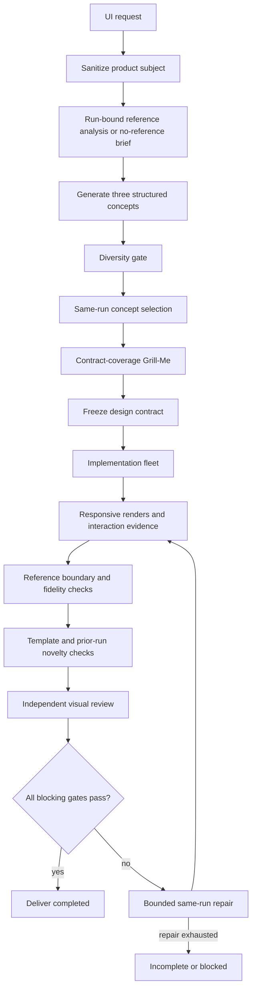
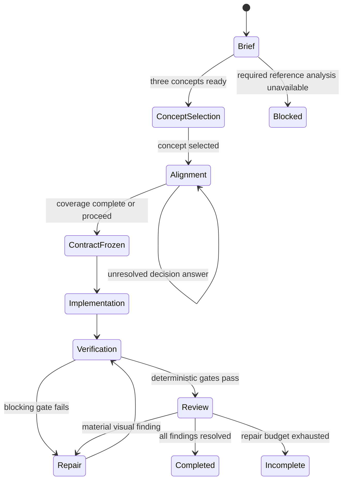

# fix: prevent UI visual convergence and reference copying

## Goal Capsule

- **Objective:** Make Omagent UI runs produce materially distinct, prompt-faithful interfaces instead of variations on one shared template, and make reference images contribute visual evidence without becoming compositional templates.
- **Means:** Replace fixed UI-set convergence with a typed, run-scoped concept and design-contract pipeline, bounded adaptive grilling, explicit reference borrowing boundaries, and deterministic visual novelty/fidelity evidence. (KTD1, KTD2, KTD4)
- **Authority:** The user's Product Contract decisions, the existing quality/reliability plan, and current repository behavior govern scope. This plan focuses on the UI development mode and does not reopen unrelated provider, mobile, direct-lane, or web-lane decisions.
- **Execution profile:** Deep, cross-cutting refactor across the UI route, quality profile, reference analysis, controller evidence, QML flow, evaluation fixtures, and documentation.
- **Stop conditions:** Stop and preserve the last known-good path if the replacement loses the user's product subject, copies reference-only content, blocks simple briefs without a meaningful reason, makes all concepts converge, mutates unrelated runs, or reports a UI result complete without rendered evidence.
- **Tail ownership:** After implementation, `ce-work` owns code changes, verification, simplification, review, and commits. This plan does not authorize implementation by itself.

---

## Product Contract

### Summary

Omagent's UI mode will no longer select one of a few fixed visual archetypes and then optimize variations of that recipe. It will produce three structurally different concepts, select one through the existing same-run interaction model, freeze a typed design contract, and verify the result against three separate questions:

1. Does it faithfully represent the requested product?
2. Does it borrow the reference only where allowed?
3. Is it materially different from the template and recent different-product designs?

The default reference mode is style-only. Exact recreation requires an explicit user-selected mode and still cannot silently reuse third-party brand assets or content.

### Problem Frame

The current UI route has several convergence sources:

- `UI_SKILL_SETS` and the route-level directives repeat shared navbar, glass, dark-luxury, CTA, typography, hero, and conversion patterns.
- `build_adaptive_brief()` produces a small direction label, but the route still routes the request into the legacy set-selection and Grill-Me flow.
- Grill-Me uses repeated question dimensions and substring-based answer mapping. More questions usually produce more adjectives, not a different design system.
- `build_grill_me_design_brief()` starts from shared visual defaults, so unanswered or ambiguous decisions converge to the same result.
- Reference analysis produces aesthetic language but does not maintain a typed allowed/forbidden reference boundary. The implementation prompt can therefore preserve the requested subject while still reproducing the reference's composition.
- UI quality checks verify field presence and rendered evidence, but do not measure concept diversity, template reuse, reference-boundary compliance, or comparison against prior outputs.
- Reference analysis is session-sidecar based and can be stale across image changes, runs, and analyzer versions.

The recent controller and quality work improved truthful lifecycle reporting. It did not solve this creative divergence problem. This plan treats divergence and reference boundaries as product behavior, not as additional prompt advice.

### Actors

- A1. **User:** Supplies the product request, optional reference image, concept preference, and blocking design decisions.
- A2. **Omagent controller:** Owns the run, stores the design contract and reference evidence, and controls `awaiting_user`, verification, review, repair, and terminal states.
- A3. **Concept generator:** Produces distinct candidate directions grounded in the requested product.
- A4. **UI implementer fleet:** Builds only the selected concept and records the design contract and rendered evidence.
- A5. **Visual QA/reviewer:** Checks prompt fidelity, reference boundaries, responsive behavior, accessibility, novelty, and material defects.
- A6. **Reference analyzer:** Produces untrusted image evidence and never becomes the product authority.

### Requirements

- R1. A UI run must produce three materially different design concepts before implementation, or explicitly record why fewer concepts are valid for a trivial brief.
- R2. A concept must differ across at least three independent axes: information architecture, hero/composition, typography, interaction signature, and asset/motif strategy.
- R3. The user must be able to select one concept through the same run. Selection and follow-up answers must not create a replacement run or workspace.
- R4. Grill-Me must ask only unresolved high-impact contract fields, preserve answered decisions, and stop when the contract is sufficiently complete or the user proceeds.
- R5. Generic rounds, repeated question dimensions, invalid option IDs, and unanswered questions must not silently regenerate the same design defaults.
- R6. The design contract must explicitly contain product subject, direction, layout, interaction, responsive behavior, accessibility, motion, asset policy, reference policy, and verification viewports.
- R7. The user prompt must remain authoritative for product subject, domain, copy, features, brand, navigation, and data model.
- R8. A reference image must produce a typed policy separating abstract attributes that may be borrowed from subject, content, assets, geometry, and composition that must not be copied.
- R9. Reference analysis must be bound to the run, normalized image identity, analyzer version, and artifact generation. Stale analysis must not be reused.
- R10. The default reference mode must be style-only. Exact recreation must require an explicit user-selected mode and must retain provenance and content restrictions.
- R11. The implementation path must receive one frozen concept and one frozen design contract. Specialists may refine craft within that direction but must not introduce a competing direction.
- R12. UI verification must produce separate evidence for prompt fidelity, reference boundary, reference fidelity, concept novelty, template convergence, responsive behavior, interaction, accessibility, and rendered quality.
- R13. Reference fidelity must not be treated as proof of originality. A result can be faithful to a reference and still fail because it copies the reference's subject, content, assets, or distinctive composition.
- R14. Novelty must be measured against both the built-in template directions and the last 20 successful different-product UI runs, excluding retries and follow-ups in the same run.
- R15. A near-duplicate rendered result or repeated concept signature must enter bounded repair or become `incomplete`; it must not be reported as completed.
- R16. A failed or unavailable reference analysis must not produce invented visual claims. The run must use explicit assumptions, ask the user, or block when semantic reference evidence is required.
- R17. The same run, workspace, concept, reference evidence, and decision history must survive question responses, concept selection, repair, and follow-up.
- R18. The existing accessibility, responsive, interaction, and independent-review requirements remain mandatory; novelty must not override usability or accessibility.
- R19. The UI benchmark must include written briefs, conflicting product/reference subjects, multiple visual directions, repeated product prompts, template-convergent candidates, and explicit recreation requests.
- R20. The replacement must preserve the current local-first, auto-approved, SQLite-authoritative, fail-closed, and no-real-provider-in-deterministic-CI constraints.

### Key Flows

- F1. **No-reference UI request**
  - **Trigger:** User submits a UI request without an image.
  - **Decision:** Parse product subject and unresolved design axes; generate three concepts; enter `awaiting_user` only for concept selection or a genuinely blocking field.
  - **Outcome:** One concept and contract are frozen before implementation.

- F2. **Reference UI request**
  - **Trigger:** User submits a product request and one or more reference images.
  - **Decision:** Run-bound analysis produces abstract visual evidence plus explicit borrow/forbid boundaries; the requested product remains separate.
  - **Outcome:** Concepts preserve the requested product while applying only permitted visual attributes.

- F3. **Adaptive alignment**
  - **Trigger:** The contract has unresolved high-impact fields or the user requests refinement.
  - **Decision:** Ask only unanswered decision keys, validate option IDs, preserve prior answers, and record assumptions for non-blocking gaps.
  - **Outcome:** The same run reaches a complete contract or an explicit `awaiting_user`/`blocked` state.

- F4. **Rendered quality and repair**
  - **Trigger:** The implementation fleet reports completion.
  - **Decision:** Run responsive, accessibility, reference-boundary, fidelity, novelty, and visual-review checks.
  - **Outcome:** Passing evidence can deliver; blocking findings enter bounded repair; unresolved findings end as `incomplete`.

- F5. **Explicit recreation request**
  - **Trigger:** User explicitly chooses faithful recreation rather than style-only translation.
  - **Decision:** Record the mode and provenance constraints before implementation.
  - **Outcome:** The run may preserve authorized visual structure but cannot silently replace the product subject or reuse third-party content/assets.

### Acceptance Examples

- AE1. Given two different product prompts with the same broad UI skill set, when concepts are generated, then at least three concepts have different structure, typography, and interaction signatures rather than only different colors.
- AE2. Given a reference image showing a salon and a request for sports analytics, when analysis completes, then the contract preserves sports analytics and records the salon as forbidden subject/content evidence.
- AE3. Given a dark reference with a distinctive hero composition, when style-only implementation completes, then palette and atmosphere may be borrowed while the hero topology, copy, assets, and product domain are not cloned.
- AE4. Given a detailed request with enough decisions, when Grill-Me starts, then it asks no generic questions and records explicit assumptions instead.
- AE5. Given an invalid option answer, when the user responds, then the same run remains `awaiting_user`, preserves prior answers, and re-prompts only the unresolved field.
- AE6. Given a reference image changes after analysis, when the user submits a new run, then the old reference evidence is not reused.
- AE7. Given a rendered result near-duplicates a recent different-product UI run, when novelty evidence is evaluated, then the run enters repair or ends `incomplete`.
- AE8. Given a result is visually faithful to the reference but uses the reference's subject, copy, or assets, when boundary checks run, then completion is blocked.
- AE9. Given a concept passes novelty but fails keyboard, contrast, or mobile interaction checks, when quality gates run, then accessibility and usability still block completion.
- AE10. Given the user answers a concept-selection question after a restart, when the run resumes, then the same run, workspace, reference fingerprint, and concept history are restored.

### Success Criteria

- Three concept candidates are structurally distinct for held-out non-trivial UI briefs.
- Reference-boundary violations are zero in the held-out conflicting-subject fixtures.
- Generated results no longer share the same hero/nav/component signature across unrelated prompts in the benchmark corpus.
- Grill-Me asks zero questions for sufficiently specified briefs and no more than two adaptive rounds by default.
- Every delivered UI run has run-bound renders, contract evidence, reference evidence when a reference is supplied, novelty evidence, and independent review evidence.
- Any blocking novelty, boundary, accessibility, responsive, or interaction finding prevents `completed`.
- The existing controller, provider, lifecycle, and non-UI quality tests remain green.

### Scope Boundaries

#### In Scope

- UI concept generation and concept selection.
- Typed design-contract and reference-policy contracts.
- Adaptive Grill-Me replacement and same-run state projection.
- Run-bound reference analysis and image fingerprinting.
- Visual fidelity, boundary, novelty, and template-convergence evidence.
- UI quality profile integration, repair, and independent visual review.
- QML concept/reference/decision presentation.
- UI fixtures, benchmark rubrics, deterministic tests, and architecture/operations documentation.

#### Deferred to Follow-Up Work

- A general visual design IDE or manual design-system editor.
- A full computer-vision model or hosted image-similarity service.
- A general-purpose cross-provider design benchmark outside Omagent's local evaluation corpus.
- Replacing the existing provider adapters or Herdr/Firstmate runtime.
- Mobile bridge work.

#### Outside this Product's Identity

- Reproducing third-party websites, brands, copy, or assets from a reference image.
- Treating a UI skill library as a substitute for a distinct design contract.
- Making novelty so aggressive that accessibility, usability, or the user's explicit visual intent is sacrificed.

### Dependencies

- Existing `RunController`, `SessionStore`, lifecycle states, quality engine, and review receipt channel.
- Existing UI route, QML projection, reference-analysis path, screenshot helper, evaluation fixtures, and fake integration harness.
- A deterministic local image comparison capability for rendered evidence. If unavailable, the result is `blocked` or `incomplete`, never silently treated as novel.
- Current provider and Herdr/Firstmate session identity contracts.

### Open Questions

- None blocking planning. The implementation may defer the exact local image-comparison backend and analyzer-version format to the owning modules, provided the contract remains deterministic and no network dependency is introduced.

### Sources

- Existing reliability plan: `docs/plans/2026-09-24-1459-refactor-omagent-quality-reliability-plan.md`, especially the UI direction and quality decisions.
- Current UI contract: `omagent_core/quality/ui_profile.py`.
- Current route and reference flow: `omagent-route`, `omagent_core/reference_analysis.py`, and `Omagent.qml`.
- Current stale architecture description: `ARCHITECTURE_UI_UX.md`.
- Current evaluation contract: `evaluation/rubrics.md`, `evaluation/ui/tasks.json`, and `tests/unit/test_ui_profile.py`.
- Current quality and lifecycle contracts: `docs/quality-engine.md`, `omagent_core/quality/engine.py`, and `omagent_core/session_store.py`.

---

## Planning Contract

### Key Technical Decisions

- KTD1. **Generate three concepts before implementation.** Each concept is a structured candidate with a direction, information architecture, composition, typography, interaction signature, motion policy, and asset policy. A concept is not a palette swap. (session-settled: user-approved — chosen over one-template refinement: three concepts directly address the reported visual convergence)
- KTD2. **Make the design contract the live UI authority.** The contract is created before implementation and is the only input used to freeze specialist direction. Universal accessibility and responsive requirements remain separate from optional visual choices. (session-settled: user-approved — chosen over shared global visual defaults: separate invariants from art direction)
- KTD3. **Use a two-sided reference contract.** Reference analysis records abstract visual evidence separately from forbidden product/content/asset/composition evidence. The product prompt remains the sole product authority.
- KTD4. **Measure fidelity and novelty independently.** Compare rendered results against the reference for permitted fidelity and against the template corpus plus recent different-product runs for novelty. Never use a single LLM opinion as the gate. (session-settled: user-approved — chosen over reference-only comparison: fidelity and divergence answer different questions)
- KTD5. **Default to style-only reference use.** Exact recreation is an explicit user-selected mode with provenance and content restrictions.
- KTD6. **Use bounded contract-coverage grilling.** Ask only unresolved decision keys, validate answers, preserve the same run, and record assumptions for non-blocking gaps. At most two adaptive rounds are the default; a later round requires a named unresolved decision.
- KTD7. **Persist all UI evidence in the existing run event model.** Concept candidates, selected concept, reference fingerprint, analysis version, screenshots, metrics, rejected alternatives, and review findings are run-scoped evidence or compatibility projections. Do not create a second UI state machine.
- KTD8. **Use deterministic local visual QA with fail-closed unavailable behavior.** Store image fingerprints, viewport, comparison population, metric values, and blocking rationale. Do not make visual checks depend on a live provider or network.
- KTD9. **Preserve the existing lifecycle and repair semantics.** Novelty and reference-boundary findings are blocking quality evidence. They enter the existing bounded repair loop and otherwise end as `incomplete` or `blocked`.

### High-Level Technical Design

### Planning-Time Constraints

- Do not add another global UI style preset that becomes the new sameness source.
- Do not let every specialist independently choose a direction.
- Do not use a model-generated novelty score without stored structured features and rendered evidence.
- Do not compare a style-only result to the reference using one raw pixel-similarity score.
- Do not reuse a session-only reference cache across image changes or runs.
- Do not let reference OCR or visible text become an instruction source.
- Do not remove the current accessibility, responsive, interaction, and independent-review gates.
- Do not require a fixed question count for sufficiently specified briefs.

### Sequencing

1. Establish typed contracts and deterministic evidence schemas before changing prompts.
2. Move concept generation and reference analysis into owning modules.
3. Replace the route's fixed set/grill flow with the new same-run flow.
4. Add deterministic visual QA and quality-profile integration.
5. Add held-out fixtures and benchmark gates.
6. Update QML projection and documentation only after the controller flow is stable.
7. Remove legacy fixed-set and shared-default behavior only after the replacement passes the held-out suite and rollback checks.

---

## Implementation Units

### U1. Define typed UI concept, design-contract, reference-policy, and visual-evidence contracts

- **Goal:** Create one authoritative data model for the UI flow instead of passing prose and legacy set names between route functions.
- **Requirements:** R2, R6, R8, R9, R11, R12, R13, R17.
- **Dependencies:** Existing `TaskContract`, `QualityEngine`, `SessionStore`, and UI profile.
- **Files:** `omagent_core/quality/ui_profile.py`, `omagent_core/ui_brief.py`, `omagent_core/reference_analysis.py`, `tests/unit/test_ui_profile.py`, `tests/unit/test_ui_contracts.py`.
- **Approach:**
  - Define typed records for product subject, design direction, concept candidate, selected concept, reference policy, render evidence, comparison evidence, and rejected alternatives.
  - Separate universal requirements from optional art direction so glass, capsule navigation, specific fonts, hero patterns, and conversion patterns are not global defaults.
  - Include a versioned evidence-generation and reference-fingerprint field in every record.
- **Test scenarios:**
  - Given a complete concept payload, when it is serialized and parsed, then all required fields round-trip without losing the selected direction or reference policy.
  - Given a concept with only color differences, when diversity validation runs, then it is rejected as a palette-only variant.
  - Given a reference policy with allowed and forbidden attributes, when the product subject changes, then the policy remains attached to the run and not the reference subject.
  - Given an unknown evidence version, when parsed, then the result is rejected as stale rather than silently accepted.
- **Verification:** Contract round-trip and validation tests pass, and legacy set names are no longer required by the new UI path.

### U2. Build structured concept generation and diversity selection

- **Goal:** Replace fixed Set 1/2/3/4 routing with three product-grounded, structurally distinct concepts.
- **Requirements:** R1, R2, R3, R11, R15, R19.
- **Dependencies:** U1.
- **Files:** `omagent_core/ui_brief.py`, `omagent-route`, `Omagent.qml`, `tests/unit/test_ui_concepts.py`, `tests/integration/test_ui_flow.py`.
- **Approach:**
  - Generate three candidates from the product contract and unresolved design axes.
  - Require candidates to differ across at least three structural axes and record why each candidate is distinct.
  - Keep the concept choice in the same run. The UI presents the three candidates and records the user's selection or an explicit proceed decision.
  - Remove the route's automatic Set 4 binding and shared fallback visual recipe from the new path.
- **Test scenarios:**
  - Given two unrelated product prompts, when concepts are generated, then the candidate sets do not share the same hero, navigation, typography, and interaction signature.
  - Given a detailed prompt, when all major axes are already resolved, when the system still offers three concepts, then each concept is a valid alternative rather than a question round.
  - Given a user selection, when the run is resumed after restart, then the selected concept and rejected candidates remain available from the same run.
  - Given a provider failure during concept generation, when no concept can be validated, then the run becomes blocked or incomplete and does not enter implementation.
- **Verification:** Held-out concept fixtures demonstrate three structurally distinct candidates and stable same-run selection.

### U3. Replace fixed Grill-Me with contract-coverage alignment

- **Goal:** Make questions resolve missing design decisions instead of repeatedly describing the same visual preferences.
- **Requirements:** R3, R4, R5, R17, R18.
- **Dependencies:** U1, U2.
- **Files:** `omagent-route`, `omagent_core/ui_brief.py`, `Omagent.qml`, `tests/integration/test_ui_flow.py`, `tests/unit/test_ui_profile.py`.
- **Approach:**
  - Map every question to a named unresolved design-contract field.
  - Track answered fields, conflicts, assumptions, and remaining blockers in run evidence.
  - Validate option IDs and reject semantically duplicate or out-of-range answers.
  - Stop after contract coverage is sufficient or the user proceeds. Default to no more than two adaptive rounds; allow further rounds only for a named unresolved decision.
  - Keep invalid responses and question transitions in the existing `awaiting_user` lifecycle rather than creating grill-specific terminal states.
- **Test scenarios:**
  - Given a sufficiently specified prompt, when alignment starts, then zero generic questions are emitted and explicit assumptions are recorded.
  - Given a blocking field, when the user answers invalid and then valid input, then the same run remains `awaiting_user` between responses and continues with prior answers intact.
  - Given a completed round, when all blocking fields are resolved, when the user proceeds, then the contract freezes without another generated round.
  - Given a non-blocking field, when no answer is provided, then the run records an assumption and continues rather than waiting.
  - Given a user requests another round without naming an unresolved decision, then the system explains that the contract is already sufficient instead of repeating questions.
- **Verification:** UI flow tests prove bounded questioning, same-run continuation, answer validation, and explicit assumption recording.

### U4. Make reference analysis run-bound and explicitly two-sided

- **Goal:** Ensure reference images provide usable aesthetic evidence without becoming hidden compositional instructions.
- **Requirements:** R7, R8, R9, R10, R16, R17.
- **Dependencies:** U1, U2.
- **Files:** `omagent_core/reference_analysis.py`, `omagent_core/ui_brief.py`, `omagent-route`, `Omagent.qml`, `tests/unit/test_reference_analysis.py`, `tests/integration/test_ui_flow.py`.
- **Approach:**
  - Key analysis by run ID, normalized image identity, image SHA-256, and analyzer version.
  - Treat OCR, filenames, visible text, and image content as untrusted evidence.
  - Produce separate allowed-borrow and forbidden-copy fields covering palette relationships, contrast, type class, spacing rhythm, materials, subject, copy, assets, geometry, and composition.
  - Default to style-only. Require an explicit recreation mode for authorized structural fidelity and retain provenance/content restrictions.
  - Replace invented fallback visual claims with explicit unavailable state, assumptions, or a blocked run.
- **Test scenarios:**
  - Given a changed image with the same filename, when a new run starts, then the prior analysis is not reused.
  - Given a reference containing visible instructions, when analysis runs, then the text is recorded as untrusted evidence and cannot alter the product contract.
  - Given a conflicting product and reference subject, when the contract is built, then the requested product remains authoritative and the reference subject is forbidden.
  - Given multiple references, when no primary reference is selected, then the run asks for a primary reference instead of merging all visual claims.
  - Given image analysis fails, when semantic evidence is required, then the run blocks or records an explicit assumption without inventing palette or layout facts.
- **Verification:** Reference analysis tests prove fingerprint isolation, subject separation, untrusted text handling, and explicit failure behavior.

### U5. Add deterministic visual fidelity, boundary, and novelty QA

- **Goal:** Make visual sameness and reference copying measurable quality evidence rather than reviewer opinion.
- **Requirements:** R12, R13, R14, R15, R18, R19.
- **Dependencies:** U1, U2, U4.
- **Files:** `omagent_core/visual_qa.py`, `omagent_core/quality/engine.py`, `omagent-route`, `evaluation/rubrics.md`, `tests/unit/test_visual_qa.py`, `tests/integration/test_quality_harness.py`.
- **Approach:**
  - Implement separate evidence records for prompt fidelity, reference boundary, reference fidelity, concept novelty, template convergence, and rendered quality.
  - Use deterministic local image fingerprints and structured concept features. Record viewport, artifact revision, comparison population, metric values, and rationale.
  - Compare novelty against built-in template directions and the last 20 successful different-product UI runs, excluding same-run retries and follow-ups.
  - Treat near-duplicate rendered signatures, reference-only entities/assets, copied distinctive composition, and repeated concept signatures as blocking findings.
  - Do not use raw reference pixel similarity as a universal fidelity requirement. A style-only result may match palette and atmosphere while failing subject or composition boundaries.
  - If the local comparison capability is unavailable, emit unavailable evidence and block rather than passing by default.
- **Test scenarios:**
  - Given two different product prompts with similar palettes, when novelty is evaluated, then the result is not failed solely for palette similarity.
  - Given a reference and a style-only result with the same palette but different product and topology, when boundary and fidelity checks run, then fidelity can pass while boundary passes independently.
  - Given a result that copies reference-only OCR, assets, or distinctive hero topology, when boundary checks run, then the result is blocked as a critical finding.
  - Given a result near-duplicates a recent different-product run at the same viewport, when novelty is evaluated, then the result enters repair.
  - Given a concept differs only by color, when structural novelty is evaluated, then it is rejected as a palette-only variant.
  - Given the visual comparison backend is unavailable, when quality runs, then the result is `blocked` or `incomplete`, never `completed`.
- **Verification:** Deterministic visual-QA fixtures produce stable classifications and the quality engine records metric-backed blocking reasons.

### U6. Integrate UI gates, independent review, and bounded repair

- **Goal:** Make the new UI evidence part of the existing controller quality lifecycle without weakening truthful completion.
- **Requirements:** R11, R12, R13, R15, R17, R18, R20.
- **Dependencies:** U1, U2, U3, U4, U5.
- **Files:** `omagent_core/quality/profiles.py`, `omagent_core/quality/engine.py`, `omagent_core/session_store.py`, `omagent-route`, `docs/quality-engine.md`, `tests/integration/test_quality_harness.py`.
- **Approach:**
  - Add UI profile checks for design contract, reference boundary, reference fidelity, concept novelty, template convergence, rendered evidence, interaction, accessibility, and visual review.
  - Keep universal accessibility and responsive checks blocking even when novelty passes.
  - Bind concept, reference, render, comparison, and reviewer evidence to the same run and artifact revision.
  - Route blocking visual findings through the existing bounded repair loop and require fresh evidence after repair.
  - Keep missing reviewer or unavailable visual QA as blocked/incomplete rather than self-certified.
- **Test scenarios:**
  - Given all deterministic UI checks pass and an independent visual receipt is valid, when delivery runs, then the run completes with the selected concept and evidence attached.
  - Given reference-boundary evidence fails, when repair is available, then the same run and workspace receive a repair request and must produce fresh renders.
  - Given the repair limit is exhausted, when visual findings remain, then the terminal state is `incomplete` and the unresolved findings remain inspectable.
  - Given a reviewer is unavailable, when the UI otherwise passes, then the run becomes `blocked` rather than completed.
  - Given a follow-up after a concept decision, when the run resumes, then the selected concept, reference fingerprint, and evidence generation are unchanged.
- **Verification:** Existing lifecycle tests remain green and new UI quality scenarios prove fail-closed completion, repair continuity, and independent review binding.

### U7. Add held-out UI benchmarks, CI gates, and documentation migration

- **Goal:** Prove the replacement improves diversity and reference safety rather than merely passing a few hand-written prompts.
- **Requirements:** R19, R20.
- **Dependencies:** U1, U2, U3, U4, U5, U6.
- **Files:** `evaluation/rubrics.md`, `evaluation/ui/tasks.json`, `evaluation/ui/fixtures/`, `tests/`, `.github/workflows/ci.yml`, `ARCHITECTURE_UI_UX.md`, `docs/operations.md`, `README.md`.
- **Approach:**
  - Expand UI fixtures with unrelated products, repeated prompts, conflicting references, multiple visual styles, reference-subject mismatch, explicit recreation, template-convergent candidates, and accessibility-only changes.
  - Add deterministic fixture checks for candidate distinctness, reference boundaries, evidence binding, and terminal-state honesty.
  - Update the architecture document so it no longer mandates Set 1/2/3 selection, automatic Set 4 routing, or fixed six-question rounds.
  - Keep live visual/provider benchmarks outside deterministic CI; CI must remain network-free and provider-free.
- **Test scenarios:**
  - Given the expanded fixture corpus, when the UI benchmark runs, then it rejects palette-only concept swaps and reference composition cloning.
  - Given a valid concept set with different structures, when the benchmark evaluates it, then it passes novelty without requiring a live provider.
  - Given a missing render or stale artifact revision, when the benchmark runs, then completion is rejected.
  - Given an accessibility regression in an otherwise novel result, when the benchmark runs, then the result is rejected.
  - Given the architecture documentation is scanned, when stale fixed-set and fixed-six-question rules remain, then the documentation gate fails.
- **Verification:** The deterministic suite, QML parsing, compilation, schema checks, and UI fixture gates pass without network or real provider access.

---

## Verification Contract

### Deterministic gates

| Gate | Applies to | Done signal |
|---|---|---|
| Contract tests | UI concepts, design contracts, reference policies, visual evidence | Typed records round-trip and reject stale or incomplete payloads. |
| Concept diversity fixtures | Three generated concepts per non-trivial held-out brief | At least three candidates differ across the required structural axes. |
| Grill flow tests | Adaptive alignment | No generic question is emitted for a complete brief; invalid answers preserve `awaiting_user`; same run continues. |
| Reference safety tests | Conflicting subjects, changed images, untrusted text, recreation mode | Product subject stays authoritative; stale analysis is not reused; copied entities/assets/composition block. |
| Visual QA tests | Reference fidelity, boundary, template convergence, prior-run novelty | Metric-backed evidence produces stable pass/block/repair outcomes without network calls. |
| Lifecycle integration | Quality completion, review, repair, restart, follow-up | Existing SQLite/controller semantics remain authoritative; unresolved UI gates never complete. |
| Benchmark fixtures | Written briefs and reference cases | Held-out corpus catches sameness, copying, stale artifacts, and accessibility regressions. |
| QML/static validation | Overlay and JSON/schema files | QML parsing and repository validation pass. |
| Full deterministic suite | All existing profiles | Existing direct, web, coding, lifecycle, provider, and UI tests remain green. |

### Quality gates

- A non-trivial UI run does not enter implementation without a selected concept and frozen contract.
- A reference-only subject, asset, copy, or distinctive composition violation blocks delivery.
- A repeated concept signature or near-duplicate rendered artifact enters bounded repair or ends `incomplete`.
- Accessibility, responsive behavior, interaction, and independent visual review remain blocking.
- Missing visual QA, stale reference evidence, missing renders, or unavailable reviewer never produce `completed`.
- The deterministic suite never calls a live provider, network service, or real image-analysis service.

### Definition of Done

- U1 through U7 are implemented and their verification outcomes are recorded.
- Three materially different concepts are available for every non-trivial UI run.
- The selected concept and design contract survive question responses, restart, repair, and follow-up on the same run.
- Reference analysis is run-bound, fingerprinted, versioned, and explicitly separates borrowable evidence from forbidden content and composition.
- The legacy fixed UI-set route and shared global design defaults are no longer the live path.
- Grill-Me asks only unresolved high-impact questions and has a bounded default stop condition.
- UI quality evidence includes prompt fidelity, reference boundary, reference fidelity, concept novelty, template convergence, rendered evidence, interaction, accessibility, and independent review.
- Blocking findings cannot be bypassed by provider self-report or reviewer self-certification.
- Held-out UI fixtures demonstrate distinct outputs, safe reference translation, and truthful terminal states.
- The existing controller/SQLite/review/repair contracts remain intact.
- The architecture and operator documentation match the new behavior.
- No live provider, network, or user-state mutation is required by deterministic CI.
