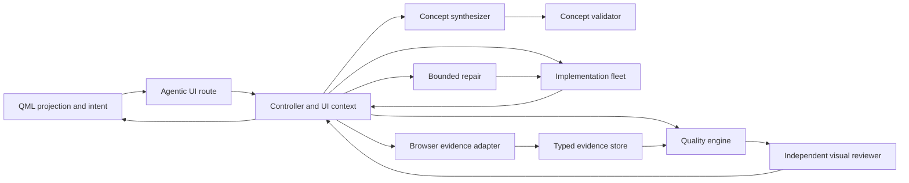
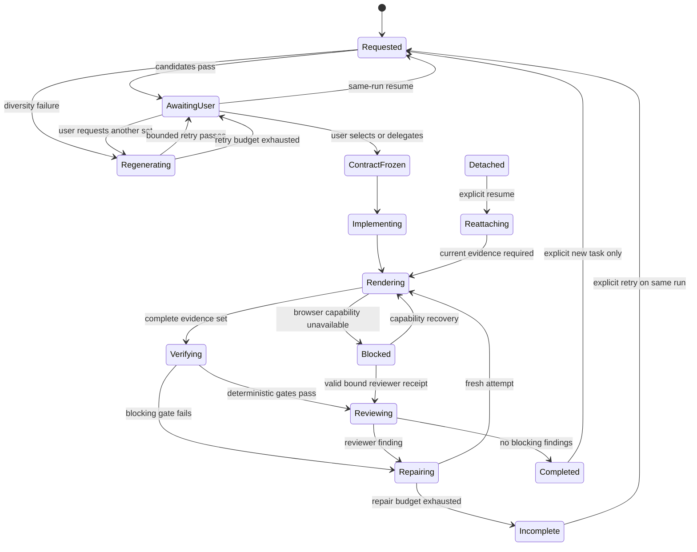
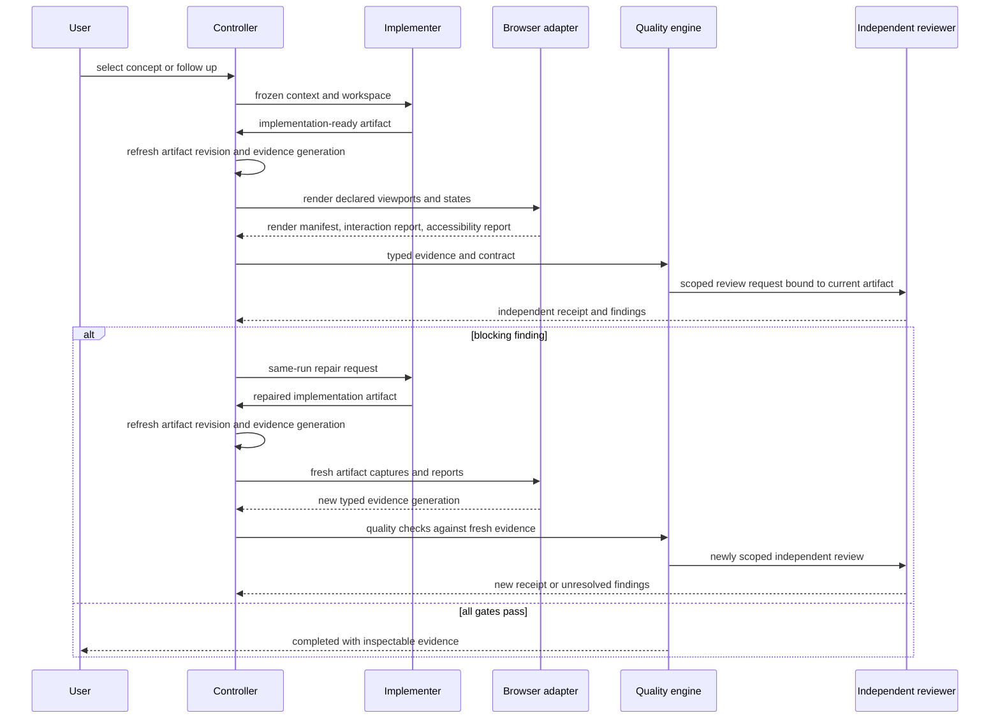

# refactor: improve the agentic UI-making loop

## Goal Capsule

- **Objective:** Let a user submit an agentic UI request, compare materially different design directions, approve one, and receive a product-specific result that is verified through current browser-rendered evidence, interaction and accessibility checks, independent review, and same-run repair.
- **Means:** Extract the UI flow from the router, make one run-scoped UI context authoritative, replace fixed local concept templates with bounded provider-generated concepts plus deterministic validation, add a typed browser-evidence adapter, and project the full loop into QML. (KTD1, KTD2, KTD3, KTD4)
- **Authority:** The user's request, the confirmed product decisions, the existing controller and quality contracts, and current repository behavior govern scope. The prior visual-convergence plan is background; this plan covers the next end-to-end improvement rather than reopening its completed contract.
- **Execution profile:** Deep, cross-cutting refactor across the agentic router, UI context, provider handoff, browser evidence, quality lifecycle, QML projection, evaluation fixtures, and migration boundaries.
- **Stop conditions:** Stop and preserve the last known-good path if the new flow loses the requested product, creates a replacement run for a same-run follow-up, accepts provider prose as browser evidence, reuses stale screenshots, bypasses independent review, or reports completion without the required viewport and interaction evidence.
- **Tail ownership:** After implementation, `ce-work` owns code changes, deterministic verification, simplification, review, and any commit decision. This plan does not authorize implementation by itself.

---

## Product Contract

### Summary

Omagent's agentic UI route will become a complete, resumable making loop rather than a prompt-to-provider handoff. The user will receive a small set of genuinely different, product-grounded concepts, make an explicit choice, and see the same run and workspace continue through implementation, browser rendering, interaction checks, accessibility checks, visual comparison, independent review, and repair.

The route will retain local-first behavior. SQLite and controller events remain authoritative. QML remains a projection and input surface. A deterministic fake evidence adapter will cover the test suite. A real browser adapter will be optional and capability-gated; its absence will block the affected UI result rather than create a false pass.

### Problem Frame

The current concept-first foundation solves the first layer of convergence but leaves the making loop incomplete:

- The live route still lives inside a large compatibility router, while the deterministic concept generator always returns the same workflow, atlas, and signal directions.
- The QML overlay stores concept options but does not present a real chooser or expose the selected contract and quality evidence.
- Browser rendering is instruction-only. The route scans image files and accepts provider text markers instead of receiving typed, run-owned viewport evidence.
- Viewport coverage, artifact freshness, target safety, interaction checks, and accessibility checks are not enforced as independent evidence contracts.
- The reviewer receives a generic receipt that does not prove that visual review covered the current render set and current artifact revision.
- Repair can reuse existing workspace images, lacks a reliable fresh-review path, and can leave blocked or incomplete runs without a clear continuation surface.
- The same-run/new-task distinction is fragile because the agentic track flag can be interpreted as a new task even when the user is answering a concept question or resuming a run.
- The current environment has no Pillow, no bundled browser driver, and no CI browser infrastructure. Deterministic tests therefore need a capability-independent fake adapter, while the real path needs an explicit optional backend.

### Actors

- **A1. User:** Supplies the product request, optional reference image, concept choice, follow-up direction, and explicit new-task intent.
- **A2. Omagent controller:** Owns the run, UI context, lifecycle transitions, evidence generation, and terminal state.
- **A3. UI concept synthesizer:** Produces candidate directions from the run context and retries only when structural validation fails.
- **A4. UI implementation fleet:** Builds the selected direction in the recorded workspace and returns current-artifact evidence.
- **A5. Browser QA adapter:** Renders declared states and viewports, exercises interactions, and produces machine-readable accessibility and render records.
- **A6. Independent visual reviewer:** Reviews the current render manifest, contract, reference policy, interaction report, accessibility report, and artifact revision.
- **A7. QML overlay:** Presents state and sends user intent without owning contract, evidence, or completion state.

### Requirements

- R1. The agentic UI route must use one versioned, run-scoped UI context containing the request, subject, concept candidates, selected concept, decisions, assumptions, reference policy, viewports, workspace, artifact revision, evidence generation, render manifest, reports, review state, and repair history.
- R2. The controller and event stream must remain authoritative for UI state. JSON files and legacy Grill-Me state are compatibility projections or migration inputs only.
- R3. A non-trivial request must receive three candidate concepts whose information architecture, composition, typography, interaction signature, and asset strategy are materially distinct. A provider-generated set must be structurally validated; deterministic fixtures provide a bounded fallback and test oracle.
- R4. A candidate set that fails structural diversity must receive at most one bounded regeneration before the run asks the user or becomes blocked. Palette-only changes must never pass.
- R5. Concept selection must be a deliberate user checkpoint. The user may select a concept, request another set, or explicitly delegate selection. `proceed` must not silently select a concept.
- R6. Selecting and freezing a concept must preserve the same run, workspace, reference evidence, decision history, and product subject across restart, follow-up, repair, and resume.
- R7. Implementation, browser QA, review, and repair roles must receive the same redacted UI context snapshot. Roles must not independently invent a competing design direction.
- R8. The route must start an approved local development target for browser evidence, or use a configured local target. Screenshot targets and outputs must pass the existing workspace and URL policy.
- R9. The browser adapter must produce one current-artifact render for every contract viewport and relevant interaction state, with viewport, dimensions, target, renderer version, checksum, run ID, workspace, evidence generation, and artifact revision recorded.
- R10. Interaction evidence must be structured and state-specific. It must cover the contract's keyboard, pointer, touch or mobile, loading, empty, error, and success paths where those states exist.
- R11. Accessibility evidence must be structured and state-specific. It must cover semantic structure, names, focus, contrast, target size, keyboard reachability, and reduced-motion behavior where applicable.
- R12. Reference boundary, reference fidelity, concept novelty, template convergence, responsive behavior, rendered quality, interaction, accessibility, and independent visual review must remain separate gates.
- R13. Generic provider prose and literal text markers must not satisfy browser, interaction, accessibility, or visual-review gates. Only typed evidence from the browser adapter, deterministic checks, and bound review receipts may do so.
- R14. Visual comparison must be viewport-aware and artifact-bound. Exact identity, calibrated perceptual comparison, and prior-run comparison must use the same render context rather than mixing screenshots from different revisions.
- R15. Repair must produce a new artifact revision, fresh renders and reports, and a new independent review receipt. Reusing old evidence must fail.
- R16. Blocked, incomplete, and detached UI runs must expose a safe continuation path. A follow-up continues the current run; a new task requires explicit intent and remains subject to ownership checks.
- R17. QML must present selectable concept cards, selected-contract status, viewport evidence, quality findings, repair state, and continuation actions while remaining a projection and intent surface.
- R18. The fake evidence adapter must be the deterministic default for unit and integration tests. A real browser adapter may be optional, but its unavailable state must be explicit and fail closed.
- R19. The existing accessibility, responsive, interaction, provider, Herdr, Firstmate, and independent-review guarantees must remain intact.
- R20. The route must remain local-first, auto-approved where configured, SQLite-authoritative, network-free in deterministic tests, and free of real provider calls in CI.

### Key Flows

- **F1. Request to concept set**
  - **Trigger:** User submits an agentic UI request with or without a reference.
  - **Decision:** Create or resume the run, normalize the product subject, analyze the reference if present, synthesize candidates, and validate structural diversity.
  - **Outcome:** The same run enters `awaiting_user` with a renderable concept set and no implementation side effect.

- **F2. Concept selection and freeze**
  - **Trigger:** User selects a concept, requests regeneration, or explicitly delegates selection.
  - **Decision:** Validate the intent, preserve the run and workspace, freeze the selected contract, and create a structured implementation handoff.
  - **Outcome:** The run enters implementation with one authoritative contract and no unresolved structural ambiguity.

- **F3. Implementation to browser evidence**
  - **Trigger:** The implementation fleet reports the current artifact ready.
  - **Decision:** Refresh the artifact revision, start or resolve an approved local target, render each declared viewport and state, and run interaction and accessibility checks.
  - **Outcome:** A run-owned render manifest and structured reports are available for deterministic quality checks.

- **F4. Quality review and repair**
  - **Trigger:** Browser evidence is complete.
  - **Decision:** Evaluate reference boundary, fidelity, novelty, convergence, responsive behavior, interaction, accessibility, and rendered quality. Bind an independent reviewer to the current artifact and request a review.
  - **Outcome:** Passing evidence delivers; blocking findings enter same-run repair; exhausted repair ends `incomplete`; unavailable input or reviewer ends `blocked`.

- **F5. Follow-up and new task**
  - **Trigger:** User replies after `awaiting_user`, `blocked`, `incomplete`, or `detached`.
  - **Decision:** Resume the current run for a follow-up, accept a receipt or retry through the current run, or create a child run only after explicit new-task intent and cleanup.
  - **Outcome:** The UI context, evidence generation, and ownership remain coherent.

### Acceptance Examples

- **AE1.** Given two unrelated product briefs, when the concept synthesizer returns candidates, then the three candidates differ across at least three structural axes and do not share a single template signature.
- **AE2.** Given a concept set with only palette changes, when validation runs, then the set is rejected and the route performs one bounded regeneration or asks the user.
- **AE3.** Given a user selects the second concept, when the run restarts before implementation, then the same run, workspace, reference policy, decision history, and selected concept are restored.
- **AE4.** Given a contract declares desktop, tablet, and mobile viewports and relevant interaction states, when browser evidence is collected, then exactly one current-artifact render exists for every declared viewport and required interaction state, and every missing viewport or state blocks completion.
- **AE5.** Given a provider prints `ui_accessibility: passed` without a browser report, when quality checks run, then accessibility remains unproven and the run does not complete.
- **AE6.** Given an interaction opens a dialog and changes focus, when the interaction report is generated, then the report records the state, action, focus result, and artifact revision rather than only a free-text summary.
- **AE7.** Given a repaired artifact changes after the first review, when repair completes, then old screenshots and the old review receipt are rejected and a new review is required.
- **AE8.** Given the same-run user asks a follow-up after `awaiting_user`, when the route receives it, then no new run or workspace is created.
- **AE9.** Given the user explicitly starts a new task after cleanup, when the route receives the intent, then a child run records its parent and does not reuse active resources.
- **AE10.** Given the real browser backend is unavailable, when UI verification runs, then the fake adapter can support deterministic tests but the live run remains blocked or incomplete with a capability reason.
- **AE11.** Given QML receives a concept set, when the user chooses a card, then the overlay submits the same-run selection intent and displays the resulting contract status without becoming the source of truth.
- **AE12.** Given an independent reviewer signs a generic receipt without visual scope or current render-manifest binding, when the receipt is imported, then it cannot complete a UI run.

### Success Criteria

- A held-out corpus of unrelated UI briefs produces candidate sets that pass structural diversity validation.
- A detailed run reaches implementation without a generic Grill-Me interview.
- Every completed UI run has a current render manifest, interaction report, accessibility report, deterministic visual evidence, and scoped independent review receipt.
- A stale render, missing viewport, provider-only evidence marker, or unbound review receipt cannot produce `completed`.
- Same-run concept selection, follow-up, repair, and resume preserve run and workspace identity.
- Explicit new-task behavior is distinguishable from normal UI follow-up behavior.
- QML users can select a concept and inspect the quality state without the overlay becoming a second controller.
- The deterministic suite remains provider-free and browser-free. Real browser/provider smoke tests remain separate.

### Scope Boundaries

#### In Scope

- Agentic UI route extraction and same-run state ownership.
- Provider-assisted concept synthesis with deterministic validation and fallback.
- Human concept selection and QML projection.
- Typed render, interaction, accessibility, and review evidence.
- Optional real browser adapter with capability detection.
- Artifact revision, repair, review continuation, and resume behavior.
- UI-specific quality profile, evaluation fixtures, and documentation.

#### Deferred to Follow-Up Work

- A hosted visual-regression service or uploaded screenshot baseline.
- Semantic image embeddings or a general computer-vision model.
- A general visual design editor or manual design-system IDE.
- Full QML accessibility and visual-regression coverage for the Omarchy overlay itself; this plan targets generated UI artifacts and the overlay's UI projection.
- Replacing the existing provider, Herdr, or Firstmate runtime.

#### Outside this Product's Identity

- Treating a provider's prose as proof that a browser check ran.
- Reusing a reference image's subject, copy, brand, or third-party assets as product content.
- Weakening accessibility, responsive behavior, or independent review to make novelty pass.
- Running real providers or browsers in deterministic CI.

### Dependencies

- Existing `RunController`, `SessionStore`, lifecycle transitions, run manifest, review receipt channel, and quality engine.
- Existing concept and reference contracts in `omagent_core/ui_brief.py` and `omagent_core/reference_analysis.py`.
- Existing screenshot target and workspace policy in `omagent_core/screenshot_policy.py`.
- A local development target and a browser-capable runtime for live UI evidence.
- Optional browser and accessibility tooling. The core runtime remains standard-library-first; capability absence is explicit.
- Existing fake Herdr, Firstmate, provider, and isolated-environment test patterns.

### Open Questions

- The exact optional browser backend and pinned version are deferred to implementation. The plan requires an adapter contract and capability-gated behavior, not a specific package.
- The exact threshold calibration for perceptual comparison is deferred until the fixture corpus exists. Thresholds must be versioned and calibrated from held-out renders, not copied from generic examples.
- The plan covers generated UI artifacts. A separate plan may add full QML overlay accessibility and visual regression.

### Sources

- Existing concept and convergence plan: `docs/plans/2026-09-24-2138-fix-ui-visual-convergence-plan.md`.
- Current UI orchestration: `omagent-route`, `omagent_core/ui_brief.py`, `omagent_core/reference_analysis.py`, and `omagent_core/visual_qa.py`.
- Current state and evidence contracts: `omagent_core/session_store.py`, `omagent_core/run_manifest.py`, `omagent_core/quality/engine.py`, and `omagent_core/quality/review.py`.
- Current projection and safety boundaries: `Omagent.qml` and `omagent_core/screenshot_policy.py`.
- Current evaluation and CI: `evaluation/ui/`, `evaluation/quality_runner.py`, `pyproject.toml`, and `.github/workflows/ci.yml`.
- External implementation guidance: [Playwright screenshots](https://playwright.dev/python/docs/screenshots), [Playwright emulation](https://playwright.dev/python/docs/emulation), [Playwright ARIA snapshots](https://playwright.dev/python/docs/aria-snapshots), [axe API](https://www.deque.com/axe/core-documentation/api-documentation/), [Qt Quick Test](https://doc.qt.io/qt-6/qml-qttest-testcase.html), and [Qt Accessible](https://doc.qt.io/qt-6/qml-qtquick-accessible.html).

---

## Planning Contract

### Key Technical Decisions

- **KTD1. One authoritative UI context.** The controller, run manifest, and event stream own the current UI context. Sidecars remain compatibility projections. This removes the current split where the route reads a pending sidecar as active authority and prevents lead, reviewer, repair, and QML from receiving different contract snapshots.
- **KTD2. Provider-assisted concepts with deterministic gates.** The concept synthesizer may use the active provider to produce product-grounded directions, but the router validates structure and performs at most one bounded regeneration. The deterministic fixture generator remains a test and fallback path, not the sole creative engine.
- **KTD3. Human-gated concept selection.** A user checkpoint remains the default. Explicit delegation is supported, but `proceed` cannot select a concept implicitly. This preserves user control without reintroducing approval friction for every later step.
- **KTD4. Evidence adapters, not provider markers.** Browser rendering, interaction, and accessibility are capabilities behind typed adapters. Provider summaries are contextual only. A fake adapter is the deterministic default; an optional real browser adapter is selected by capability, not by a hidden global dependency.
- **KTD5. One evidence unit is a viewport and state.** Each render record includes target, viewport, state, dimensions, renderer, checksum, run, workspace, evidence generation, and artifact revision. Comparisons never mix these dimensions.
- **KTD6. Review is scoped and artifact-bound.** UI review receipts must name the selected concept, render-manifest digest, interaction report, accessibility report, and current artifact revision. A generic receipt cannot certify visual quality.
- **KTD7. Repair creates a new evidence generation.** A repair attempt invalidates prior renders and receipts. The same run and workspace continue, but every post-repair verification starts from fresh evidence.
- **KTD8. Follow-up and new task are different intents.** The route treats normal UI replies, concept choices, receipt continuation, and retries as same-run operations. Only an explicit new-task intent may create a child run after ownership checks.
- **KTD9. Local-first optional browser integration.** The plan does not make a hosted service or a mandatory third-party runtime dependency part of the core. A real browser backend must be locally runnable, capability-detected, and fail closed when unavailable.
- **KTD10. QML remains a projection.** QML renders structured state and sends typed intent. It must not infer completion, freeze a contract, or treat its own visual state as quality evidence.

### High-Level Technical Design

#### Component topology

#### Lifecycle and continuation

#### Evidence and review sequence

### Planning-Time Constraints

- Do not add another global visual preset or fixed UI set to the live route.
- Do not make browser screenshots or provider text sufficient without typed evidence.
- Do not compare screenshots from different viewports, artifact revisions, or evidence generations.
- Do not let QML become a second source of lifecycle or quality truth.
- Do not run real providers or browsers in deterministic CI.
- Do not remove legacy compatibility readers until same-run migration and continuation tests pass.
- Do not add a hosted baseline service or a mandatory cloud dependency.
- Do not make QML overlay accessibility a blocker for generated-artifact UI completion in this plan.

### Sequencing

1. Define the authoritative UI context, render manifest, report, and review-scope contracts.
2. Add characterization tests for the current starting, awaiting, blocked, incomplete, detached, repair, and new-task transitions.
3. Extract the UI flow and role handoff behind a stable adapter boundary.
4. Add provider-assisted concept synthesis with deterministic validation and bounded regeneration.
5. Add the fake browser adapter and optional real browser adapter behind one evidence contract.
6. Bind quality, review, repair, and artifact revisions to fresh evidence.
7. Update QML projection and continuation actions.
8. Extend evaluation and CI schemas, then perform a disposable live smoke test outside deterministic CI.
9. Retire legacy route callers only after migration, rollback, and continuation checks pass.

---

## Implementation Units

### U1. Establish the authoritative UI context and evidence contracts

- **Goal:** Create one versioned UI context that all roles, adapters, quality checks, and projections can consume without reconstructing state from sidecars or prose.
- **Requirements:** R1, R2, R6, R9, R11, R14, R15, R20.
- **Dependencies:** Existing `RunController`, `SessionStore`, run manifest, and `DesignContract`.
- **Files:** `omagent_core/ui_context.py`, `omagent_core/ui_brief.py`, `omagent_core/quality/ui_profile.py`, `omagent_core/reference_analysis.py`, `omagent_core/session_store.py`, `omagent_core/run_manifest.py`, `tests/unit/test_ui_context.py`, `tests/unit/test_ui_profile.py`.
- **Approach:**
  - Define typed context records for the request, product subject, concept set, selected concept, decisions, assumptions, reference policy, viewports, workspace, evidence generation, artifact revision, render manifest, interaction report, accessibility report, review state, and repair history.
  - Normalize viewport definitions once and remove duplicate default ownership.
  - Recompute contract direction when selection changes and reject malformed or stale context records.
  - Persist context transitions as controller events while preserving sidecars as projections.
- **Patterns to follow:** Existing dataclass serialization and validation in `ui_brief.py`; SQLite event ownership in `session_store.py`; fail-closed manifest validation.
- **Test scenarios:**
  - Given a selected concept other than the first candidate, when the context is serialized and restored, then the selected concept, direction, product subject, and reference policy remain unchanged.
  - Given a context with a stale artifact revision, when it is used for review, then the context is rejected as stale.
  - Given duplicate viewport definitions from the route and quality profile, when normalized, then one canonical viewport set remains.
  - Given a sidecar and a controller event disagree, when the context is loaded, then the controller event is authoritative and the disagreement is recorded.
- **Verification:** Context round-trip, malformed-context, stale-artifact, and sidecar-migration tests pass without provider or browser calls.

### U2. Extract the agentic UI flow and role handoff

- **Goal:** Move the concept, alignment, freeze, implementation handoff, continuation, and new-task decisions out of the router monolith while preserving the existing CLI and QML event surface.
- **Requirements:** R1, R2, R5, R6, R7, R16, R19, R20.
- **Dependencies:** U1.
- **Files:** `omagent_core/ui_flow.py`, `omagent-route`, `omagent_core/controller.py`, `omagent_core/session_store.py`, `tests/unit/test_ui_flow.py`, `tests/unit/test_ui_route.py`, `tests/integration/test_runtime_integration.py`.
- **Approach:**
  - Keep a thin router adapter for CLI parsing, session lookup, event emission, and legacy migration.
  - Make the UI flow service consume and emit controller-owned context transitions.
  - Give the lead, implementation, browser QA, reviewer, and repair roles the same redacted context snapshot.
  - Treat normal UI replies and explicit new-task intent as distinct operations.
  - Preserve legacy fixed-set and Grill-Me readers only as migration inputs until their callers are removed.
- **Patterns to follow:** Existing `RunController.ensure_run`, event envelopes, `HerdrAdapter`, `FirstmateAdapter`, and isolated fake integration tests.
- **Test scenarios:**
  - Given a new UI request, when the route starts the flow, then the run reaches `awaiting_user` with the same run and no implementation resource.
  - Given a concept selection, follow-up, retry, or receipt continuation, when the route receives the reply, then the existing run and workspace remain active.
  - Given an explicit new-task request while the prior run owns resources, when the route receives it, then the request is rejected without deleting or detaching unrelated resources.
  - Given a legacy pending UI selection, when it is migrated, then the new flow records the migration and does not create a second active run.
  - Given the implementation handoff, when each role is registered, then every role receives the same selected concept and contract revision.
- **Verification:** Route and integration tests prove same-run continuation, explicit new-task behavior, role-context parity, and legacy migration.

### U3. Add provider-assisted concept synthesis with bounded regeneration

- **Goal:** Replace the fixed workflow, atlas, and signal templates with product-grounded candidate generation that remains bounded, validated, and testable.
- **Requirements:** R3, R4, R5, R7, R20.
- **Dependencies:** U1, U2.
- **Files:** `omagent_core/ui_brief.py`, `omagent_core/ui_flow.py`, `omagent-route`, `tests/unit/test_ui_concepts.py`, `tests/unit/test_ui_flow.py`, `tests/fixtures/ui/`.
- **Approach:**
  - Define a concept-synthesizer interface that accepts the normalized product context and returns three structured candidates.
  - Use the active provider for candidate elaboration when available, with a deterministic fixture implementation for offline tests and bounded fallback.
  - Validate candidate uniqueness, product-task fit, axis distance, reference boundaries, and rejection of palette-only variants before exposing the set to QML.
  - Permit one regeneration after diversity failure. Expose regeneration as a user action without creating a new run.
  - Keep the selected concept immutable for the implementation handoff.
- **Patterns to follow:** Existing provider identity and session binding; typed `ConceptCandidate`; bounded retry and fail-closed quality behavior.
- **Test scenarios:**
  - Given two unrelated product briefs and a valid provider response, when candidates are synthesized, then the product task and structural signatures differ across the required axes.
  - Given a provider response with three palette variants, when validation runs, then one regeneration is requested.
  - Given the regeneration also fails, when the retry budget is exhausted, then the run remains `awaiting_user` with an actionable reason.
  - Given a provider outage, when the deterministic fallback is enabled, then the fallback is labeled and remains provider-free in tests.
  - Given a user requests another set, when regeneration completes, then prior candidates and decisions remain in the same run history.
- **Verification:** Offline fixtures cover valid, duplicate, palette-only, provider-failure, regeneration, and product-family cases.

### U4. Build typed browser, render, interaction, and accessibility evidence adapters

- **Goal:** Make rendered verification a real capability boundary with safe local targets, current-artifact evidence, and deterministic fake coverage.
- **Requirements:** R8, R9, R10, R11, R13, R14, R18, R20.
- **Dependencies:** U1, U2, U3.
- **Files:** `omagent_core/ui_evidence.py`, `omagent_core/browser_adapter.py`, `omagent_core/screenshot_policy.py`, `pyproject.toml`, `tests/unit/test_ui_evidence.py`, `tests/unit/test_browser_adapter.py`, `tests/support/fake_browser.py`.
- **Approach:**
  - Define a common adapter result for render manifests, interaction reports, accessibility reports, traces, and capability status.
  - Provide a fake adapter as the deterministic default. It must emit valid artifacts without a browser or provider.
  - Provide an optional real browser adapter using a locally available Playwright-style capability. Keep the dependency optional and capability-gated rather than silently installing it.
  - Start or resolve only approved local HTTP targets and write only inside the run workspace or owned evidence directory.
  - Capture one artifact per declared viewport and relevant state with dimensions, renderer, checksum, run, workspace, evidence generation, and artifact revision.
  - Exercise state-specific keyboard, pointer, touch or mobile, focus, loading, empty, error, and success paths defined by the contract.
  - Record accessibility findings for semantic structure, names, focus, contrast, target size, keyboard reachability, and reduced motion where applicable.
- **Patterns to follow:** `screenshot_policy.py` containment and URL checks; isolated fake binaries; Playwright screenshot, emulation, ARIA snapshot, and trace patterns; Qt Quick Test as a future native-QML analogue.
- **Test scenarios:**
  - Given a contract with desktop, tablet, and mobile viewports, when the fake adapter runs, then the manifest contains one current-artifact record for each viewport.
  - Given an output path outside the workspace, when capture is requested, then the adapter rejects the target.
  - Given a non-local or unsafe URL, when capture is requested, then the adapter rejects the target.
  - Given a missing viewport, wrong dimensions, stale artifact revision, or missing renderer capability, when evidence is validated, then the result is unavailable and blocking.
  - Given a dialog interaction, when the report is produced, then it records the state transition, focus result, action, and revision.
  - Given an accessibility violation, when the report is produced, then the named violation remains blocking and is not reduced to a provider text marker.
  - Given Pillow or the optional real browser is absent, when deterministic tests use the fake adapter, then tests remain provider-free and live UI verification remains blocked.
- **Verification:** Contract tests, fake-adapter integration tests, policy tests, and capability-failure tests prove typed evidence without real browser or provider calls.

### U5. Bind quality, visual review, artifact revisions, and repair

- **Goal:** Make completion depend on current structured evidence and make repair produce a fresh reviewable artifact rather than reusing stale screenshots or a generic receipt.
- **Requirements:** R12, R13, R14, R15, R16, R19, R20.
- **Dependencies:** U1, U2, U4.
- **Files:** `omagent_core/quality/engine.py`, `omagent_core/quality/review.py`, `omagent_core/quality/profiles.py`, `omagent_core/visual_qa.py`, `omagent_core/session_store.py`, `omagent-route`, `tests/unit/test_quality_engine.py`, `tests/integration/test_quality_harness.py`, `tests/integration/test_runtime_integration.py`.
- **Approach:**
  - Extend UI review receipts with a review scope, selected concept, render-manifest digest, interaction-report digest, accessibility-report digest, and current artifact revision.
  - Refresh review bindings after implementation and after every repair, before requesting a receipt.
  - Pass the selected concept and product subject explicitly to visual comparison; do not assume the first candidate is selected.
  - Compare renders per viewport, state, and revision. Keep reference boundary, fidelity, novelty, and template convergence separate.
  - Require a new render manifest and report set after repair. A repair runner must return a new independent review receipt or leave the run incomplete.
  - Allow blocked runs to accept a valid receipt or capability recovery without creating a new run.
- **Patterns to follow:** Existing `QualityEngine` bounded repair; `ReviewReceipt` identity binding; `RunManifest` artifact and evidence generation; current SQLite review-receipt channel.
- **Test scenarios:**
  - Given all typed UI evidence and a scoped bound receipt, when quality runs, then the run can reach `completed`.
  - Given a generic receipt without visual scope or render-manifest binding, when imported, then the UI run remains blocked.
  - Given a blocking visual finding, when repair changes the artifact, then old renders and the old receipt are rejected and a new review is required.
  - Given a repair changes only prose and produces no fresh artifact, when verification runs, then the run remains incomplete.
  - Given a blocked reviewer becomes available, when a bound receipt is imported, then the same run resumes review without a new workspace.
  - Given a selected concept is not the first candidate, when visual QA runs, then the evidence names the selected concept.
  - Given a reference policy has a forbidden subject, when the requested subject collides, then the boundary check blocks independently of fidelity.
- **Verification:** Quality and integration tests prove current-artifact completion, stale-evidence rejection, receipt scoping, repair freshness, blocked continuation, and separate reference/novelty gates.

### U6. Project the complete UI loop into QML and preserve accessible continuation

- **Goal:** Make the overlay a useful projection and intent surface for concept choice, evidence, review, repair, resume, and explicit new-task actions.
- **Requirements:** R5, R6, R16, R17, R19.
- **Dependencies:** U1, U2, U3, U5.
- **Files:** `Omagent.qml`, `omagent-route`, `tests/unit/test_ui_projection.py`, `tests/fixtures/ui/`.
- **Approach:**
  - Render concept cards with thesis, structure, type, interaction, and assumptions. Submit selection as structured same-run intent.
  - Show selected contract, reference mode, viewport coverage, interaction and accessibility status, visual findings, review state, repair attempt, and blocked reason.
  - Add explicit actions for regenerate, continue, provide receipt, retry verification, and new task. Do not infer these actions from track flags.
  - Preserve the current QML state in snapshots and restore it from controller events.
  - Add accessible names, focus order, keyboard activation, and clear state labels to custom controls. Keep QML from deciding quality or completion.
- **Patterns to follow:** Existing QML event envelope handling, `activeRunId`, bounded handoff snapshots, and `Quickshell` input controls.
- **Test scenarios:**
  - Given a `ui_concepts` event, when QML receives it, then three accessible concept choices are displayed and selecting one submits the concept id.
  - Given a selected contract event, when QML receives it, then the selected direction and frozen state are visible and the overlay does not claim completion independently.
  - Given a blocked or incomplete event, when the user chooses continue or new task, then the correct structured intent is submitted.
  - Given an overlay restart, when the snapshot is restored, then active run, selected concept, quality state, and continuation state are restored from the controller projection.
  - Given keyboard-only input, when the user traverses concept and continuation controls, then focus order, activation, and visible focus remain usable.
- **Verification:** QML parsing, projection fixtures, event-shape tests, and static accessibility checks pass. Full native QML visual regression remains deferred.

### U7. Add deterministic evaluation, CI contracts, migration, and live smoke boundaries

- **Goal:** Prove the complete loop with offline fixtures, protect CI from real browser/provider dependencies, and retire legacy route behavior only after migration evidence exists.
- **Requirements:** R12, R18, R19, R20.
- **Dependencies:** U1, U2, U3, U4, U5, U6.
- **Files:** `evaluation/ui/`, `evaluation/quality_runner.py`, `evaluation/capture_baseline.py`, `.github/workflows/ci.yml`, `pyproject.toml`, `docs/quality-engine.md`, `docs/operations.md`, `ARCHITECTURE_UI_UX.md`, `tests/integration/test_quality_harness.py`, `tests/integration/test_runtime_integration.py`.
- **Approach:**
  - Extend UI evaluation results to require render-manifest, interaction, accessibility, visual-comparison, and review-scope evidence rather than accepting any evidence list.
  - Add fake-browser fixtures for missing viewports, wrong dimensions, stale revisions, unsafe paths, interaction failures, accessibility violations, reviewer unavailability, repair exhaustion, and blocked continuation.
  - Keep real browser and provider smoke tests outside deterministic CI. Add a disposable manual smoke path for the selected optional browser backend and existing Herdr, Firstmate, and provider boundaries.
  - Validate JSON schemas, Python compilation, QML parsing when available, and the deterministic unittest suite in CI.
  - Update operator and architecture documentation to describe the new UI context, adapter capability states, evidence lifecycle, and legacy migration boundary.
  - Remove dead fixed-set callers only after same-run, restart, follow-up, repair, and explicit-new-task tests pass. Keep a reversible compatibility path until the smoke check succeeds.
- **Patterns to follow:** Current isolated-environment tests, temporary fake binaries, evaluation fixture validation, and optional `qmllint` handling.
- **Test scenarios:**
  - Given a UI result with scores but no render manifest, when the evaluation runner validates it, then the result is rejected.
  - Given a result with all required evidence and a valid terminal state, when validation runs, then the fixture passes.
  - Given a fake-browser interaction failure, when quality evaluation runs, then the result is incomplete rather than completed.
  - Given a missing optional browser backend, when deterministic tests run, then no browser installation or provider call is required and the capability failure is explicit.
  - Given stale legacy sidecar state, when migration runs, then the controller context wins and the compatibility projection is rewritten.
  - Given the disposable live smoke run, when it completes, then its external resources are recorded and cleaned through the existing ownership manifests.
- **Verification:** Offline UI evaluation, CI schema checks, QML parse, compile checks, migration tests, and a separately recorded manual smoke result all meet their defined outcomes.

---

## Verification Contract

### Deterministic gates

| Gate | Scope | Done signal |
|---|---|---|
| UI context contract | U1 | One versioned context round-trips and rejects stale or malformed state. |
| Flow and ownership | U2 | Same-run selection, follow-up, retry, repair, and explicit new-task behavior pass isolated integration tests. |
| Concept synthesis | U3 | Three product-grounded candidates pass structural validation; duplicate and palette-only sets fail or regenerate once. |
| Browser evidence | U4 | Fake adapter produces one current-artifact record per viewport and state; unsafe targets and missing capabilities fail closed. |
| Quality and review | U5 | Only current structured evidence plus a scoped independent receipt can complete; repair creates fresh evidence. |
| QML projection | U6 | Concept selection, quality state, evidence, and continuation intents project correctly and remain keyboard accessible. |
| Evaluation and CI | U7 | UI fixture validation rejects missing evidence and deterministic tests remain provider-free and browser-free. |

### Quality gates

- A UI run cannot reach `completed` without a selected concept and frozen contract.
- A UI run cannot reach `completed` without all required viewport renders, interaction evidence, accessibility evidence, visual evidence, and independent visual review.
- A browser, Pillow, or accessibility capability failure is explicit and blocking when required.
- A stale artifact revision, stale evidence generation, or mismatched workspace invalidates the evidence.
- A provider summary cannot satisfy a typed quality gate.
- A repair attempt cannot reuse the previous artifact revision, render manifest, or review receipt.
- A follow-up cannot create a new run or workspace unless the user explicitly requests a new task and the prior run is clean.
- Deterministic tests do not invoke live providers, Herdr, Firstmate, or a real browser.

### Manual smoke checks

- Use a disposable workspace and disposable run to exercise concept selection through implementation handoff.
- Run the selected optional browser backend against a local target and record all viewport and state evidence.
- Exercise one keyboard interaction, one mobile interaction, one empty/error state, and one accessibility violation or scan result.
- Run independent visual review, trigger one repair, and verify that a new artifact revision and receipt are required.
- Stop the run and confirm that only recorded Herdr, Firstmate, provider, worktree, and evidence resources are cleaned up.

---

## Definition of Done

- U1 through U7 are implemented with their test scenarios and verification outcomes recorded.
- The live agentic UI route uses controller-owned UI context rather than sidecar authority.
- Provider-assisted concepts are structurally validated, bounded, and replaceable through the same run.
- Concept selection is deliberate, visible, and accessible from QML.
- The selected concept and contract are injected consistently into implementation, browser QA, review, and repair roles.
- Browser evidence is typed, run-owned, viewport-aware, state-aware, and artifact-bound.
- Interaction and accessibility reports are independent blocking gates and cannot be replaced by provider prose.
- Visual comparison uses the selected concept, current revision, declared viewports, and a versioned calibrated profile.
- Independent review receipts are UI-scoped and bound to current render, interaction, accessibility, and artifact evidence.
- Repair creates fresh evidence and a fresh review opportunity within the bounded retry policy.
- Blocked, incomplete, detached, follow-up, and explicit-new-task flows are covered and safe.
- Deterministic evaluation and CI remain network-free, provider-free, and browser-free.
- Documentation describes the new UI loop, capability states, migration boundary, and manual smoke procedure.
- Optional browser dependencies and version choices are documented without making the core local-first runtime depend on a hosted service.
- Abandoned experimental adapters or dead-end route code are removed after the compatibility and smoke checks pass.
