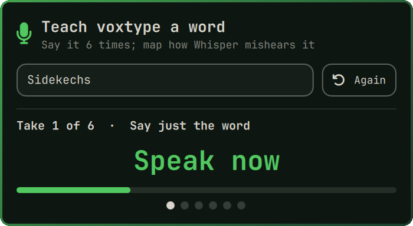
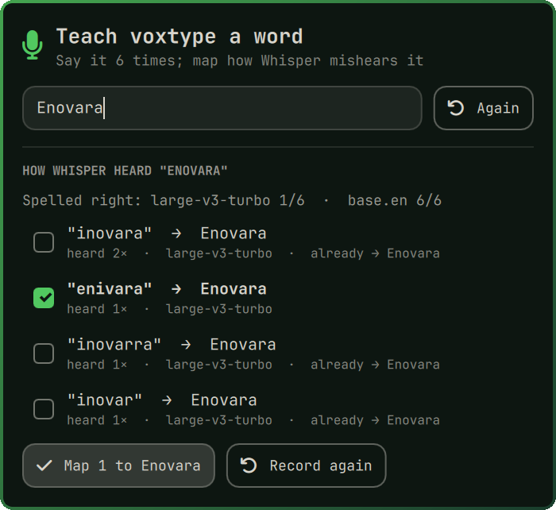

# Teach Voxtype

**Teach [voxtype](https://github.com/peteonrails/voxtype) dictation how to spell the words it keeps getting wrong.** Names, brands, and jargon come out of Whisper as near-misses ("inovara", "in obara" for *Enovara*). Say the word a few times, see exactly how Whisper hears it, and map every mishearing to the right spelling.

```bash
omarchy plugin add https://github.com/Enovara/omarchy-teach-voxtype.git --enable --yes
```

| Record | Review and map |
|---|---|
|  |  |

## How it works

1. Open the panel from the mic in the bar.
2. Type the word the way it should be typed, e.g. `Enovara`, and press Enter.
3. Say it when prompted, six short takes with a 3-2-1 countdown each: alone, slowly, quickly, and inside sentences.
4. Each take is transcribed with the Whisper model your dictation uses, plus `base.en` when it is installed (it mishears more, so it surfaces errors you would hit later).
5. Review every spelling Whisper produced, how often, and by which model. Spellings that are real English words are flagged and left unchecked, so a mapping never rewrites a word you actually say. Phrases that only differ by a surrounding word ("for inovara") are reduced to the mishearing itself.
6. Press **Map**. The plugin adds each checked spelling to voxtype's `text.replacements`, adds the word to `whisper.initial_prompt` so Whisper leans toward it, and restarts voxtype. **Re-test takes** runs the same recordings again.

The bar mic follows voxtype's live status (it lights up while you dictate). Left click opens the trainer; right click toggles dictation.

## Requirements

| Dependency | Why | Arch package |
|---|---|---|
| [voxtype](https://github.com/peteonrails/voxtype) with the Whisper engine, running as `voxtype.service` | transcription, config, restart | `voxtype` (AUR) |
| Python 3 (standard library only) | the engine, `voxwords.py` | `python` |
| PipeWire's `pw-record` | recording the takes | `pipewire` |
| A word list at `/usr/share/dict/words` *(optional, recommended)* | flagging real words | `words` |

Without a word list the review still works, but real words are not flagged: check the list yourself before mapping.

Recordings are kept in `~/.local/state/voxwords/<word>/` so you can re-test later. The plugin only changes `~/.config/voxtype/config.toml`, and only when you press **Map**, through `voxtype config set` (comments and other settings are preserved).

## Open it from a shortcut or the Omarchy menu

```lua
-- ~/.config/hypr/bindings.lua
o.bind("SUPER + CTRL + ALT + X", "Teach Voxtype a word", "omarchy-shell shell toggle io.github.enovara.teach-voxtype")
```

```jsonc
// ~/.config/omarchy/extensions/omarchy-menu.jsonc
"teach-voxtype": {"icon": "", "label": "Teach Voxtype a Word", "action": "omarchy-shell shell toggle io.github.enovara.teach-voxtype"},
```

## Settings

In `~/.config/omarchy/shell.json`, on the plugin's bar entry:

| Key | Default | |
|---|---|---|
| `takes` | `6` | recordings per word (minimum 2) |
| `seconds` | `3` | length of each recording |

## Use it from the terminal

Drive the panel over Omarchy shell IPC, e.g. from a keybinding or script:

```bash
omarchy-shell io.github.enovara.teach-voxtype teach "Enovara"    # open and start recording takes
omarchy-shell io.github.enovara.teach-voxtype review "Enovara"   # review the saved takes again, no recording
```

The panel is a front end for `voxwords.py`, which you can also run directly:

```bash
ENGINE=~/.config/omarchy/plugins/io.github.enovara.teach-voxtype/voxwords.py
$ENGINE probe "Enovara" ~/.local/state/voxwords/enovara/*.wav     # JSON: transcripts and mishearings
$ENGINE apply "Enovara" "inovara" "in obara"                       # map them, update the prompt, restart voxtype
```

## Remove

```bash
omarchy plugin remove io.github.enovara.teach-voxtype --yes
rm -rf ~/.local/state/voxwords          # the recordings
```

Mappings you applied stay in voxtype. To undo one: `voxtype config unset text.replacements.<spelling>` and `systemctl --user restart voxtype`.

## License

[MIT](LICENSE) © Enovara
