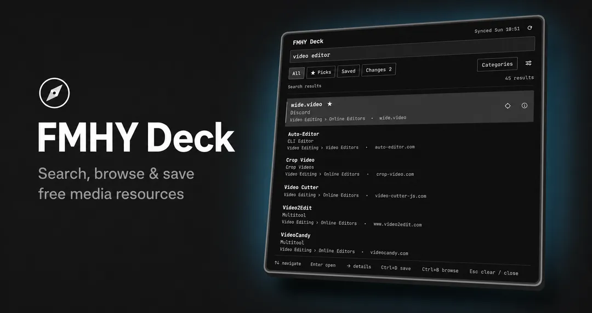

# FMHY Deck

FMHY Deck puts the [FMHY](https://fmhy.net/) directory behind a fast, keyboard-first Omarchy
panel. Open it from the bar, type what you need, and press Enter. Search, saved resources, and
the last downloaded safety metadata stay local and continue to work offline.

FMHY Deck is an independent integration. It is not affiliated with or endorsed by FMHY,
Omarchy, or 37signals.



## What it does

- Searches names, descriptions, categories, and hostnames from a local index.
- Understands prefixes, common plurals, close misspellings, and concise natural-language intent.
  FMHY-irrelevant filler does not make queries such as `best free video editor` fail.
- Keeps FMHY-preferred resources, saved resources, and catalog changes one shortcut away.
- Browses the complete FMHY category tree without requiring a query.
- Shows the real destination hostname before opening and keeps the full URL in the details view.
- Requires confirmation for FMHY warnings and every unencrypted HTTP destination.
- Refreshes transactionally: malformed or incomplete updates never replace the last good index.
- Runs inside the existing Omarchy shell process with no daemon, account, telemetry, or runtime
  package dependencies.

## Install

Use the HTTPS URL of this repository:

```bash
omarchy plugin add https://github.com/i12bp8/fmhy-deck.git --enable
```

FMHY Deck registers the `io.github.i12bp8.fmhy-deck` bar widget in the right section by default. If it is
enabled but not visible, place it explicitly:

```bash
omarchy bar move io.github.i12bp8.fmhy-deck --section right
```

Remove the plugin with:

```bash
omarchy plugin remove io.github.i12bp8.fmhy-deck
```

Removal leaves saved resources and the downloaded index on disk. Delete
`~/.local/state/fmhy-deck` and `~/.cache/fmhy-deck` separately only if you also want to remove
that local data.

## Use

Click the deck icon in the bar and start typing. The initial view puts FMHY's preferred picks
first; `Categories` switches to directory browsing.

| Key | Action |
|---|---|
| Type | Search all resources or the selected category |
| `Up` / `Down` | Move through results |
| `Page Up` / `Page Down` | Move by one visible page |
| `Home` / `End` | Move to the first or last loaded result |
| `Enter` | Open the selected resource |
| `Right` or `Ctrl+I` | Inspect the selected resource |
| `Ctrl+D` | Save or unsave the selected resource |
| `Ctrl+R` | Open a random FMHY pick in the details view |
| `Ctrl+B` | Browse categories |
| `Ctrl+1` … `Ctrl+4` | All, FMHY picks, saved, or changes |
| `Ctrl+F` | Focus and select the current query |
| `Esc` | Go back, clear the query, or close the panel |

Right-clicking a result opens its details. Search from another process with the shell's canonical
IPC entry point:

```bash
omarchy-shell io.github.i12bp8.fmhy-deck search "video editor"
omarchy-shell io.github.i12bp8.fmhy-deck sync
omarchy-shell io.github.i12bp8.fmhy-deck status
```

## Data and network access

The catalog is fetched from `fmhy/edit` and warning metadata from `fmhy/FMHYFilterlist`. A stale
index triggers two lightweight GitHub revision checks. Full documents are downloaded only when
one of those revisions changes, and each document URL is pinned to the returned 40-character
commit SHA.

| Domain | Purpose |
|---|---|
| `api.github.com` | Check the two upstream repository revisions |
| `raw.githubusercontent.com` | Download commit-pinned catalog and warning files |

Those are the only download hosts accepted by the transport boundary. Requests are HTTPS-only,
redirects and user curl configuration are disabled, response size and time are bounded, and no
search query or saved resource is transmitted.

Local files:

| Path | Contents |
|---|---|
| `~/.cache/fmhy-deck/index-v1.json` | Rebuildable catalog, warning metadata, changes, and search index |
| `~/.local/state/fmhy-deck/state-v1.json` | Saved resource snapshots and the last reviewed revision |

## Security model

Omarchy plugins run as unsandboxed code with the current user's permissions. FMHY Deck therefore
treats downloaded catalog data, its own cache, and saved state as untrusted input.

- Remote content is parsed as bounded data and is never imported, evaluated, or passed to a shell.
- Display strings are normalized and always rendered as `Text.PlainText`.
- URLs use a deliberately narrow HTTP(S) parser that rejects credentials, ambiguous authorities,
  IP-literal spellings, control characters, encoded traversal, and unsupported schemes.
- Opening uses Qt's external-URL API only after validation. HTTP and upstream-warning destinations
  require a second explicit action; known unsafe-list matches take precedence over the HTTP notice.
- Downloads use fixed argument arrays and an exact host/path allowlist. Active data changes only
  after parse validation, bounded index construction, an atomic write, and write acknowledgement.
- Cache indices are structural hints only. Invalid resources, warnings, ordering, category data, or
  duplicate index positions cause a rebuild instead of becoming active.

FMHY warning data is advisory and can be incomplete or stale. A resource without a known warning
is not guaranteed to be safe.

## Development

Run the complete local gate on an Omarchy system:

```bash
tests/check.sh
```

It runs the JavaScript domain and worker tests, Omarchy manifest validation, static QML analysis,
and the QML worker tests on the real Qt engine. The project has no build step and no vendored or
runtime third-party dependencies.
