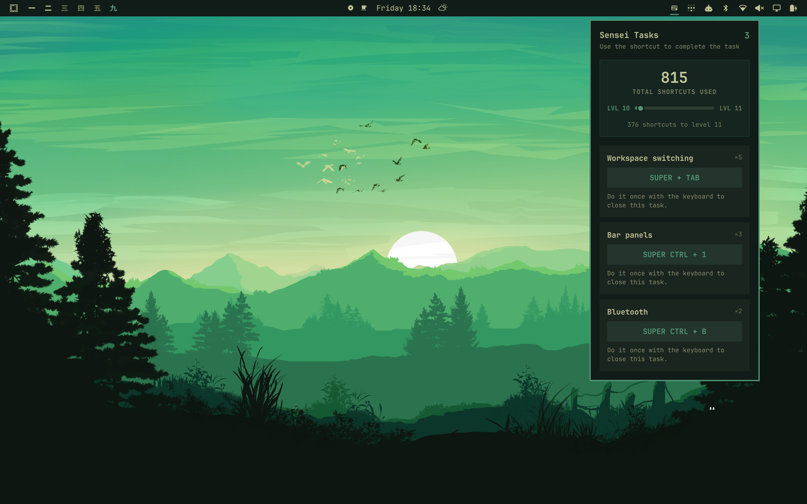
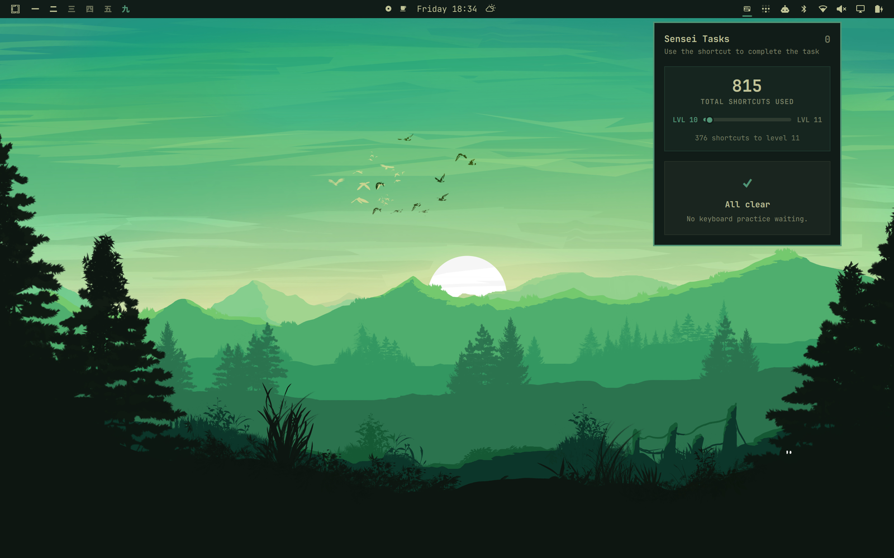

# Omarchy Sensei

**Learn Omarchy by using it. Get faster every day.**

Omarchy Sensei finds the things you still reach for with the mouse and turns them into focused keyboard practice. Instead of asking you to memorize a giant shortcut sheet, it teaches the right shortcut at the exact moment it becomes useful.



Whether you are new to Omarchy or already fly through most of it from the keyboard, Sensei shows you the habits you have not mastered yet. Every task is based on something *you actually do*, so your practice stays personal and useful.

## Your path to keyboard-first

Sensei has one simple loop:

1. Use the mouse to switch windows, click a workspace or bar panel, choose a shortcut-backed menu route, or launch a shortcut-backed app from Omarchy's Apps menu.
2. Sensei creates a practice task and shows every matching shortcut from Omarchy's Super+K panel.
3. Use one of those shortcuts the next time.
4. The task completes automatically.

That is it. No courses, streak pressure, or generic drills—just a quiet coach that helps your real workflow become faster.

Repeated mouse habits rise to the top, so the biggest opportunity is always the first thing you see. If an old habit returns, its task returns too. As your muscle memory grows, Sensei keeps looking for the next improvement.

## Built for beginners and power users

- **Learn in context.** See a shortcut when you have just demonstrated why you need it.
- **Practice what matters.** Tasks come from your own mouse usage, not a predetermined curriculum.
- **Find your blind spots.** Even proficient users can see which parts of Omarchy they still do the slow way.
- **Watch yourself level up.** Every shortcut use advances a lifetime level, with each level requiring 50% more deliberate keyboard use.
- **Graduate from every task.** Perform the action from the keyboard once and it disappears—until the mouse habit comes back.

The goal is simple: fewer open tasks, more shortcuts used, and an Omarchy workflow that feels increasingly effortless.

## Install

Requires Omarchy Quattro. Sensei uses the Python 3 runtime included with Omarchy and installs only user-level files and services; it does not download dependencies or require elevated privileges.

```sh
omarchy plugin add https://github.com/nilszeilon/omarchy-sensei.git --enable
```

When the plugin is enabled, its service automatically runs setup from the cloned checkout. It snapshots Omarchy's live Super+K bindings, collapses duplicate commands into semantic tasks, and connects safe desktop event sources to those identities. Menu shortcuts resolve through Omarchy's own route IDs and aliases. Apps-menu launches resolve through desktop IDs, executable commands, URLs, and configured default roles. Bar clicks resolve through Omarchy Shell's widget metadata. Window-focus clicks resolve from the compositor's before/after window geometry. Ambiguous candidates are ignored instead of guessed, and no action-specific list is required. Sensei never edits `/usr/share/omarchy`.

If you need to repair the integration manually, run `./install.sh` from the cloned plugin directory.

Setup installs the helper in `~/.local/bin`, adds clearly marked managed blocks to the user Hyprland and Omarchy menu configurations, and enables a user-level systemd path unit that refreshes shortcut hints after remaps or Omarchy updates. Existing configuration is backed up before a managed block changes.

Task hints resolve against the active Hyprland bindings, so user remaps take precedence over Omarchy defaults and every current alternative is shown. Clicks without one unique keyboard equivalent are ignored.

Equivalent habits share one task: every numbered workspace click contributes to `Workspace switching`, and `Super+Tab` or any numbered workspace shortcut completes it. Panels without a named shortcut contribute to `Bar panels`; any positional bar-panel shortcut completes that shared task. Named panels such as Bluetooth stay independent and require their named shortcut.

The panel shows your lifetime shortcut level above your tasks. Level 1 takes 10 shortcut uses; each following level requires 50% more than the previous one, rounded up. It is a small, shareable measure of how keyboard-first your Omarchy workflow has become.

## Private by design

Sensei stores no action or keypress history. Its private local state contains only the lifetime shortcut total and currently open tasks. Task records contain the action name, current shortcut hints, offender count, and opening time. A sub-second duplicate guard is discarded automatically. Sensei has no telemetry or network client; during normal use, all data stays local.

Sensei is event-driven at idle. The panel watches its compact state file through Quickshell instead of polling or keeping Python resident. When you use an observed shortcut, Omarchy performs the action first and launches the small state update asynchronously, so coaching never sits in the shortcut's critical path. The compositor focus observer is mouse-only and non-consuming; ordinary clicks launch no process, and only a real focus transition followed by the matching click release emits an event.

The catalog refreshes automatically after menu or personal binding changes and after Omarchy updates. Inspect its decisions with:

```sh
omarchy-sensei catalog
omarchy-sensei catalog --unmatched
omarchy-sensei catalog --json
omarchy-sensei catalog --coverage
omarchy-sensei catalog --coverage --json
omarchy-sensei doctor
```

Coverage distinguishes actions Sensei can currently observe from actions whose shortcut identity is understood but whose UI does not yet expose a safe slow-path event. On the release snapshot, all 218 bindings are accounted for as 191 semantic concepts; only five lack dispatcher metadata.

## Controls

Tasks are ordered by their slow-use count, so the worst offender is always first. Use arrows or `h/j/k/l` to move through the scrollable list, `Tab`/`Shift+Tab` to switch bar panels, and `Esc` to close.

```sh
omarchy-sensei status
omarchy-sensei pause
omarchy-sensei resume
omarchy-sensei clear
```

State stays in `$XDG_STATE_HOME/omarchy-sensei/state.json` or `~/.local/state/omarchy-sensei/state.json`, with mode `0600`. `clear` permanently deletes progress and open tasks. Upgrading from a pre-2.0 release compacts the old history once and then permanently deletes `events.jsonl`.

## All clear



## Remove

```sh
# Optional: permanently delete progress before removing the helper.
omarchy-sensei clear

omarchy-sensei uninstall
hyprctl reload
omarchy plugin remove io.github.nilszeilon.omarchy-sensei
```

Uninstall removes the helper, generated integration, managed configuration blocks, binding cache, refresh unit, and update hook. Omit `clear` if you want to keep your compact progress file for a later reinstall.

## License

MIT
