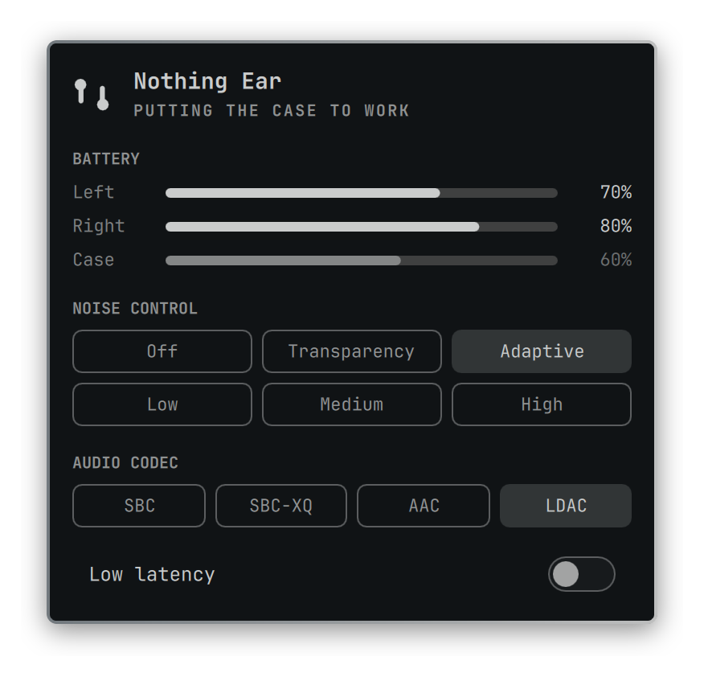

# Nothing Audio for Omarchy

An Omarchy bar widget for Nothing earbuds and headphones: battery, noise
control, audio codec, and low latency mode. Tested on Nothing Ear and Nothing
Headphone (1). It speaks the Nothing X protocol over Bluetooth RFCOMM through a
small Python helper, so there is no daemon and no dependencies beyond
`bluetoothctl` and `pactl`.

<p align="center">
  
</p>

## Features

- Left, right, and case battery for earbuds, one headset battery for
  Headphone (1), with a charging pulse on the meter
- Noise control: Off, Transparency, Adaptive, Low, Medium, High
- Low latency mode on devices that expose it
- Audio codec, limited to what your laptop can actually negotiate
- Falls back to the single Bluetooth percentage if the Nothing control channel
  is busy

The case only reports while it is open. Once it closes, the last reading stays
on screen, dimmed, for 6 hours.

## Install

```bash
omarchy plugin add https://github.com/r-witz/omarchy-nothing-ear --enable
omarchy bar move io.github.r-witz.nothing-ear
```

Pair the device through the normal Bluetooth panel first. The helper picks the
first connected device whose name contains `Nothing`, `Ear`, or `CMF`.

## Settings

| Key | Default | What it does |
| --- | --- | --- |
| `hideWhenDisconnected` | `true` | Hide the icon while the device is away. An error keeps it visible. |
| `deviceAddress` | `""` | Pin a Bluetooth address, for when several matching devices are paired. |
| `helperPath` | `""` | Use a different `nothing-earctl.py`. Empty uses the bundled one. |

## Controls

Left click opens the panel, right click cycles noise control.

| Key | Action |
| --- | --- |
| `j` `k` `↓` `↑` | Move between groups |
| `h` `l` `←` `→` | Move between options |
| `Enter` `Space` | Activate |
| `o` `t` `a` | Off, Transparency, Adaptive |
| `Shift+L` `m` `Shift+H` | Low, Medium, High ANC |
| `g` | Toggle low latency |
| `c` | Cycle codec |
| `r` | Refresh |
| `Esc` | Close |

Plain `h` and `l` walk the chips, so the ANC levels take the shifted letters.

The panel is also scriptable:
`omarchy-shell nothing-ear toggle|refresh|noise|codec|status`.

## Codecs

Codec options come from PipeWire's real A2DP card profiles, so a codec your
laptop cannot negotiate never appears. Switching one may briefly interrupt audio
while PipeWire renegotiates the stream.

The device reports a vendor codec mode of its own. The plugin reads it for
diagnostics but never writes it, because the firmware can acknowledge a value
without applying it. The host side is what actually changes the stream.

## Helper

`nothing-earctl.py` is the only part that touches the hardware, and it only
runs for the length of one call:

```bash
./nothing-earctl.py status
./nothing-earctl.py set-anc transparency
./nothing-earctl.py set-latency on
./nothing-earctl.py set-codec ldac
```

Each call prints one line of JSON. `status` always prints a full snapshot and
exits 0; the `connected` and `protocol` fields say which state the device is
in.

## Remove

```bash
omarchy plugin remove io.github.r-witz.nothing-ear
rm -rf "${XDG_STATE_HOME:-$HOME/.local/state}/nothing-ear"
```

## License

MIT. Nothing, Nothing Ear, and Nothing X are trademarks of Nothing Technology
Limited.
This project is unofficial.
