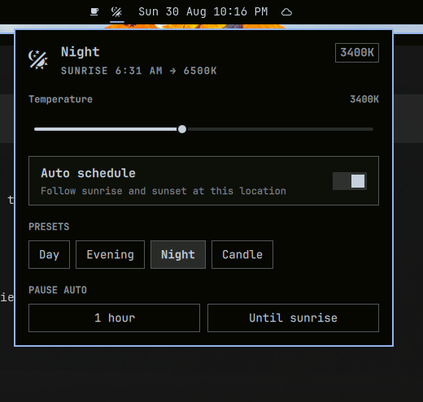

# Night Light

f.lux-style screen color temperature for [Omarchy](https://omarchy.org/) on Hyprland.

A moon icon in the bar opens a panel with a Kelvin slider, an automatic sunrise/sunset schedule, warmth presets, and pause controls. The compositor backend is [hyprsunset](https://wiki.hypr.land/Hypr-Ecosystem/hyprsunset/).



Enabling this plugin replaces Omarchy’s built-in night-light toggle (4000K / 6500K) with the scheduler and panel.

## Install

```bash
omarchy plugin add https://github.com/key-tone/omarchy-nightlight.git --enable
```

The widget lands in the **center** of the bar. Move it with:

```bash
omarchy bar move kenny.nightlight --section right
```

Hyprland’s `hyprsunset` must be installed (Omarchy ships it). The plugin starts it if it is not already running.

### Update

```bash
omarchy plugin update kenny.nightlight
```

### Remove

```bash
omarchy plugin remove kenny.nightlight
```

That restores the built-in night-light service.

## Controls

| Input | Action |
| --- | --- |
| Left click moon | Open or close the panel |
| Right click moon | Toggle night / day (switches to manual) |
| Slider | Set Kelvin live (1000–6500) and switch to manual |
| Auto schedule | Follow local sunrise and sunset |
| Day / Evening / Night / Candle | Jump to 6500K / 4000K / 3400K / 1900K |
| Pause 1 hour | Hold daylight until then |
| Until sunrise | Hold daylight until morning |
| `j` / `k` | Move between panel rows |
| `h` / `l` | Nudge the slider or walk presets |
| `a` | Toggle auto |
| `p` | Pause one hour |
| `s` | Pause until sunrise |

Location is taken from Omarchy weather (`~/.local/state/omarchy/settings/weather.json`) and geocoded through Open-Meteo if coordinates are missing. Sunrise and sunset are then computed offline (NOAA algorithm), so the schedule keeps working without the network.

Settings persist in `~/.local/state/omarchy/settings/nightlight.json`.

## Requirements

- Omarchy with shell plugins (Quattro)
- Hyprland + `hyprsunset`
- `hyprctl`, `curl`, `jq` (all present on a stock Omarchy install)

## CLI

The plugin keeps the existing `nightlight` IPC target, so Omarchy’s night-light commands still work:

```bash
omarchy-shell nightlight status
omarchy-shell nightlight setMode auto
omarchy-shell nightlight setTemperature 3400
omarchy-shell nightlight preset candle
omarchy-shell nightlight pause 3600
omarchy-shell nightlight pause sunrise
omarchy-shell kenny.nightlight toggle    # open the panel
```

When auto is on, `omarchy toggle nightlight` is a one-shot; the scheduler reasserts the scheduled temperature on the next tick.

## Development

```bash
omarchy plugin validate .
node -e '
const M = require("./NightlightModel.js")
const sun = M.sunTimes(31.50239, -89.27895, new Date(2026, 7, 30, 12))
console.log(M.formatMinutes(sun.sunrise), M.formatMinutes(sun.sunset))
'
```

The shell hot-reloads QML under `~/.config/omarchy/plugins/` on save. The service process is created once per shell lifetime; restart it after `Service.qml` changes with `omarchy restart shell`.

## License

MIT
