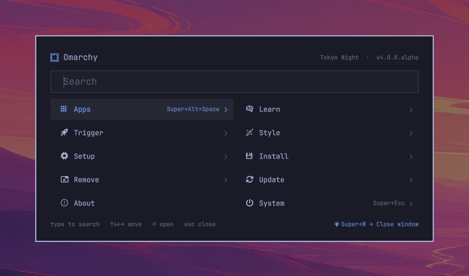
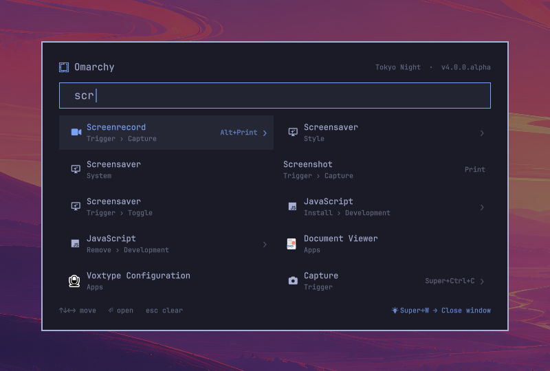
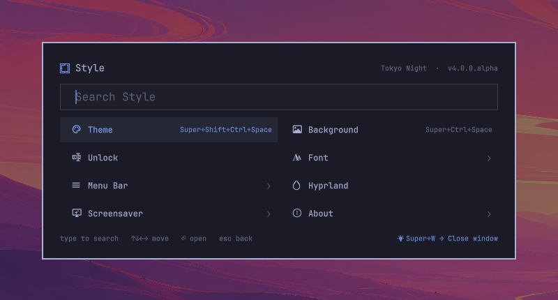
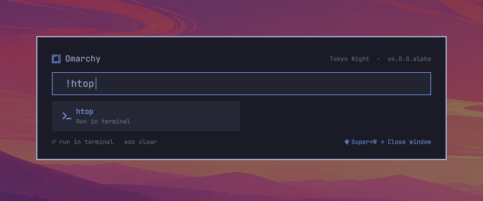
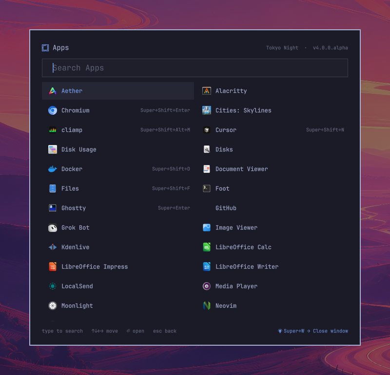

# Switchboard

A grid launcher for [Omarchy](https://omarchy.org). Same menu, same data,
laid out so you can see it.



Press `SUPER+SPACE`. Ten tiles, one search box, nothing else. Type to find
anything anywhere in the menu tree, arrow to it, Enter. Every tile that also
has a global keybinding shows it — so the launcher slowly teaches you not to
need it.

## Install

```bash
omarchy plugin add https://github.com/krall12/omarchy-switchboard.git
omarchy plugin enable krall.switchboard
```

That's it. Enabling is the switch: while it's on, every `SUPER+SPACE`, bar
click, and `omarchy menu` call opens Switchboard instead of the built-in
menu. Turn it off and you're back, keybindings untouched:

```bash
omarchy plugin disable krall.switchboard   # back to the built-in menu
omarchy plugin remove krall.switchboard    # gone entirely
```

Everything it needs ships with Omarchy: `jq`, `hyprctl`, `xdg-open`,
`xdg-terminal-exec`, and the `omarchy-*` helper scripts. No install hooks,
no sudo, no network, nothing written outside the plugin directory.

## What it does

### Search everything, always

There's no search mode. Just type. The query runs against the current menu
and everything under it, so `scr` from the root finds Screenshot, Screensaver
and Screenrecord wherever they live, with the path shown under each.



### Learn the shortcuts

Anything reachable from a Hyprland keybinding shows the combo on its tile.
Apps get theirs from your `bindings.lua` too — `Super+Enter` on the
terminal, `Super+Shift+Enter` on the browser. The footer shows one random
binding each time you open it.



### Run anything

`!` runs a command in a new terminal, in the directory your active terminal
is already in; the shell stays open afterwards so you can read the output.
`~/path` or `/path` opens it with whatever handles it.



### Apps, in one width

Long menus scroll instead of resizing the card. The launcher is 680px wide
everywhere, so it never jumps under your eyes.



### Everything else still works

Switchboard reads the same `omarchy-menu.jsonc` files as the built-in menu —
the defaults plus your `~/.config/omarchy/extensions/omarchy-menu.jsonc` —
including `when:` / `checked:` guards, providers, and your own entries. It
answers the `select` / `input` requests that `omarchy menu select` and other
scripts send. Theme colors, fonts, radius and spacing all come from the
theme's `[menu]` tokens, so every theme already styles it.

## Keys

| Key | Menu | `select` / `input` |
|-----|------|--------------------|
| letters | search | filter / type |
| `!cmd` | run in a terminal | typed |
| `~/path` | open with xdg-open | typed |
| `↑ ↓ ← →` | move | move |
| `Tab` / `Shift+Tab` | next / previous | same |
| `Enter` | open | pick / confirm |
| `Escape` | clear search → up a level → close | cancel |
| `Backspace` | delete; when empty, up a level | delete |
| `Delete` | uninstall the selected app | — |

## Toggle from the menu

Want an on/off switch inside the menu itself? Add this to
`~/.config/omarchy/extensions/omarchy-menu.jsonc` (it's also in
[`extension/omarchy-menu.jsonc`](extension/omarchy-menu.jsonc)) and a
**Switchboard Launcher** toggle appears under `Trigger › Toggle` in both the
classic menu and Switchboard:

```jsonc
"trigger.toggle.switchboard": {
  "icon": "󰕰",
  "label": "Switchboard Launcher",
  "checked": "$HOME/.config/omarchy/plugins/krall.switchboard/scripts/enabled",
  "action": "$HOME/.config/omarchy/plugins/krall.switchboard/scripts/toggle"
},
```

## How it fits in

The manifest declares `omarchy.clonedFrom: "omarchy.menu"`. The shell treats
an enabled clone as the owner of that plugin id, so summons for
`omarchy.menu` route here without any keybinding or script changing. That's
the whole integration.

```
manifest.json     plugin manifest (kinds: menu + bar-widget, clonedFrom omarchy.menu)
Switchboard.qml   the launcher
BarWidget.qml     the bar button (same as the built-in one)
MenuModel.js      menu parsing and search, from Omarchy's menu plugin
Keybinds.js       maps Hyprland binds onto menu items and desktop entries
scripts/keybinds  emits the bind records (reuses omarchy-menu-keybindings' cache)
scripts/read-file bounded, symlink-refusing reader for the menu JSONC files
scripts/status    theme and version for the header
scripts/updates   pending update count for the header
scripts/toggle    enable ⇄ disable
scripts/enabled   exit 0 when Switchboard is active (for `checked:` guards)
extension/        the Trigger › Toggle entry above
```

## Input bounds

Everything the launcher parses is produced by something else — helper
scripts, `provider:` commands, `when:` / `checked:` guard batches, and the
two `omarchy-menu.jsonc` files — so all of it goes through the same limits
(top of `Switchboard.qml`, `maxProcess*` / `maxMenuFileBytes` /
`*TimeoutMs`):

- Process output is kept line by line up to 256K characters / 4000 lines;
  past either the producer is killed and its output discarded.
- Every producer has a deadline (10s providers and guards, 15s helpers,
  2min for the update check) after which it is killed.
- Menu files are read by `scripts/read-file`, which refuses symlinks,
  non-regular files, and anything over 1 MiB, and opens with `O_NOFOLLOW`.
  The QML only watches those paths for changes; it never reads them itself.
- The keybinding cache is picked the same way: newest regular non-symlink
  file, size-checked, opened with `O_NOFOLLOW`, output capped.

## Hacking

Files under `~/.config/omarchy/plugins/` hot-reload on save; if a change
doesn't show, `omarchy restart shell`. `Keybinds.js` is a `.pragma library`
and always needs the restart. Shell logs:

```bash
tail -f /run/user/$UID/quickshell/by-pid/*/log.log
```

The knobs are at the top of `Switchboard.qml`: tile height and gap, card
width, and `cardTop` (where the card hangs from — the same distance is kept
below it, so a full launcher sits centred).

## License

MIT. `MenuModel.js` is from Omarchy, also MIT.
