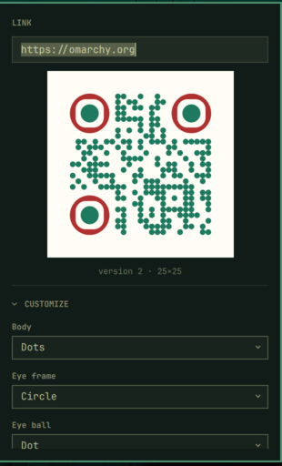

# QR generator

An Omarchy bar widget that turns a link into a QR code in a dropdown under its
own icon. Styled codes, a centre asset, and optional link compression — and it
checks that what it drew actually scans.



Left click opens it with the link field focused. Escape, or a click outside,
closes it.

## Install

```sh
omarchy plugin add https://github.com/MahmoodKhalil57/omarchy-qrgen --enable
```

That clones it into `~/.config/omarchy/plugins/`, registers it, and puts the
icon in the bar. `omarchy bar move mahmoodkhalil57.qrgen --section right` moves
it; the shell picks up changes without a restart.

To update: `omarchy plugin update mahmoodkhalil57.qrgen`.

## Remove

```sh
omarchy plugin remove mahmoodkhalil57.qrgen
```

That takes the icon out of the bar and deletes the plugin directory. Nothing is
left behind anywhere else: the plugin writes only its own entry in
`~/.config/omarchy/shell.json`, which goes with it, and saved codes are ordinary
files in `~/Pictures` that are yours to keep or delete.

## How it runs

The generator runs inside the shell's own JavaScript engine. There is no build
step, no `node_modules`, no daemon and no subprocess: a code takes about twenty
milliseconds and is handed to the preview as a string, so nothing is written to
disk to show you a QR code.

`renderer.js` is a bundle of [qrgen](https://github.com/mahmoodkhalil57/qrgen)'s
generator — the same shape registries, colour handling and centre-asset geometry
as the web app it comes from, rather than a reimplementation that would drift
from it. The shape dropdowns are built from that bundle, so a shape added
upstream appears here without this plugin changing.

Two optional things use programs you may already have:

| Feature | Needs | Without it |
| --- | --- | --- |
| Copy / Save PNG | `librsvg`, `wl-clipboard` | The buttons report what is missing |
| Scan check | `zbar`, `librsvg` | Silently skipped |
| Link compression | `node` or `bun` | The option says so and stays off |

Omarchy already ships the first two.

## Customize

Body, eye-frame and eye-ball shapes; foreground and background colours, with
separate eye colours that fall back to the foreground when left blank; a
transparent background; and a centre asset chosen by path or through Omarchy's
image picker, with size, padding, punch-out and backdrop.

The asset is inlined into the SVG, so the code renders the same everywhere it is
opened — the preview, the exported PNG, and the file itself.

## Advanced

Error correction, quiet zone and link compression, each with an **Automatic**
switch. Turn one on and the control below is replaced by a line saying what was
chosen and why; turn it off and the manual control returns holding its value.

Automatic decides by measuring. A QR code's size is a step function of its
payload, so the only way to know whether compression helps is to encode it both
ways and compare:

- **Error correction** — the strongest level the payload carries without the
  code getting bigger. A centre asset raises the floor to Q, since the code has
  to be readable through a hole.
- **Quiet zone** — four modules, which is what the specification asks for. There
  is no cleverer number; automatic exists so it cannot be left somewhere
  unhelpful.
- **Link compression** — every candidate is built and measured. Smallest wins;
  ties go to whatever depends on least, so a plain link beats a redirect and a
  redirect beats emoji.

Emoji therefore never wins on its own merits, and cannot: emoji are UTF-8 and a
QR code is charged by the byte, so an emoji payload reliably makes a *bigger*
code even though the link reads shorter.

Where automatic earns its keep is the interaction. With a centre asset it
prefers a payload that keeps the code under version 7 — the point where an asset
starts landing on the middle alignment pattern — so a link that would otherwise
produce a handsome unscannable code gets compressed into one that works:

```
ha.mr · 37×37 instead of 45×45 · keeps the asset off the centre alignment pattern
```

All three are on by default. Compression is the one with a consequence outside
the code — a compressed link is a redirect through [ha.mr](https://ha.mr), so it
is only as durable as that service — which is why the panel always states what
it chose and why, and the switch to turn it off is right beside the answer. It
only ever turns compression on when doing so makes a genuinely smaller code.

## Codes that do not scan

A centre asset lands on the middle alignment pattern from version 7 up. That is
structure, not payload, so error correction cannot put it back — and nothing
about the picture says the code is dead.

So every render is read back: the SVG is rasterised onto white and decoded, and
the panel says plainly when what came out is not what went in. Transparent
backgrounds do not trip it, and it stays quiet where there is no decoder.

## Link compression

Optional, and the only part that needs a runtime present. It
compresses the link with [ha.mr](https://ha.mr) and encodes a short redirect
instead of the URL — a smaller code, at the cost of a link that only works while
that redirector does.

Compressed codes point at `ha.mr` unless you set `siteRoot` to somewhere running
qrgen's own resolver, in which case that becomes a second choice in the dropdown.
There is no default site: a plugin should not quietly route other people's links
through somebody's personal domain.

## Settings

Every option is remembered on the widget's entry in
`~/.config/omarchy/shell.json`, written as it changes. Which sections were open
is remembered too.

```json
{
  "id": "mahmoodkhalil57.qrgen",
  "correctionAuto": true,
  "marginAuto": true,
  "compressAuto": true,
  "siteRoot": "",
  "assetDirs": "~/Pictures\n~/Downloads"
}
```

`assetDirs` is newline separated and sets where the asset picker looks.

## Over IPC

```sh
omarchy-shell mahmoodkhalil57.qrgen toggle
omarchy-shell mahmoodkhalil57.qrgen encode "$(wl-paste)"   # open holding a link
omarchy-shell mahmoodkhalil57.qrgen copy                   # PNG to the clipboard
omarchy-shell mahmoodkhalil57.qrgen save                   # PNG to ~/Pictures
omarchy-shell mahmoodkhalil57.qrgen level H                # L | M | Q | H
```

`encode` is the one worth a keybinding — it makes "QR the link I just copied" a
single keystroke.

## Rebuilding renderer.js

`renderer.js` is a committed build artefact — bundling the generator from
[qrgen](https://github.com/MahmoodKhalil57/qrgen) so the panel draws codes with
the app's own shape registries and geometry rather than a reimplementation.

The script that produces it lives with the source it bundles, in that repository
under `tools/`, not here: this plugin ships the built file and nothing that
builds it, so installing it never involves a toolchain. See `THIRD-PARTY.md` for
what goes into the bundle and what is done to it.

## Licence

MIT — see `LICENSE`. Bundled and vendored code is MIT too; `THIRD-PARTY.md`
lists what is included, whose it is, and what was done to it.
