# meteobar

[](https://aur.archlinux.org/packages/meteobar)
[](LICENSE)

meteobar is a weather widget for [Waybar](https://github.com/Alexays/Waybar) and the [Omarchy](https://omarchy.org) shell. It gets the data from [Open-Meteo](https://open-meteo.com/), which does not need an API key. meteobar shows the current conditions in your bar, and it gives the hourly and the daily forecast on demand.

The same core drives both frontends, so a number reads the same on either one:

| The Omarchy shell plugin | The Waybar module |
| :---: | :---: |
| 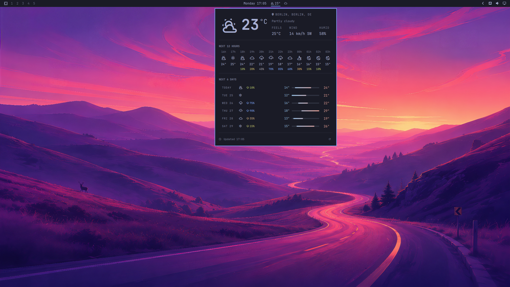 | 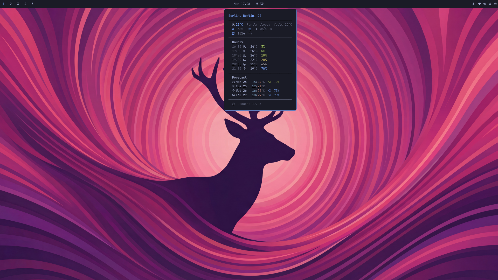 |

## Contents

- [Why meteobar?](#why-meteobar)
- [Features](#features)
- [Requirements](#requirements)
- [Installation](#installation)
- [Quick start](#quick-start)
- [Configuration](#configuration)
- [Omarchy shell plugin](#omarchy-shell-plugin)
- [Theming](#theming)
- [Tooltip font](#tooltip-font)
- [Monochrome mode](#monochrome-mode)
- [Structured JSON output](#structured-json-output)
- [How it works](#how-it-works)
- [Troubleshooting](#troubleshooting)
- [Related](#related)

## Why meteobar?

| Feature | wttrbar | meteobar |
|---|---|---|
| API reliability | wttr.in, which is often down | Open-Meteo, which is stable and has no request limit |
| Location disambiguation | None | A province or a country identifies the correct city |
| Day and night icons | No | Automatic, from the current weather |
| Format customization | Fixed flags | Template strings with placeholders |
| CSS classes | No | One class for each weather condition |
| Omarchy shell panel | No | Yes |
| API key | Not necessary | Not necessary |

## Features

- Current conditions with day/night aware icons
- Hourly and daily forecast, in a Waybar tooltip or an Omarchy panel
- Smart geocoding: a province or a country identifies the correct city
- Automatic detection of the location by IP
- Four icon sets: Nerd Font, Weather Icons, emoji, Font Awesome
- Follows your Omarchy theme, or your pywal palette
- Monochrome mode for a sober bar
- Structured JSON output for other frontends
- Rust code: one binary and no runtime dependencies

## Requirements

- [Waybar](https://github.com/Alexays/Waybar), or the Omarchy shell for the plugin
- A [Nerd Font](https://www.nerdfonts.com/) for the icons
- (Optional) [Font Awesome](https://fontawesome.com/) 7.0.0 or later for the `fontawesome` icon set

## Installation

### Omarchy

On [Omarchy](https://omarchy.org), the complete installation is two commands:

```bash
yay -S meteobar-bin
omarchy plugin add https://github.com/mryll/meteobar.git --enable
```

The first command installs the prebuilt binary. The second command installs the bar widget and enables it. Refer to [Omarchy shell plugin](#omarchy-shell-plugin) for the panel and its settings.

### Arch Linux (AUR)

```bash
yay -S meteobar        # builds from source
yay -S meteobar-bin    # prebuilt binary
```

### From source

```bash
git clone https://github.com/mryll/meteobar.git
cd meteobar
make install PREFIX=~/.local
```

Or install it system wide:

```bash
sudo make install
```

To remove meteobar:

```bash
make uninstall PREFIX=~/.local
```

## Quick start

Add this configuration to your `~/.config/waybar/config.jsonc`:

```jsonc
"modules-right": ["custom/meteobar", ...],

"custom/meteobar": {
    "exec": "meteobar --location 'Berlin'",
    "return-type": "json",
    "interval": 900,
    "tooltip": true
}
```

Run `meteobar --help` for the full reference: the usage line, every flag, and the format placeholders.

Your bar now shows something like `󰖐 23°`. Move the pointer onto the bar to see the full forecast.

<p align="center">
  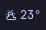
</p>

<p align="center">
  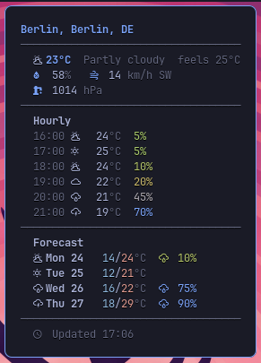
</p>

The screenshot shows every section, with `--tooltip-format both --days 4 --hours 6`. The default is `--tooltip-format days`, which gives the forecast alone.

## Configuration

### Options

| Option | Values | Default | Description |
|---|---|---|---|
| `--help` | flag | — | Prints the reference — usage, every flag, and the format placeholders — and exits 0. Also `-h` |
| `--location <NAME>` | city name, or `auto` | auto-detect by IP | `"City"`, `"City, Province"`, or `"City, CC"` |
| `--lat <FLOAT>` | latitude | — | Requires `--lon` |
| `--lon <FLOAT>` | longitude | — | Requires `--lat` |
| `--city-name <NAME>` | text | coordinates | Display name for `--lat`/`--lon` |
| `--format <TEMPLATE>` | template | `{icon} {temp}°` | Bar text. See the placeholders below |
| `--tooltip-format <FMT>` | `days`, `hours`, `both` | `days` | What the tooltip lists |
| `--days <N>` | 1-7 | `3` | Days in the tooltip |
| `--hours <N>` | 0-24 | `0` | Hours in the tooltip |
| `--units <UNITS>` | `metric`, `imperial` | `metric` | Unit system |
| `--icons <SET>` | `nerd`, `weather`, `emoji`, `fontawesome` | `nerd` | Icon set for the bar text |
| `--tooltip-font <NAME>` | font family or list | `JetBrainsMono Nerd Font, JetBrainsMono Nerd Font Mono, monospace` | The family the tooltip is pinned to. Must be monospace — see [Tooltip font](#tooltip-font) |
| `--frame`, `--frame-font` | — | — | **DEPRECATED**, still accepted. `--frame` is a no-op; `--frame-font` aliases `--tooltip-font` |
| `--no-color[=<WHAT>]` | `all`, `bar`, `tooltip` | `all` | Drops the colors. See [Monochrome mode](#monochrome-mode) |
| `--output <FORMAT>` | `waybar`, `json` | `waybar` | Output format. See [Structured JSON](#structured-json-output) |
| `--timeout <SECS>` | 1-60 | `10` | HTTP timeout |

### Format placeholders

Use `--format` to control the bar text:

| Placeholder | Example | Description |
|---|---|---|
| `{icon}` | 󰖙 | Weather icon |
| `{temp}` | 23 | Current temperature |
| `{feels_like}` | 22 | Apparent temperature |
| `{humidity}` | 47 | Humidity, in percent |
| `{wind}` | 9 | Wind speed |
| `{wind_dir}` | NE | Wind direction |
| `{pressure}` | 1012 | Pressure, in hPa |
| `{city}` | Berlin | Location name |
| `{min}` | 13 | Minimum temperature today |
| `{max}` | 26 | Maximum temperature today |
| `{rain_chance}` | 5 | Probability of rain today, in percent |
| `{description}` | Overcast | Condition text |

Examples:

```bash
# Default
meteobar --location "Berlin"
# => 󰖙 23°

# More detail
meteobar --location "Berlin" --format "{icon} {temp}° {city} ({description})"
# => 󰖙 23° Berlin (Clear sky)

# Today's range
meteobar --location "Berlin" --format "{icon} {min}/{max}°"
# => 󰖙 13/26°

# Hourly forecast in the tooltip
meteobar --location "Berlin" --tooltip-format both --hours 12

# Disambiguate a city by country
meteobar --location "Toledo, Spain"
```

> [!NOTE]
> The tooltip always uses Nerd Font icons, because they align in a monospace grid. The `--icons` option changes the bar text only.

### CSS classes

meteobar adds a class for the condition, so you can style the bar yourself:

| Class | Condition |
|---|---|
| `clear` | Clear sky, or mainly clear |
| `cloudy` | Partly cloudy, or overcast |
| `rainy` | Rain, or drizzle |
| `snowy` | Snow |
| `stormy` | Thunderstorm |
| `foggy` | Fog, or mist |
| `error` | The fetch failed |

```css
#custom-meteobar.clear { color: #e5c07b; }
#custom-meteobar.rainy { color: #81a1c1; }
#custom-meteobar.snowy { color: #88c0d0; }
#custom-meteobar.stormy { color: #bf616a; }
```

## Omarchy shell plugin

The repository is also an [Omarchy](https://omarchy.org) shell plugin. The bar shows the condition glyph and the temperature. A click on the bar opens a panel with the current conditions, the next 12 hours, and the next 6 days. A middle-click gets new data. The footer of the panel ends with a refresh control (󰑐), next to the time of the last update. The control stays disabled while a fetch runs.

<p align="center">
  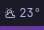
</p>

<p align="center">
  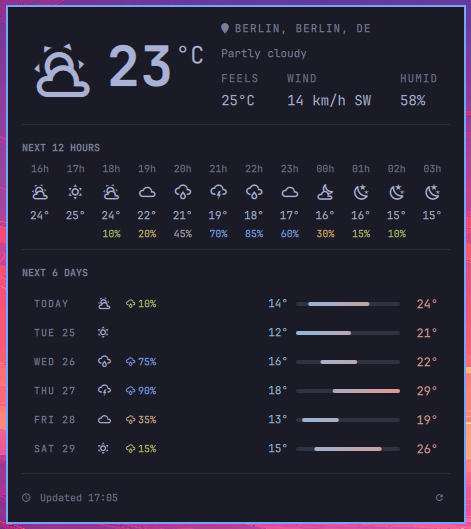
</p>

The panel shows more than the tooltip can:

- A hero block with a large glyph, the temperature, the apparent temperature, and the resolved location
- An hourly strip that tints each temperature by its position between the coldest and the warmest hour in view
- A daily section where each day is a min-max bar on the range of the whole week

Both frontends read the same forecast. The core selects the entries one time, so "the next 12 hours" means the same thing in the panel and in the tooltip. A night hour also gets its night icon in both frontends.

The plugin also answers the shell's IPC, so a keybind or a script can drive it without the mouse:

```bash
qs ipc call mryll.meteobar toggle    # open or close the panel
qs ipc call mryll.meteobar refresh   # fetch now, without opening anything
```

### Install the plugin

From the marketplace, or from this repository directly:

```bash
omarchy plugin add https://github.com/mryll/meteobar.git --enable
```

That clones the repository into `~/.config/omarchy/plugins/mryll.meteobar` and
validates the manifest before it is enabled. To remove it later:
`omarchy plugin remove mryll.meteobar`.

The plugin runs the `meteobar` binary from your PATH, so install that too — from the AUR (`yay -S meteobar-bin`) or with `make install PREFIX=~/.local`.

For development, link the working copy instead of cloning a second one:

```bash
make install PREFIX=~/.local   # the meteobar binary must be on your PATH
make install-omarchy           # links the repository into ~/.config/omarchy/plugins/
```

Then add the widget to the bar layout in `~/.config/omarchy/shell.json`:

```json
{
  "bar": {
    "layout": {
      "right": [
        { "id": "mryll.meteobar" }
      ]
    }
  }
}
```

To remove the link: `make uninstall-omarchy`.

> [!IMPORTANT]
> The shell compiles QML when it starts. After you edit a file in `omarchy/`, run `omarchy restart shell` to see the result. A plugin rescan is not sufficient.

### Settings

Configure these keys in the shell settings window, or in the layout entry in `shell.json`:

| Key | Type | Default | Description |
|---|---|---|---|
| `refreshMinutes` | 1-180 | `15` | Minutes between refreshes |
| `units` | `metric`, `imperial` | `metric` | Unit system |
| `location` | text | `""` | City name, `City, Province`, or `City, CC`. An empty value detects the location by IP |
| `iconSet` | `nerd`, `weather`, `emoji`, `fontawesome` | `nerd` | Icon set. `fontawesome` needs otf-font-awesome 7 or later |
| `colorMode` | `full`, `none`, `bar-only`, `panel-only` | `full` | Where to keep the colors |

## Theming

meteobar reads the colors from your system, in this order:

1. **Omarchy theme** — `$XDG_STATE_HOME/omarchy/current/theme/colors.toml`, which is `~/.local/state/omarchy/current/theme/colors.toml` by default. The old `~/.config/omarchy/current/theme/colors.toml` path still works.
2. **pywal cache** — `$XDG_CACHE_HOME/wal/colors.json`, which is `~/.cache/wal/colors.json` by default. meteobar reads this file only when there is no Omarchy theme. That one file also covers [pywal16](https://github.com/eylles/pywal16) and the pywal-compatible output of [wallust](https://codeberg.org/explosion-mental/wallust).
3. **One Dark** — the built-in palette, when there is no theme file.

The panel and the tooltip always agree, because the core resolves the palette and publishes it in the structured JSON. The palette includes the precipitation ramp with its threshold positions. Thus, if the core changes, both frontends change together.

A key can be absent, or can hold a value that is not a `#rgb`, `#rgba`, `#rrggbb`, or `#rrggbbaa` color. Then only that one color takes its default value. A partial theme file does not disable the other colors.

The Waybar tooltip follows the same theme:

| Flexoki Light | Rosé Pine | Hackerman |
|:---:|:---:|:---:|
| 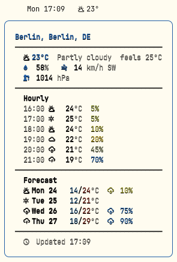 | 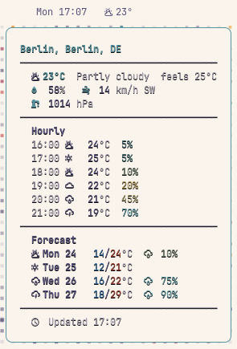 | 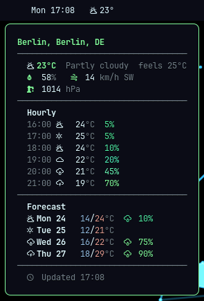 |

| Ristretto | Nord | Kanagawa |
|:---:|:---:|:---:|
| 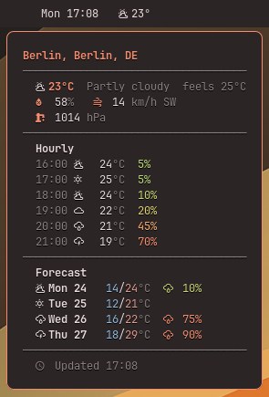 | 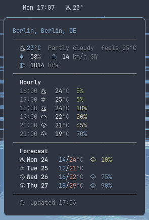 | 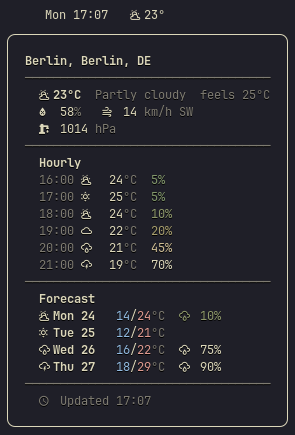 |

And so does the Omarchy panel:

| Flexoki Light | Rosé Pine | Hackerman |
|:---:|:---:|:---:|
| 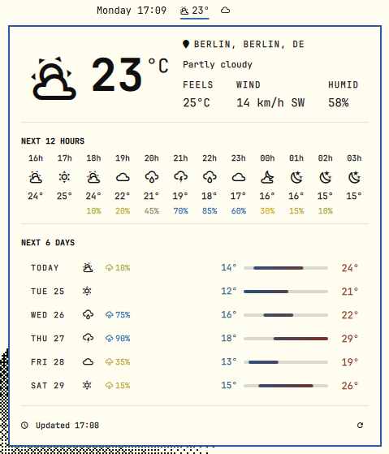 | 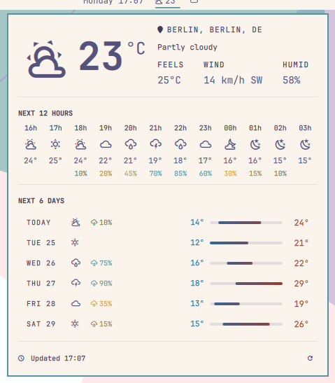 | 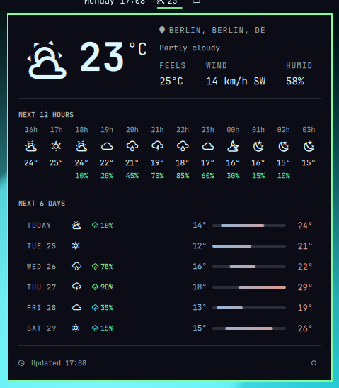 |

| Ristretto | Nord | Kanagawa |
|:---:|:---:|:---:|
| 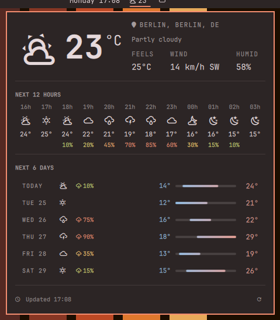 | 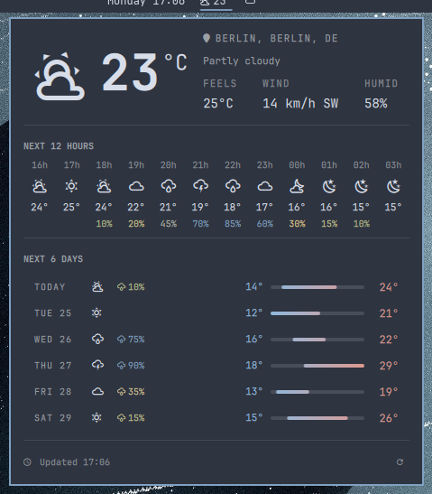 | 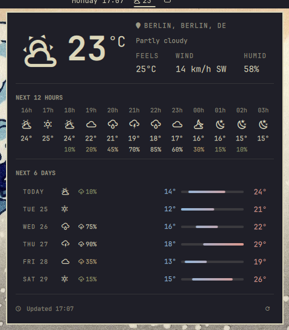 |

> [!NOTE]
> **Upgrading?** Two things look different now.
> Theme detection did not work correctly before: meteobar read the pre-4.x Omarchy path and needed a legacy `color1` key. Thus every tooltip quietly used the built-in palette. Now you get your real theme colors.
> The tooltip showed the rain probability in three steps, but now it uses a smooth ramp that agrees with the panel.

## Tooltip font

The tooltip is pinned to a monospace font. That is not decoration: its rules are box-drawing characters, and in a proportional font one of those is nearly twice as wide as a letter. The tooltip then sizes itself to the rules, and a dead margin opens to the right of the text. Waybar draws the tooltip in a GTK window that ignores `font-family` from your CSS, so the markup is the only place this can be said.

The default is a **list** of families, tried in order:

```
JetBrainsMono Nerd Font, JetBrainsMono Nerd Font Mono, monospace
```

Pango falls through to the next name when one is not installed. Both families are fully monospaced — every glyph, icons included, advances 0.6 em — so the rules align the same with either. The difference is the drawn size of the icons: the `…Mono` family shrinks them to fit the cell, about 40% smaller. The non-Mono family draws them at full size, and for that reason it comes first. The Arch package `ttf-jetbrains-mono-nerd` ships both families; `ttf-jetbrains-mono-nerd-basic` — the one Omarchy installs — ships only the non-Mono one.

To use a different font, name any monospace family (or your own list):

```bash
meteobar --tooltip-font "FiraCode Nerd Font Mono"
```

> [!NOTE]
> **`--frame` and `--frame-font` are deprecated.** `--frame` drew the tooltip as a bordered card. It is still accepted, so an existing Waybar config keeps working, but it now does nothing; `--frame-font` is an alias for `--tooltip-font`.
>
> The box was a second way of drawing the same content — more code, more documentation, more screenshots — and it only lined up when the pinned font was a complete Mono Nerd Font. Pinning the font on the one remaining tooltip gives the alignment without the box.

## Monochrome mode

`--no-color` removes the color markup. The value is optional, so one option covers every combination:

| Command | Bar text | Tooltip |
|---|---|---|
| *(none)* | colored | colored |
| `--no-color` or `--no-color=all` | plain | plain |
| `--no-color=bar` | plain | colored |
| `--no-color=tooltip` | colored | plain |

A [`NO_COLOR`](https://no-color.org) environment variable with a value that is not empty does the same as `--no-color=all`. An explicit option on the command line has priority over the environment variable. `--no-color=bar` therefore still paints the tooltip.

meteobar removes the color only. The icons, the box, the alignment, and the bold text all stay. The structured JSON output does not change at all.

<p align="center">
  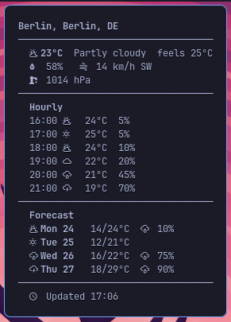
  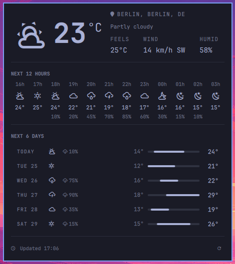
</p>

Because the CSS classes stay, monochrome mode is also the way to style the bar entirely from your own stylesheet:

```bash
meteobar --no-color --location "Berlin"
```

```css
/* your palette, your rules */
#custom-meteobar { color: #d0d0d0; }
#custom-meteobar.stormy { color: #bf616a; }
```

> [!NOTE]
> The bar text of meteobar never had colors of its own, because Waybar styles it from CSS. `--no-color=bar` therefore has nothing to remove today. The value exists so that the option means the same thing in every widget of the family.

In the Omarchy plugin, the `colorMode` setting does the same. A monochrome panel draws in the foreground color and a dimmed foreground only.

## Structured JSON output

`--output json` prints raw data for other frontends. There is no markup, no color, and no layout, because the frontend decides how to draw the data. The Omarchy plugin reads this format.

```bash
meteobar --output json --location "Berlin" --days 6 --hours 12
```

```json
{
  "schema_version": 1,
  "error": null,
  "location": "Berlin, Berlin, DE",
  "units": { "temperature": "°C", "wind_speed": "km/h", "pressure": "hPa" },
  "icon_set": "nerd",
  "cache": { "fetched_at": "2026-08-20T16:00:00+02:00", "stale": false, "stale_reason": null },
  "palette": {
    "text": "#a9b1d6",
    "dim": "#62667e",
    "accent": "#7aa2f7",
    "temp_cold": "#90b9df",
    "temp_warm": "#df9a90",
    "precip_ramp": [
      { "pct": 0, "color": "#9ece6a" },
      { "pct": 30, "color": "#e0af68" },
      { "pct": 60, "color": "#7aa2f7" }
    ]
  },
  "current": {
    "temperature": 23.4,
    "feels_like": 24.6,
    "humidity_pct": 58.0,
    "wind_speed": 14.0,
    "wind_direction_deg": 225.0,
    "wind_direction": "SW",
    "pressure": 1014.0,
    "precipitation": 0.0,
    "weather_code": 2,
    "is_day": true,
    "icon": "󰖕",
    "description": "Partly cloudy",
    "condition": "cloudy"
  },
  "hourly": [
    { "time": "2026-08-20T16:00", "temperature": 24.0, "weather_code": 2, "is_day": true, "icon": "󰖕", "description": "Partly cloudy", "precip_pct": 5 }
  ],
  "daily": [
    { "date": "2026-08-20", "temperature_min": 14.0, "temperature_max": 24.0, "weather_code": 2, "icon": "󰖕", "description": "Partly cloudy", "precip_pct": 10, "sunrise": "2026-08-20T05:56", "sunset": "2026-08-20T20:31" }
  ]
}
```

Notes on the shape:

- `error` is `null`, or an object with a `message` and an optional `code`.
- `cache.stale` is `true` when the fetch failed and meteobar served the last data it had. `cache.stale_reason` then gives the cause.
- `palette` carries the colors the core resolved from your theme. `precip_ramp` gives each stop a position, so a frontend can interpolate between the stops.
- Both frontends select the same entries: `hourly` starts at the hour in progress, and every entry carries the `is_day` flag that decides its icon.

> [!IMPORTANT]
> meteobar always exits with code 0 and prints valid JSON, even when the fetch fails or an option is wrong. A bar widget that exits with an error makes a hole in your bar.

## How it works

1. Resolve the location, from `--location`, from `--lat`/`--lon`, or by IP with [ipwho.is](https://ipwho.is/).
2. Get the forecast from [Open-Meteo](https://open-meteo.com/), which is free and needs no API key.
3. Keep the response in the cache for 60 seconds. The cache key holds the location, the units, and the number of days and hours. Thus, two different commands never read the same data.
4. Print the Waybar JSON, or the structured JSON.

## Troubleshooting

| Symptom | Cause | Fix |
|---|---|---|
| The bar shows `?` | The fetch failed | Read the tooltip. It gives the error message |
| The wrong city | The name is ambiguous | Use `"City, Province"` or `"City, CC"` |
| No output at all | The location did not resolve | Check the spelling, then try `"City, Country"` |
| Old data | The network is not available | meteobar serves the last forecast it has, and marks it stale in the JSON |
| Squares instead of icons | No Nerd Font | Install a [Nerd Font](https://www.nerdfonts.com/), or use `--icons emoji` |
| The tooltip columns are ragged | The pinned font is not monospace | Name a monospace family with `--tooltip-font`, or leave the default. Render in your own font |
| The panel does not change after you edit a file | The shell holds QML in its cache | Run `omarchy restart shell` |

## Related

- [claudebar](https://github.com/mryll/claudebar) — Claude AI plan usage
- [codexbar](https://github.com/mryll/codexbar) — OpenAI Codex subscription usage
- [logibar](https://github.com/mryll/logibar) — the battery of Logitech devices
- [printbar](https://github.com/mryll/printbar) — any printer: supplies, trays and queue
- [tickerbar](https://github.com/mryll/tickerbar) — prices of crypto, stocks, indices, commodities and forex
- [Omarchy](https://github.com/basecamp/omarchy) — the Linux setup for these widgets
- [Waybar](https://github.com/Alexays/Waybar) — the status bar for Wayland
