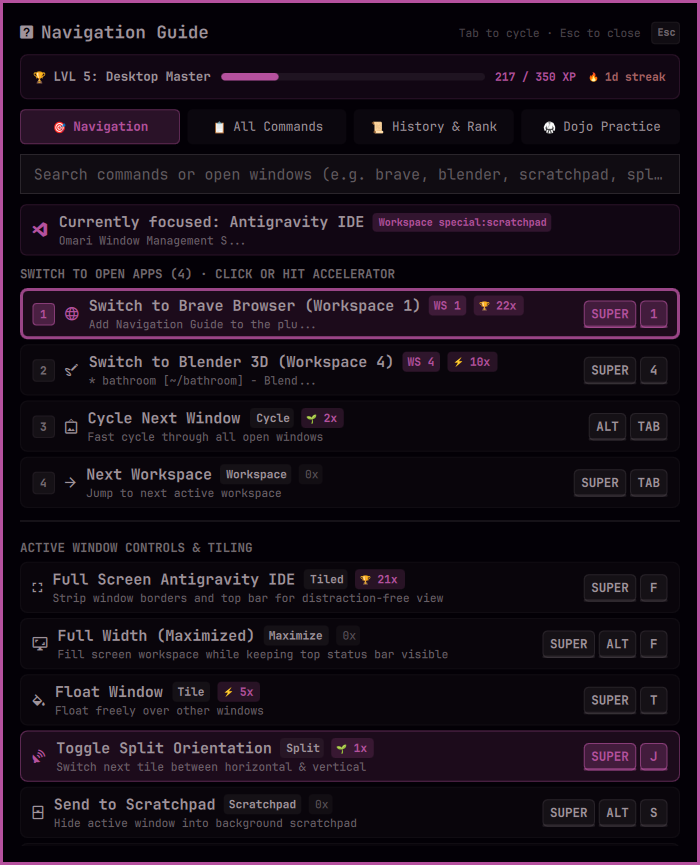

# Super+K Alternative 🧭

[](https://omarchy.org)
[](https://opensource.org/licenses/MIT)
[](https://hyprland.org)

An enhanced replacement for Omarchy's standard `SUPER + K` window that makes it easy for anyone to learn, practice, and master system keybindings.

Instead of displaying a static text cheatsheet, it actively suggests shortcut combinations based on **whatever you currently have open on your computer**, helping you navigate faster and build real keyboard muscle memory.

<p align="center">
  
</p>

---

## ✨ Key Features

* 🎯 **Smart Context Suggestions**: Suggests relevant shortcut combinations tailored to your active apps and open windows in real time.
* 🧠 **Learn & Build Muscle Memory**: Displays the exact physical keys to press, training your hands rather than making you rely on mouse menus.
* 🔍 **Instant Shortcut Search**: Find any Omarchy keybinding in seconds with auto-focused instant search.
* 📈 **Skill & Progress Tracking**: Tracks your keybinding usage and streaks as your shortcut capabilities improve.
* 🎨 **Native Theme Matching**: Seamlessly blends into your Omarchy desktop, matching your active colors and styling automatically.

---

## 🚀 Quick Install

Install and enable the plugin with a single command:

```bash
omarchy plugin add https://github.com/infinitegithub/omarchy-nav-guide.git --enable --yes
```

That's it! The plugin **automatically takes control of `SUPER + K`** upon launch — zero configuration or manual file editing required.

> **Tip:** The classic Omarchy keybindings cheatsheet is automatically preserved and available on `SUPER + SHIFT + K`.

---

## 🎮 Controls

| Shortcut | Action |
| :--- | :--- |
| `SUPER + K` | Toggle Super+K Alternative window |
| `Type` | Instant search across all commands |
| `Down` / `Up` | Select suggestion |
| `Enter` | Execute selected action |
| `Tab` | Cycle views |
| `Esc` | Close window |
| `SUPER + SHIFT + K` | Classic Omarchy keybindings list |

---

## 💾 Data & State Storage

Super+K Alternative stores its minimal local state under `~/.local/state/omarchy/`:
* `nav-guide-windows.json`: Ephemeral live window cache for instantaneous HUD loading.
* `nav-guide-stats.json`: Local shortcut usage statistics and mastery streak counter.
* `nav-guide-keybindings.json`: Cached system keybinding registry.

### Uninstallation

To restore standard Omarchy keybindings and remove the plugin:

```bash
~/.config/omarchy/plugins/nav-guide/bin/unregister-keybind
omarchy plugin remove nav-guide
rm -f ~/.local/state/omarchy/nav-guide-*
```

---

## 📄 License

Distributed under the [MIT License](LICENSE).  
Copyright © 2026 Es Sadik Sanhaji.
