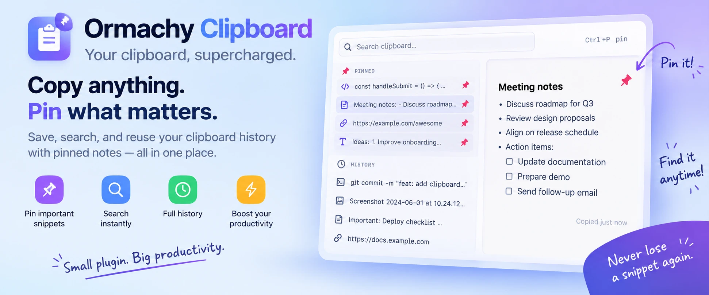

# Omarchy Clipboard



A local clipboard-history overlay for [Omarchy](https://omarchy.org/). It is
opened with `Super+V` and lets you search, pin, copy, paste, or remove recent
clipboard entries.

## Requirements

- Omarchy with Quickshell plugin support
- Standard Omarchy clipboard tools (`wl-clipboard`, Python 3, Perl, and coreutils)

## Install

```bash
omarchy plugin add https://github.com/htrnguyen-labs/omarchy-clipboard.git --enable --yes
```

Add this to `~/.config/hypr/bindings.lua`:

```lua
hl.unbind("SUPER + V")
o.bind("SUPER + V", "Clipboard manager", "omarchy-shell shell toggle nguyenn.clipboard")
o.bind("SUPER + SHIFT + V", "Clipboard manager", "omarchy-shell shell toggle nguyenn.clipboard")
```

Hyprland reloads the configuration when the file is saved. If the plugin does
not appear immediately, run:

```bash
omarchy-shell shell rescanPlugins
```

## Usage

- `Super+V` or `Super+Shift+V`: open or close history
- Type to filter; use Up/Down and Enter to select and paste
- `Shift+Enter`: copy the selected entry without pasting
- `Ctrl+P`: pin or unpin the selected entry
- `Delete`: remove the selected entry
- `Escape`: close the overlay

## Features

- Search clipboard history
- Pin entries, separate them from history, and reorder them from the context menu
- Paste, copy, open, or remove an entry
- Store text and image clipboard entries
- Ignore clipboard data marked sensitive by the source application

## Data and privacy

History and pinned entries stay on the local machine:

```text
~/.local/state/omarchy/clipboard-history.json
~/.local/state/omarchy/clipboard-pinned.json
~/.local/state/omarchy/clipboard-images/
```

The plugin does not send clipboard data over the network. Clear the history
from the overlay when it is no longer needed.

Clipboard state is capped at 256 KiB, text entries at 64 KiB, images at 2 MiB,
and the image store at 32 MiB. State is written through a no-follow directory
FD using private permissions, `fsync`, and atomic rename; orphaned images are
removed after history updates. Writable group/other path components are
rejected before state is read or written. QML caps raw child-process output;
finite jobs and persistent watchers run under bounded `timeout` process groups.

## Update

```bash
omarchy plugin update nguyenn.clipboard --yes
```

## Removal

```bash
omarchy plugin remove nguyenn.clipboard --yes
```

Remove the two `Super+V` bindings added during installation. To restore the
built-in clipboard plugin, run:

```bash
omarchy plugin enable omarchy.clipboard
```

## Development

Validate the plugin after making a change:

```bash
omarchy plugin validate ~/.config/omarchy/plugins/nguyenn.clipboard
./test_state.py
node test_stream_guard.js
```

## License

MIT. The plugin includes Omarchy-derived code; see [LICENSE](LICENSE).
