# Examples

The entries below are historical examples made with Omagen v1. For the current
v2 product gallery, see [Product examples](product/examples/README.md).

Each example pairs the source wallpaper with the generated Omagen desktop
result. The pair makes the image-to-theme transformation easy to compare:

~~~text
wallpaper → generated theme
~~~

## Quattro Rules — made with Omagen v1

This example uses an Audi Quattro sunset wallpaper and the generated
`quattro-rules` theme preview.

| Source wallpaper | Generated theme |
| --- | --- |
|  | 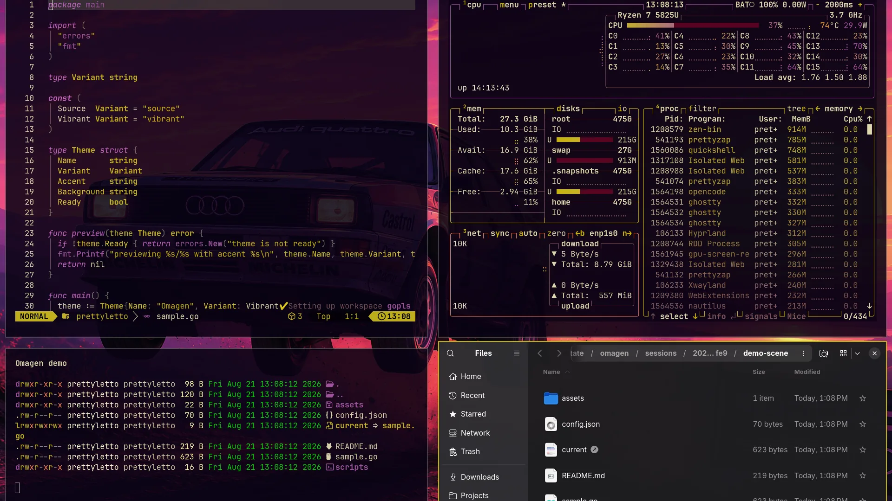 |

## Ushinawareta — 失われた — made with Omagen v1

This example uses a neon anime wallpaper and shows the generated theme with
animated border and high-contrast shell styling.

| Source wallpaper | Generated theme |
| --- | --- |
| 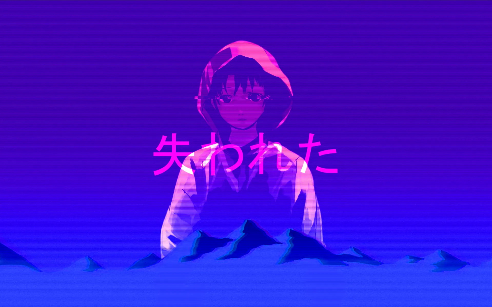 | 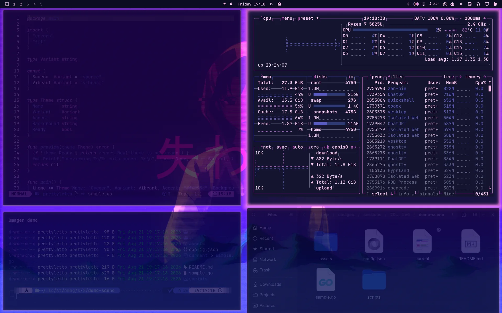 |

## Kanaawesome — Kanagawa Waves — made with Omagen v1

This example uses a Kanagawa-style wave wallpaper and shows the generated
theme across the Demo workspace.

| Source wallpaper | Generated theme |
| --- | --- |
| 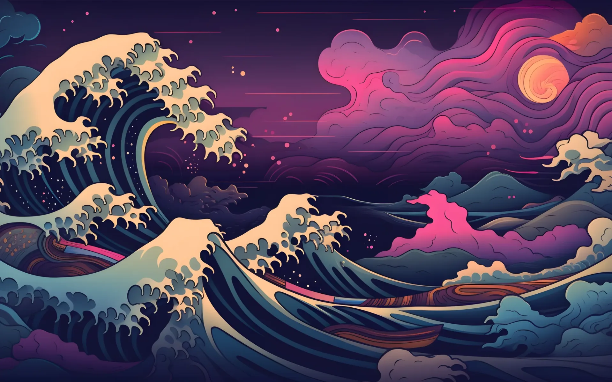 | 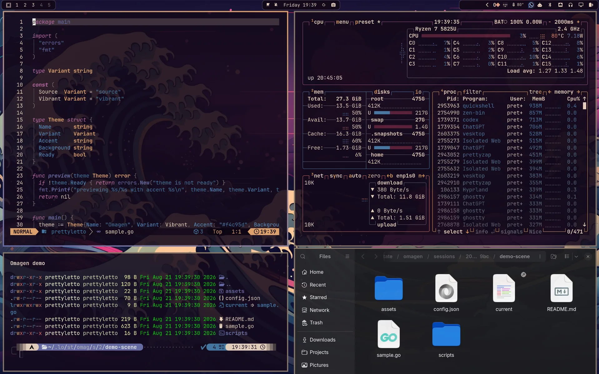 |

## NieR:Automata — made with Omagen v1

This example uses a NieR:Automata-inspired 2B sunset wallpaper and shows the
generated theme across the Demo workspace.

| Source wallpaper | Generated theme |
| --- | --- |
|  | 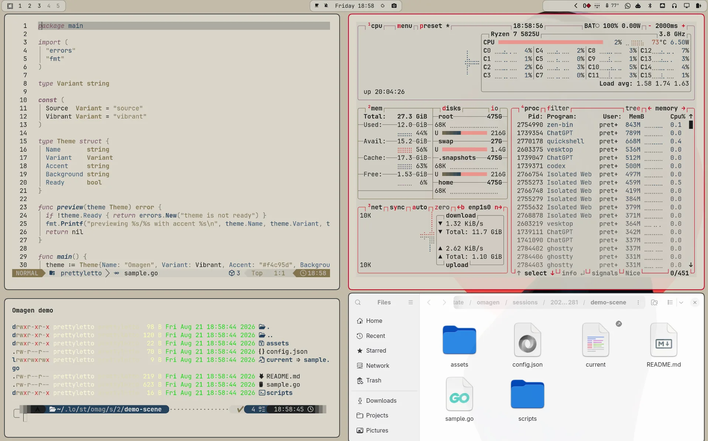 |

## Neon District — made with Omagen v1

This example uses a neon city wallpaper and shows the generated theme across
the Demo workspace.

| Source wallpaper | Generated theme |
| --- | --- |
| 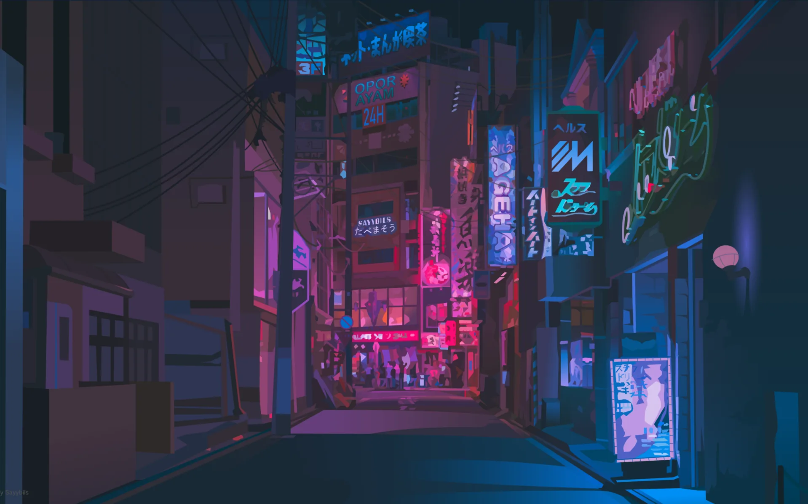 | 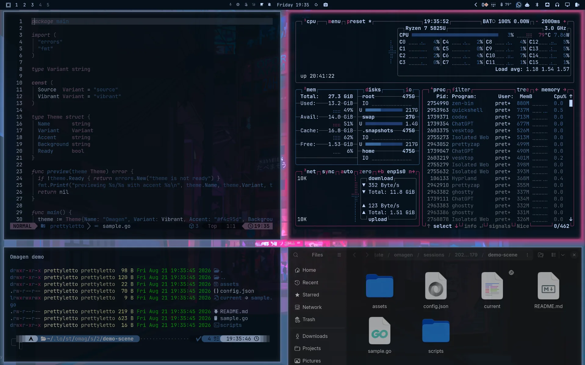 |

## Quiet Platform — made with Omagen v1

This example uses a green railway-platform wallpaper and shows a quieter
translucent desktop treatment across the Demo workspace.

| Source wallpaper | Generated theme |
| --- | --- |
| 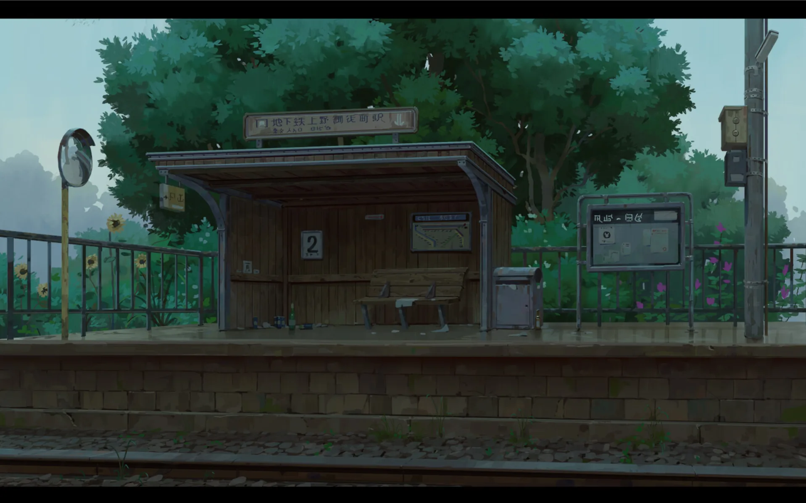 | 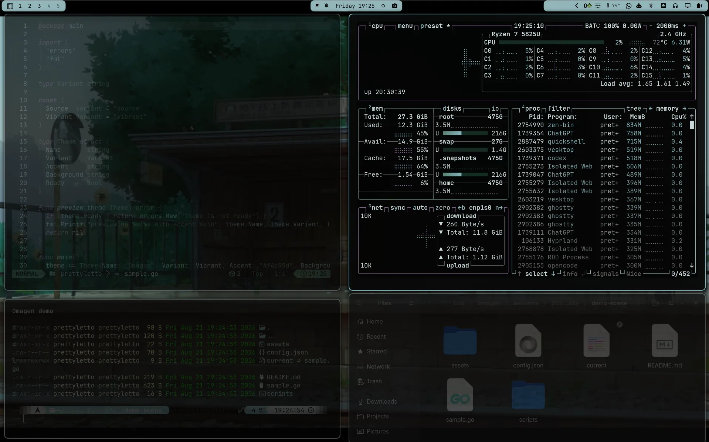 |

## Sakura Gate — made with Omagen v1

This example uses a cherry-blossom mountain-gate wallpaper and shows the
generated theme across the Demo workspace.

| Source wallpaper | Generated theme |
| --- | --- |
|  | 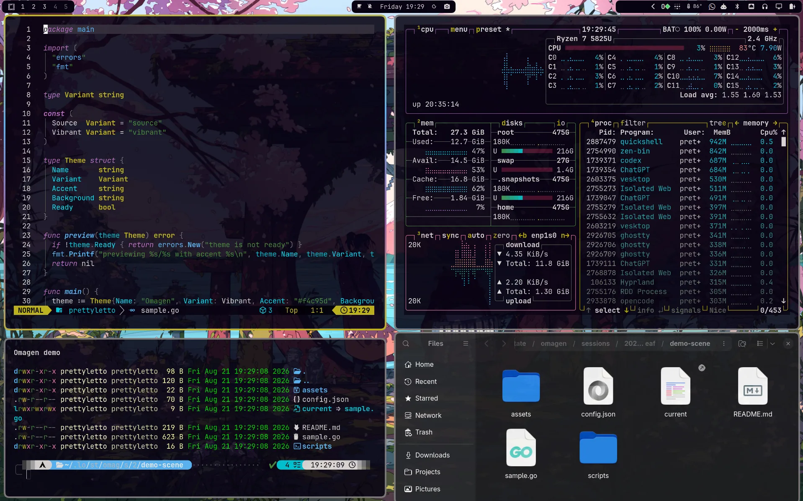 |

## Eva Deep — made with Omagen v1

This example uses a pink-and-blue Evangelion-inspired wallpaper and the
generated `eva-deep` desktop preview.

| Source wallpaper | Generated theme |
| --- | --- |
| 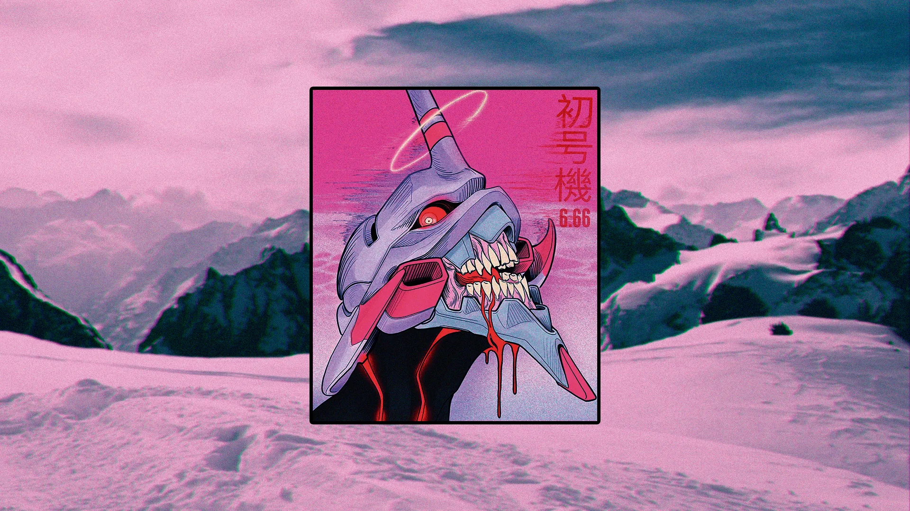 | 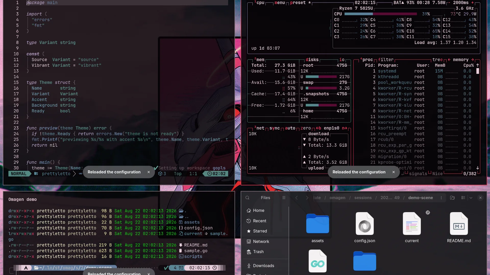 |

More generated themes will be added to this gallery as new wallpaper/theme
pairs are captured.
