# Getting started

Omagen is designed to take you from an image to a usable Omarchy theme in a
few deliberate steps. You can stop at any preview stage without committing the
result to your permanent themes.

## Requirements

- Omarchy Quattro
- Hyprland
- Quickshell
- Linux x86_64 for the bundled backend

Omagen detects optional Demo applications at runtime. A missing editor,
terminal, monitor, or file manager does not prevent theme generation; a useful
fallback is selected instead.

## Install

Install the stable repository with Omarchy's plugin manager:

```sh
omarchy plugin add https://github.com/prettyletto/omagen.git --enable --yes
```

This installs the Omagen suite without requiring Go. The core overlay and the
optional full-bar package remain separate in Omarchy's registry so the native
Quattro bar is not replaced unexpectedly.

## First launch

1. Open the Omagen widget from the Quattro bar.
2. Choose an image.
3. Review the six palette directions.
4. Select a direction and open Live Canvas.
5. Use **Test live**, **Demo**, or **Apply theme**.

Choose **Fast** for the shortest path. Choose **In-depth** when you want to
shape Window, Shell, Bar, Animation, or Look & Feel behavior before applying.

## Visual setup walkthrough

The following walkthrough shows the complete setup path using one source image
on workspace 5. It is a product tour, not a requirement to follow every step:
choose an image, select a workflow, generate a palette, preview the result,
open optional styling and Demo surfaces, then finish or restore the session.

### 1. Open setup and choose an image

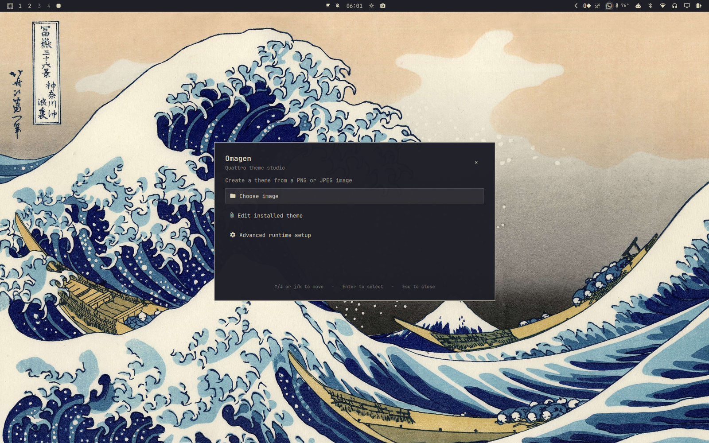

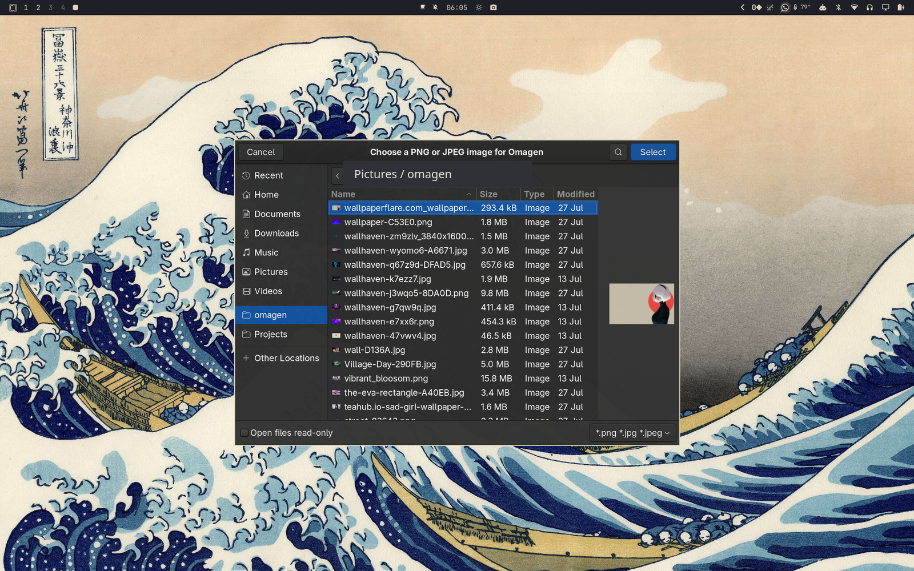

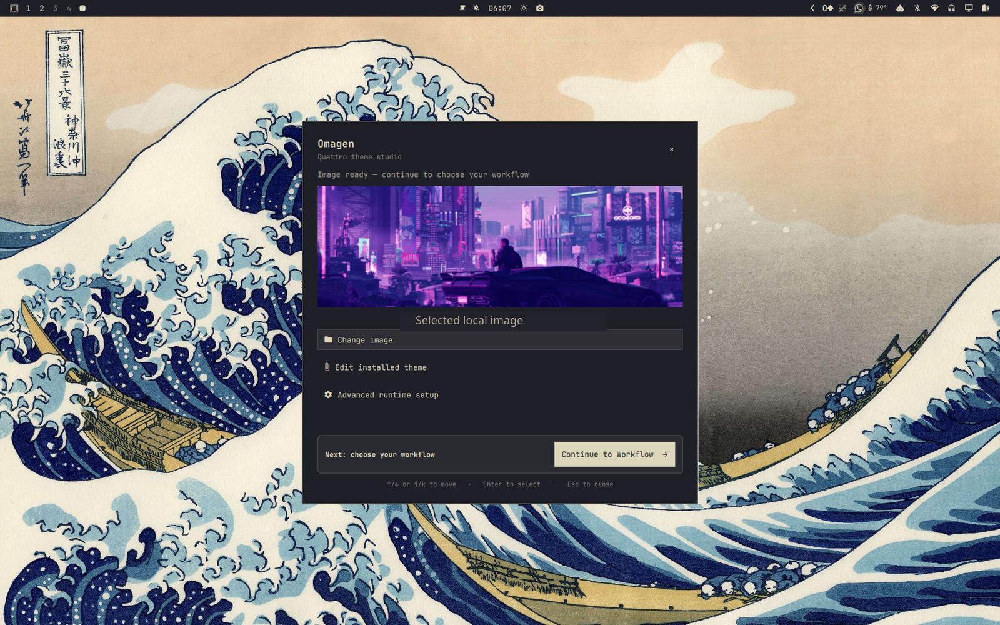

### 2. Choose a workflow and palette direction

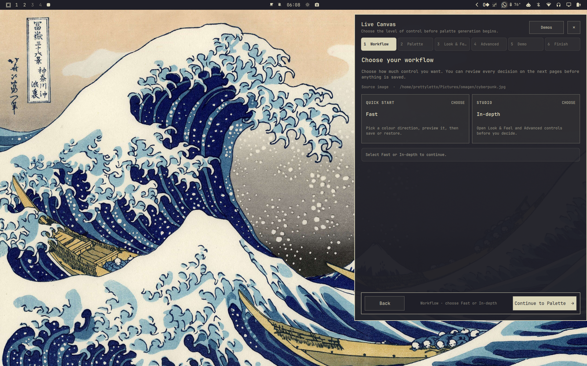

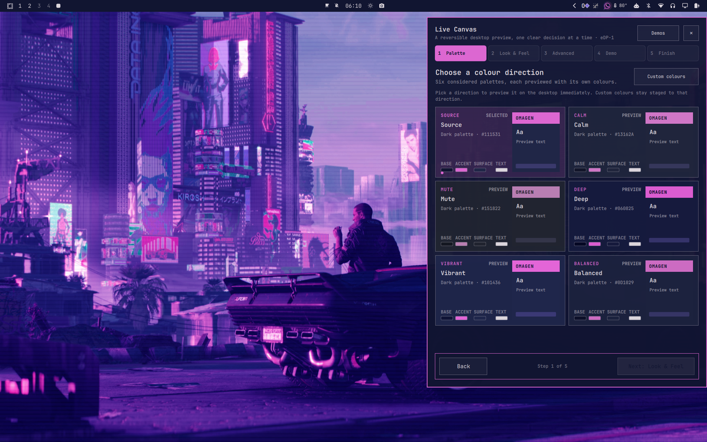

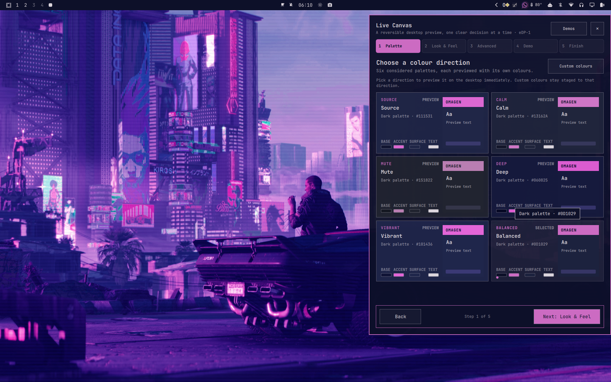

### 3. Preview optional styling

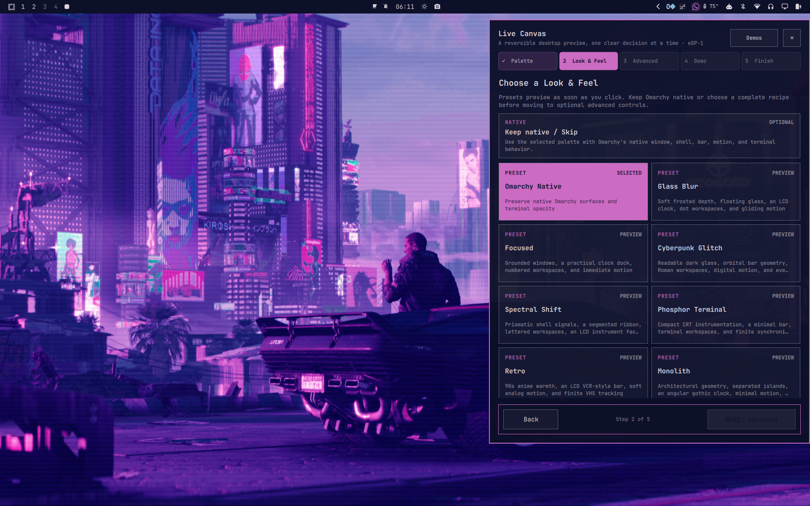

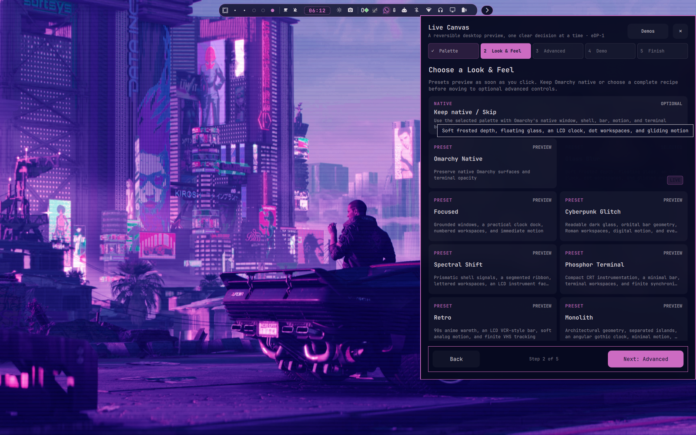

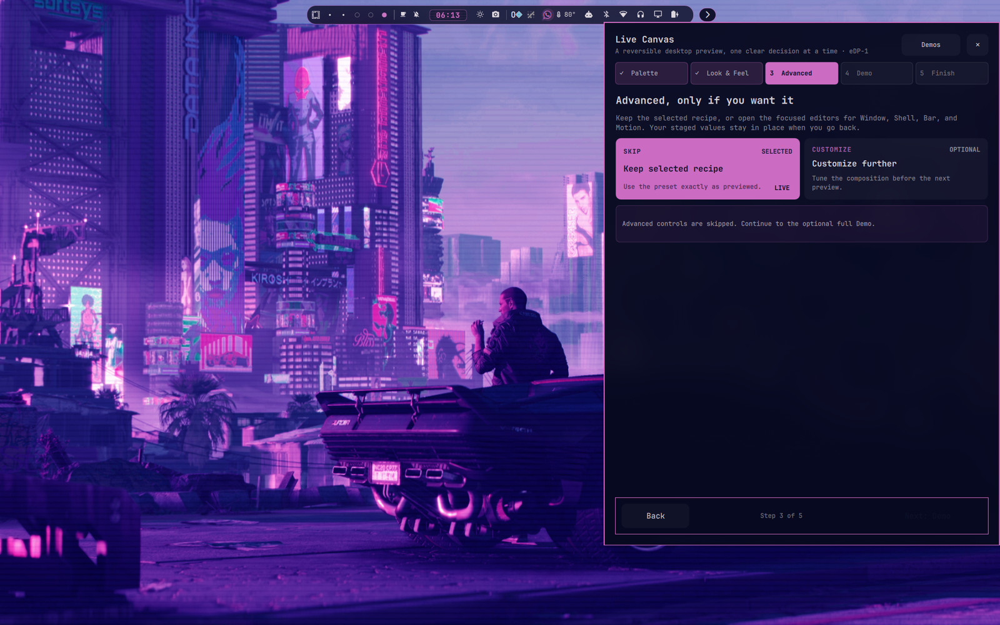

### 4. Inspect Demo and finish

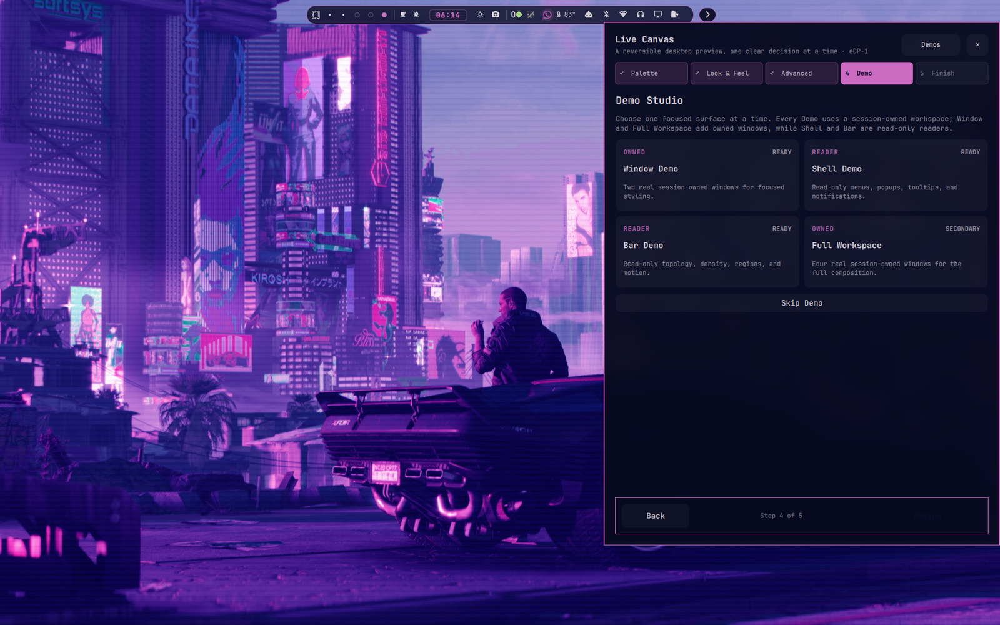

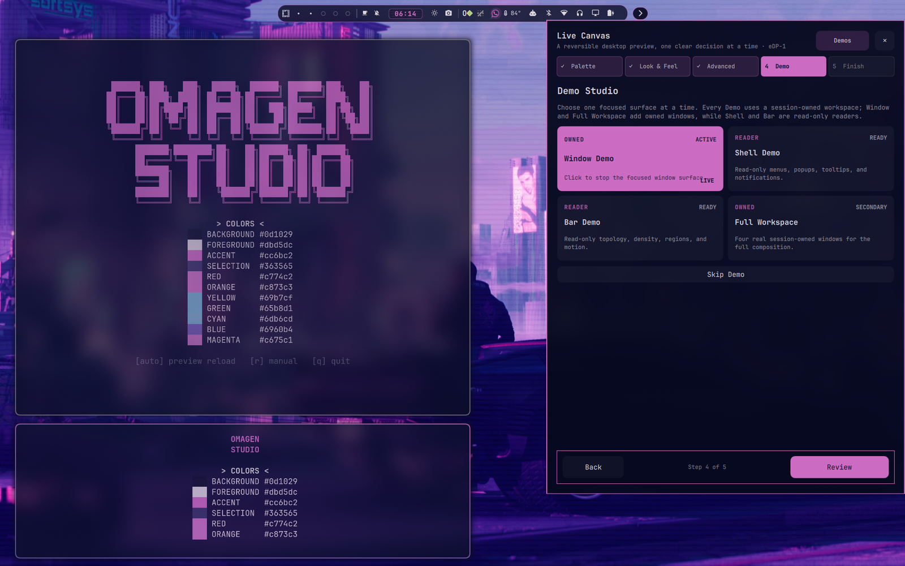

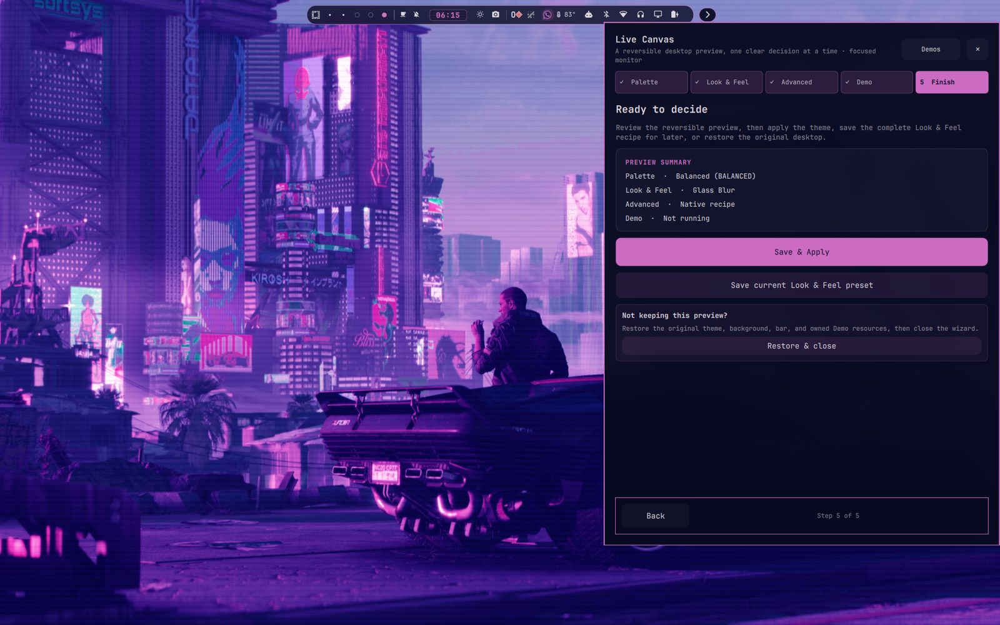

For the meaning of Preview, Test live, Demo, Apply, Cancel, and Quit, continue
with the [product workflow guide](workflow.md). For ownership and interrupted
sessions, see [recovery and rollback](recovery.md).

## Remove

```sh
omarchy plugin remove pretty.omagen --yes
omarchy plugin remove pretty.omagen.bar --yes
```

Permanent themes created by the user are not removed with the plugins. If an
active session exists, use [recovery](recovery.md) before removing anything.

For exact-commit tester installation and developer checkout workflows, see the
[developer installation guide](../development.md).
