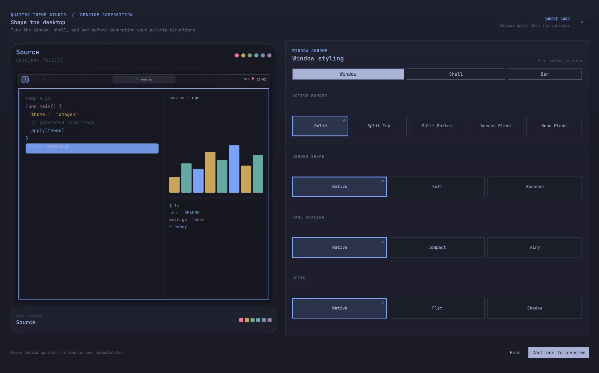
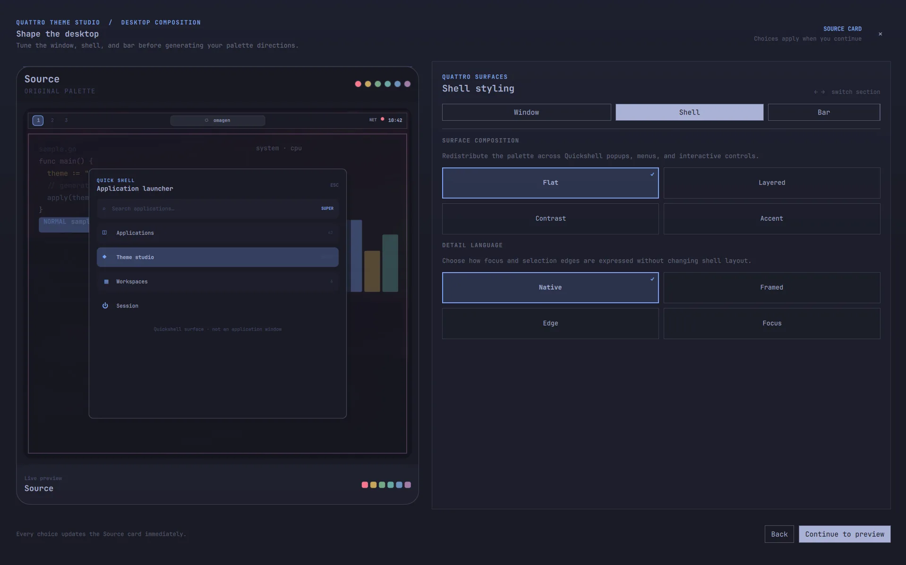

# Usage

Omagen is the complete renewed image-to-theme workflow for Omarchy Quattro. It
is designed as a short loop:

~~~text
image → palette directions → live preview or Demo → permanent theme
~~~

For a visual tour of the complete workflow, watch the [Omagen video
walkthrough on YouTube](https://youtu.be/juDJe0zWwZI).

## Open Omagen

Click the Omagen widget in the Quattro bar to open the theme studio. The
widget is installed in the right bar section by default and can be moved with
Omarchy's normal bar controls.

Right-click the widget for:

- **Open** — open the theme studio.
- **Settings** — edit palette harmony and contrast preferences.
- **Quit** — close Omagen and restore an active temporary session when one
  exists.

The overlay also supports outside-click dismissal, a close button, arrow-key
navigation, and <code>h/j/k/l</code> navigation. Use <code>Enter</code> or <code>Space</code> to
activate the focused action and <code>Escape</code> to close the current surface.

On the first open, Omagen shows a short optional setup screen before the image
chooser. **Enable & continue** installs only two user-owned files: the
theme-set hook at <code>~/.config/omarchy/hooks/theme-set.d/omagen-theme-set</code>
and the runtime state at <code>~/.local/state/omagen/advanced-runtime.json</code>.
It does not require sudo, install packages, or change the current theme. Choose
**Use native mode** to skip the bridge; image generation and reversible previews
remain available, while advanced Window, Shell, Bar, and Animation activation
stays disabled. You can reopen **Advanced runtime setup** from the setup screen
at any time, or follow the prompt shown when an advanced theme is applied
without the bridge.

## Unified theme activation

Installation also provides <code>~/.local/bin/omagen-theme-set</code> (or the
configured <code>$XDG_BIN_HOME</code>) as the single user-facing activation
command. It validates Omagen's runtime manifest before routing a generated
advanced theme through the atomic Studio driver; all ordinary or malformed
markers use native <code>omarchy theme set</code> instead. Repository-installed
themes keep Omarchy's native executable-file and symlink staging protections.
The installer never replaces an existing non-Omagen command with that name.

<p align="center">
  
</p>

Settings persist the harmony and contrast preferences used by later palette
generations. Reset defaults is available when you want to return to the
baseline values.

## Choose an image

The setup screen starts with **Choose image**. Omagen accepts common raster
formats supported by its image decoder, including PNG, JPEG, GIF, BMP, TIFF,
and WebP. The selected image is used for palette extraction and remains the
source shown in the preview cards.

After choosing an image, choose a workflow:

- **Fast** keeps the path focused on the six palette directions, Live Canvas
  Preview, optional Full Demo, and Apply.
- **In-depth** adds Look & Feel plus the Window, Shell, Bar, and Animation
  composition controls before you decide; see [Styling and palette settings](styling.md).

<p align="center">
  
</p>

## Configure extra desktop styling

When **In-depth** is selected, the Live Canvas wizard exposes composition
controls after the six palette directions are generated. Choose a Look & Feel
recipe, then open **Advanced, only if you want it** and move between the four
editors:

- **Window** controls the active border, a Default/None/1–24 px border slider, five fixed
  corner-shape presets, pane spacing, shadow depth, and independent active/inactive
  Frosted backdrop profiles (with Soft dim or Shadow · Preserve transparency
  for inactive windows).
- **Shell** controls surface composition, focus/detail language, and tooltip or
  notification feedback surfaces.
- **Bar** exposes a preset, named size modes, and pane treatments (Preset
  default, Opaque, Metal, Glass, and Clear), plus an expandable advanced size control
  showing the resolved pixel footprint with a preset-specific usable minimum.
  Native Quattro layout behavior remains preserved; Glass uses a scoped
  compositor layer rule rather than a fake QML blur.
- **Bar Demo** opens an interactive reader surface below the real native bar.
  It shows the selected preset and size without replacing the native bar or
  capturing its widget input.
- **Animations** controls window, workspace, and border motion plus reduced motion.

Every choice is staged in the current session. Palette cards and Look & Feel
recipes use Preview to apply the selected candidate to the Live Canvas. Use
**Test Live** on the Advanced page to apply staged Window, Shell, Bar, and
Animation values to their native runtime owners; custom palette colours preview
as they are edited. Tested values become part of the generated preview and
applied theme.

### Look & Feel recipes

Look & Feel recipes are named compositions of those same Advanced controls,
not a parallel styling implementation. The authored catalog contains Glass
Blur, Focused, Cyberpunk Glitch, Spectral Shift, Phosphor Terminal, Retro,
Monolith, Elastic Orbit, Nature, Oriental, Gothic Cathedral, and Acid Pulse; Omarchy
Native remains a protected no-op baseline. Oriental is the Kanagawa-inspired
recipe: Japanese Kanji workspace labels, a compact floating bar, warm frosted
windows, and quiet directional motion without a screen shader. Gothic Cathedral
uses ceremonial framing and stained-glass depth, while Acid Pulse uses reactive
spinning borders and a segmented chemical-instrument bar.
Each recipe also carries its workspace presentation. Cyberpunk retains its
existing 4 px neon/digital/RGB-tear behavior and Roman workspace labels. Retro
uses an LCD-style bar, soft analog motion, and a bounded VHS tracking signal
with tape wobble, chroma bleed, scanlines, and restrained noise.

Spectral Shift, Phosphor Terminal, and Retro use finite Hyprland screen shaders. The
Advanced Animations page exposes effect family, Low/Medium/Strong intensity,
duration, and event triggers. Effects restore the previously configured screen
shader and stop redrawing after their event envelope; Reduced Motion disables
them.

Recipes can be exchanged through the strict versioned JSON manifest contract:

```sh
omagen look-feel export nature > nature.omagen-recipe.json
omagen look-feel import nature.omagen-recipe.json
```

Import currently validates and resolves the recipe without installing hooks or
executing downloaded code. Community manifests reference bounded built-in
effect IDs rather than embedding arbitrary shader source.

## Fast and advanced theme paths

Omagen-generated themes have two runtime paths:

- **Fast** writes the native Omarchy theme files, including `colors.toml` and
  the supported shell settings. It never requires an Omagen runtime bridge.
- **Advanced** records an `omagen.runtime.json` marker alongside the native
  files. Omarchy still applies the native files first. The first time Omagen
  applies an advanced theme without the bridge, it keeps that native result and
  shows a notification explaining how to enable the complete theme.

Enabling advanced themes is an explicit, user-consented setup action. It
installs only a user-owned theme-set hook under
`~/.config/omarchy/hooks/theme-set.d/` and Omagen state under
`~/.local/state/omagen/`; it does not modify package-owned Omarchy files. A
theme can always continue to use its native colors and shell behavior without
the bridge.






## Explore palette directions

Omagen generates six directions from the same source image:

- **Source** — the closest representation of the extracted palette.
- **Calm** — a quieter, less aggressive interpretation.
- **Mute** — a more restrained version with reduced intensity.
- **Deep** — a darker, more atmospheric direction.
- **Vibrant** — a stronger, more expressive direction.
- **Balanced** — a middle-ground interpretation between source character and
  usability.

Select a card to make it the active direction. The gallery can be navigated
with the arrow keys or <code>h/j/k/l</code> and activated with <code>Enter</code> or <code>Space</code>.

Omagen applies semantic contrast processing to the generated palette before
it reaches the gallery, so the preview represents the palette that will be
used by the generated theme rather than an earlier intermediate result.

<p align="center">
  
</p>

## Enter Live Canvas

Activate a palette card with a click or with **Enter** to enter Live Canvas.
Omagen applies the selected direction temporarily through the Studio theme
driver and opens the Live Canvas control surface while keeping the real desktop
available. This is the palette **Preview** path: the temporary theme and the
original theme/background are tracked by the active Omagen session.

Arrow-key navigation only changes the focused direction. It does not mutate the
desktop until the direction is activated. Reopen Omagen from the bar to choose
another direction while the canvas is active; the new candidate is applied in
place without recreating the workspace.

The **Live Canvas** action applies a direction and opens the control surface;
it does not start the optional Full Demo workspace. **Test Live** is the
explicit action for staged Advanced edits, while palette colour edits preview
immediately.

Live preview requests are single-flight. If another direction or style is
chosen while one is applying, Omagen keeps the newest request and drops stale
intermediate requests so Quickshell does not replay each intermediate desktop
state.

Use **Cancel** when you are finished testing. Omagen restores the original
theme and background before clearing the session.

## Use the Live Canvas

**Live Canvas** applies a direction to the real desktop and keeps the
monitor-bound control panel available. It is the normal place to compare
directions, apply the theme, or restore the original desktop.

Use **Demos** in the Live Canvas header, or open the **Demo Studio** step, to
choose the focused Window Demo, the read-only Shell or Bar reader, or the
temporary four-window Full Workspace containing the applications Omagen can
resolve on the current machine. Starting a Demo does not end the preview
session.

Only one Demo surface is active at a time. Omagen closes the current owned
surface before switching to another one. Window Demo previews the current
staged composition before opening its windows. Bar Demo is rendered below the
real native bar and does not replace Quattro's widgets or capture their input.

When the canvas is open, Studio provides a monitor-bound side panel. Hide the
panel to keep interacting with the desktop; a small handle on the canvas
monitor reopens it without capturing application input while hidden. The panel
can reapply directions, apply the theme, close the canvas, or **Restore & close**
the complete temporary session. See the
[Live Canvas workspace guide](demo.md) for ownership and cleanup details.

## Apply a theme

Choose **Save & Apply** to open the save dialog. Enter a name for the permanent
Omarchy theme and choose any optional outputs:

- **Generate unlock screen** creates Plymouth unlock artwork and its preview.
- **Capture live Demo preview** uses the loaded Demo workspace as the theme's
  <code>preview.png</code>.

Choose **Save & Apply** to publish the generated theme and select it through
Omarchy. Apply is staged so an interrupted operation can be recovered; see
[Recovery and safety](recovery.md).

## Cancel, Quit, and recovery

Cancel from the gallery restores the original desktop. Closing the overlay is
not the same as abandoning the session: Omagen keeps the durable session state
until the session is applied, canceled, or recovered.

If a previous session is found on the next launch, Omagen shows **Recover
Omagen**. Choose **Restore & close** to restore the original theme and
background, or **Resume** when the generated workspace is still available.
