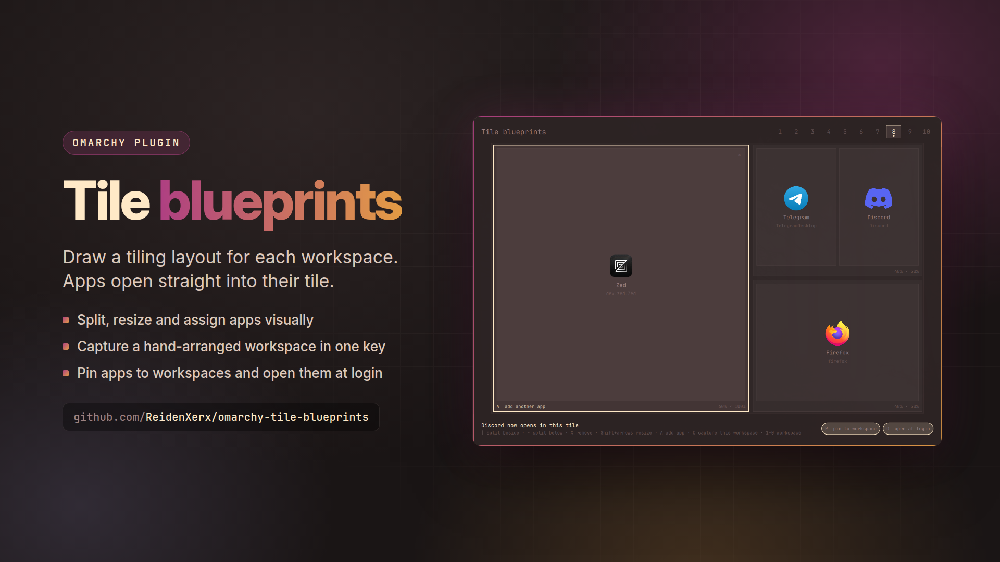

# Tile blueprints



An [Omarchy](https://omarchy.org) editor for **per-workspace tiling layouts**. Draw the tiles
for a workspace, say which app lives in each one, and from then on those apps open
straight into their tile at the proportions you set.

A workspace you have already arranged by hand becomes a blueprint in one key: **capture**
reads the real window sizes and turns them into tiles.


## Install

```bash
omarchy plugin add https://github.com/ReidenXerx/omarchy-tile-blueprints.git --enable
```

Bind the editor to a key in `~/.config/hypr/bindings.lua`. `SUPER + ALT + L` is free on
a stock install, next to `SUPER + L` (layout toggle):

```lua
o.bind("SUPER + ALT + L", "Tile blueprints", "omarchy-shell shell toggle reidenxerx.tile-blueprints '{}'")
```

To add its entries to the Omarchy menu as well:

```bash
~/.config/omarchy/plugins/reidenxerx.tile-blueprints/bin/tile-blueprints-menu-install
```

It needs Hyprland 0.56 or newer (Lua config, Lua layouts), plus `/usr/bin/python3` and
`/usr/bin/hyprctl`.

## Use

The editor opens on the workspace you are on, drawn in your screen's proportions.

| key | does |
|---|---|
| `\|` | split the selected tile side by side |
| `-` | split it top and bottom |
| `X` / `Del` | remove the tile; its neighbours take the space |
| `Shift` + arrows | make the tile wider, narrower, taller, shorter |
| drag a divider | set the split with the mouse |
| arrows / `hjkl`, `Tab` | select a tile |
| `A` / `Enter` / double-click | add an app to the tile (running apps first) |
| `Backspace`, or an app's `×` | take the last app out, or that one |
| `C` | **capture**: build the blueprint from the windows on this workspace |
| `P` | pin: the apps always open on this workspace |
| `O` | open these apps at login |
| `1`–`9`, `0` | edit another workspace |
| `Ctrl` + `S` | save and apply |
| `Ctrl` + `Del` | clear this workspace's blueprint |
| `Esc` | close (twice if there are unsaved changes) |

Saving applies at once: Hyprland reloads, and running apps that belong elsewhere move to
their workspace.

## How windows are placed

- **Every app has one tile.** A window goes to the tile that lists its app. Adding an app
  to a tile takes it out of any other.
- **Empty tiles collapse.** A tile whose app is not open gives its space to its
  neighbours, so an unused slot never leaves a hole. The space comes back when the app
  opens.
- **Unlisted windows share the largest tile.** Several windows in one tile split it evenly
  along its longer side.
- **Workspaces without a blueprint are untouched** and keep whatever layout they had.

## How it works

`Ctrl+S` writes your blueprints to `~/.config/omarchy/tile-blueprints.json`, then generates
`~/.local/state/omarchy/workspace-layouts/zz-tile-blueprints.lua`. Omarchy already loads
every file in that folder on each Hyprland start and reload, so **your hypr config is never
edited**. The generated file:

- registers a Lua layout, `lua:tile-blueprints`, that places windows by the blueprint
  ([Hyprland's Lua layout API](https://github.com/hyprwm/Hyprland/tree/main/example/layouts));
- sets that layout on each workspace that has a blueprint;
- with **pin** on, adds a window rule per app so it opens on its workspace;
- with **open at login** on, starts each app through its desktop entry
  (`uwsm-app -- gtk-launch …`), the way Omarchy's launcher does.

## Worth knowing

- **Pinning is per app, not per window.** Pin a terminal to workspace 3 and every new
  window of that terminal opens there. Leave pin off for apps you open everywhere.
- **Mouse-resizing a window snaps back.** On a blueprint workspace the blueprint owns the
  proportions. Change them in the editor, or arrange by hand and capture again.
- **`SUPER + L` still works.** It switches the current workspace to dwindle or scrolling
  until the next reload, then the blueprint takes over again.
- **Capture sees tiled windows only.** Floating windows are left out, and windows that
  overlap in ways a tiling layout cannot produce share a tile.

## From the command line

```bash
tile-blueprints status     # what is configured, and what Hyprland is using
tile-blueprints apply      # regenerate, reload, arrange
tile-blueprints arrange    # just move running apps to their workspaces
tile-blueprints windows 2  # windows on workspace 2 as JSON (what capture reads)
tile-blueprints remove     # turn blueprints off (keeps your saved blueprints)
```

## Menu entries

A plugin cannot register menu routes itself, because Omarchy builds its menu from its own
file plus one user file. Opt in with:

```bash
bin/tile-blueprints-menu-install          # add them
bin/tile-blueprints-menu-install remove   # take them out
bin/tile-blueprints-menu-install print    # just show the snippet
```

This adds *Edit blueprints*, *Arrange apps now*, *Show blueprints* and *Turn blueprints
off*. The installer writes only between its own marker comments in
`~/.config/omarchy/extensions/omarchy-menu.jsonc` and leaves the rest of that file
untouched. It is safe to re-run, and it rolls back rather than leaving the file
unparseable, because a malformed menu file silently disables **every** user entry.

## Security

- **Trusted programs only.** The editor starts its helper as `/usr/bin/python3
  bin/tile-blueprints`. Everything the helper runs (`hyprctl`, `notify-send`,
  `omarchy-shell`) is a root-owned binary in `/usr/bin`, with a deadline, an output ceiling
  and `PATH=/usr/bin`; the login launches in the generated file name
  `/usr/bin/uwsm-app` and `/usr/bin/gtk-launch` by absolute path. The editor stops any
  helper that overruns (SIGTERM, then SIGKILL).
- **No payloads in argv.** Saving hands the blueprint document to the helper on stdin.
- **Files.** Reads and writes go through the vendored `bin/plugin_safety.py`: no symlinks
  followed, owner and type checks, size caps, random temporary files replaced atomically.
  System desktop entries are read only when they are root-owned regular files that really
  live under `/usr/share`, `/usr/local/share`, `/usr/lib` or `/var/lib/flatpak` (64 KB
  each, at most 3000 apps).
- **The blueprint file is untrusted input.** It is capped at 512 KB and normalized before
  any Lua is generated: workspaces 1–99 (at most 10), 64 tiles and 16 split levels per
  workspace, 32 apps per tile, class names up to 256 characters without control
  characters, desktop ids of `[A-Za-z0-9._+-]`, finite positive sizes. Strings enter the
  Lua file only as escaped literals (printable ASCII, every other byte as `\ddd`) and class
  regexes are escaped, so a hostile window class cannot break out of its string. Window
  addresses and workspace ids are checked before anything is dispatched.

## Remove

```bash
bin/tile-blueprints remove
bin/tile-blueprints-menu-install remove
omarchy plugin remove reidenxerx.tile-blueprints
rm -f ~/.config/omarchy/tile-blueprints.json
```

Also remove the key binding if you added one. Nothing else is left behind: the plugin runs
no daemon.

## License

MIT
