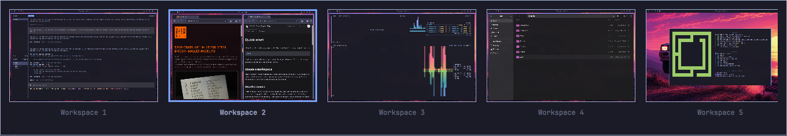

# Omarchy Workspace Switcher

A Mac-style visual workspace switcher for Omarchy. It presents occupied
Hyprland workspaces as cached visual previews in stable numeric positions,
uses the most-recently used workspace for a quick toggle, then moves left or
right through stable numeric positions while Command/Super is held. It
activates the selection when the modifier is released. A quick Command-Tab
switches without flashing the overlay; holding Command briefly reveals the
visual switcher with the current workspace selected.
Mouse hover provides a subtle visual rollover without changing the keyboard
selection, while clicking a preview activates that workspace.

Each workspace receives one in-memory screenshot shortly after it becomes
active. The switcher never records continuously and never writes previews to
disk. Until a workspace has been visited, its card uses a lightweight window
layout as a fallback.

To keep the always-loaded overlay bounded, it displays and retains previews for
at most 10 occupied workspaces, and uses at most 24 windows per workspace in
the fallback layout. When more than 10 workspaces are occupied, the current and
most recently used workspaces take priority.



> [!NOTE]
> This is a beta release. It is currently tested on Omarchy 4.0.2 with
> Hyprland 0.56.2 and Quickshell 0.3.1 on a 2011 MacBook Pro. Reports from
> other hardware, keyboards, display layouts, and Omarchy versions are very
> welcome.

## Install

```bash
omarchy plugin add https://github.com/cmyk/omarchy-workspace-switcher.git --enable
~/.config/omarchy/plugins/reomarchy.workspace-switcher/install.sh
```

The guided setup explains that it replaces Omarchy's immediate
`Super+Tab`/`Super+Shift+Tab` workspace cycling, checks for an existing manual
setup, asks for confirmation, backs up `~/.config/hypr/bindings.lua`, and adds
only a marked loader block. It reloads Hyprland and rolls the change back if
configuration validation or plugin enabling fails. The file update is locked,
no-follow, atomic, and flushed to disk before validation. The replacement is
an atomic exchange that is reverted if another tool replaced the file in the
meantime, and a durable transaction marker lets the next run finish or undo an
edit that was interrupted before validation completed. Binding files over 4 MiB
are refused, and the scan for an older manual setup is bounded by depth, entry
count, Lua file count, cumulative bytes, and elapsed time. Within a directory every
Lua file is inspected before the scan descends into that directory's
subdirectories. The walk is otherwise depth-first, so if one subtree exhausts a
budget, a later sibling subtree is not reached and its contents are missing from
the report. If any limit stops the scan, setup refuses to continue and says
which limit it hit: an incomplete scan cannot show that no manual setup exists,
and installing anyway would leave two sets of bindings behind. An incomplete
report therefore costs detail in the error message, never a second setup.

The scripts never resolve a command through the caller's `PATH`. They replace
`PATH`, `CDPATH` and `IFS` before running anything external, and derive their
own location with shell builtins rather than `dirname`. `hyprctl` and `omarchy`
are opened at their fixed `/usr/bin` locations and verified as root-owned
regular files in a root-owned directory; `hyprctl` is then executed through that
verified descriptor, and `omarchy` by its verified path, because it locates its
own subcommands relative to that path. Both run with a deadline, an output cap,
and an explicit allowlisted environment.

The transaction journals each phase durably and re-checks that `bindings.lua`
still names the published file before validation, plugin enabling, and commit.
After an interrupted run, recovery restores the binding file it owns but never
changes the plugin's enabled state: a crash cannot establish who last changed
it, so the state is reported instead. Pass `--yes` for non-interactive setup.

Setup refuses a Hyprland config directory or `bindings.lua` that is not owned by
you, or that is writable by group or other, because the transaction relies on
advisory locks and on no second writer outside your control.

Both scripts also unset `LD_PRELOAD`, `LD_AUDIT`, `LD_LIBRARY_PATH` and the
other loader variables before starting anything, so no command they run inherits
them, including `/usr/bin/env` itself, whose own environment `env -i` cannot
change.

Scope: the dynamic loader acts before the first line of either script, so a
library already preloaded into the launching shell cannot be unmapped from
inside the process it affects. The test suite measures exactly that with a real
preloaded library: it must appear in the launching shell and in nothing else.
Anyone who can set those variables in your environment can already run code as
you.

The test suite (`tests/setup.sh`) runs inside an unprivileged user namespace
and binds a mock `/usr/bin` over the real one, so it needs `unshare` with user
namespaces enabled. A C compiler is optional; when present the suite builds a
real preloaded library to measure the environment boundary.

For transaction safety, guided setup refuses a symlinked Hyprland config
directory or `bindings.lua`. If your dotfiles use symlinks, point
`XDG_CONFIG_HOME` at the real config root before running setup, or configure
the loader manually.

If you already installed the bindings documented by version 0.2.x, keep that
manual setup or remove its old Lua block before running `install.sh`.

## Update

```bash
omarchy plugin update reomarchy.workspace-switcher --yes
```

## Remove

```bash
~/.config/omarchy/plugins/reomarchy.workspace-switcher/uninstall.sh
```

The removal helper deletes only its marked loader block, backs up and validates
the Hyprland configuration, then delegates plugin removal to Omarchy. Use
`--keep-plugin` to remove only the managed bindings.

## Compatibility reports

When reporting a problem, include the output of:

```bash
omarchy version
hyprctl version
quickshell --version
```

Please also mention whether you use an Apple or PC keyboard, your monitor
layout, and approximately how many occupied workspaces you had.

## Privacy

Workspace previews are captured only after a workspace becomes active. They
are kept in memory, are never continuously recorded, and are never written to
disk by the plugin. At most 10 preview frames are retained at once.

## License

[MIT](LICENSE)
