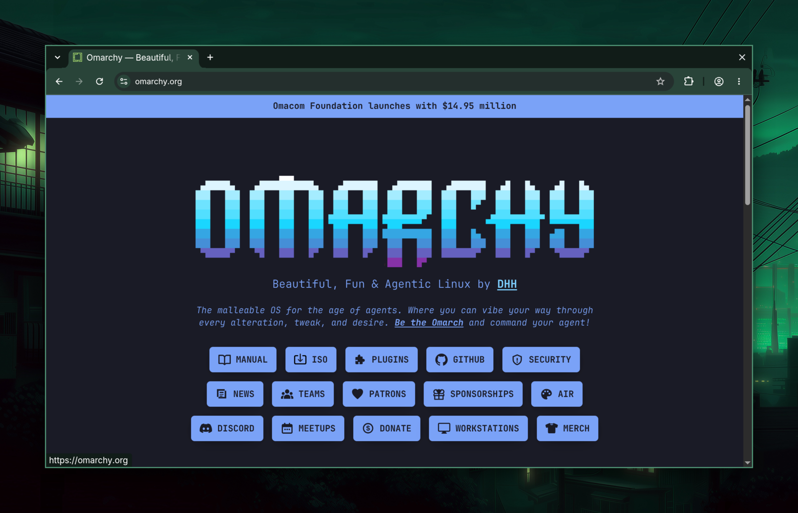
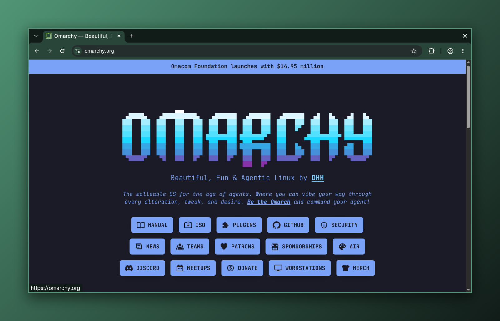
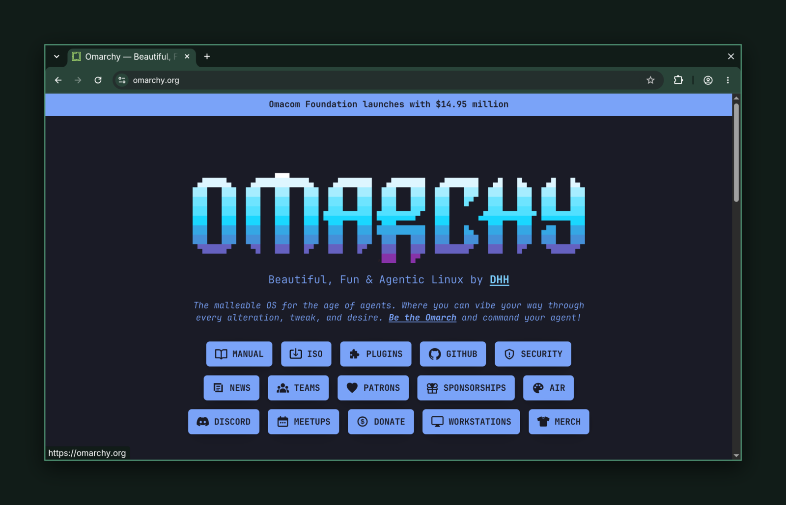

# omarchy-pretty-screenshot

An Omarchy plugin that replaces the stock screenshot with one styled to match
your theme: square corners, a themed border, a soft shadow, and a background
of your choosing: your wallpaper, a theme gradient, a solid theme color, or
none at all.

## Preview

Background `wallpaper` (the default):



Background `gradient` (theme accent → background):



Background `solid` (theme background color):



## What it does

The plugin takes over the PRINT key and the menu's `Capture → Screenshot`
row, so the screenshot you already know how to trigger becomes the styled
one. Turn "Pretty mode" off in the settings submenu and both fall straight
back to the stock, unstyled screenshot.

## Requirements

- Omarchy 4.x, for `omarchy-capture-screenshot`, `omarchy-theme-color`,
  `omarchy-notification-send`, `omarchy-launch-editor` and `hyprctl`
- ImageMagick (`magick`)
- `jq`
- `wl-copy`

All of the above are stock on Omarchy.

## What it touches

- Runs entirely as your user: no sudo, no network, no background process, and
  nothing written outside `$HOME` and your own runtime directory. The `Service.qml` entry point exists only
  to run the setup and teardown below. The plugin itself is a bash script plus
  menu rows.
- On enable, it appends a marked block to `~/.config/hypr/bindings.lua` that
  **unbinds the stock PRINT** (`hl.unbind("PRINT")`) and rebinds it to the
  plugin's script, falling back to the stock `omarchy-capture-screenshot` if
  that script is ever missing. Hyprland reloads the file by itself.
- On enable, it also inserts a marked block of rows into
  `~/.config/omarchy/extensions/omarchy-menu.jsonc`, just inside the top-level
  `{`. Those rows replace the stock `Capture → Screenshot` row's action and
  add a `Screenshot style` submenu; the `checked` guards call the script's
  `get <key>` against the config file each time the menu re-evaluates.
- Both blocks sit between `ricardosuman.pretty-screenshot (begin)` and
  `(end)` markers, and both are removed again when the plugin is disabled or
  removed. Nothing else in either file is touched, and a block is only ever
  written when it is missing, so enabling again changes nothing.
- The menu edit is checked against the shell's own JSONC rules before it is
  written. If the result would not parse, the file is left exactly as it was
  and a notification says so. Both files are rewritten in place, keeping their
  inode, so the shell's and Hyprland's watches on them survive.
- While it edits those files it holds a lock on a private directory of its
  own, `pretty-screenshot`, mode 700, inside `$XDG_RUNTIME_DIR` when that is
  really your runtime directory (yours, mode 700, not a symlink) and inside
  `~/.cache` otherwise. It never uses a shared `/tmp` name, and it refuses to
  run the setup if that directory is not a private directory of yours.
- Captures go through Omarchy's own `omarchy-capture-screenshot`, so the
  freeze/selection UI, cursor handling and `$OMARCHY_SCREENSHOT_DIR` /
  `$XDG_PICTURES_DIR` (default `~/Pictures`) behave exactly as stock. The raw
  capture is replaced by the styled `screenshot-pretty-<timestamp>.png` when
  `save_file` is on, and deleted otherwise.
- Writes the result to the Wayland clipboard with `wl-copy`; sends a
  notification via `omarchy-notification-send` whose click opens
  `$OMARCHY_SCREENSHOT_EDITOR` (default `tensaku-edit`), like stock.
- Reads (never writes): Hyprland options via `hyprctl getoption` /
  `hyprctl monitors`, the theme palette via `omarchy-theme-color`, the current
  wallpaper symlink under `~/.local/state/omarchy/current/background`.
- Config file: `~/.config/omarchy/pretty-screenshot.json` (created on first
  run; rewritten atomically by `set`/`toggle`).

## Install

From the plugin registry, with the repository URL:

```
omarchy plugin add https://github.com/ricardosuman/omarchy-pretty-screenshot.git --enable
```

That is the whole install. Enabling the plugin binds PRINT and adds the menu
rows on its own, with no restart and nothing to paste by hand, and sends a
notification once both are in place.

## Settings

The `Screenshot style` submenu (under `Capture`) toggles every setting
live, with a ✓ marking the current choice: `Background ▸ Wallpaper /
Gradient / Solid / None` and `Padding ▸ None / Small (40) / Medium (80) /
Large (120)`. Note: Omarchy evaluates menu guards asynchronously, so a ✓
reflects the state as of the *previous* time the menu was opened. Toggle
something, then close and reopen the menu to see the mark move.

The same settings live at `~/.config/omarchy/pretty-screenshot.json`, seeded
on first run:

```json
{
  "enabled": true,
  "background": "wallpaper",
  "padding": 80,
  "border": true,
  "shadow": true,
  "save_file": true
}
```

| Key          | Values                                          | Meaning                                                            |
| ------------ | ------------------------------------------------ | ------------------------------------------------------------------- |
| `enabled`    | `true` \| `false`                                | Pretty mode. `false` falls back to the stock screenshot untouched. |
| `background` | `wallpaper` \| `gradient` \| `solid` \| `none`   | `wallpaper`: current theme wallpaper. `gradient`: theme accent → background. `solid`: theme background color. `none`: no background canvas. |
| `padding`    | non-negative integer (px)                        | Background padding around the window.                              |
| `border`     | `true` \| `false`                                | Draw the theme's active border color/width around the window.      |
| `shadow`     | `true` \| `false`                                | Draw a soft drop shadow under the window.                           |
| `save_file`  | `true` \| `false`                                | Keep a PNG on disk. The clipboard is always updated regardless.    |

Edit the file directly, or use the script's own CLI:

```
omarchy-pretty-screenshot get <key>
omarchy-pretty-screenshot set <key> <value>
omarchy-pretty-screenshot toggle <key>
omarchy-pretty-screenshot --config
```

## Usage / CLI

```
omarchy-pretty-screenshot [smart|region|windows|fullscreen] [--input <png>] [--output <png>] [--background <mode>] [--no-save] [--no-copy]
omarchy-pretty-screenshot --setup
omarchy-pretty-screenshot --unsetup
```

The first form is what the PRINT key and the menu's `Screenshot` row run under
the hood, with no arguments (mode defaults to `smart`).

`--setup` and `--unsetup` are what the plugin's service runs for you when the
plugin is enabled and when it is disabled or removed: they add and remove the
keybind block and the menu block. If the "Pretty Screenshot is ready"
notification never came, run `--setup` yourself, or paste the contents of the
plugin's `omarchy-menu.jsonc` right after the opening `{` of
`~/.config/omarchy/extensions/omarchy-menu.jsonc`.

## How it works

The plugin captures with `omarchy-capture-screenshot`, then styles the result
with ImageMagick using values read live from Hyprland and the active theme.
Nothing is cached: switch themes and the next screenshot picks it up
automatically.

Border, padding and shadow are scaled using the focused monitor's scale
factor; a region captured on a different monitor with a different scale will
have those measurements off by that ratio.

## Uninstall

```
omarchy plugin remove ricardosuman.pretty-screenshot
```

That reverts both files on the way out: the keybind block leaves
`~/.config/hypr/bindings.lua` and the rows leave
`~/.config/omarchy/extensions/omarchy-menu.jsonc`. `omarchy plugin disable
ricardosuman.pretty-screenshot` does the same without deleting the plugin.

Running the script's `--unsetup` by hand is refused while the plugin is still
enabled in `~/.config/omarchy/shell.json`; disable or remove it instead.

## License

MIT
