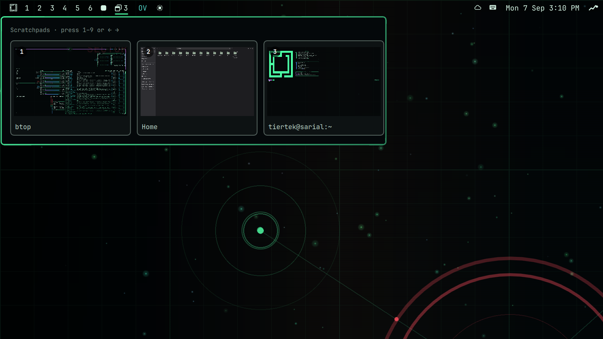

# Scratchpad Deck

A visual scratchpad switcher for the [Omarchy](https://omarchy.org) bar.

Omarchy gives you one scratchpad. This gives you nine, each with its own hotkey,
and a dropdown that shows you a **live picture of what is actually in them** —
so you pick the window you want by looking at it instead of remembering which
key you stashed it under.



## What it does

- **Live previews.** Every card is a real capture of the window hiding in that
  scratchpad, not an icon. It updates while the deck is open.
- **Nine scratchpads.** Each one is a Hyprland special workspace, each with its
  own hotkey. `Super+Ctrl+3` always goes to the same place.
- **Launcher slots.** Point a slot at a command and it becomes a card even when
  nothing is running. Press it and the app starts *into* that scratchpad.
- **Keyboard driven.** `1`–`9` jump straight to a scratchpad, arrows move,
  `Enter` opens, `Esc` closes.
- **Costs nothing when closed.** No capture runs while the dropdown is shut.

## Requirements

- **Omarchy 4.x** (Hyprland 0.56+). The plugin uses Hyprland's Lua dispatch API,
  which older releases do not have.
- **Quickshell 0.3+**, which ships with Omarchy. Previews need its
  `ScreencopyView`, backed by `hyprland-toplevel-export-v1`.

No other external dependencies — everything it calls (`hyprctl`, `qs`) is part
of a stock Omarchy install.

## Install

```bash
omarchy plugin add https://github.com/TIerTek/omarchy-scratchpad-deck --enable
omarchy restart shell
```

If the widget does not appear in the bar, enable it explicitly:

```bash
omarchy plugin enable tiertek.scratchpad-deck left
omarchy restart shell
```

### From a checkout

```bash
git clone https://github.com/TIerTek/omarchy-scratchpad-deck
cp -r omarchy-scratchpad-deck ~/.config/omarchy/plugins/tiertek.scratchpad-deck
omarchy-shell shell rescanPlugins
omarchy plugin enable tiertek.scratchpad-deck left
omarchy restart shell
```

## Uninstall

```bash
omarchy plugin disable tiertek.scratchpad-deck
omarchy plugin remove tiertek.scratchpad-deck --yes
omarchy restart shell
```

That removes the plugin and its bar entry. If you added the keybindings below,
also delete the block between the `-- BEGIN tiertek.scratchpad-deck` and
`-- END tiertek.scratchpad-deck` markers in `~/.config/hypr/bindings.lua`, then
`omarchy restart hyprland`. Any windows still parked in a scratchpad stay where
they are — reach them with Hyprland's own `toggle_special`, or just close them.

## Keybindings

The plugin ships a ready-made snippet. **Append** it to your user bindings file
and reload:

```bash
cat ~/.config/omarchy/plugins/tiertek.scratchpad-deck/hypr/scratchpad-deck.lua \
  >> ~/.config/hypr/bindings.lua
omarchy restart hyprland
```

It is a snippet rather than a drop-in file because Omarchy loads exactly one
user bindings file — `~/.config/hypr/bindings.lua`, via
`require("hypr.bindings")` — after its own defaults. That ordering is what lets
the snippet's `hl.unbind` calls replace stock bindings. A new `.lua` dropped
into `~/.config/hypr/` is not loaded unless you also require it from
`hyprland.lua`.

To remove them later, delete the block between the
`-- BEGIN tiertek.scratchpad-deck` and `-- END tiertek.scratchpad-deck` markers.

| Key | Action |
|---|---|
| `Super + S` | Open the deck |
| `Super + Ctrl + 1…9` | Show that scratchpad (press again to hide it) |
| `Super + Alt + S` | Send the focused window to scratchpad 1 |
| `Super + Alt + Ctrl + 1…9` | Send the focused window to a specific scratchpad |
| `Super + Ctrl + /` | Cycle to the next occupied scratchpad |

`Super + Ctrl + 1…9` is unclaimed in a stock Omarchy install — `Super + 1…n`
switches workspaces and `Super + Alt + 1…5` selects windows within a group.

The snippet rebinds Omarchy's stock `Super + S` and `Super + Alt + S`. That is
deliberate: those act on `special:scratchpad`, which the deck ignores — it only
tracks the numbered `special:scratch-1…9`. Leaving them alone means
`Super + Alt + S` stashes windows somewhere the deck cannot show you. Delete the
two `hl.unbind`/`o.bind` pairs if you would rather keep the built-in scratchpad
anyway; the numbered bindings work either way.

Everything is also reachable from the command line, which is what the bindings
call:

```bash
scratchpad-deck toggle      # open/close the deck
scratchpad-deck slot 3      # show scratchpad 3
scratchpad-deck send 3      # stash the focused window in scratchpad 3
scratchpad-deck next        # cycle
```

### In the deck

| Key | Action |
|---|---|
| `1`–`9` | Jump to that scratchpad |
| `←` `→` | Move the selection |
| `Enter` | Open the selected scratchpad |
| `Esc` | Close the deck |

Mouse: left-click a card to open it. On the bar glyph, left opens the deck,
middle cycles, right toggles the most relevant scratchpad, and the scroll wheel
cycles.

## Launcher slots

A slot with nothing in it normally shows no card. Declare one and it becomes a
launcher: the card is always there, and pressing it starts the app inside that
scratchpad.

Add a `slots` array to the widget's entry in `~/.config/omarchy/shell.json`:

```json
{
  "bar": {
    "layout": {
      "left": [
        {
          "id": "tiertek.scratchpad-deck",
          "slots": [
            { "slot": 1, "name": "Terminal", "command": "kitty" },
            { "slot": 2, "name": "Notes",    "command": "obsidian" },
            { "slot": 3, "name": "Music",    "command": "spotify" }
          ]
        }
      ]
    }
  }
}
```

| Field | Meaning |
|---|---|
| `slot` | 1–9. Which scratchpad this describes. |
| `name` | Label for the card while the slot is empty. A running window's own title takes over once something is in there. |
| `command` | What to launch when you press an empty slot. Omit it and the card is just a placeholder. |

Restart the shell after editing (`omarchy restart shell`).

## How it works

Each scratchpad is a Hyprland special workspace named `special:scratch-N`.
Showing one is a single `toggle_special` dispatch: Hyprland already swaps
cleanly when a *different* special workspace is visible, so switching between
scratchpads needs no hide-then-show bookkeeping.

The previews come from Quickshell's `ScreencopyView`, which on Hyprland uses
`hyprland-toplevel-export-v1`. That protocol renders a window on demand, which
means it works on windows that are sitting in a hidden workspace and have never
been displayed at all. No portal, no permission prompt.

Hyprland creates special workspaces on demand and destroys them the moment the
last window closes, so a slot's identity cannot live in the compositor. That is
what the declared `slots` list is for: it is what makes slot 3 still mean
"Music" when nothing is running.

## Known limitations

- **A hidden window's preview is its last drawn frame.** Wayland clients stop
  drawing when nothing is showing them, so a stashed window's preview is
  accurate as of the last time it rendered — not a live video feed. It catches
  up as soon as the app draws again.
- **Single-instance apps ignore the launcher slot.** If the app you point a slot
  at is already running (Nautilus, most GTK apps, browsers), a second launch is
  handled by the existing process and the new window ignores Hyprland's
  workspace rule, so it opens wherever you are instead. Launcher slots work best
  with apps that fork a fresh process, like a terminal.
- **A slot holding several windows previews only the first**, with a `+n` badge
  for the rest. Opening the slot shows them all, tiled, as Hyprland normally
  would.
- **Tested on a single-monitor AMD laptop with a horizontal bar.** Capture goes
  through the compositor rather than the driver, so other GPUs should behave the
  same; each monitor keeps its own special workspace and the deck acts on the
  focused one, so multi-monitor should be correct. Neither is verified. A
  vertical bar puts the card row on the narrow axis, where a deck with several
  scratchpads will be cramped. Reports welcome.

## Development

```bash
git clone https://github.com/TIerTek/omarchy-scratchpad-deck
cd omarchy-scratchpad-deck
node tests/test-slot-model.cjs      # slot logic
omarchy plugin validate .           # manifest
```

Slot logic lives in `SlotModel.js` as pure functions so it can be tested under
node; the QML only renders. When editing an installed copy, note that Omarchy
caches compiled QML — `omarchy restart shell` is required for any change to take
effect, even though the log claims the plugin was reloaded.

## Credits

Inspired by [nlboris/omarchy-scratchpad](https://github.com/nlboris/omarchy-scratchpad),
which puts a scratchpad occupancy indicator in the bar.

## License

MIT — see [LICENSE](LICENSE).
