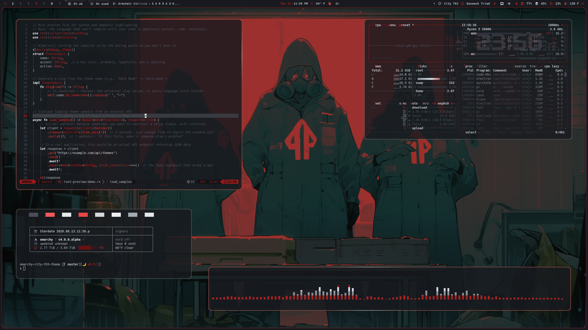
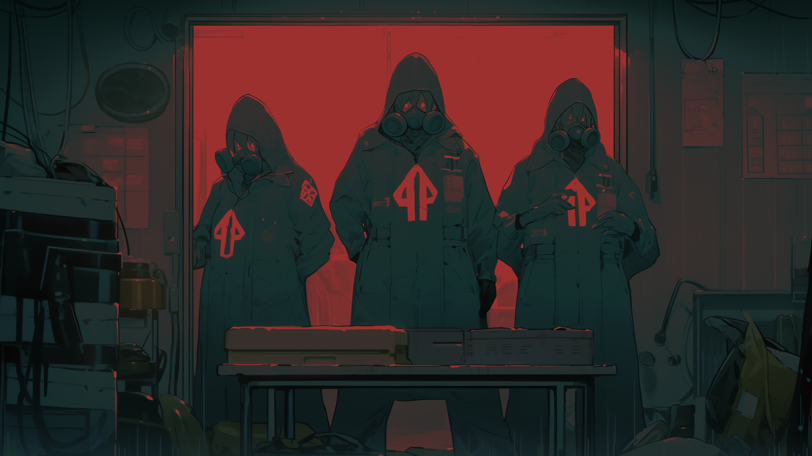
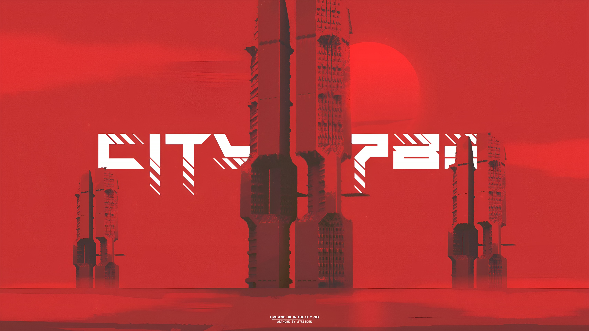
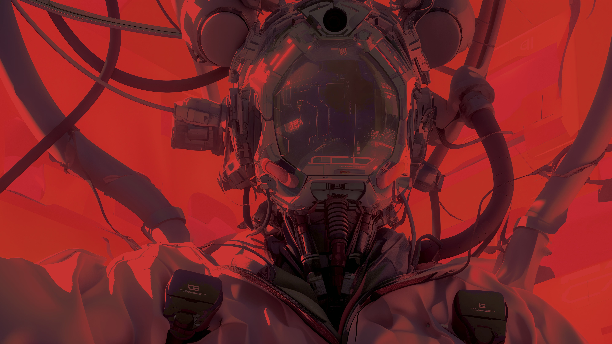
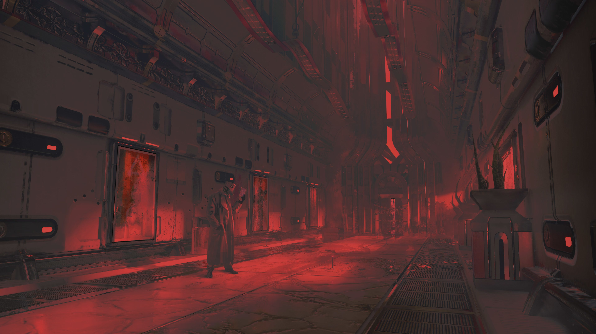
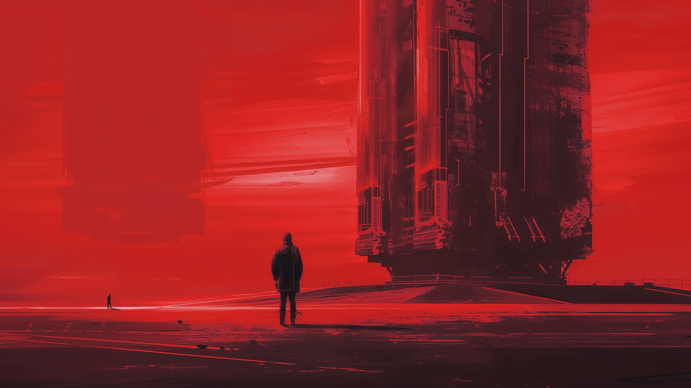
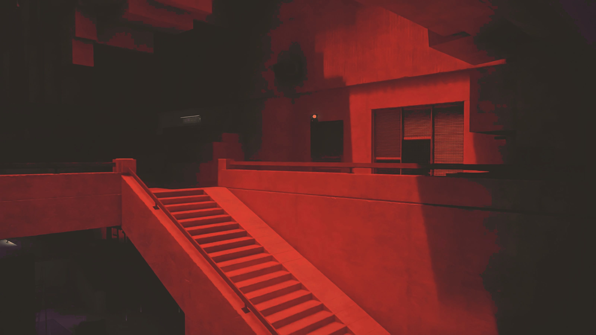

# Omarchy City-783 Theme

City-783 is a rain-black city theme: dark asphalt surfaces, cool gray text, and hard red signal accents. It is built to keep the desktop sharp and nocturnal without turning every surface into pure black.

## Preview



## Install

Use the Omarchy theme installer:

```bash
omarchy-theme-install https://github.com/OldJobobo/omarchy-city-783-theme
```

## What's Included

- Full Omarchy theme coverage for Hyprland, Hyprlock, GTK, Walker, Mako, SwayOSD, btop, Chromium, Steam, Vencord, Neovim, Aether, and Zed.
- Terminal palettes for Alacritty, Kitty, Ghostty, Foot, and Warp.
- Omarchy 4/quattro support through `colors.toml`, `shell.toml`, `hyprland.lua`, `gum_env.lua`, `helix.toml`, `pi.json`, `vscode-theme.json`, `keyboard.rgb`, and `hyprland-preview-share-picker.css`.
- Omarchy 3.8 compatibility is preserved through the existing app-specific files, including `hyprland.conf`, `waybar-theme/`, `wofi.css`, and the legacy terminal/theme configs.
- Base24 palette source in `city-783-base24.yaml`, with the older Base16-style `city-783.yaml` kept for compatibility.
- A custom Waybar theme directory with compact-state scripts and clock assets.

## Wallpapers

<table>
  <tr>
    <td></td>
    <td></td>
    <td></td>
  </tr>
  <tr>
    <td></td>
    <td></td>
    <td></td>
  </tr>
</table>

### Animated backgrounds

Optional animated wallpaper assets are included for third-party wallpaper tools:

- `backgrounds/clovis-bray-everdrift.3840x2160.mp4`
- `backgrounds/crimson-blind-faith.3840x2160.mp4`
- `backgrounds/cyberpunk-skull.3840x2160.mp4`

## Notes

- `city-783-base24.yaml` is the palette source of truth.
- The theme ships both Omarchy 4/quattro files and the Omarchy 3.8 compatibility set.

## Attribution

- Theme direction and palette: OldJobobo and J.S. Brown.
- Wallpaper creator metadata is not recorded in this repository; verified credit corrections are welcome.
