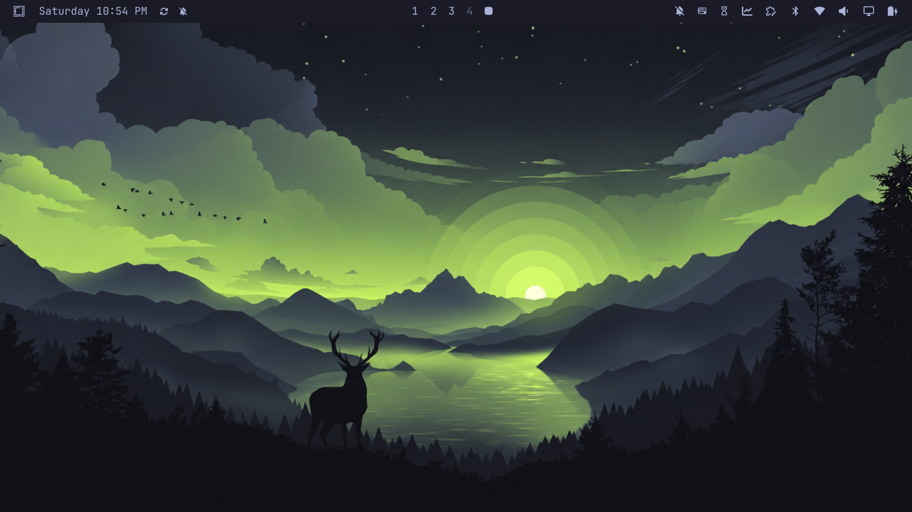
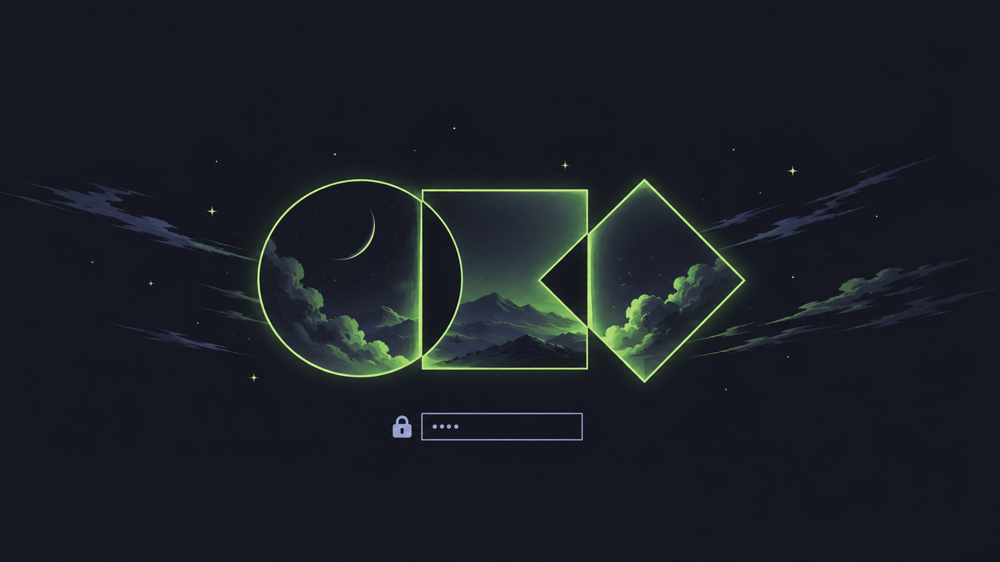

# Omarchy Signature Theme


A sleek, modern dark theme for [Omarchy](https://omarchy.org/) featuring deep Tokyo Night canvases paired with vibrant Omarchy Signature green accents.



---

## 🎨 Features

- **Palette**: Deep Tokyo Night canvas (`#1A1B26`) paired with Omarchy Signature Green (`#9ECE6A`).
- **Neovim & VS Code**: Out-of-the-box configuration matching Tokyo Night schemes.
- **Custom Lockscreen**: Styled lockscreen with included `unlock.png` and `preview-unlock.png`.
- **GTK Icons**: Configured for `Yaru-olive` icon theme.
- **RGB Keyboard**: Synced accent lighting `#9ECE6A`.
- **Wallpapers**: Curated collection of high-resolution backgrounds included in `backgrounds/`.

---

## 🚀 Installation

### Option 1: Via Omarchy Menu (Recommended)
1. Press `Super + Alt + Space` (or `Super + Space`) to open the Omarchy menu.
2. Navigate to **Install > Style > Theme**.
3. Paste the repository URL:
   ```text
   https://github.com/mshareef-git/Omarchy_Signature.git
   ```

### Option 2: Via Terminal
Run the Omarchy theme install command:
```bash
omarchy theme install https://github.com/mshareef-git/Omarchy_Signature.git
```

*Or manually clone to your themes directory:*
```bash
git clone https://github.com/mshareef-git/Omarchy_Signature.git ~/.config/omarchy/themes/Omarchy_Signature
```

---

## 🖼️ Lock Screen Preview



---

## 📂 Repository Structure

```text
├── backgrounds/         # Curated wallpapers
├── colors.toml          # 22-color palette definition for Omarchy
├── icons.theme          # GTK icon set configuration
├── keyboard.rgb         # Keyboard backlight hex color
├── neovim.lua           # Neovim colorscheme configuration
├── preview.png          # Theme switcher preview
├── preview-unlock.png   # Lock screen selector preview
├── shell.lock.toml      # Omarchy lockscreen styling
├── unlock.png           # Lockscreen visual asset
├── vscode.json          # VS Code theme reference
└── README.md            # Documentation & install guide
```

---

## 📄 License

Distributed under the MIT License.
