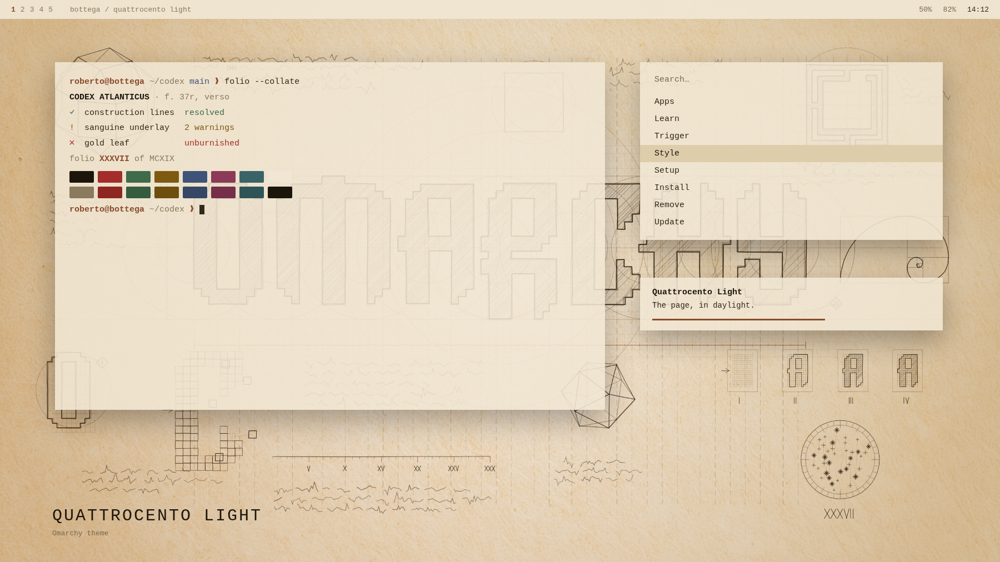
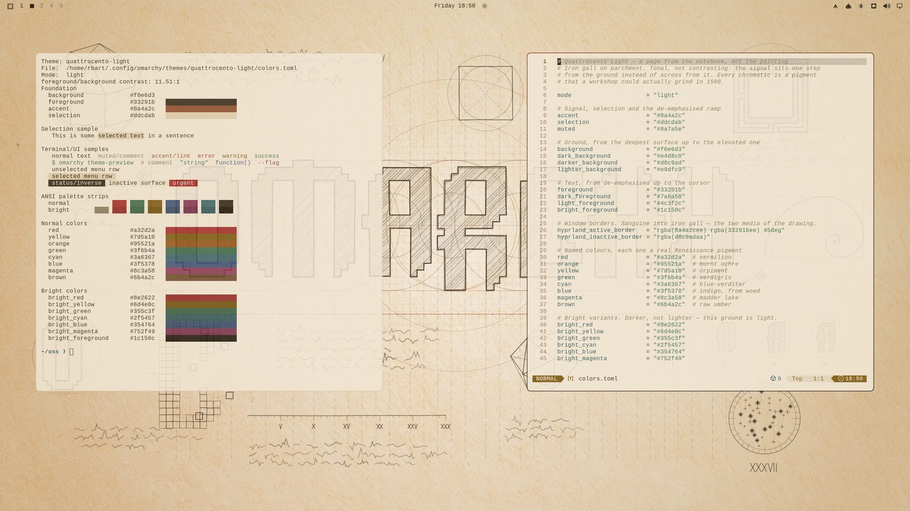
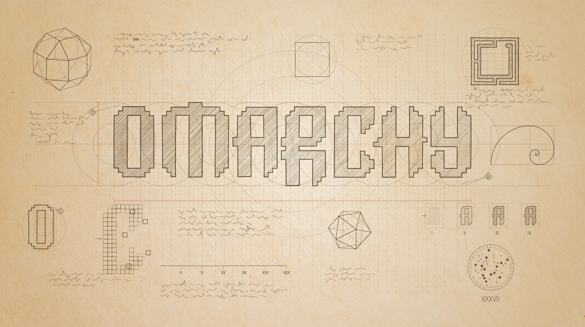
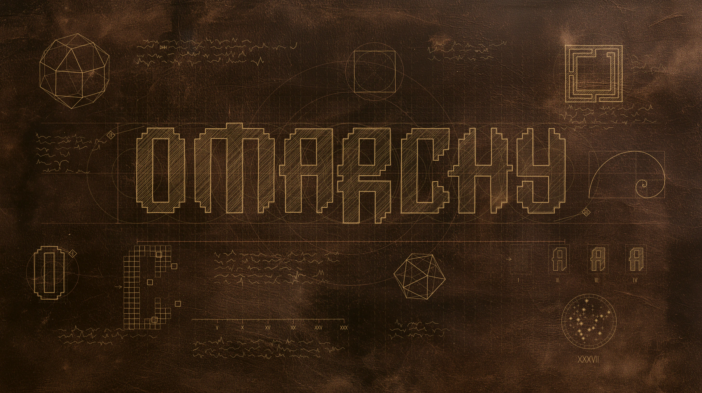

# Quattrocento Light

Quattrocento is a tribute to the moment Omarchy has caught.

Every technology we have, with generative AI as the cherry on top, has turned
our machines into an API wired straight into the imagination, shortening the
distance between an idea and the thing itself more than at any point in
history. A neo-Renaissance, in other words.

The name is a homage to two things at once: the Omarchy version this was built
on, *quattro*, and the centuries Leonardo da Vinci lived across, 1452 to 1519.
A decisive person in a decisive period, for humanity and for civilisation
both.

And one thing seems safe to say. If there were a da Vinci now, he would be
building on Omarchy.

Quattrocento Light is the daylight version of [Quattrocento](https://github.com/r-bart/omarchy-quattrocento-theme).

That century did not inherit its alphabet, it constructed it. Pacioli built the
Roman capitals with compass and straightedge in *De Divina Proportione*, the
book Leonardo illustrated, and Dürer did the same in *Underweysung der
Messung*. Letters as a geometry problem, with the working lines left on the
page.

Omarchy's wordmark is that kind of object: no curves anywhere, every glyph
assembled from squares on a fifteen-unit grid. So this theme starts from a
wallpaper that puts it on such a page — half-hatched, construction lines
running past the edges of the sheet, solids and trials in the margins — and
takes its palette from what is actually on it: iron gall ink and red chalk.



*Mock-up, not a screenshot — see [PREVIEW.md](PREVIEW.md).*

And the real thing, on a running desktop:



Tonal rather than contrasting. Where Dawn sets a cold signal against a warm
ground, this one keeps everything inside a single hue family and lets the
accent sit one step from the surface instead of across from it. The discipline
that holds it together is a rule: every named colour is a pigment a workshop
could grind in 1500. No colour is here because a terminal palette expects it.

## Install

```bash
omarchy theme install https://github.com/r-bart/omarchy-quattrocento-light-theme.git
omarchy theme set quattrocento-light
```

Or use *Install > Style > Theme* in the Omarchy menu, then pick **Quattrocento
Light** under *Style > Theme* (`Super + Ctrl + Shift + Space`).

Requires Omarchy 4. The palette uses the semantic key set, which does not exist
in 2.x.

## Palette

| Key | Value | |
|-----|-------|---|
| `accent` | `#8a4a2c` | sanguine |
| `background` | `#f0e6d3` | parchment |
| `lighter_background` | `#e9dfc9` | |
| `foreground` | `#33291b` | iron gall |
| `bright_foreground` | `#1c150c` | bone black |
| `selection` | `#ddcdab` | |
| `muted` | `#8a7a5e` | silverpoint |

The chromatics, and what each one is:

| Key | Value | Pigment |
|-----|-------|---------|
| `red` | `#a32d2a` | vermilion |
| `orange` | `#95521a` | burnt ochre |
| `yellow` | `#7d5a10` | orpiment |
| `green` | `#3f6b4a` | verdigris |
| `cyan` | `#3a6367` | blue verditer |
| `blue` | `#3f5378` | indigo |
| `magenta` | `#8c3a58` | madder lake |
| `brown` | `#6b4a2c` | raw umber |

Window borders come from `hyprland_active_border`, a gradient from sanguine
into iron gall — the two media of the drawing.

### Contrast

WCAG relative luminance, against both surfaces a theme renders text on.
`lighter_background` is where tooltips, floats, status lines and Neovim's
`NormalFloat` sit — the surface most palettes forget to check.

| | on `background` | on `lighter_background` |
|---|---|---|
| `foreground` | 11.51 | 10.76 |
| `bright_foreground` | 14.60 | 13.65 |
| `accent` | 5.48 | 5.12 |
| `red` | 5.72 | 5.35 |
| `green` | 4.97 | 4.65 |
| `cyan` | 5.37 | 5.02 |
| `blue` | 6.24 | 5.83 |
| `magenta` | 5.93 | 5.54 |
| `muted` | 3.38 | 3.16 |

Every chromatic clears 4.5:1 on both. Body text clears 10:1.

True sanguine is `#9a5a3a`, and it does not clear the floor — 4.47 and 4.12.
The accent is that pigment darkened until it does. It is the one place where
the rule bends to the contrast requirement rather than the other way round.

## What it ships

`colors.toml`, `icons.theme` and `backgrounds/`. Nothing in this repository
runs on your machine: no `neovim.lua`, no terminal config, no `vscode.json`.

That is a choice, not a constraint. Leaving them out is what makes the entire
desktop fall out of the palette, window borders included — and it is also why
`shell.toml` is left to Omarchy's template, so this theme keeps picking up
shell improvements on each release instead of pinning a snapshot.

`hyprland-extra.lua.example` is documentation, not a theme file. Omarchy never
reads it — see [Window metrics](#window-metrics). The suffix is what keeps it
in an installed copy: `omarchy-theme-set` drops every `*.lua` from a theme
cloned from a git repo, since that is the extension Hyprland and Neovim load
code from.

## Backgrounds

Two, cycled with `Super + Ctrl + Space`. The same two ship with
[Quattrocento](https://github.com/r-bart/omarchy-quattrocento-theme); both
open on the daylight page.

| File | Scene |
|------|-------|
| `1-codex.webp` **(default)** | The page in daylight: iron gall and sanguine on parchment, graded so a soft vignette warms the centre. |
| `2-codex-dusk.webp` | The same page at the other end of the day: worn brass on rag paper stained dark with age. Same vectors, same composition, different hour and different ink. |

### The wallpapers





Both are 2912×1632 WebP, quality 90 with sharp YUV:

```bash
magick in.jpg -strip -quality 90 -define webp:method=6 \
  -define webp:use-sharp-yuv=true out.webp
```

Chroma matters: the sanguine construction lines are a thin warm stroke on a
warm ground, and 4:2:0 turns them to mud. Lossy WebP has no 4:4:4 mode, so
sharp YUV stands in — it fits the half-resolution chroma to the luma edges
instead of averaging across them, and neither plane falls below 42.8 dB.
Overall the two land at 40.2 dB and 38.3 dB against the quality-95 4:4:4 JPEGs
they replace, clear of the 38 dB floor Omarchy holds its own backgrounds to,
at half the weight: 4.5 MB down to 2.3 MB.

WebP, not JPEG. Omarchy draws the background and the lock screen through Qt,
which had no WebP handler until `qt6-imageformats` joined the base packages in
August 2026. That is fixed, and Omarchy's own backgrounds are WebP now.

The page itself is generated, not drawn: the wordmark is the real `logo.svg`
geometry with a hand-stroke treatment applied, and every study on the sheet is
computed — the polyhedra from their actual vertex coordinates, the module
explosion from the glyph's own fifteen-unit grid.

Add your own in `~/.config/omarchy/backgrounds/quattrocento-light/` — they appear
alongside these.

## Window metrics

Not part of the theme. Omarchy never reads a Hyprland config from a theme
directory; the only thing a theme sends the compositor is
`hyprland_active_border`. To match the design, paste the block in
`hyprland-extra.lua.example` into `~/.config/hypr/looknfeel.lua`.

## The rest of the set

The same two wallpapers, opposite palette over them.

| Theme | |
|-------|--|
| [Quattrocento](https://github.com/r-bart/omarchy-quattrocento-theme) | Walnut ground, worn brass accent. The same page, in gold on dark paper. |

## License

MIT. See [LICENSE](LICENSE).
