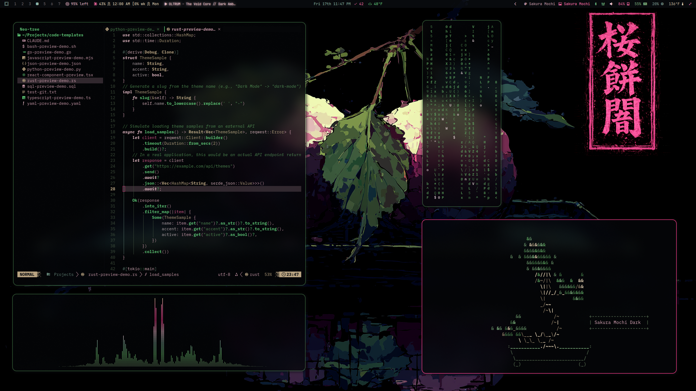
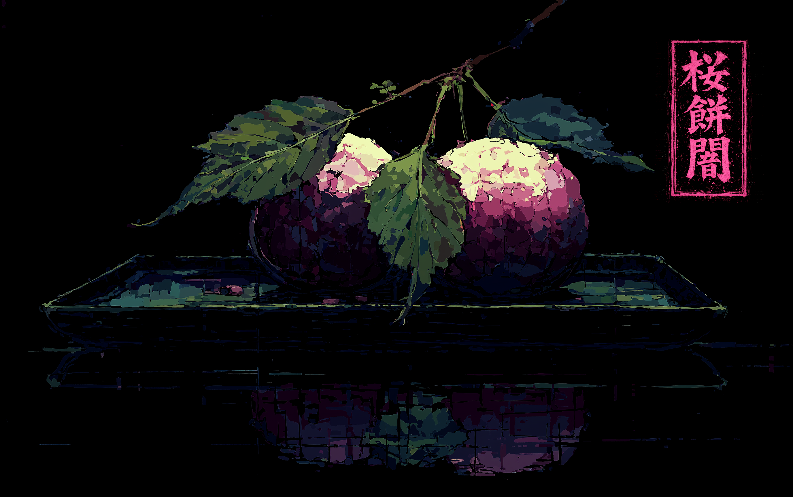
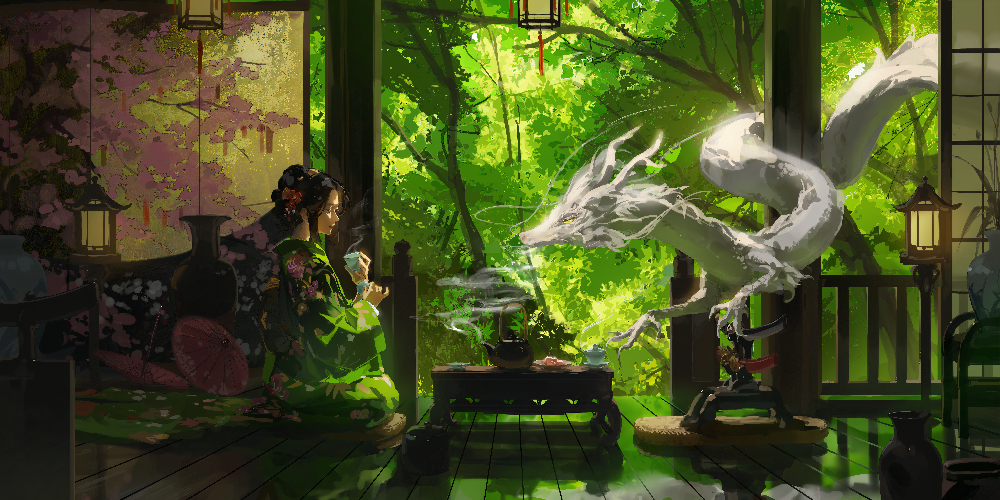
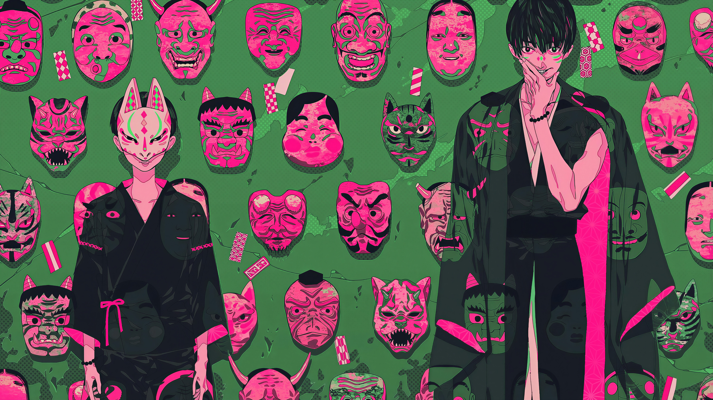
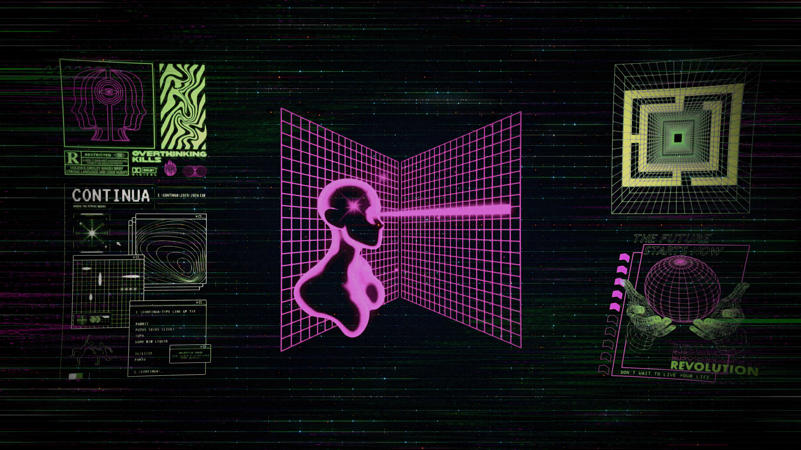
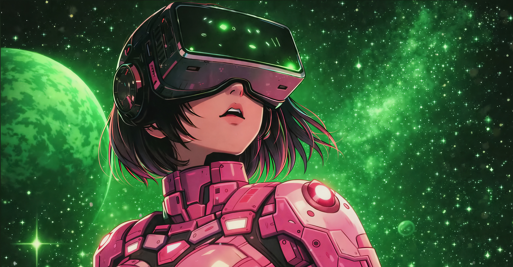
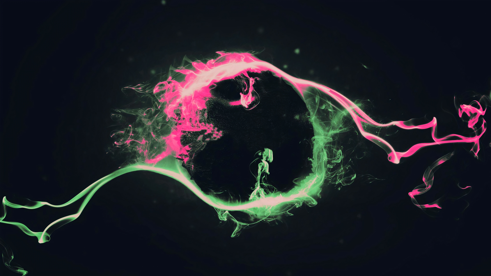
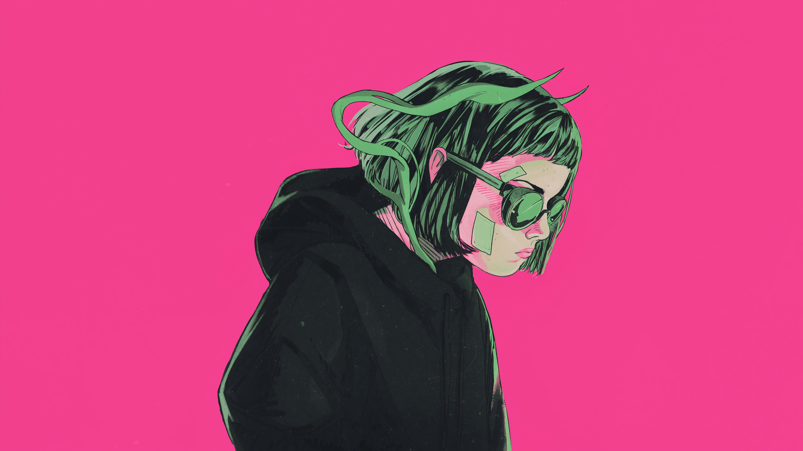
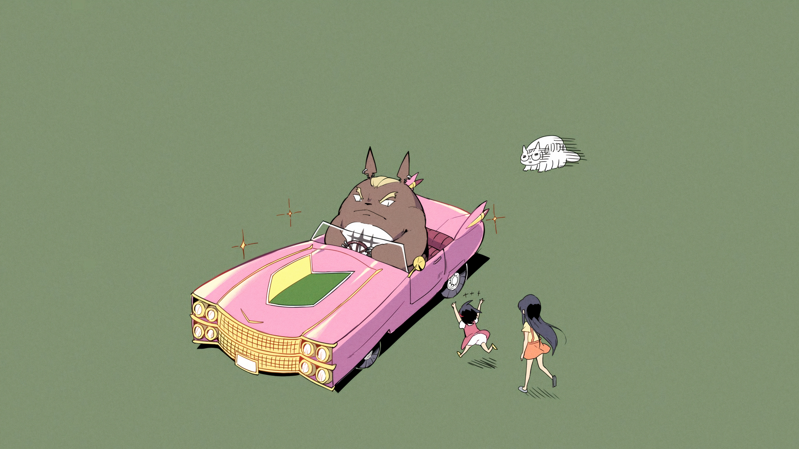
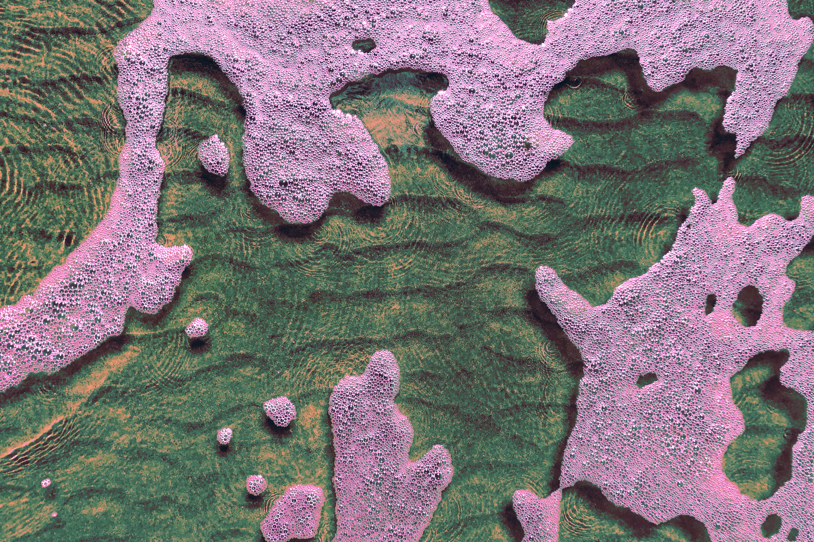

# Omarchy Sakura Mochi Theme

Sakura Mochi is a dark Omarchy theme with soft pink accents, cool green structure, and a near-black base. Rounded glass surfaces and a subtle glow keep it polished, whether the wallpaper is quiet or loud.

## Preview



## Install

Use the Omarchy theme installer:

```bash
omarchy-theme-install https://github.com/OldJobobo/omarchy-sakura-mochi-theme
```

## What's Included

- Native Omarchy Quattro theming through `colors.toml`, `shell.toml`, and `hyprland.lua`, including shared pink/green border gradients, shell surfaces, controls, spacing, and typography.
- Omarchy 3.8 compatibility styling for Hyprland, Hyprlock, Waybar, Mako, Walker, and SwayOSD.
- Current terminal and editor mappings for Alacritty, Foot, Ghostty, Kitty, Helix, Pi, VS Code, Zed, Warp, and Neovim.
- A standalone [Vencord theme](vencord.theme.css) with its own layered Discord treatment instead of a thin palette pass-through.
- A custom [Neovim theme override](neovim.lua) for `bjarneo/aether.nvim` with Sakura Mochi-specific highlight tuning.

## Wallpapers

<table>
  <tr>
    <td></td>
    <td></td>
    <td></td>
  </tr>
  <tr>
    <td></td>
    <td></td>
    <td></td>
  </tr>
  <tr>
    <td></td>
    <td></td>
    <td></td>
  </tr>
</table>

### Animated Wallpapers

The `backgrounds/` directory also includes six optimized 4K H.264 loops for setups that support animated wallpapers. Their original 3840×2160 resolution and frame rates are preserved.

Omarchy Quattro's built-in background picker currently selects static image formats only, so these videos are intentionally shipped as optional assets for an animated-wallpaper tool such as `mpvpaper`. They do not replace the static wallpapers or interfere with normal theme switching.

## Requirements

- Omarchy 4.0 (Quattro) for native shell and Hyprland Lua treatment
- `Yaru-magenta` icon theme
- Optional animated-wallpaper renderer for the bundled MP4 loops
